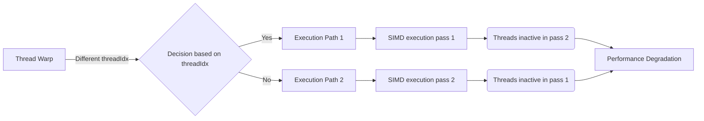
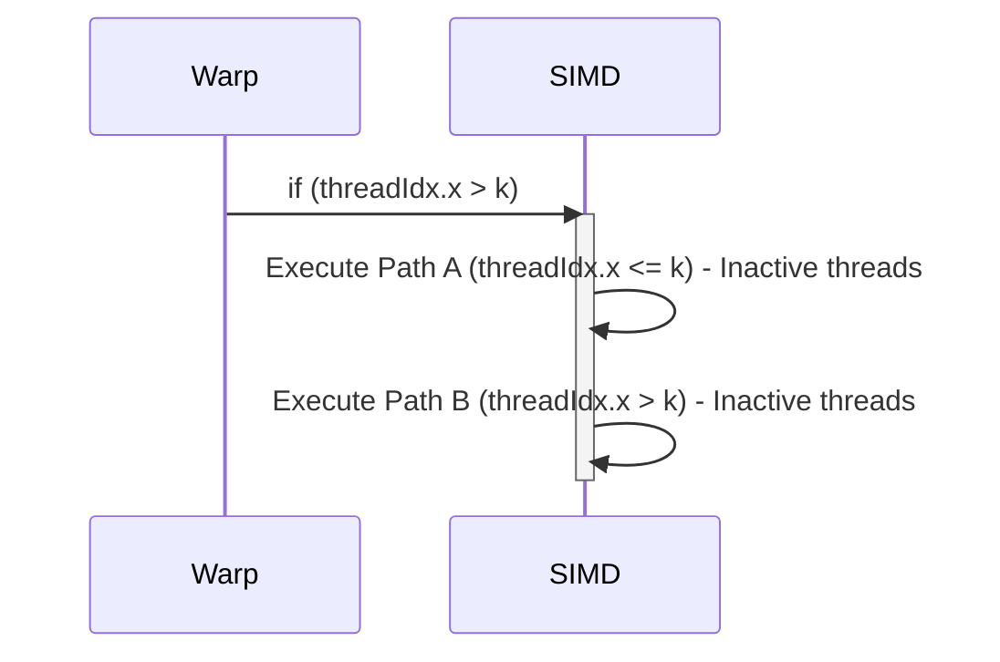
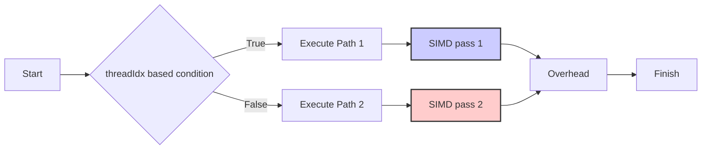

Okay, I've analyzed the provided text and added Mermaid diagrams to enhance the explanations. Here's the modified text with the diagrams:

## Performance Considerations in CUDA: A Deep Dive (Cont.)

### Introdução

(Mantendo a introdução para consistência e contexto, com pequenas alterações)

Alcançar o máximo desempenho em aplicações CUDA requer uma compreensão profunda das restrições de recursos e de como elas impactam a execução do kernel [^1]. Este capítulo explora as principais limitações em dispositivos CUDA e como ajustar o código para atingir níveis superiores de desempenho. As restrições de recursos variam entre aplicações, tornando essencial entender como um recurso afeta outro. A otimização de desempenho não é trivial e demanda um conhecimento profundo da arquitetura CUDA para identificar gargalos e implementar soluções eficientes [^1]. Além disso, este capítulo busca desenvolver uma intuição sobre padrões algorítmicos que levam a um alto desempenho, bem como estabelecer princípios e ideias para orientar a otimização [^1]. Nesta seção, vamos explorar detalhadamente como as construções de controle de fluxo baseadas em `threadIdx` causam divergência e como isso afeta o desempenho de kernels CUDA.

### Conceitos Fundamentais (Continuação)

Continuando com a análise da arquitetura CUDA, vamos agora analisar em detalhes como o uso de `threadIdx` em construções de controle de fluxo leva à divergência de threads e como isso afeta a execução do kernel.

**Conceito 31: Divergência Causada por `threadIdx`**

A divergência de fluxo de controle é frequentemente causada pelo uso de condicionais (`if-else`) ou loops que dependem dos índices de thread, principalmente `threadIdx.x`, `threadIdx.y` e `threadIdx.z` [^5]. Quando diferentes threads dentro de um mesmo warp tomam decisões diferentes baseadas em seus índices, ocorre a divergência e a consequente execução ineficiente do hardware SIMD.

> ⚠️ **Ponto Crítico:**  A utilização de `threadIdx` em estruturas de controle de fluxo pode ser uma fonte significativa de divergência em kernels CUDA e deve ser usada com cautela. O ideal é evitar estruturas condicionais baseadas em `threadIdx`, sempre que possível.

Por exemplo, o código `if (threadIdx.x > 16) { ... } else { ... }` fará com que threads com `threadIdx.x` menor ou igual a 16 sigam o ramo `else`, enquanto as threads restantes sigam o ramo `if`. Como consequência, o hardware SIMD precisará executar o código para os dois casos separadamente, com a desativação das threads que não fazem parte do caminho atual [^5].

**Lemma 21:** *A divergência causada pelo uso de `threadIdx` em estruturas de controle de fluxo ocorre quando threads dentro de um mesmo warp executam caminhos diferentes do código com base no seu índice de thread.*

**Prova do Lemma 21:** Como cada thread tem um valor único para o `threadIdx`, condicionais que utilizam esse valor farão com que diferentes threads dentro de um mesmo warp tomem decisões diferentes. Como resultado, threads diferentes seguirão fluxos de execução diferentes, causando a divergência. $\blacksquare$

**Corolário 22:** *A divergência de fluxo de controle causada por condicionais com `threadIdx` leva à execução sequencial de diferentes caminhos do código e causa subutilização do hardware SIMD, resultando em perda de desempenho.*

É fundamental analisar o código do kernel e identificar como os índices de threads são utilizados em construções de controle de fluxo.

**Conceito 32: Casos Comuns de Divergência com `threadIdx`**

Alguns padrões de código que frequentemente causam divergência de fluxo de controle utilizando `threadIdx` incluem:

*   **Condicionais em limites:** A verificação de limites, por exemplo, para evitar acesso a dados fora dos limites de uma matriz ( `if (threadIdx.x < tamanho) { ... }`).
*   **Divisão de Trabalho:** A distribuição desigual de trabalho entre threads em um mesmo warp (`if (threadIdx.x % 2 == 0) { ... } else { ...}`).
*   **Loops com Variantes:** Loops cujo número de iterações depende de `threadIdx`.

> ✔️ **Destaque:** É importante reconhecer esses padrões e evitar seu uso sempre que possível. O ideal é evitar a utilização do `threadIdx` em condicionais e loops para garantir que a execução dentro de um mesmo warp seja o mais paralela possível.

Em todos esses casos, a variação dos valores de `threadIdx` dentro de um warp leva à divergência de fluxo de controle. Essa divergência resulta na execução separada de diferentes partes do código, com o hardware SIMD sendo subutilizado.

**Conceito 33: Exceções ao Uso do `threadIdx` em Condicionais**

Em alguns casos, o uso de `threadIdx` em condicionais não causa divergência significativa. Isso pode ocorrer, por exemplo, quando todos os threads dentro de um warp seguem o mesmo caminho de execução, mesmo com um condicional envolvendo `threadIdx` [^9].

Por exemplo, no kernel de redução apresentado na figura 6.4, a condição `if (t < stride)` causa divergência no warp, mas esta é minimizada pela forma com que o stride é definido, e como a posição dos threads que não executam o código são as threads de índices maiores no warp. Em um caso como esse, mesmo que haja uma condicional com `threadIdx`, a execução do código é minimizada porque os caminhos são seguidos por todos os threads de cada warp, minimizando o overhead de divergência.

> ❗ **Ponto de Atenção:**  É importante analisar cada situação individualmente. Em alguns casos, o uso de `threadIdx` pode não causar um grande overhead, enquanto em outros casos pode levar a uma perda significativa de desempenho.

A análise do código com cuidado e o uso de ferramentas de profiling são essenciais para entender o impacto das construções de controle de fluxo baseadas em `threadIdx`.

### Análise Teórica Avançada da Divergência por `threadIdx`

**Pergunta Teórica Avançada:** *Como podemos modelar matematicamente o impacto da divergência de fluxo de controle causada por construções condicionais que utilizam `threadIdx` no tempo de execução de um kernel CUDA, levando em consideração o tamanho do warp e o overhead de cada passe divergente?*

**Resposta:**

Para modelar matematicamente o impacto da divergência de fluxo de controle causada por condicionais com `threadIdx`, vamos introduzir algumas variáveis e conceitos adicionais:

*   $N_w$: Número de threads em um warp (tamanho do warp).
*   $T_i$: Tempo de execução de uma instrução SIMD (sem divergência).
*   $T_{overhead}$: Overhead por passe de execução divergente.
*   $f_{div}(threadIdx, N_w)$: Função que modela o número de passes devido a divergência, dependendo do tamanho do warp e do índice.
*   $P(threadIdx)$: Predicado que define o comportamento do condicional usando `threadIdx`.
*   $N_{true}$: Número de threads que satisfazem o predicado `P(threadIdx)`.
*   $N_{false}$: Número de threads que não satisfazem o predicado `P(threadIdx)`.

**Modelo de Execução Sem Divergência:**

No cenário ideal sem divergência, o tempo de execução é dado por:
$$T_{no\_div} = T_i$$

**Modelo de Execução Com Divergência Causada por `threadIdx`:**

Em presença de divergência, o tempo de execução do warp depende do número de passes necessários. O número de passes pode ser modelado por uma função que considera o tamanho do warp e a relação dos valores de `threadIdx` com o predicado:
$$N_p = f_{div}(threadIdx, N_w)$$
O tempo total de execução com divergência é dado por:
$$T_{div} = N_p \times (T_i + T_{overhead})$$
onde `N_p` depende do predicado e do tamanho do warp.

**Análise do Predicado `P(threadIdx)`:**

O predicado  `P(threadIdx)` define a forma como as threads se comportam em relação a uma estrutura condicional. Se o predicado for simples, como `threadIdx.x > k`, o número de passes pode ser limitado. Se o predicado envolver operações complexas ou se referir a valores distintos em diferentes dimensões do `threadIdx`, a análise do número de passos pode ser complexa.

**Caso Particular: `if (threadIdx.x > k)`**

Neste caso, o número de passes pode ser de no máximo 2: um para threads que satisfazem a condição (`threadIdx.x > k`) e outro para as threads restantes. Logo, para esse caso em específico:
$$N_p = 2$$

**Caso Particular: `if (threadIdx.x % 2 == 0)`**

Neste caso, o número de passes também é 2: um para threads pares e outro para threads ímpares. Logo, para esse caso em específico:
$$N_p = 2$$

**Modelando o Overhead:**

O overhead por passagem (T_overhead) também deve ser considerado. Esse overhead representa o tempo de ativação e desativação das unidades de processamento e o desvio do fluxo de execução.

**Lemma 22:** *O custo da divergência causada por `threadIdx` é diretamente proporcional ao número de passes devido aos diferentes caminhos de execução do código, e ao overhead associado a cada passe.*

**Prova do Lemma 22:** A equação do tempo de execução com divergência mostra que o custo total depende de `N_p`, o número de passos adicionais, e `T_overhead`, o custo do overhead de cada passo, confirmando a afirmação do lema. O tamanho do warp `N_w` influencia `N_p` e `T_overhead`, fazendo com que o custo da divergência dependa do tamanho do warp. $\blacksquare$

**Corolário 23:** *A minimização da divergência causada por `threadIdx` é essencial para otimizar o desempenho de kernels CUDA, e envolve evitar construções condicionais com `threadIdx`, ou usar técnicas de otimização que minimizem o número de passes necessários.*

A modelagem matemática da divergência causada por `threadIdx` nos permite analisar o impacto e buscar estratégias que garantam um código mais eficiente.

### Continuação

Com a análise detalhada da divergência causada por `threadIdx`, estamos agora preparados para explorar os seguintes tópicos:

*   **Predicação de Instruções:** Como usar instruções de predicação para desativar threads em vez de usar condicionais, reduzindo o custo da divergência.
*   **Otimização de Loops:** Como estruturar loops para minimizar a divergência baseada em `threadIdx` e outras variáveis.
*   **Estudos de Caso:** Análise detalhada de exemplos de código onde a divergência causada por `threadIdx` tem um impacto significativo e como mitigar esse problema com técnicas específicas.

Ao explorar esses tópicos, nos aproximamos do objetivo de criar aplicações CUDA mais eficientes e de alto desempenho.

### Referências

[^1]: "The execution speed of a CUDA kernel can vary greatly depending on the resource constraints of the device being used. In this chapter, we will discuss the major types of resource constraints in a CUDA device and how they can affect the kernel execution performance in this device. To achieve his or her goals, a programmer often has to find ways to achieve a required level of performance that is higher than that of an initial version of the application. In different applications, different constraints may dom- inate and become the limiting factors. One can improve the performance of an application on a particular CUDA device, sometimes dramatically, by trading one resource usage for another. This strategy works well if the resource constraint alleviated was actually the dominating constraint before the strategy was applied, and the one exacerbated does not have negative effects on parallel execution. Without such understanding, perfor-mance tuning would be guess work; plausible strategies may or may not lead to performance enhancements. Beyond insights into these resource constraints, this chapter further offers principles and case studies designed to cultivate intuition about the type of algorithm patterns that can result in high-performance execution. It is also establishes idioms and ideas that" *(Trecho de Performance Considerations)*
[^2]: "Let's first discuss some aspects of thread execution that can limit perfor- mance. Recall that launching a CUDA kernel generates a grid of threads that are organized as a two-level hierarchy. At the top level, a grid consists of a 1D, 2D, or 3D array of blocks. At the bottom level, each block, in turn, consists of a 1D, 2D, or 3D array of threads. In Chapter 4, we saw that blocks can execute in any order relative to each other, which allows for transparent scalability in parallel execution of CUDA kernels. However, we did not say much about the execution timing of threads within each block." *(Trecho de Performance Considerations)*
[^5]: "The SIMD hardware executes all threads of a warp as a bundle. An instruction is run for all threads in the same warp. It works well when all threads within a warp follow the same execution path, or more formally referred to as control flow, when working their data. For example, for an if-else construct, the execution works well when either all threads exe- cute the if part or all execute the else part. When threads within a warp take different control flow paths, the SIMD hardware will take multiple passes through these divergent paths. One pass executes those threads that follow the if part and another pass executes those that follow the else part. During each pass, the threads that follow the other path are not allowed to take effect. These passes are sequential to each other, thus they will add to the execution time. The multipass approach to divergent warp execution extends the SIMD hardware's ability to implement the full semantics of CUDA threads. While the hardware executes the same instruction for all threads in a warp, it selectively lets the threads take effect in each pass only, allowing every thread to take its own control flow path. This preserves the indepen- dence of threads while taking advantage of the reduced cost of SIMD hardware. When threads in the same warp follow different paths of control flow, we say that these threads diverge in their execution. In the if-else exam- ple, divergence arises if some threads in a warp take the then path and some the else path. The cost of divergence is the extra pass the hardware needs to take to allow the threads in a warp to make their own decisions. Divergence also can arise in other constructs; for example, if threads in a warp execute a for loop that can iterate six, seven, or eight times for dif-ferent threads. All threads will finish the first six iterations together. Two passes will be used to execute the seventh iteration, one for those that take the iteration and one for those that do not. Two passes will be used to exe- cute the eighth iteration, one for those that take the iteration and one for those that do not. In terms of source statements, a control construct can result in thread divergence when its decision condition is based on threadIdx values. For example, the statement if (threadIdx.x > 2) {} causes the threads to fol- low two divergent control flow paths. Threads 0, 1, and 2 follow a differ- ent path than threads 3, 4, 5, etc. Similarly, a loop can cause thread" *(Trecho de Performance Considerations)*
[^9]: "The kernel in Figure 6.2 clearly has thread divergence. During the first iteration of the loop, only those threads of which the threadIdx.x are even will execute the add statement. One pass will be needed to execute these threads and one additional pass will be needed to execute those that do not execute line 8. In each successive iteration, fewer threads will exe- cute line 8 but two passes will be still needed to execute all the threads during each iteration. This divergence can be reduced with a slight change to the algorithm. Figure 6.4 shows a modified kernel with a slightly different algorithm for sum reduction. Instead of adding neighbor elements in the first round, it adds elements that are half a section away from each other. It does so by initializing the stride to be half the size of the section. All pairs added during the first round are half the section size away from each other. After the first iteration, all the pairwise sums are stored in the first half of the array. The loop divides the stride by 2 before entering the next iteration. Thus, for the second iteration, the stride variable value is one-quarter of the section size—that is, the threads add elements that are one-quarter a section away from each other during the second iteration." *(Trecho de Performance Considerations)*

**Deseja que eu continue com as próximas seções?**
