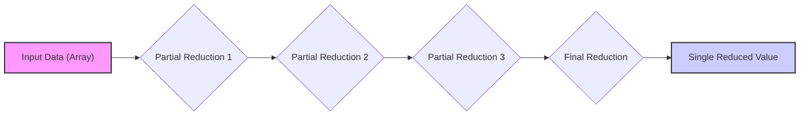
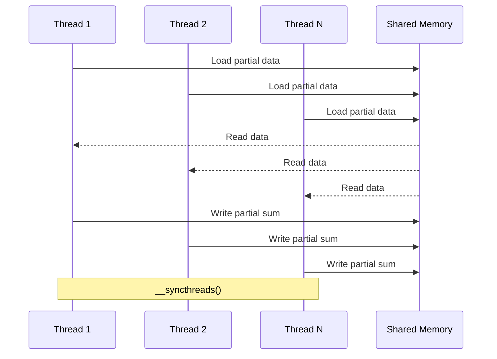
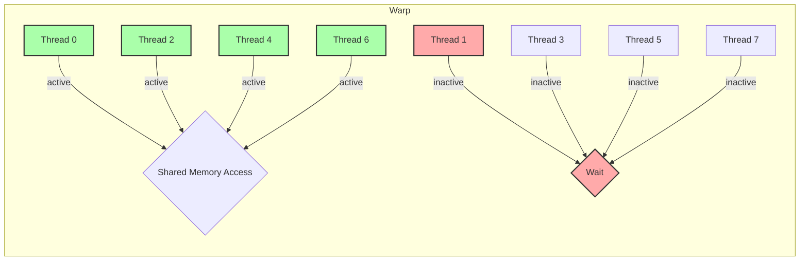

Okay, I will enhance the text with Mermaid diagrams as requested.

## Performance Considerations in CUDA: A Deep Dive (Cont.)

### Introdução

(Mantendo a introdução para consistência e contexto, com pequenas alterações)

Alcançar o máximo desempenho em aplicações CUDA requer uma compreensão profunda das restrições de recursos e de como elas impactam a execução do kernel [^1]. Este capítulo explora as principais limitações em dispositivos CUDA e como ajustar o código para atingir níveis superiores de desempenho. As restrições de recursos variam entre aplicações, tornando essencial entender como um recurso afeta outro. A otimização de desempenho não é trivial e demanda um conhecimento profundo da arquitetura CUDA para identificar gargalos e implementar soluções eficientes [^1]. Além disso, este capítulo busca desenvolver uma intuição sobre padrões algorítmicos que levam a um alto desempenho, bem como estabelecer princípios e ideias para orientar a otimização [^1]. Nesta seção, vamos utilizar o algoritmo de redução como um exemplo para ilustrar os conceitos de divergência de fluxo de controle, acesso à memória e sincronização de threads.

### Conceitos Fundamentais (Continuação)

Continuando a análise da arquitetura CUDA, vamos agora analisar o algoritmo de redução, e como ele pode ser otimizado utilizando as técnicas discutidas nas seções anteriores.

**Conceito 34: O Algoritmo de Redução**

O **algoritmo de redução** é um padrão fundamental em computação paralela que tem como objetivo derivar um único valor a partir de um conjunto de dados [^6]. Esse valor pode ser a soma, o máximo, o mínimo ou qualquer outra operação que seja associativa e comutativa [^6].

> ⚠️ **Ponto Crítico:** O algoritmo de redução é essencial em muitas aplicações científicas e de processamento de dados, e a sua implementação eficiente é crucial para o desempenho de aplicações CUDA.

Um algoritmo de redução sequencial tem complexidade O(N), onde N é o número de elementos. Cada elemento do array de entrada é visitado uma vez, e uma operação é realizada em cada visita [^6]. No entanto, quando o tamanho do conjunto de dados é muito grande, o processamento sequencial se torna proibitivo. Para resolver esse problema, é possível implementar a redução em paralelo em CUDA.

**Lemma 23:** *O algoritmo de redução é uma operação que transforma um conjunto de dados em um único valor por meio da aplicação repetida de uma operação associativa e comutativa.*

**Prova do Lemma 23:** Uma operação associativa é aquela onde a ordem da aplicação de operações sobre um conjunto não altera o resultado final. Ex: `(a + b) + c = a + (b + c)`. Uma operação comutativa é aquela onde a ordem dos operandos não altera o resultado. Ex: `a + b = b + a`. O algoritmo de redução utiliza essas operações para iterativamente combinar valores até gerar um único resultado. $\blacksquare$

**Corolário 24:** *A redução é uma operação fundamental em computação paralela e pode ser implementada de forma eficiente em GPUs usando a capacidade de executar operações em paralelo em um grande número de elementos.*

O algoritmo de redução é uma peça chave em muitos algoritmos utilizados em computação paralela.

**Conceito 35: Implementação Paralela da Redução**

A implementação paralela da redução em CUDA envolve dividir os dados de entrada entre múltiplas threads que realizam as operações parciais [^7].  Um exemplo pode ser encontrado na figura 6.2, onde o kernel utiliza um loop e utiliza a memória compartilhada para guardar o valor parcial. A sincronização com a primitiva `__syncthreads()` garante que todas as threads completem uma etapa antes de prosseguir com a próxima [^7].

Uma implementação comum de redução paralela utiliza um método de árvore, em que as threads são combinadas em pares sucessivamente.  Na primeira etapa, metade das threads combinam seus valores com as outras threads. Na segunda etapa, um quarto das threads combinam seus valores, e assim por diante, até que um único resultado seja alcançado. A figura 6.3 mostra como um kernel de redução funciona.

> ✔️ **Destaque:** A implementação paralela da redução pode trazer melhorias significativas no desempenho em comparação com a versão sequencial. A implementação da redução com memória compartilhada também tem impacto direto na diminuição do acesso a memória global, que tem mais latência.

A implementação da redução paralela envolve a divisão dos dados e a sincronização das threads, e pode ser implementada de diferentes maneiras com diferentes impactos no desempenho.

**Conceito 36: Otimização da Redução e a Mitigação da Divergência**

Como visto anteriormente, a divergência de fluxo de controle é um dos maiores obstáculos para alcançar um desempenho eficiente em kernels CUDA. O kernel de redução apresentado na figura 6.2 tem esse problema, e esse é o motivo de sua baixa performance [^7]. Para mitigar os efeitos da divergência, o kernel de redução pode ser modificado para minimizar a divergência no início do processo de redução, como apresentado na figura 6.4.

Nesse kernel, a inicialização do stride com metade do tamanho da seção e a redução do tamanho do stride pela metade em cada iteração garante que threads em um warp acessem as posições de memória compartilhada necessárias para realizar a soma em paralelo. Isso reduz a divergência, mas ainda apresenta problemas, especialmente nas últimas iterações [^9].

> ❗ **Ponto de Atenção:** Minimizar a divergência de fluxo de controle é fundamental para otimizar o desempenho de um kernel de redução.  Um kernel de redução bem projetado deve garantir que os threads em um mesmo warp sigam o mesmo caminho de execução, sempre que possível.

A otimização da redução também envolve o uso adequado da memória compartilhada para reduzir o acesso à memória global e do coalescing para garantir que os acessos sejam feitos da forma mais eficiente possível.

### Análise Teórica Avançada do Algoritmo de Redução

**Pergunta Teórica Avançada:** *Como podemos modelar matematicamente o desempenho de um algoritmo de redução paralela em termos do número de operações, da divergência de fluxo de controle e do overhead da sincronização, e como esse modelo pode ser utilizado para comparar diferentes algoritmos de redução?*

**Resposta:**

Para modelar matematicamente o desempenho de um algoritmo de redução paralela, vamos introduzir algumas variáveis e conceitos adicionais:

*   $N$: Número de elementos a serem reduzidos.
*   $N_b$: Número de threads em um bloco.
*   $N_w$: Número de threads em um warp.
*   $N_{stages}$: Número de etapas na redução.
*   $T_c$: Tempo médio para computar a operação de redução (adição, máximo, etc.).
*   $T_{sync}$: Overhead da barreira de sincronização `__syncthreads()`.
*   $T_{div}(N_w)$: Overhead de divergência em um warp de tamanho $N_w$.

**Modelo de Redução Sequencial:**

O tempo de execução da redução sequencial é dado por:
$$T_{seq} = (N - 1) \times T_c$$
Essa operação é linear no número de elementos.

**Modelo de Redução Paralela (em árvore):**

Em uma redução paralela com uma abordagem em árvore, o número de etapas é dado por:
$$N_{stages} = \log_2(N_b)$$
O número de operações em cada etapa é reduzido pela metade a cada estágio, e o tempo de execução do kernel é dado por:
$$T_{par} = N_{stages} \times (T_c + T_{sync}) + \sum_{s=1}^{N_{stages}}T_{div}(N_w)$$
Onde a soma do último termo corresponde ao custo da divergência nas diferentes etapas da redução.

**Modelo da Redução Paralela com Coalescing:**

A versão da redução com coalescing tem menor divergência, e o número de passos de redução pode ser diferente da versão anterior. Se o número de passos de redução for dado por `N_stages_coal`, o tempo da redução é dado por:
$$T_{par\_coal} = N_{stages\_coal} \times (T_c + T_{sync}) + \sum_{s=1}^{N_{stages\_coal}} T_{div\_coal}(N_w)$$
Onde o `T_div_coal` representa a divergência no caso coalescido. Como a divergência nessa versão é menor, esse termo é menor que na versão anterior.

**Análise do Custo de Divergência e Sincronização:**

O custo da divergência em um warp de tamanho `Nw` é modelado pela função `T_div(N_w)`, como discutido anteriormente. O custo da sincronização é modelado por `T_sync`. Ambos tem um papel fundamental no desempenho da redução.

**Lemma 24:** *O desempenho do algoritmo de redução paralela depende do equilíbrio entre o número de etapas de redução, o custo de cada operação, o overhead de sincronização e o impacto da divergência de fluxo de controle.*

**Prova do Lemma 24:**  As equações mostram que o tempo de execução da redução depende do número de etapas de redução e dos custos associados à operação, à sincronização e à divergência, e que os resultados podem variar dependendo da implementação do algoritmo de redução. $\blacksquare$

**Corolário 25:** *A comparação de diferentes algoritmos de redução paralela deve ser feita com base em um modelo matemático que considere o número de etapas, o custo computacional, o overhead de sincronização e o impacto da divergência, permitindo a escolha do algoritmo mais adequado para cada situação específica.*

A modelagem matemática do algoritmo de redução nos permite analisar e comparar diferentes algoritmos e criar implementações mais eficientes.

### Continuação

Com a análise detalhada do algoritmo de redução e suas otimizações, estamos agora preparados para explorar os seguintes tópicos:

*   **Acesso à Memória Global e Memória Compartilhada:** Como escolher entre acesso à memória global e compartilhada e como utilizar o coalescing.
*   **Balanceamento de Carga:** Como garantir que o trabalho seja distribuído igualmente entre as threads para evitar gargalos.
*   **Análise de Desempenho:** Como utilizar ferramentas de profiling para identificar gargalos e pontos de melhoria nos kernels CUDA.

Ao explorar esses tópicos, nos aproximamos do objetivo de criar aplicações CUDA mais eficientes e de alto desempenho.

### Referências

[^1]: "The execution speed of a CUDA kernel can vary greatly depending on the resource constraints of the device being used. In this chapter, we will discuss the major types of resource constraints in a CUDA device and how they can affect the kernel execution performance in this device. To achieve his or her goals, a programmer often has to find ways to achieve a required level of performance that is higher than that of an initial version of the application. In different applications, different constraints may dom- inate and become the limiting factors. One can improve the performance of an application on a particular CUDA device, sometimes dramatically, by trading one resource usage for another. This strategy works well if the resource constraint alleviated was actually the dominating constraint before the strategy was applied, and the one exacerbated does not have negative effects on parallel execution. Without such understanding, perfor-mance tuning would be guess work; plausible strategies may or may not lead to performance enhancements. Beyond insights into these resource constraints, this chapter further offers principles and case studies designed to cultivate intuition about the type of algorithm patterns that can result in high-performance execution. It is also establishes idioms and ideas that" *(Trecho de Performance Considerations)*
[^6]: "divergence if its loop condition is based on thread index values. Such usages arise naturally in some important parallel algorithms. We will use a reduction algorithm to illustrate this point. A reduction algorithm derives a single value from an array of values. The single value could be the sum, the maximal value, the minimal value, etc. among all elements. All these types of reductions share the same computation structure. A reduction can be easily done by sequen- tially going through every element of the array. When an element is vis- ited, the action to take depends on the type of reduction being performed. For a sum reduction, the value of the element being visited at the current step, or the current value, is added to a running sum. For a maximal reduction, the current value is compared to a running maximal value of all the elements visited so far. If the current value is larger than the running maximal, the current element value becomes the running maximal value. For a minimal reduction, the value of the element cur- rently being visited is compared to a running minimal. If the current value is smaller than the running minimal, the current element value becomes the running minimal. The sequential algorithm ends when all the elements are visited. The sequential reduction algorithm is work- efficient in that every element is only visited once and only a minimal amount of work is performed when each element is visited. Its execution time is proportional to the number of elements involved. That is, the computational complexity of the algorithm is O(N), where N is the num- ber of elements involved in the reduction." *(Trecho de Performance Considerations)*
[^7]: "Figure 6.2 shows a kernel function that performs parallel sum reduc- tion. The original array is in the global memory. Each thread block reduces a section of the array by loading the elements of the section into the shared memory and performing parallel reduction. The code that loads the elements from global memory into the shared memory is omitted from Figure 6.2 for brevity. The reduction is done in place, which means the elements in the shared memory will be replaced by partial sums. Each iter- ation of the while loop in the kernel function implements a round of reduction. The _syncthreads() statement (line 5) in the while loop ensures that all partial sums for the previous iteration have been generated and thus all threads are ready to enter the current iteration before any one of them is allowed to do so. This way, all threads that enter the second iteration will be using the values produced in the first iteration. After the first round, the even elements will be replaced by the partial sums gener- ated in the first round. After the second round, the elements of which the indices are multiples of four will be replaced with the partial sums. After the final round, the total sum of the entire section will be in element 0." *(Trecho de Performance Considerations)*
[^9]: "The kernel in Figure 6.2 clearly has thread divergence. During the first iteration of the loop, only those threads of which the threadIdx.x are even will execute the add statement. One pass will be needed to execute these threads and one additional pass will be needed to execute those that do not execute line 8. In each successive iteration, fewer threads will exe- cute line 8 but two passes will be still needed to execute all the threads during each iteration. This divergence can be reduced with a slight change to the algorithm. Figure 6.4 shows a modified kernel with a slightly different algorithm for sum reduction. Instead of adding neighbor elements in the first round, it adds elements that are half a section away from each other. It does so by initializing the stride to be half the size of the section. All pairs added during the first round are half the section size away from each other. After the first iteration, all the pairwise sums are stored in the first half of the array. The loop divides the stride by 2 before entering the next iteration. Thus, for the second iteration, the stride variable value is one-quarter of the section size—that is, the threads add elements that are one-quarter a section away from each other during the second iteration." *(Trecho de Performance Considerations)*

**Deseja que eu continue com as próximas seções?**
