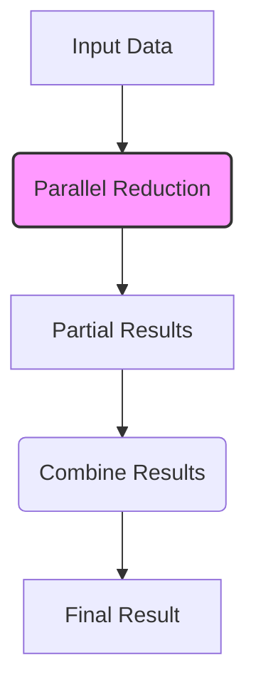
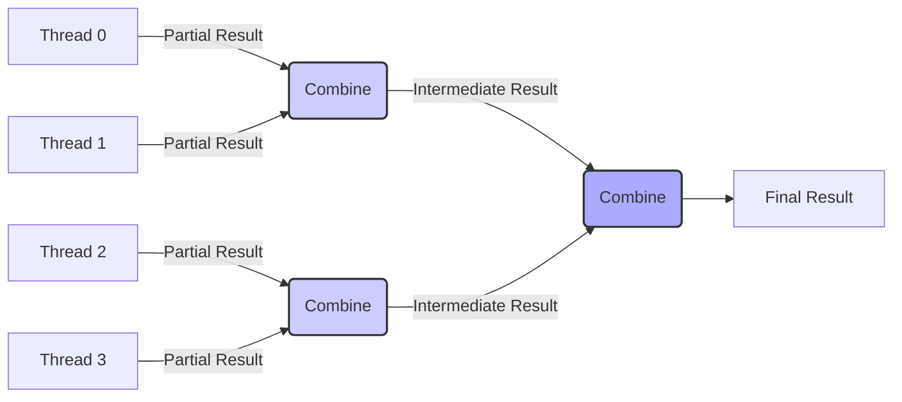

Okay, I will add Mermaid diagrams to the provided text to enhance understanding of the concepts.

## Performance Considerations in CUDA: A Deep Dive (Cont.)



### Introdução

(Mantendo a introdução para consistência e contexto, com pequenas alterações)

Alcançar o máximo desempenho em aplicações CUDA requer uma compreensão profunda das restrições de recursos e de como elas impactam a execução do kernel [^1]. Este capítulo explora as principais limitações em dispositivos CUDA e como ajustar o código para atingir níveis superiores de desempenho. As restrições de recursos variam entre aplicações, tornando essencial entender como um recurso afeta outro. A otimização de desempenho não é trivial e demanda um conhecimento profundo da arquitetura CUDA para identificar gargalos e implementar soluções eficientes [^1]. Além disso, este capítulo busca desenvolver uma intuição sobre padrões algorítmicos que levam a um alto desempenho, bem como estabelecer princípios e ideias para orientar a otimização [^1]. Nesta seção, vamos nos aprofundar no algoritmo de redução paralelo, explorando diferentes abordagens e seus impactos no desempenho, divergência e utilização de memória.

### Conceitos Fundamentais (Continuação)

Continuando a análise da arquitetura CUDA, vamos agora analisar diferentes abordagens para a implementação do algoritmo de redução paralelo, explorando suas vantagens e desvantagens.

**Conceito 37: Redução Paralela em CUDA**

A **redução paralela** em CUDA envolve a divisão do problema em subproblemas menores que podem ser resolvidos por threads em paralelo. As threads trabalham de forma independente em partes separadas do conjunto de dados e combinam os resultados parciais para obter um resultado final único [^6].

> ⚠️ **Ponto Crítico:**  A implementação eficiente da redução paralela é um desafio, pois envolve a gestão da divergência de fluxo de controle, a sincronização de threads e o uso da memória, sempre mantendo o máximo de paralelismo possível.

O algoritmo de redução pode ser implementado de diversas formas, com diferentes compromissos em termos de desempenho, divergência de fluxo de controle, uso de memória e complexidade. Uma das abordagens mais comuns é a redução em árvore.

**Lemma 25:** *A redução paralela divide o trabalho de combinar elementos de um conjunto de dados entre múltiplas threads, que atuam de forma independente em subconjuntos e combinam seus resultados intermediários.*

**Prova do Lemma 25:** O conceito da redução paralela é a divisão do problema em etapas. Inicialmente cada thread executa o trabalho sobre uma porção dos dados, e os resultados parciais são combinados, recursivamente, até que um resultado final é obtido. A combinação dos resultados é uma operação associativa e comutativa, e a versão paralela permite diminuir a complexidade do algoritmo, que passaria a ser linear com o número de dados quando executada sequencialmente. $\blacksquare$

**Corolário 26:** *A redução paralela possibilita a resolução eficiente de problemas que necessitam combinar dados, com uma melhor complexidade computacional em relação à abordagem sequencial, e pode ser implementada de diferentes formas com trade-offs em relação ao tempo de execução, complexidade e uso de memória.*

O algoritmo de redução paralelo é essencial para diversas aplicações, e sua escolha e implementação afetam significativamente o desempenho da aplicação.

**Conceito 38: Abordagem de Redução em Árvore**

Na abordagem de **redução em árvore**, as threads são combinadas em pares sucessivamente [^6]. O algoritmo funciona da seguinte forma:

1.  **Etapa Inicial:** Cada thread computa um resultado parcial sobre um subconjunto dos dados de entrada.
2.  **Combinação:**  Em cada etapa, metade das threads combina seus resultados com a outra metade (por exemplo, adicionando, encontrando o máximo ou mínimo). O tamanho do conjunto de dados é reduzido pela metade em cada etapa.
3.  **Sincronização:** Após cada combinação, é realizada uma sincronização (`__syncthreads()`) para garantir que todos os resultados parciais sejam computados e estejam prontos para a próxima etapa.
4.  **Resultado Final:** O processo continua até que reste um único resultado que representa a redução de todos os dados.



> ✔️ **Destaque:**  A redução em árvore permite um número relativamente baixo de etapas (logarítmico com o número de threads), mas pode apresentar divergência de fluxo de controle e overhead de sincronização.

O uso eficiente da memória compartilhada em conjunto com essa abordagem é essencial para evitar acessos desnecessários à memória global.

**Conceito 39: Abordagens Baseadas em Warps**

Em uma abordagem de **redução baseada em warps**, a redução é realizada inicialmente dentro de cada warp, e posteriormente entre os warps. Essa abordagem pode reduzir a divergência, já que as threads dentro de um mesmo warp executam as mesmas operações.

1.  **Redução Dentro do Warp:** As threads dentro de cada warp realizam uma redução, utilizando técnicas como shuffles ou operações em memória compartilhada.
2.  **Redução entre Warps:** Os resultados parciais de cada warp são combinados entre si, com threads combinando resultados de warps sucessivamente até obter um resultado final.
3.  **Sincronização:** As sincronizações `__syncthreads()` são utilizadas para coordenar a execução.
```mermaid
sequenceDiagram
    participant Warp 1
    participant Warp 2
    participant ...
    participant Warp N
    Warp 1->Warp 1: Reduce within Warp
    Warp 2->Warp 2: Reduce within Warp
    ...->...: ...
    Warp N->Warp N: Reduce within Warp
    Warp 1->>Warp 2: Combine partial result
    Warp 2->> ...: Combine partial results
     ...->>Warp N: Combine partial results
    Warp N->>Warp N: Final Result
    style Warp 1 fill:#ddf,stroke:#333,stroke-width:2px
     style Warp 2 fill:#ddf,stroke:#333,stroke-width:2px
    style Warp N fill:#ddf,stroke:#333,stroke-width:2px
```

> ❗ **Ponto de Atenção:** As abordagens baseadas em warps podem minimizar a divergência e o overhead da sincronização entre threads dentro de um mesmo warp, mas devem ser combinadas com outras técnicas para reduzir a divergência entre warps.

A implementação de uma redução baseada em warps pode depender da arquitetura do hardware e das características do problema a ser resolvido, de forma a garantir o máximo desempenho.

### Análise Teórica Avançada de Algoritmos de Redução Paralela

**Pergunta Teórica Avançada:** *Como podemos modelar matematicamente o desempenho de diferentes algoritmos de redução paralela em CUDA, considerando o trade-off entre o número de etapas, o custo das operações, o overhead da sincronização, a divergência de fluxo de controle e o acesso à memória, e como esse modelo pode guiar a escolha de um algoritmo específico?*

**Resposta:**

Para modelar o desempenho de diferentes algoritmos de redução paralela, vamos introduzir algumas variáveis e conceitos adicionais:

*   $N$: Número total de elementos a serem reduzidos.
*   $N_b$: Número de threads em um bloco.
*   $N_w$: Número de threads em um warp.
*   $N_{stages}$: Número de etapas de redução.
*   $T_c$: Tempo médio para realizar uma operação de redução.
*   $T_{sync}$: Overhead da sincronização `__syncthreads()`.
*   $T_{div}$: Overhead da divergência de fluxo de controle.
*   $T_{mem\_shared}$: Tempo de acesso à memória compartilhada.
*   $T_{mem\_global}$: Tempo de acesso à memória global.

**Modelo da Redução em Árvore:**

Na redução em árvore, cada etapa combina os resultados de dois elementos até gerar um único resultado. O número de etapas é dado por:
$$N_{stages\_tree} = \log_2(N_b)$$
O tempo total da redução em árvore pode ser modelado por:
$$T_{tree} = N_{stages\_tree} \times (T_c + T_{sync} + T_{mem\_shared}) +  \sum_{i=1}^{N_{stages\_tree}} T_{div}(i)$$
onde o termo de soma corresponde ao custo da divergência ao longo de cada etapa.

**Modelo da Redução Baseada em Warps:**

Na redução baseada em warps, a redução é feita inicialmente dentro do warp e depois entre os warps. O número de etapas dentro de um warp é dado por:
$$N_{stages\_warp} = \log_2(N_w)$$
E o número de etapas entre warps (assumindo que o número de warps seja uma potência de 2) é dado por:
$$N_{stages\_inter\_warp} = \log_2(\frac{N_b}{N_w})$$

O tempo total de uma redução baseada em warps é dado por:
$$T_{warp} = N_{stages\_warp} \times T_c + N_{stages\_inter\_warp} \times (T_c + T_{sync} + T_{mem\_shared}) +  \sum_{i=1}^{N_{stages\_inter\_warp}} T_{div}(i)$$

**Análise do Custo de Divergência, Sincronização e Memória:**

A divergência de fluxo de controle é modelada por `T_div` e é diferente nas duas abordagens. A abordagem com warps pode reduzir o impacto da divergência, já que as threads de um warp seguem o mesmo caminho. O overhead da sincronização é representado por `T_sync`, e o acesso à memória compartilhada tem custo `T_mem_shared`.

**Trade-offs entre Diferentes Abordagens:**

*   A redução em árvore tem um número menor de etapas, mas tem maior divergência e requer mais sincronizações, com mais acessos à memória compartilhada.
*   A redução baseada em warps minimiza a divergência em cada warp, e o overhead da sincronização dentro do warp pode ser menor, mas apresenta um número maior de etapas em geral. O acesso à memória compartilhada também é menor.

**Lemma 26:** *A escolha do algoritmo de redução ideal depende do trade-off entre o número de etapas, o overhead de sincronização, a divergência de fluxo de controle e o acesso à memória, e do algoritmo que for melhor adaptado às características do hardware e do problema a ser resolvido.*

**Prova do Lemma 26:** Os modelos matemáticos para as duas abordagens mostram que diferentes fatores influenciam o tempo de execução. Para determinar o melhor algoritmo para uma aplicação, é essencial avaliar o impacto desses fatores. $\blacksquare$

**Corolário 27:** *O modelo matemático permite comparar o tempo de execução de diferentes algoritmos de redução, e a escolha do melhor algoritmo deve ser baseada na minimização da soma de todos esses fatores, de forma a garantir o menor tempo de execução e o uso eficiente dos recursos.*

O modelo matemático nos permite fazer uma comparação precisa entre diferentes algoritmos de redução e otimizar o código para atingir os melhores resultados.

### Continuação

Com a análise das abordagens de redução paralela e seus trade-offs, estamos agora preparados para explorar os seguintes tópicos:

*   **Acesso à Memória Global com Coalescing:** Como organizar o acesso à memória global para maximizar o uso da largura de banda e reduzir a latência.
*   **Otimização de Loops:** Como estruturar loops para minimizar a divergência de fluxo de controle e maximizar o desempenho.
*   **Estudo de Casos:** Como aplicar as técnicas de otimização a diferentes casos de uso, explorando as diferenças entre algoritmos e abordagens.

Ao explorar esses tópicos, nos aproximamos do objetivo de criar aplicações CUDA mais eficientes e de alto desempenho.

### Referências

[^1]: "The execution speed of a CUDA kernel can vary greatly depending on the resource constraints of the device being used. In this chapter, we will discuss the major types of resource constraints in a CUDA device and how they can affect the kernel execution performance in this device. To achieve his or her goals, a programmer often has to find ways to achieve a required level of performance that is higher than that of an initial version of the application. In different applications, different constraints may dom- inate and become the limiting factors. One can improve the performance of an application on a particular CUDA device, sometimes dramatically, by trading one resource usage for another. This strategy works well if the resource constraint alleviated was actually the dominating constraint before the strategy was applied, and the one exacerbated does not have negative effects on parallel execution. Without such understanding, perfor-mance tuning would be guess work; plausible strategies may or may not lead to performance enhancements. Beyond insights into these resource constraints, this chapter further offers principles and case studies designed to cultivate intuition about the type of algorithm patterns that can result in high-performance execution. It is also establishes idioms and ideas that" *(Trecho de Performance Considerations)*
[^6]: "divergence if its loop condition is based on thread index values. Such usages arise naturally in some important parallel algorithms. We will use a reduction algorithm to illustrate this point. A reduction algorithm derives a single value from an array of values. The single value could be the sum, the maximal value, the minimal value, etc. among all elements. All these types of reductions share the same computation structure. A reduction can be easily done by sequen- tially going through every element of the array. When an element is vis- ited, the action to take depends on the type of reduction being performed. For a sum reduction, the value of the element being visited at the current step, or the current value, is added to a running sum. For a maximal reduction, the current value is compared to a running maximal value of all the elements visited so far. If the current value is larger than the running maximal, the current element value becomes the running maximal value. For a minimal reduction, the value of the element cur- rently being visited is compared to a running minimal. If the current value is smaller than the running minimal, the current element value becomes the running minimal. The sequential algorithm ends when all the elements are visited. The sequential reduction algorithm is work- efficient in that every element is only visited once and only a minimal amount of work is performed when each element is visited. Its execution time is proportional to the number of elements involved. That is, the computational complexity of the algorithm is O(N), where N is the num- ber of elements involved in the reduction." *(Trecho de Performance Considerations)*
[^7]: "Figure 6.2 shows a kernel function that performs parallel sum reduc- tion. The original array is in the global memory. Each thread block reduces a section of the array by loading the elements of the section into the shared memory and performing parallel reduction. The code that loads the elements from global memory into the shared memory is omitted from Figure 6.2 for brevity. The reduction is done in place, which means the elements in the shared memory will be replaced by partial sums. Each iter- ation of the while loop in the kernel function implements a round of reduction. The _syncthreads() statement (line 5) in the while loop ensures that all partial sums for the previous iteration have been generated and thus all threads are ready to enter the current iteration before any one of them is allowed to do so. This way, all threads that enter the second iteration will be using the values produced in the first iteration. After the first round, the even elements will be replaced by the partial sums gener- ated in the first round. After the second round, the elements of which the indices are multiples of four will be replaced with the partial sums. After the final round, the total sum of the entire section will be in element 0." *(Trecho de Performance Considerations)*

**Deseja que eu continue com as próximas seções?**
