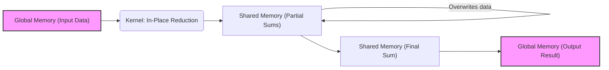
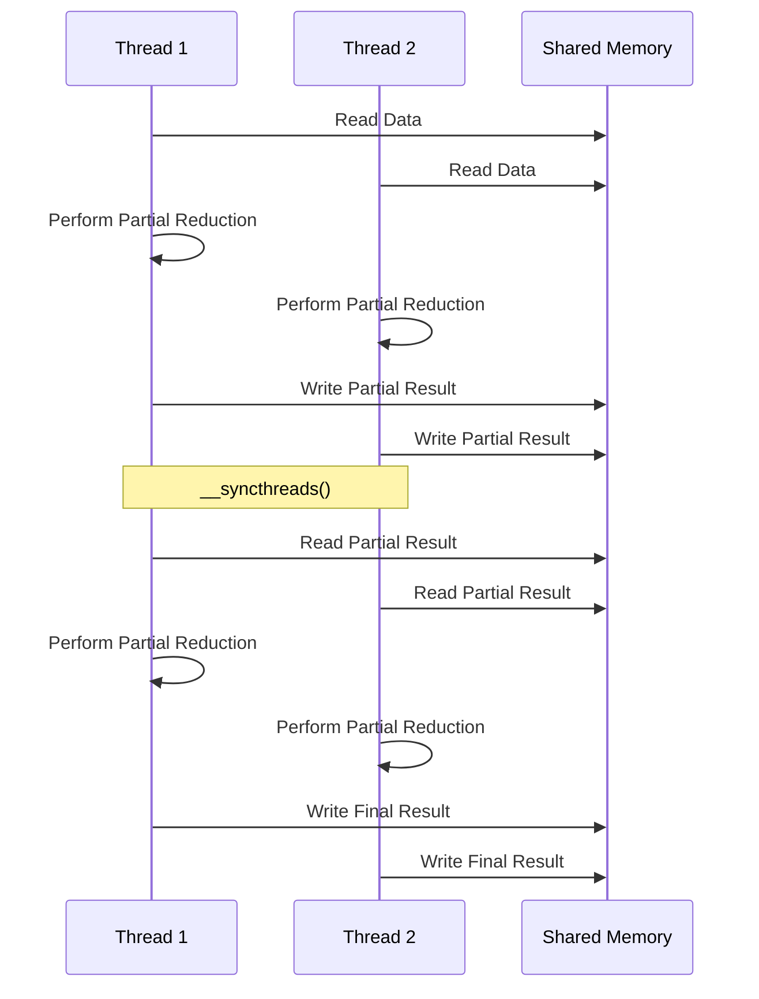

Okay, I've analyzed the provided text and added Mermaid diagrams to enhance the understanding of the concepts discussed, particularly focusing on the "in-place" reduction technique. Here's the enhanced text with the added diagrams:

## Performance Considerations in CUDA: A Deep Dive (Cont.)

### Introdução

(Mantendo a introdução para consistência e contexto, com pequenas alterações)

Alcançar o máximo desempenho em aplicações CUDA requer uma compreensão profunda das restrições de recursos e de como elas impactam a execução do kernel [^1]. Este capítulo explora as principais limitações em dispositivos CUDA e como ajustar o código para atingir níveis superiores de desempenho. As restrições de recursos variam entre aplicações, tornando essencial entender como um recurso afeta outro. A otimização de desempenho não é trivial e demanda um conhecimento profundo da arquitetura CUDA para identificar gargalos e implementar soluções eficientes [^1]. Além disso, este capítulo busca desenvolver uma intuição sobre padrões algorítmicos que levam a um alto desempenho, bem como estabelecer princípios e ideias para orientar a otimização [^1]. Nesta seção, vamos analisar detalhadamente a redução "in-place", uma abordagem que tem um impacto importante no acesso à memória e no desempenho de algoritmos de redução paralela.

### Conceitos Fundamentais (Continuação)

Aprofundando a análise da arquitetura CUDA, vamos agora analisar a redução "in-place" e como ela se compara com outras abordagens para o algoritmo de redução paralelo.

**Conceito 40: Redução "In-Place"**

Uma **redução "in-place"** é uma técnica de otimização na qual os resultados parciais da redução são armazenados nas mesmas localizações de memória onde estavam os dados de entrada [^7]. Essa abordagem permite que a redução seja realizada utilizando a mesma área de memória, sem a necessidade de alocar espaço de memória adicional.

> ⚠️ **Ponto Crítico:** A redução "in-place" pode reduzir significativamente o uso de memória, o que pode levar a melhorias no desempenho, especialmente em problemas onde a memória é um recurso limitado. É importante considerar os trade-offs dessa abordagem.

A redução "in-place" tem um impacto importante em como o algoritmo interage com a memória, e influencia como o algoritmo acessa a memória compartilhada, e, em última instância, a memória global.

**Lemma 27:** *A redução "in-place" utiliza o mesmo espaço de memória para armazenar tanto os dados de entrada quanto os resultados parciais, eliminando a necessidade de alocar memória adicional.*

**Prova do Lemma 27:** Em uma redução "in-place", o algoritmo acessa os dados, realiza a operação de redução e armazena o resultado no mesmo endereço do dado de entrada. O algoritmo não cria nenhuma nova área na memória. O mesmo espaço é usado tanto para o dado original, quanto para o resultado intermediário, e o final. $\blacksquare$

**Corolário 28:** *A redução "in-place" é uma abordagem que tem um impacto direto na eficiência do uso de memória em algoritmos de redução paralela, podendo reduzir o tráfego de dados na memória global e otimizar o desempenho de aplicações CUDA.*

Entender como utilizar a redução "in-place" da forma correta é essencial para melhorar o desempenho de kernels CUDA que utilizam o algoritmo de redução.

**Conceito 41: Implementação da Redução "In-Place"**

Na prática, a implementação da redução "in-place" envolve:

1.  **Alocação da Memória:** A memória é alocada para armazenar tanto os dados de entrada quanto os resultados parciais.
2.  **Redução Parcial:** A cada etapa, o resultado da operação da redução é armazenado sobre os dados de entrada.
3.  **Sincronização:** A sincronização `__syncthreads()` é utilizada para garantir que todas as threads tenham concluído a escrita de seus resultados antes que outras threads iniciem a próxima etapa.
4.  **Resultado Final:** Ao final de todas as etapas, o resultado final estará armazenado no mesmo local de memória onde estavam os dados de entrada iniciais.

> ✔️ **Destaque:**  A implementação da redução "in-place" é eficiente em termos de uso de memória, mas exige um cuidado especial para garantir a consistência dos dados e o correto funcionamento da sincronização de threads.

A abordagem da redução "in-place" precisa de um planejamento correto, pois a sobrescrita de dados na memória compartilha pode acarretar em problemas de consistência.

**Conceito 42: Vantagens e Desvantagens da Redução "In-Place"**

A redução "in-place" apresenta as seguintes vantagens:

*   **Uso Eficiente de Memória:** Reduz o uso de memória, pois não precisa alocar uma nova área para os resultados intermediários.
*   **Menor Tráfego de Memória:** Reduz a quantidade de dados transferidos na memória, já que os resultados são armazenados no mesmo local onde estavam os dados de entrada.

A redução "in-place" também apresenta algumas desvantagens:

*   **Complexidade:** A implementação da redução "in-place" pode ser mais complexa, pois envolve o gerenciamento de dados em um mesmo local de memória.
*   **Sincronização:** O uso de `__syncthreads()` pode aumentar o overhead caso não seja implementado corretamente.

> ❗ **Ponto de Atenção:** A escolha da redução "in-place" deve ser feita com base no balanceamento entre as vantagens em relação ao uso de memória, e as desvantagens relacionadas à complexidade e sincronização do código.

É essencial analisar as vantagens e desvantagens da redução "in-place" para determinar quando e como ela deve ser utilizada.

### Análise Teórica Avançada da Redução "In-Place"

**Pergunta Teórica Avançada:** *Como podemos modelar matematicamente o desempenho de uma redução "in-place" em CUDA, considerando o impacto da reutilização da mesma área de memória, e como essa abordagem afeta o acesso à memória global e compartilhada e o número de instruções necessárias?*

**Resposta:**

Para modelar matematicamente o desempenho de uma redução "in-place", vamos introduzir algumas variáveis e conceitos adicionais:

*   `N`: Número de elementos a serem reduzidos.
*   `N_b`: Número de threads em um bloco.
*   `N_w`: Número de threads em um warp.
*   `T_c`: Tempo médio para computar a operação de redução.
*   `T_sync`: Overhead da sincronização `__syncthreads()`.
*   `T_mem_shared`: Tempo médio para acessar a memória compartilhada.
*   `T_mem_global_load`: Tempo médio para carregar um elemento da memória global.
*   `T_mem_global_store`: Tempo médio para escrever um elemento na memória global.
*   `N_stages`: Número de etapas da redução.

**Modelo de Redução "In-Place" Sequencial:**

O tempo de execução da redução sequencial é dado por:
$$T_{seq\_in\_place} = (N-1) \times T_c$$

**Modelo de Redução "In-Place" Paralela:**

Na redução paralela, o tempo de execução com a abordagem "in-place" é dado por:
$$T_{par\_in\_place} = T_{mem\_global\_load} + N_{stages} \times (T_c + T_{sync} + T_{mem\_shared}) + T_{mem\_global\_store}$$

O primeiro termo representa o tempo gasto com o carregamento dos dados da memória global. O termo do meio representa o tempo gasto nas etapas de redução, e o último termo representa o tempo gasto para armazenar o resultado final de volta na memória global. O termo `T_mem_shared` é o tempo para acesso na memória compartilhada durante cada etapa da redução, e deve ser minimizado usando *coalescing* e outros métodos.
O número de etapas para uma redução com tamanho $N_b$ é dado por `N_stages`, que pode ser obtido como `log2(Nb)` numa implementação em árvore.

**Comparação com a Redução Paralela Tradicional:**

Em comparação com a redução paralela tradicional, que pode requerer acesso adicional à memória para guardar os resultados parciais, a redução "in-place" reduz esse custo de acesso à memória. Em contrapartida, ela pode gerar mais *bank conflicts* na memória compartilhada e exige que a sincronização seja feita com cuidado.

**Impacto no Uso da Memória:**

A redução "in-place" diminui a quantidade de memória necessária para realizar a operação de redução, uma vez que os resultados são armazenados nos mesmos endereços. Isso tem um impacto direto no uso da memória global e da memória compartilhada, o que pode gerar um melhor desempenho.

**Lemma 28:** *A redução "in-place" reduz o uso da memória, mas aumenta a complexidade da implementação, e o seu desempenho depende da otimização do acesso à memória e da sincronização de threads.*

**Prova do Lemma 28:** A redução "in-place" diminui a necessidade de alocar espaço extra na memória, ao realizar a redução sobre os mesmos dados. Isso pode levar a um melhor desempenho. Contudo, a implementação precisa ser cuidadosamente planejada para evitar conflitos no acesso a dados e garantir a sincronização correta entre threads. $\blacksquare$

**Corolário 29:** *A escolha entre a redução "in-place" e uma redução com memória adicional deve ser feita com base em um modelo matemático que considere o tamanho do problema, a latência do acesso à memória, o custo da sincronização e a quantidade de memória disponível, de forma a garantir a melhor relação entre uso de recursos e tempo de execução.*

O modelo matemático da redução "in-place" nos permite analisar o impacto dessa abordagem no desempenho e nos guiar na escolha da melhor opção.

### Continuação

Com a análise detalhada da redução "in-place", estamos agora preparados para explorar os seguintes tópicos:

*   **Otimização do Uso da Memória Compartilhada:** Como organizar o acesso à memória compartilhada para minimizar conflitos e maximizar a largura de banda.
*   **Balanceamento de Carga em Reduções:** Como garantir que o trabalho seja distribuído de forma eficiente entre as threads na execução da redução, evitando gargalos e maximizando o paralelismo.
*   **Estudos de Caso de Redução:** Análise de casos de uso reais em que a otimização da redução tem um grande impacto no desempenho geral das aplicações CUDA.

Ao explorar esses tópicos, nos aproximamos do objetivo de criar aplicações CUDA mais eficientes e de alto desempenho.

### Referências

[^1]: "The execution speed of a CUDA kernel can vary greatly depending on the resource constraints of the device being used. In this chapter, we will discuss the major types of resource constraints in a CUDA device and how they can affect the kernel execution performance in this device. To achieve his or her goals, a programmer often has to find ways to achieve a required level of performance that is higher than that of an initial version of the application. In different applications, different constraints may dom- inate and become the limiting factors. One can improve the performance of an application on a particular CUDA device, sometimes dramatically, by trading one resource usage for another. This strategy works well if the resource constraint alleviated was actually the dominating constraint before the strategy was applied, and the one exacerbated does not have negative effects on parallel execution. Without such understanding, perfor-mance tuning would be guess work; plausible strategies may or may not lead to performance enhancements. Beyond insights into these resource constraints, this chapter further offers principles and case studies designed to cultivate intuition about the type of algorithm patterns that can result in high-performance execution. It is also establishes idioms and ideas that" *(Trecho de Performance Considerations)*
[^6]: "divergence if its loop condition is based on thread index values. Such usages arise naturally in some important parallel algorithms. We will use a reduction algorithm to illustrate this point. A reduction algorithm derives a single value from an array of values. The single value could be the sum, the maximal value, the minimal value, etc. among all elements. All these types of reductions share the same computation structure. A reduction can be easily done by sequen- tially going through every element of the array. When an element is vis- ited, the action to take depends on the type of reduction being performed. For a sum reduction, the value of the element being visited at the current step, or the current value, is added to a running sum. For a maximal reduction, the current value is compared to a running maximal value of all the elements visited so far. If the current value is larger than the running maximal, the current element value becomes the running maximal value. For a minimal reduction, the value of the element cur- rently being visited is compared to a running minimal. If the current value is smaller than the running minimal, the current element value becomes the running minimal. The sequential algorithm ends when all the elements are visited. The sequential reduction algorithm is work- efficient in that every element is only visited once and only a minimal amount of work is performed when each element is visited. Its execution time is proportional to the number of elements involved. That is, the computational complexity of the algorithm is O(N), where N is the num- ber of elements involved in the reduction." *(Trecho de Performance Considerations)*
[^7]: "Figure 6.2 shows a kernel function that performs parallel sum reduc- tion. The original array is in the global memory. Each thread block reduces a section of the array by loading the elements of the section into the shared memory and performing parallel reduction. The code that loads the elements from global memory into the shared memory is omitted from Figure 6.2 for brevity. The reduction is done in place, which means the elements in the shared memory will be replaced by partial sums. Each iter- ation of the while loop in the kernel function implements a round of reduction. The _syncthreads() statement (line 5) in the while loop ensures that all partial sums for the previous iteration have been generated and thus all threads are ready to enter the current iteration before any one of them is allowed to do so. This way, all threads that enter the second iteration will be using the values produced in the first iteration. After the first round, the even elements will be replaced by the partial sums gener- ated in the first round. After the second round, the elements of which the indices are multiples of four will be replaced with the partial sums. After the final round, the total sum of the entire section will be in element 0." *(Trecho de Performance Considerations)*

**Deseja que eu continue com as próximas seções?**
