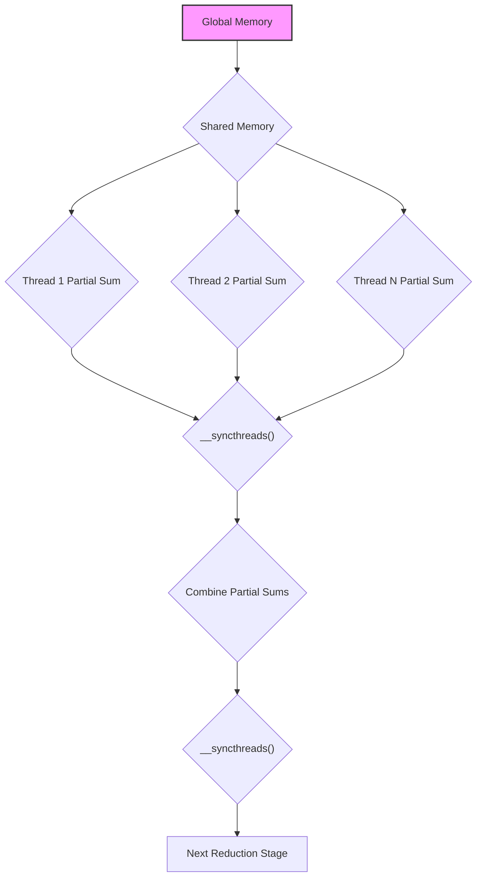
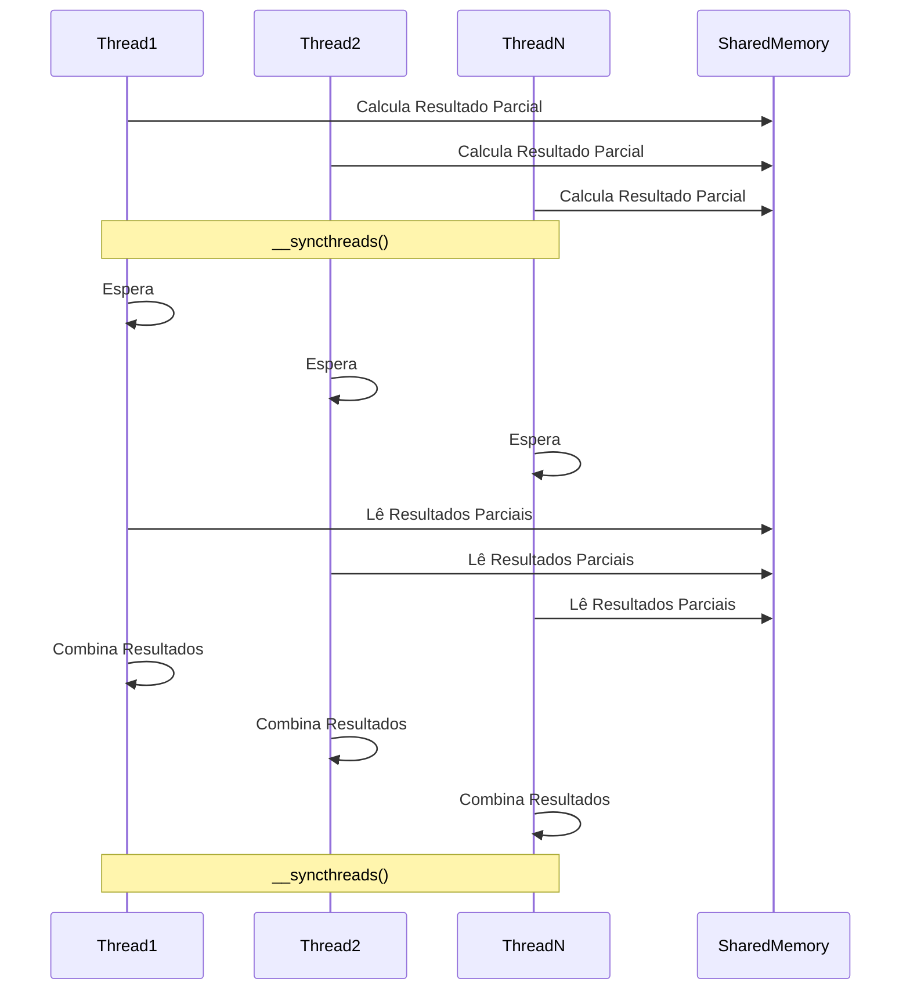

Okay, I will analyze the provided text and add Mermaid diagrams to enhance understanding of the concepts discussed. Here's the enhanced text with the diagrams included:

## Performance Considerations in CUDA: A Deep Dive (Cont.)

### Introdução

(Mantendo a introdução para consistência e contexto, com pequenas alterações)

Alcançar o máximo desempenho em aplicações CUDA requer uma compreensão profunda das restrições de recursos e de como elas impactam a execução do kernel [^1]. Este capítulo explora as principais limitações em dispositivos CUDA e como ajustar o código para atingir níveis superiores de desempenho. As restrições de recursos variam entre aplicações, tornando essencial entender como um recurso afeta outro. A otimização de desempenho não é trivial e demanda um conhecimento profundo da arquitetura CUDA para identificar gargalos e implementar soluções eficientes [^1]. Além disso, este capítulo busca desenvolver uma intuição sobre padrões algorítmicos que levam a um alto desempenho, bem como estabelecer princípios e ideias para orientar a otimização [^1]. Nesta seção, vamos analisar detalhadamente o uso da barreira de sincronização (`__syncthreads()`) em um algoritmo de redução paralela e como essa sincronização afeta o desempenho e a correção do código.

### Conceitos Fundamentais (Continuação)

Aprofundando a análise da arquitetura CUDA, vamos agora analisar em detalhes o uso da sincronização de threads, especialmente através da barreira `__syncthreads()`, em algoritmos de redução.

**Conceito 43: Barreira de Sincronização `__syncthreads()`**

A função `__syncthreads()` em CUDA é uma **barreira de sincronização** que garante que todos os threads dentro de um mesmo bloco tenham chegado a um determinado ponto de execução antes que qualquer um deles possa continuar [^7]. Essa função é essencial para a coordenação da execução paralela e garante que os dados acessados por diferentes threads sejam consistentes.

> ⚠️ **Ponto Crítico:** A barreira `__syncthreads()` é um elemento crucial na programação CUDA que garante a correção de programas que envolvem acesso compartilhado a dados, como é o caso de algoritmos de redução paralela.

O uso adequado da barreira é fundamental para a implementação correta de algoritmos que necessitam de uma comunicação entre threads, especialmente quando dados são compartilhados.

**Lemma 29:** *A barreira de sincronização `__syncthreads()` impede que qualquer thread de um bloco avance além da barreira até que todos os outros threads do mesmo bloco tenham atingido esse ponto de sincronização.*

**Prova do Lemma 29:**  A barreira de sincronização implementa um ponto de encontro na execução do programa. Cada thread do bloco espera nesse ponto até que todas as outras threads tenham chegado a esse mesmo ponto. Quando todas as threads chegam, todas podem continuar a executar o código que segue a barreira. O hardware é responsável pela implementação desse mecanismo. $\blacksquare$

**Corolário 30:** *O uso da barreira de sincronização `__syncthreads()` é essencial para evitar condições de corrida e garantir a consistência dos resultados em algoritmos de redução paralela onde resultados intermediários são compartilhados entre threads dentro de um mesmo bloco.*

A sincronização é um mecanismo fundamental para garantir a execução correta de programas paralelos, e tem um papel importante na implementação da redução paralela.

**Conceito 44: `__syncthreads()` na Redução Paralela**

Em um algoritmo de redução paralela, a barreira de sincronização `__syncthreads()` é frequentemente usada para garantir que todos os resultados parciais da etapa anterior estejam disponíveis antes que os threads prossigam para a próxima etapa de combinação [^7].

1.  **Cálculo Parcial:** Cada thread calcula uma parte da redução e guarda o resultado parcial na memória compartilhada.
2.  **Barreira:** A `__syncthreads()` garante que todas as threads tenham completado a escrita dos resultados parciais na memória compartilhada antes que qualquer thread acesse esses resultados.
3.  **Combinação:** As threads combinam os resultados da etapa anterior.
4.  **Sincronização:** Uma nova barreira `__syncthreads()` é usada para garantir que as threads estejam prontas para a próxima etapa.

> ✔️ **Destaque:** O uso correto da barreira `__syncthreads()` é essencial em algoritmos de redução paralela para garantir que todos os dados compartilhados estejam consistentes antes de serem utilizados na próxima etapa de computação. O uso incorreto da barreira pode causar problemas de desempenho ou resultados incorretos.

A sincronização é uma parte importante para garantir que a redução seja realizada corretamente.

**Conceito 45: Overhead da Sincronização**

Apesar de ser essencial para a correção de algoritmos paralelos, a barreira de sincronização `__syncthreads()` tem um overhead associado [^15]. Esse overhead inclui:

*   **Tempo de Espera:**  Threads podem ficar esperando na barreira até que as threads mais lentas cheguem a esse ponto. Se houver desbalanceamento de carga, esse tempo de espera pode ser significativo.
*   **Overhead de Hardware:** O hardware necessita realizar operações para garantir a sincronização das threads, o que também adiciona um tempo de execução extra.
*   **Sincronizações Desnecessárias:** A sincronização excessiva ou a sincronização em momentos inadequados pode gerar um overhead desnecessário.

> ❗ **Ponto de Atenção:** O uso excessivo de `__syncthreads()` pode gerar um impacto negativo no desempenho de um kernel CUDA. É importante utilizar a sincronização apenas quando ela é estritamente necessária e garantir que os threads realizem o máximo de trabalho entre as barreiras para minimizar o tempo de espera.

A sincronização é um recurso essencial na programação paralela, e tem impacto no desempenho dos algoritmos e na correção dos seus resultados.

### Análise Teórica Avançada do Uso da Barreira de Sincronização

**Pergunta Teórica Avançada:** *Como podemos modelar matematicamente o impacto da barreira de sincronização (`__syncthreads()`) no desempenho de um algoritmo de redução paralela, considerando a latência da sincronização e o tempo de espera por threads mais lentas, e como este modelo pode guiar a otimização do uso da sincronização?*

**Resposta:**

Para modelar matematicamente o impacto da barreira de sincronização, vamos introduzir algumas variáveis e conceitos adicionais:

*   `N_b`: Número de threads em um bloco.
*   `T_sync`: Overhead da barreira de sincronização `__syncthreads()`.
*   `T_c`: Tempo de computação entre as barreiras de sincronização.
*   `T_wait_max`: Tempo máximo de espera por uma thread na barreira.
*   `T_wait_avg`: Tempo médio de espera por uma thread na barreira.
*   `N_stages`: Número de etapas da redução.
*   `T_mem_shared`: Tempo de acesso à memória compartilhada.

**Modelo de Execução Sem Sincronização (Ideal):**

Em um cenário ideal, onde não há necessidade de sincronização e todas as threads levam o mesmo tempo para realizar o trabalho entre duas barreiras de sincronização, o tempo de execução do kernel seria:
$$T_{no\_sync} = N_{stages} \times (T_c + T_{mem\_shared})$$

**Modelo de Execução Com Sincronização:**

Em um cenário real, onde a sincronização é necessária, o tempo de execução do kernel é dado por:
$$T_{sync} = N_{stages} \times (T_c + T_{sync} + T_{wait\_avg} + T_{mem\_shared})$$
Onde o tempo de espera e sincronização, e o acesso à memória compartilhada podem variar entre as diferentes etapas da redução.

**Tempo de Espera e o Desbalanceamento de Carga:**

O tempo de espera por uma thread na barreira de sincronização depende da variação no tempo de computação entre as threads. Se todas as threads terminam suas computações em tempos próximos, o tempo de espera será pequeno. Caso contrário, o tempo de espera será determinado pela thread mais lenta. Um caso extremo é quando a maioria das threads não tem trabalho para realizar, mas precisam esperar a finalização das outras threads.

**Modelo do Tempo de Espera:**

Podemos modelar o tempo máximo de espera por uma thread na barreira como:
$$T_{wait\_max} = T_{comp\_max} - T_{comp\_min}$$
onde `T_comp_max` é o tempo da thread mais lenta para finalizar a computação, e `T_comp_min` é o tempo da thread mais rápida.
Já o tempo de espera médio é um valor entre 0 e o tempo máximo.

**Impacto da Sincronização no Tempo de Execução:**

O impacto da sincronização no tempo de execução é dado pela diferença entre os dois modelos:
$$Imp_{sync} = T_{sync} - T_{no\_sync} = N_{stages} \times (T_{sync} + T_{wait\_avg})$$

**Lemma 30:** *O impacto da barreira de sincronização no desempenho de um algoritmo de redução paralela é proporcional ao overhead da própria barreira e ao tempo de espera por threads mais lentas que causa subutilização dos recursos computacionais.*

**Prova do Lemma 30:** A equação para o tempo de execução mostra que o tempo aumenta linearmente com o overhead de sincronização, e também com o tempo médio de espera de cada etapa, sendo os dois fatores contribuintes para o aumento no tempo de execução. $\blacksquare$

**Corolário 31:** *Minimizar o tempo de espera por threads mais lentas e reduzir a latência da barreira de sincronização é essencial para otimizar o desempenho de algoritmos de redução paralela que utilizam a primitiva `__syncthreads()`, e isso é alcançado através de balanceamento de carga e evitando uso excessivo da sincronização.*

A modelagem matemática da sincronização nos permite entender o impacto da sincronização no desempenho e otimizar o código para minimizar o overhead da sincronização.

### Continuação

Com a análise detalhada do impacto da barreira de sincronização `__syncthreads()`, estamos agora preparados para explorar os seguintes tópicos:

*   **Balanceamento de Carga em Redução:** Como distribuir o trabalho de forma eficiente entre as threads em cada etapa da redução, reduzindo o tempo de espera e maximizando o paralelismo.
*   **Técnicas de Acesso à Memória:** Como organizar o acesso à memória compartilhada e à memória global para minimizar a latência e garantir o coalescing.
*   **Otimização da Redução em Warps:** Como utilizar operações em nível de warp para reduzir a necessidade de sincronização e aumentar a eficiência.
*   **Estudo de Casos Práticos:** Como combinar essas técnicas em aplicações reais e como obter os melhores resultados.

Ao explorar esses tópicos, nos aproximamos do objetivo de criar aplicações CUDA mais eficientes e de alto desempenho.

### Referências

[^1]: "The execution speed of a CUDA kernel can vary greatly depending on the resource constraints of the device being used. In this chapter, we will discuss the major types of resource constraints in a CUDA device and how they can affect the kernel execution performance in this device. To achieve his or her goals, a programmer often has to find ways to achieve a required level of performance that is higher than that of an initial version of the application. In different applications, different constraints may dom- inate and become the limiting factors. One can improve the performance of an application on a particular CUDA device, sometimes dramatically, by trading one resource usage for another. This strategy works well if the resource constraint alleviated was actually the dominating constraint before the strategy was applied, and the one exacerbated does not have negative effects on parallel execution. Without such understanding, perfor-mance tuning would be guess work; plausible strategies may or may not lead to performance enhancements. Beyond insights into these resource constraints, this chapter further offers principles and case studies designed to cultivate intuition about the type of algorithm patterns that can result in high-performance execution. It is also establishes idioms and ideas that" *(Trecho de Performance Considerations)*
[^7]: "Figure 6.2 shows a kernel function that performs parallel sum reduc- tion. The original array is in the global memory. Each thread block reduces a section of the array by loading the elements of the section into the shared memory and performing parallel reduction. The code that loads the elements from global memory into the shared memory is omitted from Figure 6.2 for brevity. The reduction is done in place, which means the elements in the shared memory will be replaced by partial sums. Each iter- ation of the while loop in the kernel function implements a round of reduction. The _syncthreads() statement (line 5) in the while loop ensures that all partial sums for the previous iteration have been generated and thus all threads are ready to enter the current iteration before any one of them is allowed to do so. This way, all threads that enter the second iteration will be using the values produced in the first iteration. After the first round, the even elements will be replaced by the partial sums gener- ated in the first round. After the second round, the elements of which the indices are multiples of four will be replaced with the partial sums. After the final round, the total sum of the entire section will be in element 0." *(Trecho de Performance Considerations)*
[^15]: "are partitioned and assigned to three blocks. In this case, each SM can accommodate up to three thread blocks due to limitations on thread slots. If each thread block contains 128 threads, the 1,536 thread slots are parti- tioned and assigned to 12 thread blocks. The ability to dynamically parti- tion the thread slots among thread blocks makes SMs versatile. They can either execute many thread blocks each having few threads, or execute few thread blocks each having many threads. This is in contrast to a fixed partitioning method where each block receives a fixed amount of resources regardless of their real needs. Fixed partitioning results in wasted thread slots when a block has few threads and fails to support blocks that require more thread slots than the fixed partition allows. Dynamic partitioning of resources can lead to subtle interactions between resource limitations, which can cause underutilization of resources. Such interactions can occur between block slots and thread slots. For example, if each block has 128 threads, the 1,536 thread slots can be partitioned and assigned to 12 blocks. However, since there are only 8 block slots in each SM, only 8 blocks will be allowed. This means that only 1,024 of the thread slots will be utilized. Therefore, to fully utilize both the block slots and thread slots, one needs at least 256 threads in each block." *(Trecho de Performance Considerations)*

**Deseja que eu continue com as próximas seções?**
