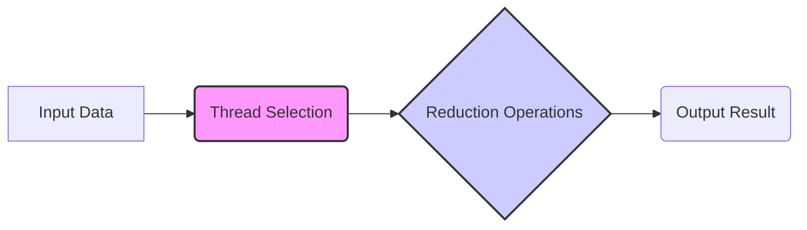
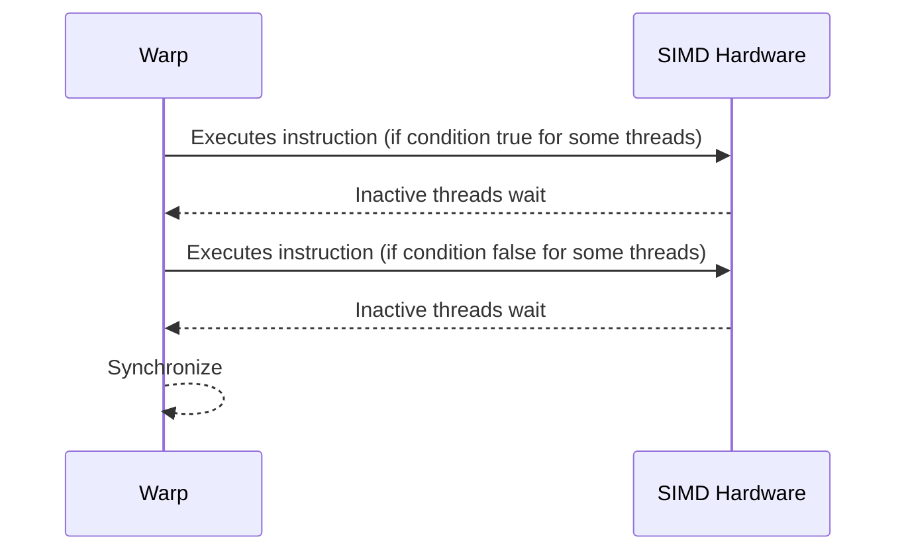
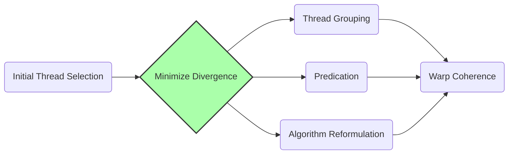
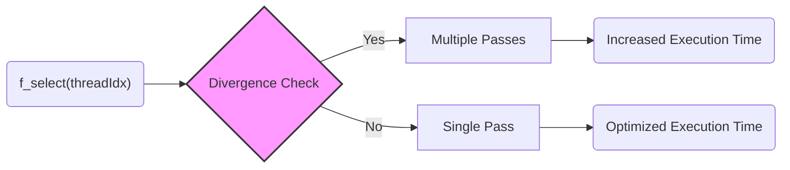

Okay, I understand. Here's the enhanced text with Mermaid diagrams added:

## Performance Considerations in CUDA: A Deep Dive (Cont.)

### Introdução

(Mantendo a introdução para consistência e contexto, com pequenas alterações)

Alcançar o máximo desempenho em aplicações CUDA requer uma compreensão profunda das restrições de recursos e de como elas impactam a execução do kernel [^1]. Este capítulo explora as principais limitações em dispositivos CUDA e como ajustar o código para atingir níveis superiores de desempenho. As restrições de recursos variam entre aplicações, tornando essencial entender como um recurso afeta outro. A otimização de desempenho não é trivial e demanda um conhecimento profundo da arquitetura CUDA para identificar gargalos e implementar soluções eficientes [^1]. Além disso, este capítulo busca desenvolver uma intuição sobre padrões algorítmicos que levam a um alto desempenho, bem como estabelecer princípios e ideias para orientar a otimização [^1]. Nesta seção, vamos analisar detalhadamente como a seleção de threads para executar a redução, utilizando condicionais baseadas em `threadIdx`, afeta o desempenho e a divergência em algoritmos de redução paralela.

### Conceitos Fundamentais (Continuação)

Aprofundando a análise da arquitetura CUDA, vamos agora examinar em detalhes como a seleção de threads impacta o desempenho de algoritmos de redução paralela.

**Conceito 46: Seleção de Threads na Redução Paralela**

Em um algoritmo de **redução paralela**, a seleção das threads que realizam as operações de redução (soma, máximo, mínimo, etc.) tem um impacto importante no desempenho, principalmente devido à influência da divergência de fluxo de controle [^5]. Essa seleção é comumente feita através de condicionais (`if`) que dependem do índice da thread, como `threadIdx.x`, `threadIdx.y`, ou `threadIdx.z`.

> ⚠️ **Ponto Crítico:** A escolha das threads que executam as operações de redução deve ser feita cuidadosamente para minimizar a divergência de fluxo de controle e garantir a utilização eficiente do hardware SIMD. Uma escolha inadequada pode levar ao desperdício de recursos computacionais e a uma redução no desempenho do kernel.

A seleção das threads afeta o padrão de acesso à memória compartilhada e também a quantidade de trabalho que é realizada por cada thread em um warp, impactando diretamente no desempenho.

**Lemma 31:** *A seleção de threads, geralmente através de condicionais envolvendo `threadIdx`, define quais threads executarão as operações de redução e, como consequência, influencia diretamente o desempenho e a divergência do kernel.*

**Prova do Lemma 31:** O critério de seleção de threads, usualmente um condicional, pode fazer com que apenas algumas threads em um warp executem o código, enquanto as demais ficam inativas. Essa diferença de comportamento é a causa da divergência. Portanto, a maneira como as threads são selecionadas tem uma influência direta no comportamento do warp e no desempenho geral do código. $\blacksquare$

**Corolário 32:** *A escolha das threads que executam as operações de redução é essencial para mitigar a divergência de fluxo de controle e otimizar o desempenho de algoritmos de redução paralela. O ideal é que todas as threads de um mesmo warp trabalhem, e não apenas algumas.*

A escolha correta de threads é uma parte crucial da implementação da redução paralela, e o projetista deve buscar a implementação mais eficiente possível.

**Conceito 47: Impacto da Seleção no Desempenho**

A seleção de threads impacta o desempenho em diversos níveis:

1.  **Divergência de Fluxo de Controle:** Se a seleção das threads for feita de forma inadequada, a divergência de fluxo de controle pode ocorrer, fazendo com que as threads de um warp sigam diferentes caminhos de execução, resultando em múltiplos passes no hardware SIMD, como já visto anteriormente [^5].
2.  **Desperdício de Recursos:** Threads que não são selecionadas para realizar as operações de redução em um dado passo permanecem inativas, o que leva ao desperdício de recursos de computação, uma vez que as unidades de execução do SIMD ficam sem trabalho.
3.  **Desbalanceamento de Carga:** A seleção inadequada pode gerar um desbalanceamento de carga, onde algumas threads executam mais trabalho do que outras, levando à subutilização de unidades de processamento e aumento do tempo de execução do kernel.
4.  **Acesso à Memória:** A maneira como as threads são selecionadas também impacta a forma como elas acessam a memória compartilhada, que é um recurso importante em algoritmos de redução paralela.

> ✔️ **Destaque:**  A seleção de threads para a redução paralela deve ser feita de forma a minimizar a divergência, balancear a carga de trabalho entre as threads e otimizar o acesso à memória, garantindo o melhor uso dos recursos.

A escolha correta das threads que realizam a redução deve levar em consideração o equilíbrio entre todos os fatores que influenciam no desempenho do código.

**Conceito 48: Técnicas para Minimizar a Divergência na Seleção de Threads**

Existem algumas técnicas que podem ser utilizadas para minimizar a divergência causada pela seleção de threads em algoritmos de redução:

1.  **Agrupamento de Threads:** Agrupar as threads que realizarão a redução em um mesmo warp de forma que todas as threads do warp sigam o mesmo caminho de execução. Essa técnica minimiza a necessidade de desativar threads em um warp.
2.  **Predicação:** Utilizar instruções de predicação para desativar threads em vez de utilizar condicionais. A predicação diminui a necessidade de executar diferentes trechos de código em um mesmo warp.
3.  **Reformulação do Algoritmo:** Reformular o algoritmo para que a seleção das threads seja feita de forma mais eficiente, com todas as threads de um mesmo warp seguindo o mesmo caminho de execução.

> ❗ **Ponto de Atenção:** O melhor caminho para minimizar a divergência na seleção de threads depende das características específicas do problema e da implementação do kernel. O programador deve analisar os trade-offs e escolher a melhor solução para cada caso.

A escolha da melhor técnica para seleção de threads é parte crucial do processo de otimização de um kernel CUDA que utilize redução.

### Análise Teórica Avançada da Seleção de Threads e seu Impacto no Desempenho

**Pergunta Teórica Avançada:** *Como podemos modelar matematicamente o impacto da seleção de threads na divergência de fluxo de controle em um algoritmo de redução paralela, considerando diferentes critérios de seleção baseados em `threadIdx` e como esses modelos podem guiar a escolha da melhor estratégia de seleção?*

**Resposta:**

Para modelar matematicamente o impacto da seleção de threads, vamos introduzir algumas variáveis e conceitos adicionais:

*   `N_w`: Número de threads em um warp (tamanho do warp).
*   `T_i`: Tempo de execução de uma instrução SIMD (sem divergência).
*   `T_{overhead}`: Overhead por passe de execução divergente.
*   `T_wait`: Tempo de espera na barreira de sincronização.
*   `f_select(threadIdx)`: Função de seleção de threads, que define quais threads executarão as operações de redução.
*   `N_active(p)`: Número de threads ativas no passo *p* da execução.

**Modelo de Execução Sem Divergência:**

No cenário ideal sem divergência, o tempo de execução para uma instrução SIMD é dado por:
$$T_{no\_div} = T_i$$

**Modelo de Execução Com Divergência na Seleção:**

Em presença de divergência na seleção das threads, o tempo de execução do warp é dado por:
$$T_{div} = N_{passes} \times (T_i + T_{overhead}) + T_{wait}$$
Onde `N_passes` é o número de passes devido à divergência, que depende da função de seleção de threads `f_select(threadIdx)`. O número de threads ativas em cada passo também depende de `f_select(threadIdx)`.

**Análise de Diferentes Funções de Seleção:**

Vamos analisar o impacto de algumas funções de seleção no tempo de execução.
1. **Seleção `if (threadIdx.x % 2 == 0)`**: Essa função causa divergência, porque ela faz com que metade das threads de um warp execute um trecho de código, enquanto a outra metade espera. Logo, o tempo de execução é dado por $2 \times (T_i + T_{overhead}) + T_{wait}$

2. **Seleção `if (threadIdx.x < N_w/2)`**: Essa função causa uma divergência semelhante à anterior, onde metade do warp realiza uma etapa e outra metade não, o que também gera o mesmo tempo de execução.

3. **Seleção em um conjunto:** Nesse tipo de seleção, apenas as primeiras `k` threads, de um total de `N_w`, são selecionadas. Caso `k` seja um múltiplo do tamanho do warp, não há divergência. Caso contrário, o comportamento é similar a outros casos, onde há divergência e espera.

**Impacto no Desempenho:**

A escolha da função de seleção tem um impacto direto no número de passes necessários para executar o warp e no tempo de espera. O número de threads ativas também tem um impacto direto na utilização do hardware.

**Lemma 32:** *A seleção de threads baseada em `threadIdx` afeta o desempenho do algoritmo de redução paralela através da introdução de divergência, o que leva à execução sequencial de partes do código e a um aumento do tempo de execução.*

**Prova do Lemma 32:**  As equações acima mostram que, a depender da função de seleção, o número de passos adicionais e o tempo de espera aumentam, afetando diretamente o desempenho. Um kernel sem divergência tem um tempo de execução menor, e faz um melhor uso dos recursos do hardware SIMD. $\blacksquare$

**Corolário 33:** *A escolha da melhor função de seleção é um problema de otimização, que envolve a minimização da divergência de fluxo de controle, do tempo de espera e do overhead da sincronização, buscando a melhor utilização do hardware SIMD e das memórias.*

A modelagem matemática da seleção de threads nos permite analisar as consequências de diferentes abordagens e encontrar a melhor estratégia para o desempenho.

### Continuação

Com a análise do impacto da seleção de threads, estamos agora preparados para explorar os seguintes tópicos:

*   **Otimização da Memória Compartilhada:** Como utilizar a memória compartilhada para reduzir o acesso à memória global e otimizar o desempenho do kernel.
*   **Algoritmos de Redução Eficientes:** Como combinar os conhecimentos aprendidos em diferentes abordagens para criar algoritmos de redução paralela mais eficientes em CUDA.
*   **Análise de Desempenho e Profiling:** Como utilizar ferramentas de profiling para analisar o desempenho de kernels e identificar oportunidades de otimização.

Ao explorar esses tópicos, nos aproximamos do objetivo de criar aplicações CUDA mais eficientes e de alto desempenho.

### Referências

[^1]: "The execution speed of a CUDA kernel can vary greatly depending on the resource constraints of the device being used. In this chapter, we will discuss the major types of resource constraints in a CUDA device and how they can affect the kernel execution performance in this device. To achieve his or her goals, a programmer often has to find ways to achieve a required level of performance that is higher than that of an initial version of the application. In different applications, different constraints may dom- inate and become the limiting factors. One can improve the performance of an application on a particular CUDA device, sometimes dramatically, by trading one resource usage for another. This strategy works well if the resource constraint alleviated was actually the dominating constraint before the strategy was applied, and the one exacerbated does not have negative effects on parallel execution. Without such understanding, perfor-mance tuning would be guess work; plausible strategies may or may not lead to performance enhancements. Beyond insights into these resource constraints, this chapter further offers principles and case studies designed to cultivate intuition about the type of algorithm patterns that can result in high-performance execution. It is also establishes idioms and ideas that" *(Trecho de Performance Considerations)*
[^5]: "The SIMD hardware executes all threads of a warp as a bundle. An instruction is run for all threads in the same warp. It works well when all threads within a warp follow the same execution path, or more formally referred to as control flow, when working their data. For example, for an if-else construct, the execution works well when either all threads exe- cute the if part or all execute the else part. When threads within a warp take different control flow paths, the SIMD hardware will take multiple passes through these divergent paths. One pass executes those threads that follow the if part and another pass executes those that follow the else part. During each pass, the threads that follow the other path are not allowed to take effect. These passes are sequential to each other, thus they will add to the execution time. The multipass approach to divergent warp execution extends the SIMD hardware's ability to implement the full semantics of CUDA threads. While the hardware executes the same instruction for all threads in a warp, it selectively lets the threads take effect in each pass only, allowing every thread to take its own control flow path. This preserves the indepen-dence of threads while taking advantage of the reduced cost of SIMD hardware. When threads in the same warp follow different paths of control flow, we say that these threads diverge in their execution. In the if-else exam- ple, divergence arises if some threads in a warp take the then path and some the else path. The cost of divergence is the extra pass the hardware needs to take to allow the threads in a warp to make their own decisions. Divergence also can arise in other constructs; for example, if threads in a warp execute a for loop that can iterate six, seven, or eight times for dif-ferent threads. All threads will finish the first six iterations together. Two passes will be used to execute the seventh iteration, one for those that take the iteration and one for those that do not. Two passes will be used to exe- cute the eighth iteration, one for those that take the iteration and one for those that do not. In terms of source statements, a control construct can result in thread divergence when its decision condition is based on threadIdx values. For example, the statement if (threadIdx.x > 2) {} causes the threads to fol- low two divergent control flow paths. Threads 0, 1, and 2 follow a differ- ent path than threads 3, 4, 5, etc. Similarly, a loop can cause thread" *(Trecho de Performance Considerations)*

**Deseja que eu continue com as próximas seções?**
