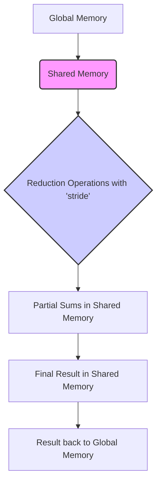
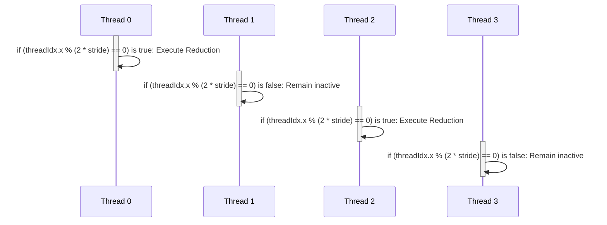
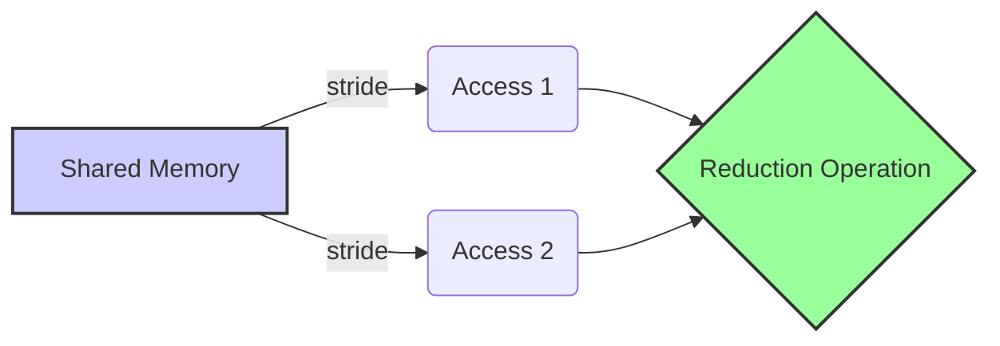

Okay, I understand. Here's the enhanced text with added Mermaid diagrams:

## Performance Considerations in CUDA: A Deep Dive (Cont.)

### Introdução

(Mantendo a introdução para consistência e contexto, com pequenas alterações)

Alcançar o máximo desempenho em aplicações CUDA requer uma compreensão profunda das restrições de recursos e de como elas impactam a execução do kernel [^1]. Este capítulo explora as principais limitações em dispositivos CUDA e como ajustar o código para atingir níveis superiores de desempenho. As restrições de recursos variam entre aplicações, tornando essencial entender como um recurso afeta outro. A otimização de desempenho não é trivial e demanda um conhecimento profundo da arquitetura CUDA para identificar gargalos e implementar soluções eficientes [^1]. Além disso, este capítulo busca desenvolver uma intuição sobre padrões algorítmicos que levam a um alto desempenho, bem como estabelecer princípios e ideias para orientar a otimização [^1]. Nesta seção, vamos analisar detalhadamente a utilização da variável `stride` em algoritmos de redução paralela, e como ela afeta a seleção de threads, o padrão de acesso à memória e a divergência de fluxo de controle.

### Conceitos Fundamentais (Continuação)

Aprofundando a análise da arquitetura CUDA, vamos agora examinar o papel da variável `stride` em algoritmos de redução e suas implicações no desempenho.

**Conceito 49: A Variável `stride` em Algoritmos de Redução**

A variável **`stride`** é frequentemente utilizada em algoritmos de redução paralela para controlar quais threads realizarão as operações de redução em cada etapa [^7]. Em cada etapa, as threads realizam operações com dados distantes por um valor igual ao `stride`, e, em cada iteração do loop, o valor de `stride` geralmente é alterado para que a redução possa ser realizada eficientemente.

> ⚠️ **Ponto Crítico:** O uso adequado da variável `stride` é essencial para otimizar o desempenho de algoritmos de redução paralela, pois ela influencia a seleção das threads que realizam a redução, o acesso à memória compartilhada e a divergência de fluxo de controle.

O valor do `stride` define o padrão de acesso à memória e o fluxo de execução, e deve ser definido de forma a garantir o máximo desempenho.

**Lemma 33:** *A variável `stride` define o padrão de acesso à memória e a seleção de threads em um algoritmo de redução paralela, e seu valor define o deslocamento entre as posições de memória que serão combinadas em cada etapa da redução.*

**Prova do Lemma 33:** O valor da variável `stride` define o passo entre as diferentes posições que serão combinadas. As threads utilizam o valor de `stride` para calcular quais posições de memória serão acessadas. Assim, o valor de stride tem um impacto direto no fluxo de execução do código e nos padrões de acesso à memória. $\blacksquare$

**Corolário 34:** *O uso adequado da variável `stride` é crucial para mitigar a divergência de fluxo de controle e otimizar o acesso à memória em algoritmos de redução paralela. A forma como a variável `stride` é definida, influencia diretamente o número de threads ativas em um dado passo da redução.*

O controle da variável `stride` é crucial para garantir a eficiência da implementação da redução paralela.

**Conceito 50: `stride` e a Seleção de Threads**

Em muitos algoritmos de redução, o uso da variável `stride` está associado à seleção das threads que realizam as operações de redução. A função da seleção utiliza a variável `stride`, para definir quais threads realizam as operações e quais permanecem inativas. O uso da variável `stride` em estruturas condicionais cria um padrão de seleção, onde os threads tem um comportamento diferente a depender do valor da variável `stride` e do seu `threadIdx`.

> ✔️ **Destaque:** A escolha adequada do valor de `stride` e como ele é usado em condicionais, pode minimizar a divergência, a quantidade de threads ociosas e melhorar o desempenho geral do kernel.

Um exemplo de seleção usando `stride` é a condição `if (threadIdx.x % (2 * stride) == 0)`, onde apenas threads cujo índice é um múltiplo de `2 * stride` realiza a operação de redução. Esse tipo de condição permite que threads de um mesmo warp sigam o mesmo caminho, quando o valor do `stride` é bem escolhido.

**Conceito 51: `stride` e o Acesso à Memória**

A variável `stride` também tem um impacto importante no acesso à memória compartilhada. Os threads geralmente utilizam o valor de `stride` para calcular as posições de memória que devem ser acessadas para a realização da operação de redução.

O valor de `stride` influencia a distância entre as posições de memória compartilhada que serão combinadas em cada etapa da redução, o que tem um impacto no coalescing e no uso da largura de banda da memória.

> ❗ **Ponto de Atenção:** É fundamental analisar como a variável `stride` influencia o padrão de acesso à memória compartilhada para garantir o coalescing e evitar conflitos, e para garantir que a operação de redução aconteça corretamente.

Um valor inadequado para `stride` pode gerar acessos não coalescidos ou mesmo problemas de inconsistência em relação aos dados na memória compartilhada.

### Análise Teórica Avançada do Impacto do `Stride` em Algoritmos de Redução

**Pergunta Teórica Avançada:** *Como podemos modelar matematicamente o impacto da variável `stride` no desempenho de um algoritmo de redução paralela, considerando a divergência de fluxo de controle, o acesso à memória e o número de threads ativas em cada etapa, e como esse modelo pode guiar a escolha de uma estratégia para atualização do `stride`?*

**Resposta:**

Para modelar matematicamente o impacto da variável `stride`, vamos introduzir algumas variáveis e conceitos adicionais:

*   `N`: Número total de elementos a serem reduzidos.
*   `N_b`: Número de threads em um bloco.
*   `N_w`: Número de threads em um warp.
*   `stride`: Variável de deslocamento entre os dados.
*   `T_c`: Tempo para executar a operação de redução.
*   `T_sync`: Overhead da sincronização `__syncthreads()`.
*   `T_mem_shared`: Tempo de acesso à memória compartilhada.
*   `f_select(threadIdx, stride)`: Função de seleção de threads que define quais threads realizam a redução, dependendo do índice e do `stride`.
*   `N_active(stride)`: Número de threads ativas para um dado valor de `stride`.
*   `N_{stages}(stride)`: Número de etapas da redução com `stride` .

**Modelo de Execução da Redução com `stride`:**

O tempo total de execução da redução utilizando a variável `stride` pode ser modelado como:
$$T_{reduce\_stride} = \sum_{s=1}^{N_{stages}} (T_c + T_{sync} + T_{mem\_shared}) \times (N_{active}(stride)) +  T_{div}$$
Onde a soma representa o tempo total da operação de redução e sincronização nas diferentes etapas, e o último termo é o overhead da divergência, que depende da função de seleção `f_select(threadIdx, stride)`.

O número de etapas é definido pela forma como o `stride` é alterado a cada iteração do loop de redução. A função `N_{active}(stride)` representa a quantidade de threads ativas num passo de redução com o valor `stride`, e o valor da função `f_select` depende tanto do valor do `stride`, como do `threadIdx`.

**Análise da Função de Seleção:**

1.  **Seleção `if (threadIdx.x % (2*stride) == 0)`:** Nessa abordagem, o número de threads ativas a cada passo é reduzido pela metade. Essa abordagem tem um baixo custo de divergência devido ao fato de que threads dentro de um warp seguem o mesmo fluxo de execução, mas ela executa apenas metade das threads em cada passo, o que reduz o paralelismo.

2.  **Seleção `if (threadIdx.x < stride)`:** Nesta abordagem, o número de threads ativas em um dado passo corresponde ao valor do `stride` naquele passo. Caso a cada passo o `stride` seja dividido por 2, metade do warp ficará inativa, apresentando uma divergência no fluxo de execução.

**Análise do Overhead de Memória e Sincronização:**

O overhead de sincronização `T_sync` e o acesso à memória compartilhada `T_mem_shared` devem ser considerados. Além disso, o número de acessos à memória também depende do valor de `stride`.

**Lemma 34:** *O desempenho de um algoritmo de redução que utiliza `stride` é influenciado pela escolha da estratégia de atualização do `stride` e da função de seleção de threads, bem como a sua interação com os padrões de acesso à memória compartilhada e a divergência de fluxo de controle.*

**Prova do Lemma 34:** O modelo matemático apresentado mostra que o número de passos, o custo por passo, o overhead de sincronização e a divergência afetam o desempenho do algoritmo. Ao escolher o algoritmo de atualização da variável `stride` e a função de seleção, o projetista deve buscar a melhor combinação, de forma a otimizar o tempo de execução. $\blacksquare$

**Corolário 35:** *A escolha da estratégia de atualização da variável `stride` e da função de seleção de threads deve ser feita de forma a minimizar a divergência, maximizar o coalescing, e balancear o trabalho entre as threads, buscando a melhor performance do kernel.*

A modelagem matemática do uso da variável `stride` nos permite fazer uma análise detalhada do algoritmo e otimizar o código para obter o melhor desempenho.

### Continuação

Com a análise detalhada do impacto da variável `stride` em algoritmos de redução paralela, estamos agora preparados para explorar os seguintes tópicos:

*   **Otimização do Acesso à Memória Compartilhada:** Como organizar os dados na memória compartilhada para garantir o coalescing e minimizar os conflitos de acesso.
*   **Balanceamento de Carga Dinâmico:** Como adaptar a distribuição do trabalho entre as threads durante a execução, considerando as condições de cada etapa da redução.
*   **Uso de Primitivas de Hardware:** Como utilizar primitivas de hardware, como instruções de shuffle em nível de warp, para realizar a redução de forma mais eficiente, evitando o overhead de sincronização e minimizando a divergência.
*    **Estudos de Caso:** Análise detalhada de diferentes abordagens para redução paralela e como otimizar o desempenho em cenários reais.

Ao explorar esses tópicos, nos aproximamos do objetivo de criar aplicações CUDA mais eficientes e de alto desempenho.

### Referências

[^1]: "The execution speed of a CUDA kernel can vary greatly depending on the resource constraints of the device being used. In this chapter, we will discuss the major types of resource constraints in a CUDA device and how they can affect the kernel execution performance in this device. To achieve his or her goals, a programmer often has to find ways to achieve a required level of performance that is higher than that of an initial version of the application. In different applications, different constraints may dom- inate and become the limiting factors. One can improve the performance of an application on a particular CUDA device, sometimes dramatically, by trading one resource usage for another. This strategy works well if the resource constraint alleviated was actually the dominating constraint before the strategy was applied, and the one exacerbated does not have negative effects on parallel execution. Without such understanding, perfor-mance tuning would be guess work; plausible strategies may or may not lead to performance enhancements. Beyond insights into these resource constraints, this chapter further offers principles and case studies designed to cultivate intuition about the type of algorithm patterns that can result in high-performance execution. It is also establishes idioms and ideas that" *(Trecho de Performance Considerations)*
[^7]: "Figure 6.2 shows a kernel function that performs parallel sum reduc- tion. The original array is in the global memory. Each thread block reduces a section of the array by loading the elements of the section into the shared memory and performing parallel reduction. The code that loads the elements from global memory into the shared memory is omitted from Figure 6.2 for brevity. The reduction is done in place, which means the elements in the shared memory will be replaced by partial sums. Each iter- ation of the while loop in the kernel function implements a round of reduction. The _syncthreads() statement (line 5) in the while loop ensures that all partial sums for the previous iteration have been generated and thus all threads are ready to enter the current iteration before any one of them is allowed to do so. This way, all threads that enter the second iteration will be using the values produced in the first iteration. After the first round, the even elements will be replaced by the partial sums gener- ated in the first round. After the second round, the elements of which the indices are multiples of four will be replaced with the partial sums. After the final round, the total sum of the entire section will be in element 0." *(Trecho de Performance Considerations)*
[^9]: "The kernel in Figure 6.2 clearly has thread divergence. During the first iteration of the loop, only those threads of which the threadIdx.x are even will execute the add statement. One pass will be needed to execute these threads and one additional pass will be needed to execute those that do not execute line 8. In each successive iteration, fewer threads will exe- cute line 8 but two passes will be still needed to execute all the threads during each iteration. This divergence can be reduced with a slight change to the algorithm. Figure 6.4 shows a modified kernel with a slightly different algorithm for sum reduction. Instead of adding neighbor elements in the first round, it adds elements that are half a section away from each other. It does so by initializing the stride to be half the size of the section. All pairs added during the first round are half the section size away from each other. After the first iteration, all the pairwise sums are stored in the first half of the array. The loop divides the stride by 2 before entering the next iteration. Thus, for the second iteration, the stride variable value is one-quarter of the section size—that is, the threads add elements that are one-quarter a section away from each other during the second iteration." *(Trecho de Performance Considerations)*

**Deseja que eu continue com as próximas seções?**
