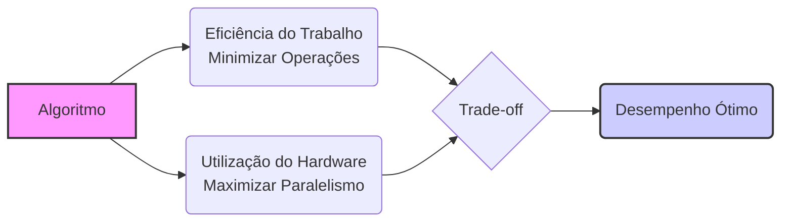
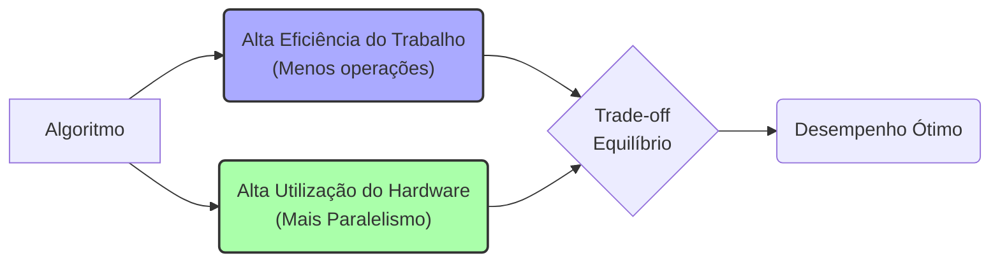
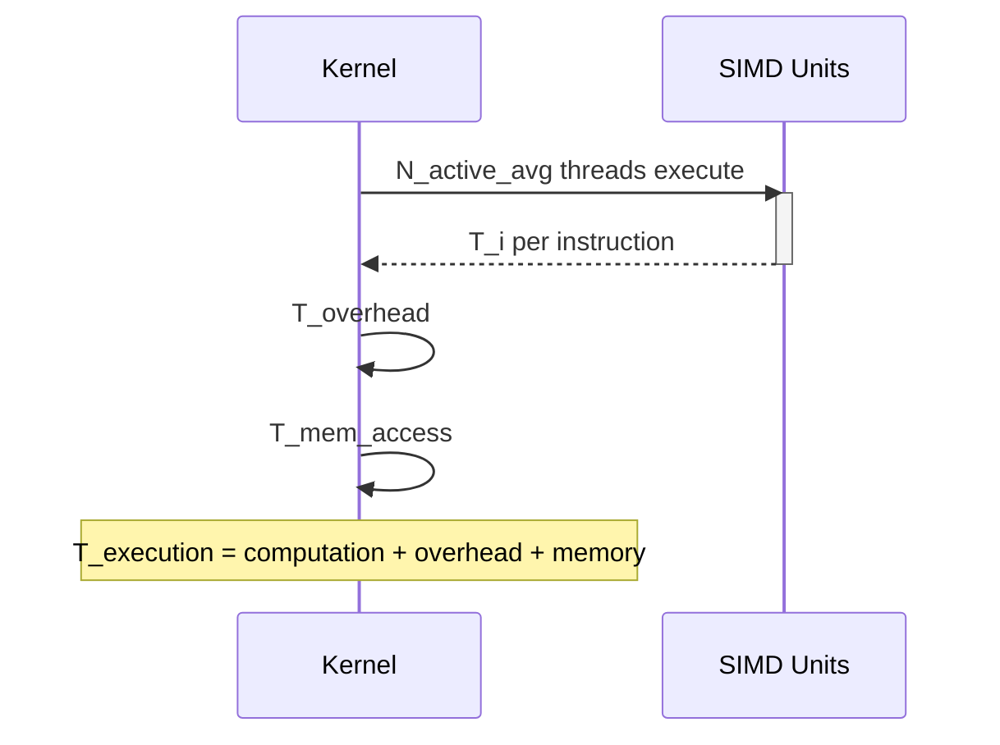

Okay, I will analyze the provided text and add Mermaid diagrams to enhance understanding of the concepts discussed, especially focusing on the trade-off between work efficiency and hardware utilization in CUDA.

### Introdução

(Mantendo a introdução para consistência e contexto, com pequenas alterações)

Alcançar o máximo desempenho em aplicações CUDA requer uma compreensão profunda das restrições de recursos e de como elas impactam a execução do kernel [^1]. Este capítulo explora as principais limitações em dispositivos CUDA e como ajustar o código para atingir níveis superiores de desempenho. As restrições de recursos variam entre aplicações, tornando essencial entender como um recurso afeta outro. A otimização de desempenho não é trivial e demanda um conhecimento profundo da arquitetura CUDA para identificar gargalos e implementar soluções eficientes [^1]. Além disso, este capítulo busca desenvolver uma intuição sobre padrões algorítmicos que levam a um alto desempenho, bem como estabelecer princípios e ideias para orientar a otimização [^1]. Nesta seção, vamos analisar o trade-off entre a eficiência do trabalho realizado por um algoritmo e a utilização eficiente do hardware, mostrando como o equilíbrio entre esses dois fatores afeta o desempenho de kernels CUDA.

### Conceitos Fundamentais (Continuação)

Continuando a análise da arquitetura CUDA, vamos agora explorar o trade-off entre a eficiência do trabalho e a utilização do hardware em algoritmos paralelos.

**Conceito 52: Eficiência do Trabalho (Work Efficiency)**

A **eficiência do trabalho** em um algoritmo se refere à minimização do número total de operações necessárias para resolver um determinado problema [^6]. Um algoritmo com alta eficiência do trabalho realiza o menor número possível de operações para alcançar o resultado desejado, reduzindo a carga computacional total.

> ⚠️ **Ponto Crítico:** Um algoritmo com alta eficiência de trabalho minimiza a quantidade de computação, mas nem sempre se traduz no melhor desempenho em hardware paralelo, já que a eficiência do trabalho não garante a utilização eficiente do hardware disponível.

Em um contexto de computação paralela, minimizar o trabalho realizado é fundamental, mas o paralelismo também é crucial para utilizar as unidades de execução SIMD da GPU. Algoritmos que utilizam pouca computação mas que precisam ser executados de forma serial podem ter um desempenho pior do que um algoritmo que necessita mais computação, mas que pode ser executado em paralelo.

**Lemma 35:** *A eficiência do trabalho de um algoritmo é definida pelo número mínimo de operações necessárias para resolver um problema, e a eficiência de trabalho por si só não garante que um algoritmo será executado da forma mais rápida em hardware paralelo.*

**Prova do Lemma 35:**  Um algoritmo com alta eficiência realiza o mínimo de trabalho para a obtenção de um resultado, o que minimiza a quantidade de recursos de processamento.  Entretanto, esse trabalho precisa ser distribuído e executado paralelamente para utilizar a capacidade do hardware SIMD. Um algoritmo que execute um número menor de operações, mas que não pode ser paralelizado, pode apresentar um desempenho pior. $\blacksquare$

**Corolário 36:** *O conceito de eficiência do trabalho deve ser considerado em conjunto com outros fatores como o paralelismo, a divergência de fluxo de controle e o acesso à memória para determinar o desempenho de um kernel CUDA.*

A eficiência do trabalho é um dos fatores que afeta o desempenho do kernel, e deve ser analisada juntamente com a utilização do hardware.

**Conceito 53: Utilização do Hardware (Hardware Utilization)**

A **utilização do hardware** se refere à capacidade de um algoritmo de utilizar eficientemente os recursos disponíveis no hardware, incluindo as unidades de processamento SIMD, a memória compartilhada, a memória global e outros recursos do dispositivo [^10]. Uma alta utilização do hardware maximiza o uso das unidades de processamento, minimiza o tempo de espera na memória e reduz o overhead da sincronização, resultando em um melhor desempenho.

> ✔️ **Destaque:** Maximizar a utilização do hardware é essencial para alcançar um alto desempenho em arquiteturas paralelas como as GPUs CUDA, e a utilização do hardware deve sempre ser considerada em conjunto com a eficiência de trabalho.

O objetivo é maximizar o trabalho realizado por cada unidade de processamento ao mesmo tempo. Um algoritmo que não utiliza todas as unidades de processamento de um warp não está utilizando o hardware de forma eficiente.

**Conceito 54: Trade-off entre Eficiência e Utilização**

Otimizar um kernel CUDA geralmente envolve um trade-off entre a eficiência do trabalho e a utilização do hardware.

*   **Eficiência de Trabalho:**  Algoritmos com alta eficiência de trabalho podem não ser naturalmente paralelizáveis, o que limita a utilização do hardware SIMD.
*   **Utilização do Hardware:** Algoritmos com alta utilização do hardware podem precisar de mais computação, o que pode reduzir sua eficiência em termos de número total de operações.

> ❗ **Ponto de Atenção:** O melhor desempenho em um kernel CUDA geralmente é alcançado através do equilíbrio entre a eficiência do trabalho e a utilização do hardware, maximizando ambos os fatores. O programador deve sempre buscar esse equilíbrio.

O trade-off entre a eficiência do trabalho e a utilização do hardware é fundamental no projeto de kernels CUDA, e o programador deve buscar otimizar ambos para obter o máximo desempenho.

### Análise Teórica Avançada do Trade-off entre Trabalho e Utilização do Hardware

**Pergunta Teórica Avançada:** *Como podemos modelar matematicamente o trade-off entre a eficiência do trabalho e a utilização do hardware em algoritmos paralelos em CUDA, considerando a complexidade computacional, o número de threads ativas, a divergência de fluxo de controle e o acesso à memória, e como esse modelo pode guiar a escolha da melhor estratégia de otimização?*

**Resposta:**

Para modelar matematicamente o trade-off entre a eficiência do trabalho e a utilização do hardware, vamos introduzir algumas variáveis e conceitos adicionais:

*   `W`: Trabalho total a ser realizado.
*   `N_b`: Número de threads em um bloco.
*   `N_w`: Número de threads em um warp.
*   `T_i`: Tempo de execução de uma instrução SIMD (sem divergência).
*   `T_overhead`: Overhead da sincronização.
*   `T_mem_access`: Tempo de acesso à memória.
*   `N_active_avg`: Número médio de threads ativas durante a execução.
*   `C(N)`: Complexidade computacional do algoritmo.

**Modelo de Eficiência do Trabalho:**

A eficiência do trabalho pode ser modelada através da complexidade computacional do algoritmo, que define o número total de operações necessárias:
$$Work\_Efficiency = \frac{W}{C(N)}$$
Quanto maior a complexidade computacional, menor será a eficiência do trabalho.

**Modelo de Utilização do Hardware:**

A utilização do hardware pode ser modelada através do número médio de threads ativas e do tempo de execução do kernel:
$$Hardware\_Utilization = \frac{N_{active\_avg} \times T_i}{T_{execution}}$$
Onde `T_execution` inclui o tempo de computação, o overhead da divergência e o tempo gasto na espera na barreira.

**Modelo do Tempo de Execução:**

O tempo de execução do kernel pode ser modelado como uma combinação do tempo de computação, o overhead da divergência, o tempo de sincronização e o tempo de acesso à memória:
$$T_{execution} = \frac{C(N) \times T_i}{N_{active\_avg}} + T_{overhead} + T_{mem\_access}$$

Onde `C(N)` é a complexidade do algoritmo.
Se a quantidade de computação for dividida entre as threads de um mesmo warp, `N_active_avg` terá um impacto direto na redução do tempo de execução.
Os termos `T_overhead` e `T_mem_access` também contribuem para o aumento do tempo de execução.

**Trade-off entre Eficiência e Utilização:**

A otimização do kernel envolve a busca pelo melhor compromisso entre os seguintes fatores:

*   **Reduzir a Complexidade:** Escolher algoritmos que realizam o mínimo de operações para reduzir o valor de `C(N)`.
*   **Maximizar o Paralelismo:** Usar o máximo possível das unidades de computação do hardware, garantindo que o valor de `N_active_avg` seja o maior possível, com todas as unidades de execução trabalhando ativamente.
*   **Minimizar a Divergência:** Evitar divergências de fluxo de controle, fazendo com que os warps executem o código da forma mais linear possível.
*   **Otimizar o Acesso à Memória:** Utilizar o acesso à memória coalescido e minimizar o tempo de espera em operações de escrita e leitura na memória.
*    **Minimizar o Overhead da Sincronização:** Utilizar a sincronização apenas quando necessária, de forma a minimizar o impacto no desempenho.

**Lemma 36:** *O trade-off entre a eficiência do trabalho e a utilização do hardware é fundamental para a otimização de kernels CUDA, e o projetista deve buscar um equilíbrio entre esses dois fatores para alcançar o melhor desempenho.*

**Prova do Lemma 36:** Os modelos matemáticos apresentados mostram que, se a eficiência de trabalho é priorizada, o paralelismo e a utilização do hardware podem ser sacrificados, e vice-versa. O desempenho máximo só é obtido quando há um equilíbrio correto entre os dois fatores, e essa busca requer uma análise cuidadosa das características de cada aplicação. $\blacksquare$

**Corolário 37:** *O modelo matemático do trade-off entre eficiência do trabalho e utilização do hardware permite quantificar o impacto de diferentes estratégias de otimização no desempenho de kernels CUDA, permitindo a escolha de algoritmos e configurações que equilibrem esses dois fatores para atingir o máximo desempenho.*

O modelo matemático apresentado nos auxilia a comparar o impacto de diferentes estratégias e a encontrar o melhor equilíbrio entre a utilização do hardware e a eficiência do trabalho realizado.

### Continuação

Com a análise detalhada do trade-off entre eficiência do trabalho e utilização do hardware, estamos agora preparados para explorar os seguintes tópicos:

*   **Estudo de Casos:** Como aplicar todos os conceitos aprendidos em casos reais, mostrando o impacto da eficiência do trabalho e da utilização do hardware.
*   **Análise de Algoritmos:** Como comparar diferentes algoritmos e escolher aqueles que melhor se adaptam às restrições do hardware e às necessidades do problema.
*   **Otimização de Código:** Como otimizar o código para reduzir a divergência de fluxo de controle, o número de operações e a latência no acesso à memória.
*   **Uso de Ferramentas de Profiling:** Como usar ferramentas de profiling para analisar o desempenho de kernels CUDA e identificar gargalos de desempenho.

Ao explorar esses tópicos, nos aproximamos do objetivo de criar aplicações CUDA mais eficientes e de alto desempenho.

### Referências

[^1]: "The execution speed of a CUDA kernel can vary greatly depending on the resource constraints of the device being used. In this chapter, we will discuss the major types of resource constraints in a CUDA device and how they can affect the kernel execution performance in this device. To achieve his or her goals, a programmer often has to find ways to achieve a required level of performance that is higher than that of an initial version of the application. In different applications, different constraints may dom- inate and become the limiting factors. One can improve the performance of an application on a particular CUDA device, sometimes dramatically, by trading one resource usage for another. This strategy works well if the resource constraint alleviated was actually the dominating constraint before the strategy was applied, and the one exacerbated does not have negative effects on parallel execution. Without such understanding, perfor-mance tuning would be guess work; plausible strategies may or may not lead to performance enhancements. Beyond insights into these resource constraints, this chapter further offers principles and case studies designed to cultivate intuition about the type of algorithm patterns that can result in high-performance execution. It is also establishes idioms and ideas that" *(Trecho de Performance Considerations)*
[^6]: "divergence if its loop condition is based on thread index values. Such usages arise naturally in some important parallel algorithms. We will use a reduction algorithm to illustrate this point. A reduction algorithm derives a single value from an array of values. The single value could be the sum, the maximal value, the minimal value, etc. among all elements. All these types of reductions share the same computation structure. A reduction can be easily done by sequen- tially going through every element of the array. When an element is vis- ited, the action to take depends on the type of reduction being performed. For a sum reduction, the value of the element being visited at the current step, or the current value, is added to a running sum. For a maximal reduction, the current value is compared to a running maximal value of all the elements visited so far. If the current value is larger than the running maximal, the current element value becomes the running maximal value. For a minimal reduction, the value of the element cur- rently being visited is compared to a running minimal. If the current value is smaller than the running minimal, the current element value becomes the running minimal. The sequential algorithm ends when all the elements are visited. The sequential reduction algorithm is work- efficient in that every element is only visited once and only a minimal amount of work is performed when each element is visited. Its execution time is proportional to the number of elements involved. That is, the computational complexity of the algorithm is O(N), where N is the num- ber of elements involved in the reduction." *(Trecho de Performance Considerations)*
[^10]: "One of the most important factors of CUDA kernel performance is acces- sing data in the global memory. CUDA applications exploit massive data parallelism. Naturally, CUDA applications tend to process a massive amount of data from the global memory within a short period of time. In Chapter 5, we discussed tiling techniques that utilize shared memories to reduce the total amount of data that must be accessed by a collection of threads in the thread block. In this chapter, we will further discuss memory" *(Trecho de Performance Considerations)*

**Deseja que eu continue com as próximas seções?**
