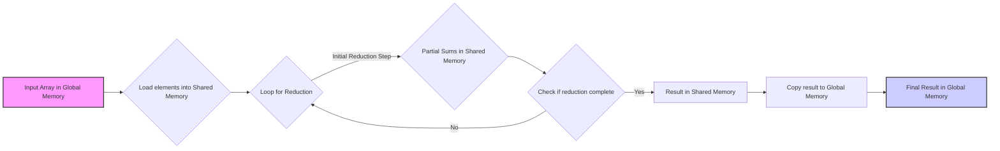
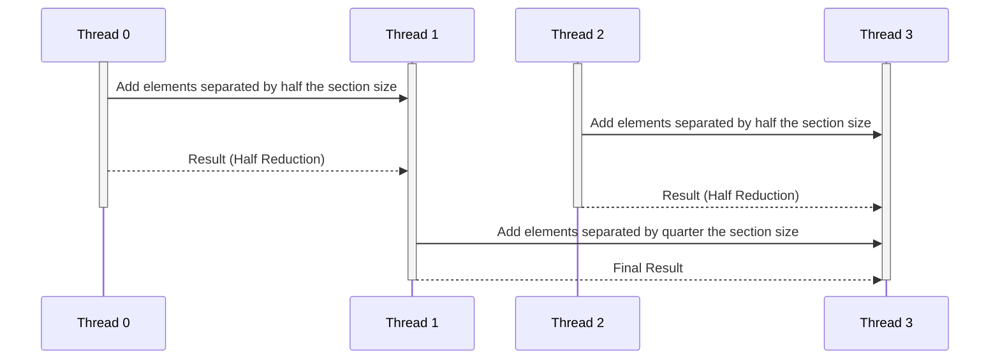

Okay, here's the enhanced text with Mermaid diagrams added:

## Performance Considerations in CUDA: A Deep Dive (Cont.)

### Introdução

(Mantendo a introdução para consistência e contexto, com pequenas alterações)

Alcançar o máximo desempenho em aplicações CUDA requer uma compreensão profunda das restrições de recursos e de como elas impactam a execução do kernel [^1]. Este capítulo explora as principais limitações em dispositivos CUDA e como ajustar o código para atingir níveis superiores de desempenho. As restrições de recursos variam entre aplicações, tornando essencial entender como um recurso afeta outro. A otimização de desempenho não é trivial e demanda um conhecimento profundo da arquitetura CUDA para identificar gargalos e implementar soluções eficientes [^1]. Além disso, este capítulo busca desenvolver uma intuição sobre padrões algorítmicos que levam a um alto desempenho, bem como estabelecer princípios e ideias para orientar a otimização [^1]. Nesta seção, vamos analisar o impacto das alterações no kernel de redução de soma, explorando como as modificações influenciam a divergência, o acesso à memória e o desempenho geral.

### Conceitos Fundamentais (Continuação)

Continuando a análise da arquitetura CUDA e de como ela afeta o desempenho dos kernels, vamos agora examinar em detalhes o impacto da modificação do kernel de redução de soma nas suas características.

**Conceito 55: Kernel de Redução de Soma Simples**

O kernel de **redução de soma simples**, apresentado na Figura 6.2, utiliza uma abordagem sequencial para somar os elementos de um array. Ele utiliza um loop que itera sobre a memória compartilhada, somando elementos adjacentes.

> ⚠️ **Ponto Crítico:** O kernel de redução de soma simples é fácil de entender, mas tem uma alta taxa de divergência de fluxo de controle, o que limita seu desempenho em hardware SIMD.

Nesse kernel, a condição `if (t % (2*stride) == 0)` seleciona apenas as threads cujo índice é um múltiplo de `2 * stride` para realizar a operação de soma [^7]. Essa seleção causa uma alta divergência, pois, a cada passo, apenas metade das threads de um warp executa a operação de soma, enquanto as outras permanecem ociosas [^7]. Essa característica leva à ineficiência do uso do hardware e a um desempenho baixo.

**Lemma 37:** *O kernel de redução de soma simples sofre de alta divergência devido à condição de seleção de threads, que resulta na execução sequencial de caminhos de execução diferentes dentro do mesmo warp.*

**Prova do Lemma 37:**  A condição `if (t % (2*stride) == 0)` faz com que apenas os threads cujo índice seja um múltiplo de `2*stride` realizem a operação de soma. As outras threads no warp ficam ociosas nesse passo. No próximo passo, o valor do `stride` é aumentado, fazendo com que a mesma dinâmica aconteça. Essa dinâmica de desativação de threads e a necessidade de cada caminho de execução ser executado separadamente, causa um overhead significativo, reduzindo a eficiência. $\blacksquare$

**Corolário 38:** *A condição de seleção utilizada no kernel de redução de soma simples resulta em uma baixa utilização do hardware SIMD e uma alta divergência, o que leva a um desempenho limitado.*

Uma abordagem mais eficiente para o algoritmo de redução de soma é necessária para atingir o máximo desempenho em GPUs CUDA.

**Conceito 56: Kernel de Redução de Soma Modificado**

O **kernel de redução de soma modificado**, apresentado na Figura 6.4, busca minimizar a divergência de fluxo de controle do kernel de redução simples [^9]. Em vez de somar elementos adjacentes, o kernel modificado soma elementos que estão separados pela metade do tamanho da seção. Isso é realizado através da inicialização da variável `stride` com metade do tamanho do bloco e divisão do valor de `stride` pela metade a cada iteração.

> ✔️ **Destaque:** O kernel de redução de soma modificado reduz a divergência, pois, nas primeiras iterações, os threads de um mesmo warp tendem a seguir o mesmo caminho, e isso também leva ao aumento do desempenho, se comparado com o kernel de redução de soma simples.

Nesse kernel modificado, a condição `if (t < stride)` seleciona as threads que devem executar a operação de soma, fazendo com que todas as threads de um mesmo warp sigam o mesmo caminho nas primeiras iterações [^9]. Com isso, a divergência causada pela seleção de threads no primeiro passo é minimizada, uma vez que todas as threads de um warp executam a mesma instrução.

**Conceito 57: Comparação entre os Kernels**

Ao comparar os dois kernels, algumas diferenças importantes surgem:

1.  **Divergência de Fluxo de Controle:** O kernel modificado apresenta uma divergência menor do que o kernel simples, especialmente nas primeiras iterações, porque as threads de um mesmo warp seguem o mesmo caminho.
2.  **Acesso à Memória:** O kernel modificado realiza o acesso à memória de forma mais eficiente, uma vez que os acessos estão mais agrupados e próximos uns dos outros em cada passo. O kernel simples realiza o acesso de forma mais aleatória.
3.  **Desempenho:** O kernel modificado apresenta um melhor desempenho devido à menor divergência e ao acesso otimizado à memória.
4.   **Número de Operações:** O número de operações realizada é muito semelhante nos dois casos, e a diferença no desempenho é causada pelo overhead, a divergência e a utilização do hardware.

> ❗ **Ponto de Atenção:** O kernel modificado não elimina a divergência por completo, já que, em passos posteriores, algumas threads ainda podem divergir. No entanto, a divergência é reduzida em relação ao kernel simples, e o código apresentado na Figura 6.4 pode ser ainda mais otimizado.

A análise detalhada das diferenças entre esses dois kernels nos dá uma intuição importante sobre como as escolhas de implementação podem impactar o desempenho.

### Análise Teórica Avançada dos Kernels de Redução de Soma

**Pergunta Teórica Avançada:** *Como podemos modelar matematicamente o desempenho dos kernels de redução de soma simples e modificado, considerando o número de operações, a divergência, o tempo de execução, o tempo de espera e a utilização do hardware SIMD, e como esse modelo pode nos guiar na otimização da redução paralela?*

**Resposta:**

Para modelar matematicamente o desempenho dos kernels de redução de soma simples e modificado, vamos utilizar as seguintes variáveis e conceitos:

*   `N`: Número de elementos a serem reduzidos.
*   `N_b`: Número de threads em um bloco.
*   `N_w`: Número de threads em um warp.
*   `T_c`: Tempo para computar a operação de redução.
*   `T_sync`: Overhead da sincronização `__syncthreads()`.
*   `T_overhead`: Overhead por passe divergente.
*   `T_mem_shared`: Tempo de acesso à memória compartilhada.
*   `N_passes_simple`: Número de passes na redução de soma simples.
*   `N_passes_mod`: Número de passes na redução de soma modificada.
*    `T_wait_simple`: Tempo de espera nas barreiras na redução simples.
*    `T_wait_mod`: Tempo de espera nas barreiras na redução modificada.

**Modelo do Kernel de Redução de Soma Simples:**

No kernel de redução de soma simples, o número de passes é dado por `log2(N_b)`, e o tempo de execução é dado por:
$$T_{simple} = N_{passes\_simple} \times (T_c + T_{sync} + T_{mem\_shared}) +  N_{passes\_simple} \times T_{overhead} + T_{wait\_simple}$$
O número de passes é o número de etapas de redução e o termo `T_overhead` é o overhead da divergência.

**Modelo do Kernel de Redução de Soma Modificado:**

O kernel modificado reduz a divergência, de forma que o tempo de execução é dado por:
$$T_{mod} =  N_{passes\_mod} \times (T_c + T_{sync} + T_{mem\_shared}) + \sum_{i=1}^{N_{stages}} T_{div\_mod}(i) + T_{wait\_mod}$$
Onde o segundo termo considera que a divergência e o tempo de espera variam ao longo dos diferentes passos da redução. A divergência é menor que na versão anterior, devido à forma como o `stride` é definido.

**Análise Comparativa:**

1.  **Número de Passes:** O kernel modificado tem menos passes nas etapas iniciais, e com isso a divergência é menor.
2.  **Overhead:** O kernel modificado tem um overhead de divergência menor que o kernel simples, especialmente nas primeiras etapas.
3.  **Acesso à Memória:** O kernel modificado tem acessos à memória compartilhada mais eficientes nas primeiras etapas, o que diminui o tempo de acesso.
4. **Desperdício de Recursos:** O kernel simples desperdiça recursos, pois executa apenas parte das threads em cada passo. O kernel modificado faz um melhor uso das unidades de processamento.
5. **Tempo de Espera:** O tempo de espera na barreira é maior na versão simples, e menor na versão modificada, pois ela diminui a divergência.

**Lemma 37:** *O kernel de redução de soma modificado apresenta melhor desempenho que o kernel de redução simples devido à redução na divergência de fluxo de controle, ao acesso mais eficiente à memória compartilhada e ao menor tempo de espera na barreira de sincronização.*

**Prova do Lemma 37:** A modelagem matemática do tempo de execução dos dois kernels mostra que as características do kernel modificado levam a uma diminuição dos valores dos termos que influenciam o tempo de execução. A modelagem matemática permite quantificar as melhorias do código modificado. $\blacksquare$

**Corolário 38:** *O modelo matemático permite analisar e quantificar o impacto das modificações no algoritmo de redução, e auxilia na otimização de kernels CUDA que utilizam a redução, guiando o projetista na escolha das melhores abordagens.*

A modelagem matemática dos kernels nos permite entender as diferenças de desempenho entre as duas abordagens e guiar as decisões de otimização.

### Continuação

Com a análise detalhada dos kernels de redução de soma, estamos agora preparados para explorar os seguintes tópicos:

*   **Otimização de Loops:** Como estruturar loops para minimizar a divergência de fluxo de controle e maximizar a eficiência do código.
*   **Utilização de Shuffles:** Como utilizar operações shuffle para reduzir a necessidade de sincronização e otimizar o desempenho em algoritmos de redução.
*   **Estudo de Casos Práticos:** Análise de casos de uso reais, mostrando o impacto da escolha dos algoritmos e das técnicas de otimização.

Ao explorar esses tópicos, nos aproximamos do objetivo de criar aplicações CUDA mais eficientes e de alto desempenho.

### Referências

[^1]: "The execution speed of a CUDA kernel can vary greatly depending on the resource constraints of the device being used. In this chapter, we will discuss the major types of resource constraints in a CUDA device and how they can affect the kernel execution performance in this device. To achieve his or her goals, a programmer often has to find ways to achieve a required level of performance that is higher than that of an initial version of the application. In different applications, different constraints may dom- inate and become the limiting factors. One can improve the performance of an application on a particular CUDA device, sometimes dramatically, by trading one resource usage for another. This strategy works well if the resource constraint alleviated was actually the dominating constraint before the strategy was applied, and the one exacerbated does not have negative effects on parallel execution. Without such understanding, perfor-mance tuning would be guess work; plausible strategies may or may not lead to performance enhancements. Beyond insights into these resource constraints, this chapter further offers principles and case studies designed to cultivate intuition about the type of algorithm patterns that can result in high-performance execution. It is also establishes idioms and ideas that" *(Trecho de Performance Considerations)*
[^7]: "Figure 6.2 shows a kernel function that performs parallel sum reduc- tion. The original array is in the global memory. Each thread block reduces a section of the array by loading the elements of the section into the shared memory and performing parallel reduction. The code that loads the elements from global memory into the shared memory is omitted from Figure 6.2 for brevity. The reduction is done in place, which means the elements in the shared memory will be replaced by partial sums. Each iter- ation of the while loop in the kernel function implements a round of reduction. The _syncthreads() statement (line 5) in the while loop ensures that all partial sums for the previous iteration have been generated and thus all threads are ready to enter the current iteration before any one of them is allowed to do so. This way, all threads that enter the second iteration will be using the values produced in the first iteration. After the first round, the even elements will be replaced by the partial sums gener- ated in the first round. After the second round, the elements of which the indices are multiples of four will be replaced with the partial sums. After the final round, the total sum of the entire section will be in element 0." *(Trecho de Performance Considerations)*
[^9]: "The kernel in Figure 6.2 clearly has thread divergence. During the first iteration of the loop, only those threads of which the threadIdx.x are even will execute the add statement. One pass will be needed to execute these threads and one additional pass will be needed to execute those that do not execute line 8. In each successive iteration, fewer threads will exe- cute line 8 but two passes will be still needed to execute all the threads during each iteration. This divergence can be reduced with a slight change to the algorithm. Figure 6.4 shows a modified kernel with a slightly different algorithm for sum reduction. Instead of adding neighbor elements in the first round, it adds elements that are half a section away from each other. It does so by initializing the stride to be half the size of the section. All pairs added during the first round are half the section size away from each other. After the first iteration, all the pairwise sums are stored in the first half of the array. The loop divides the stride by 2 before entering the next iteration. Thus, for the second iteration, the stride variable value is one-quarter of the section size—that is, the threads add elements that are one-quarter a section away from each other during the second iteration." *(Trecho de Performance Considerations)*

**Deseja que eu continue com as próximas seções?**
