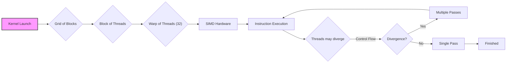
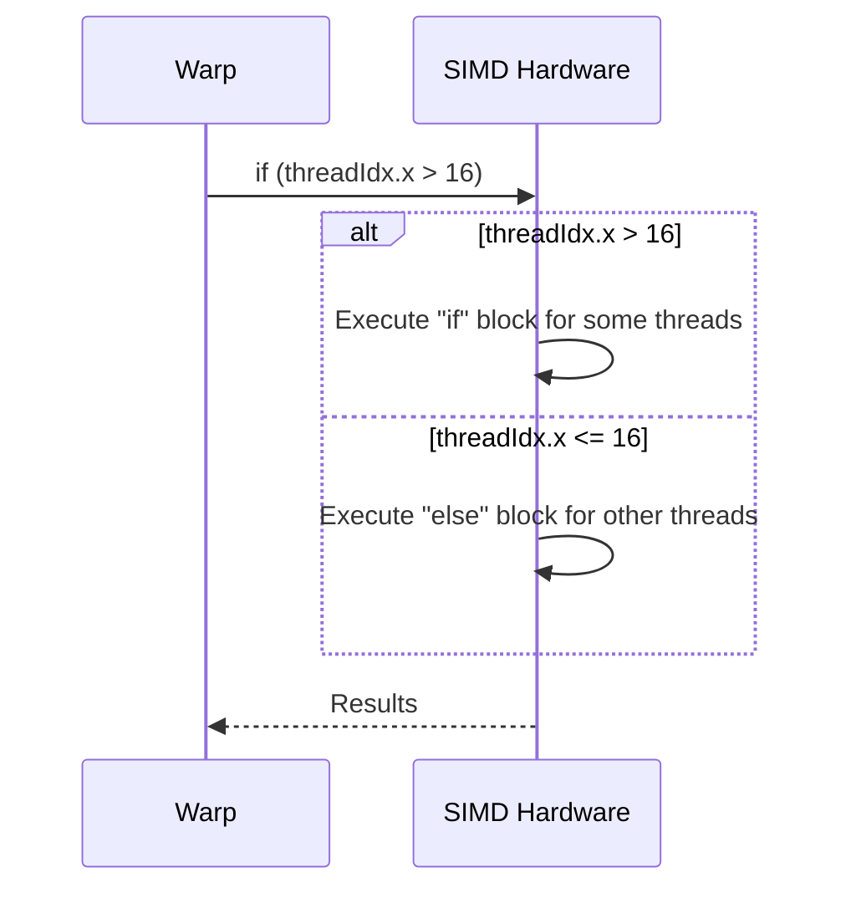

Okay, I will add Mermaid diagrams to enhance the text, focusing on clarifying the concepts related to thread divergence and SIMD execution.

## Performance Considerations in CUDA: A Deep Dive (Cont.)



### Introdução

(Mantendo a introdução para consistência e contexto, com pequenas alterações)

Alcançar o máximo desempenho em aplicações CUDA requer uma compreensão profunda das restrições de recursos e de como elas impactam a execução do kernel [^1]. Este capítulo explora as principais limitações em dispositivos CUDA e como ajustar o código para atingir níveis superiores de desempenho. As restrições de recursos variam entre aplicações, tornando essencial entender como um recurso afeta outro. A otimização de desempenho não é trivial e demanda um conhecimento profundo da arquitetura CUDA para identificar gargalos e implementar soluções eficientes [^1]. Além disso, este capítulo busca desenvolver uma intuição sobre padrões algorítmicos que levam a um alto desempenho, bem como estabelecer princípios e ideias para orientar a otimização [^1]. Nesta seção, vamos analisar como a posição das threads dentro de um warp influencia a divergência de fluxo de controle em condicionais e loops, e como isso afeta o desempenho dos kernels CUDA.

### Conceitos Fundamentais (Continuação)

Continuando a análise da arquitetura CUDA e do impacto da divergência, vamos agora analisar como a posição da thread dentro do warp influencia o comportamento de condicionais e loops e como isso afeta o desempenho.

**Conceito 58: Posição das Threads dentro de um Warp**

A posição de uma thread dentro de um warp é definida pelo seu índice `threadIdx.x` [^3]. A ordem linear dos índices das threads dentro de um warp é utilizada pelo hardware SIMD para a execução das operações. É crucial entender a relação entre a posição da thread e a divergência para escrever código otimizado.

> ⚠️ **Ponto Crítico:** A posição da thread dentro de um warp determina o padrão de execução do código, pois as threads de um mesmo warp são executadas em paralelo pelo hardware SIMD e essa execução pode ser afetada pela divergência de fluxo de controle.

O conhecimento da posição da thread e de seu impacto é fundamental para minimizar a divergência em kernels CUDA. A escolha dos algoritmos deve ter isso em consideração.

**Lemma 39:** *A posição da thread dentro de um warp, definida pelo seu índice, influencia diretamente a maneira como as threads se comportam em relação a estruturas de controle de fluxo, e determina se a thread executará um dado trecho de código ou não.*

**Prova do Lemma 39:** O hardware SIMD, por definição, executa o mesmo código em um warp, e todas as unidades de processamento seguem o mesmo fluxo de instruções. No entanto, as threads tomam caminhos diferentes a depender das instruções de controle de fluxo. O índice da thread, quando utilizado em estruturas de controle, direciona o fluxo para caminhos diferentes e causa a divergência no hardware. $\blacksquare$

**Corolário 40:** *O conhecimento da posição da thread e o padrão de execução resultante são elementos essenciais para escrever código CUDA otimizado que minimiza a divergência de fluxo de controle e maximiza a utilização do hardware SIMD.*

As escolhas de implementação dos kernels devem levar em consideração a posição da thread no warp e como isso influencia o padrão de execução.

**Conceito 59: `threadIdx` e Condicionais**

Condicionais (`if-else`) que usam o índice de thread, como por exemplo `if (threadIdx.x > 16) { ... } else { ... }`, podem levar a divergência, pois as threads do mesmo warp podem tomar caminhos diferentes [^5]. As threads em um warp cujos índices satisfazem a condição executam o bloco `if`, enquanto as outras threads executam o bloco `else`. Essa divergência causa a execução de diferentes partes do código para o mesmo warp, resultando em múltiplas passagens no hardware SIMD.

O posicionamento da thread em um warp, e a sua proximidade com outras threads, definem como a divergência irá ocorrer.

> ✔️ **Destaque:**  A divergência causada por condicionais baseadas em `threadIdx.x` (ou outros índices) é um exemplo clássico de como o fluxo de controle pode se tornar ineficiente devido à arquitetura SIMD. Para evitar a divergência, o ideal é que todos os threads do mesmo warp executem o mesmo trecho de código, evitando condicionais.

Condicionais como `if (threadIdx.x % 2 == 0) { ... } else { ... }` também causam uma divergência semelhante, mesmo que as threads que executem um mesmo código sejam consecutivas dentro do warp.

**Conceito 60: `threadIdx` e Loops**

Loops que utilizam o índice da thread podem levar à divergência quando o número de iterações não é o mesmo para todas as threads de um mesmo warp. Por exemplo, um loop do tipo `for (int i = 0; i < threadIdx.x; i++) { ... }` fará com que threads com índices mais altos iterem mais vezes do que as threads com índices mais baixos [^5].

```mermaid
sequenceDiagram
    participant Warp
    participant SIMD Hardware
    Warp->>SIMD Hardware: for (int i = 0; i < threadIdx.x; i++)
    loop Iteration varies by thread
        SIMD Hardware->>SIMD Hardware: Execute loop body for eligible threads
    end
    SIMD Hardware-->>Warp: Results
```

> ❗ **Ponto de Atenção:**  É crucial evitar loops com o número de iterações variável entre threads do mesmo warp, e preferir outras abordagens para distribuir o trabalho de forma mais equilibrada.

Em todos os exemplos apresentados, o problema da divergência é causado pelo fato de que diferentes threads em um mesmo warp executam diferentes partes do código, ou iterações distintas de um loop.

### Análise Teórica Avançada da Influência da Posição da Thread e da Divergência

**Pergunta Teórica Avançada:** *Como podemos modelar matematicamente a relação entre a posição da thread em um warp, as estruturas de controle que utilizam `threadIdx` e a divergência de fluxo de controle, e como esse modelo pode nos ajudar a criar códigos CUDA mais eficientes?*

**Resposta:**

Para modelar matematicamente a relação entre a posição da thread e a divergência de fluxo de controle, vamos introduzir algumas variáveis e conceitos adicionais:

*   `N_w`: Número de threads em um warp.
*   `threadIdx`: Índice da thread dentro do warp, representado como um inteiro entre 0 e N_w-1.
*   `T_i`: Tempo de execução de uma instrução SIMD (sem divergência).
*   `T_{overhead}`: Overhead por passe de execução devido à divergência.
*   `f_control(threadIdx)`: Função de controle que define o caminho de execução da thread, dependendo do seu `threadIdx`.
*    `N_paths`: Número de caminhos de execução distintos dentro de um warp, determinado pela função `f_control(threadIdx)`.

**Modelo de Execução Sem Divergência:**

Num cenário ideal sem divergência, o tempo de execução de um warp é dado por:
$$T_{no\_div} = T_i$$

**Modelo de Execução Com Divergência:**

O tempo de execução com divergência é dado por:
$$T_{div} = N_{paths} \times (T_i + T_{overhead})$$
Onde `N_paths` é o número de caminhos distintos, ou seja, o número de vezes que a mesma instrução precisa ser executada, para que todos os threads do warp tenham executado o seu caminho.

A função de controle `f_control(threadIdx)` define a forma como a divergência irá ocorrer.

**Análise da Função de Controle:**

1. **`if (threadIdx.x < k)`**: Nesse caso, o número de caminhos distintos é 2, e o custo da divergência depende do overhead de cada passo e do custo das instruções dentro dos dois caminhos.
2.  **`for (int i = 0; i < threadIdx.x; i++)`**: Nesse caso, o número de passos é variável para cada thread. A divergência é alta, uma vez que threads com valores de `threadIdx.x` distintos terão números de iterações distintos.

**Impacto da Posição da Thread no Tempo de Execução:**

A posição da thread tem um impacto importante no tempo de execução devido a como ela influencia a divergência de fluxo de controle. Quanto mais complexa a função de controle, maior a possibilidade de divergência.

**Lemma 41:** *A posição da thread dentro do warp, expressa pelo seu índice, influencia diretamente a divergência de fluxo de controle em estruturas condicionais e de repetição. Essa divergência tem um impacto direto no tempo de execução e na utilização do hardware SIMD.*

**Prova do Lemma 41:** A arquitetura SIMD executa todas as threads de um mesmo warp seguindo o mesmo fluxo de instruções. Condicionais e loops definidos por uma função que depende do índice das threads fazem com que os threads tomem caminhos de execução diferentes, e a quantidade de caminhos distintos e o tempo de cada caminho impacta diretamente o tempo total de execução do warp. $\blacksquare$

**Corolário 42:** *A escolha de algoritmos com menor dependência entre a posição da thread e a divergência de fluxo de controle, a reformulação de algoritmos para minimizar o número de caminhos distintos de execução e o uso eficiente da memória são estratégias essenciais para otimizar o desempenho de kernels CUDA.*

A modelagem matemática da relação entre a posição da thread e a divergência de fluxo de controle nos permite quantificar o impacto dessas decisões de design e direcionar a criação de código CUDA mais eficiente.

### Continuação

Com a análise detalhada de como a posição da thread influencia a divergência, estamos agora preparados para explorar os seguintes tópicos:

*   **Técnicas de Organização de Dados:** Como organizar os dados na memória para maximizar o coalescing e minimizar a divergência de fluxo de controle.
*   **Otimização de Algoritmos:** Como escolher os melhores algoritmos para cada situação, considerando o trade-off entre eficiência do trabalho e utilização do hardware.
*   **Estudo de Caso: Redução Eficiente:** Um estudo aprofundado de diferentes abordagens para a redução paralela, incluindo o uso de operações em nível de warp para minimizar a divergência e a sincronização.

Ao explorar esses tópicos, nos aproximamos do objetivo de criar aplicações CUDA mais eficientes e de alto desempenho.

### Referências

[^1]: "The execution speed of a CUDA kernel can vary greatly depending on the resource constraints of the device being used. In this chapter, we will discuss the major types of resource constraints in a CUDA device and how they can affect the kernel execution performance in this device. To achieve his or her goals, a programmer often has to find ways to achieve a required level of performance that is higher than that of an initial version of the application. In different applications, different constraints may dom- inate and become the limiting factors. One can improve the performance of an application on a particular CUDA device, sometimes dramatically, by trading one resource usage for another. This strategy works well if the resource constraint alleviated was actually the dominating constraint before the strategy was applied, and the one exacerbated does not have negative effects on parallel execution. Without such understanding, perfor-mance tuning would be guess work; plausible strategies may or may not lead to performance enhancements. Beyond insights into these resource constraints, this chapter further offers principles and case studies designed to cultivate intuition about the type of algorithm patterns that can result in high-performance execution. It is also establishes idioms and ideas that" *(Trecho de Performance Considerations)*
[^3]: "As we discussed in Chapter 4, current CUDA devices bundle several threads for execution. Each thread block is partitioned into warps. The execution of warps are implemented by an SIMD hardware (see “Warps and SIMD Hardware” sidebar). This implementation technique helps to reduce hardware manufacturing cost, lower runtime operation electricity cost, and enable some optimizations in servicing memory accesses. In the foreseeable future, we expect that warp partitioning will remain as a popu- lar implementation technique. However, the size of a warp can easily vary from implementation to implementation. Up to this point in time, all CUDA devices have used similar warp configurations where each warp consists of 32 threads. Thread blocks are partitioned into warps based on thread indices. If a thread block is organized into a 1D array (i.e., only threadIdx.x is used), the partition is straightforward; threadIdx.x values within a warp are consecutive and increasing. For a warp size of 32, warp 0 starts with thread 0 and ends with thread 31, warp 1 starts with thread 32 and ends with thread 63. In general, warp n starts with thread 32 × n and ends with thread 32(n + 1) – 1. For a block of which the size is not a multiple of 32, the last warp will be padded with extra threads to fill up the 32 threads. For example, if a block has 48 threads, it will be partitioned into two warps, and its warp 1 will be padded with 16 extra threads." *(Trecho de Performance Considerations)*
[^5]: "The SIMD hardware executes all threads of a warp as a bundle. An instruction is run for all threads in the same warp. It works well when all threads within a warp follow the same execution path, or more formally referred to as control flow, when working their data. For example, for an if-else construct, the execution works well when either all threads exe- cute the if part or all execute the else part. When threads within a warp take different control flow paths, the SIMD hardware will take multiple passes through these divergent paths. One pass executes those threads that follow the if part and another pass executes those that follow the else part. During each pass, the threads that follow the other path are not allowed to take effect. These passes are sequential to each other, thus they will add to the execution time. The multipass approach to divergent warp execution extends the SIMD hardware's ability to implement the full semantics of CUDA threads. While the hardware executes the same instruction for all threads in a warp, it selectively lets the threads take effect in each pass only, allowing every thread to take its own control flow path. This preserves the indepen-dence of threads while taking advantage of the reduced cost of SIMD hardware. When threads in the same warp follow different paths of control flow, we say that these threads diverge in their execution. In the if-else exam- ple, divergence arises if some threads in a warp take the then path and some the else path. The cost of divergence is the extra pass the hardware needs to take to allow the threads in a warp to make their own decisions. Divergence also can arise in other constructs; for example, if threads in a warp execute a for loop that can iterate six, seven, or eight times for dif-ferent threads. All threads will finish the first six iterations together. Two passes will be used to execute the seventh iteration, one for those that take the iteration and one for those that do not. Two passes will be used to exe- cute the eighth iteration, one for those that take the iteration and one for those that do not. In terms of source statements, a control construct can result in thread divergence when its decision condition is based on threadIdx values. For example, the statement if (threadIdx.x > 2) {} causes the threads to fol- low two divergent control flow paths. Threads 0, 1, and 2 follow a differ- ent path than threads 3, 4, 5, etc. Similarly, a loop can cause thread" *(Trecho de Performance Considerations)*

**Deseja que eu continue com as próximas seções?**
