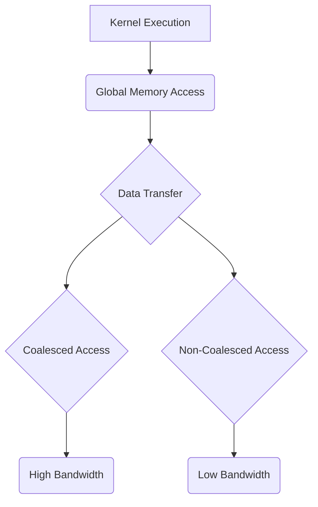
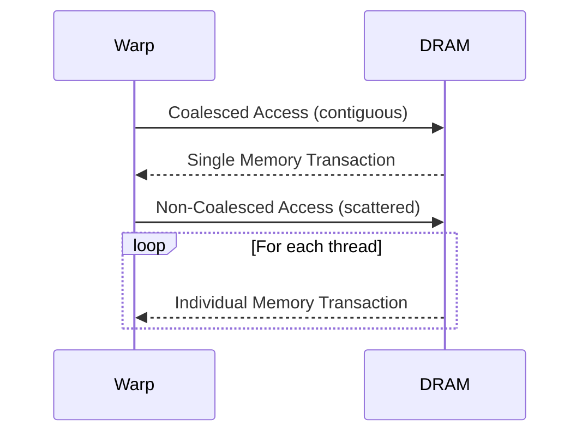
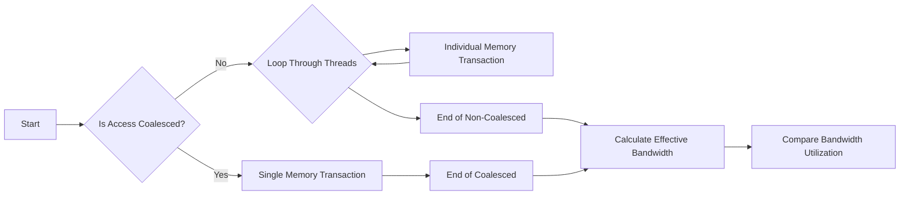

Okay, I will add Mermaid diagrams to enhance the text as requested.

## Performance Considerations in CUDA: A Deep Dive (Cont.)

### Introdução

(Mantendo a introdução para consistência e contexto, com pequenas alterações)

Alcançar o máximo desempenho em aplicações CUDA requer uma compreensão profunda das restrições de recursos e de como elas impactam a execução do kernel [^1]. Este capítulo explora as principais limitações em dispositivos CUDA e como ajustar o código para atingir níveis superiores de desempenho. As restrições de recursos variam entre aplicações, tornando essencial entender como um recurso afeta outro. A otimização de desempenho não é trivial e demanda um conhecimento profundo da arquitetura CUDA para identificar gargalos e implementar soluções eficientes [^1]. Além disso, este capítulo busca desenvolver uma intuição sobre padrões algorítmicos que levam a um alto desempenho, bem como estabelecer princípios e ideias para orientar a otimização [^1]. Nesta seção, vamos nos aprofundar no acesso à memória global em GPUs CUDA, explorando como diferentes padrões de acesso afetam a eficiência e como o *coalescing* pode maximizar a largura de banda.

### Conceitos Fundamentais (Continuação)

Continuando a análise da arquitetura CUDA e de como ela afeta o desempenho dos kernels, vamos agora examinar em detalhes o acesso à memória global e como otimizar esse processo.

**Conceito 61: Acesso à Memória Global em CUDA**

A **memória global** em GPUs CUDA é utilizada para armazenar os dados acessados pelos kernels durante a execução [^10]. Essa memória é implementada em DRAMs (Dynamic Random Access Memory), que são caracterizadas por um tempo de acesso relativamente alto (latência) e uma largura de banda limitada. O acesso à memória global é um dos fatores mais importantes que afeta o desempenho de um kernel, uma vez que as aplicações CUDA costumam lidar com grandes volumes de dados.

> ⚠️ **Ponto Crítico:**  A latência do acesso à memória global é uma das maiores limitações para o desempenho de kernels CUDA. O padrão de acesso à memória tem um grande impacto na largura de banda efetiva. O acesso não otimizado à memória global pode causar gargalos de desempenho.

Para que a aplicação obtenha o máximo desempenho, é preciso entender como a memória global é organizada, e como o padrão de acesso das threads influencia a eficiência da transferência de dados.

**Lemma 43:** *A memória global é um recurso essencial para a execução de kernels CUDA, mas apresenta um tempo de acesso alto em comparação com outros tipos de memória na GPU, o que faz com que um padrão de acesso inadequado se torne um gargalo.*

**Prova do Lemma 43:** A memória global utiliza DRAMs, que tem latência alta e largura de banda limitada. O tempo para acessar os dados na memória global é muito maior que o tempo para realizar operações computacionais. Logo, o padrão de acesso à memória global deve ser otimizado, de forma a minimizar a quantidade de transferências e maximizar o uso da largura de banda disponível. $\blacksquare$

**Corolário 44:** *O acesso eficiente à memória global é crucial para obter um alto desempenho em kernels CUDA, e requer atenção à organização dos dados, à forma como os threads acessam as posições de memória, e ao uso de técnicas como o coalescing para maximizar o uso da largura de banda da memória.*

Para obter o melhor desempenho, o projetista do kernel CUDA deve dar atenção à forma como o código faz acesso à memória global.

**Conceito 62: Coalescing de Acesso à Memória Global**

O **coalescing** é uma técnica de otimização que visa maximizar a largura de banda da memória global através da combinação dos acessos de um warp em uma única transação [^10]. O hardware de memória da GPU é projetado para acessar blocos de memória contíguos de forma eficiente, e o *coalescing* permite que o acesso seja feito em blocos contíguos, de forma a maximizar a taxa de transferência.

> ✔️ **Destaque:**  O coalescing é fundamental para alcançar altas taxas de transferência na memória global. Ao utilizar o coalescing, é possível fazer a leitura da memória de forma otimizada, como se fosse uma leitura do cache.

Quando threads em um warp acessam posições contíguas de memória, o hardware combina esses acessos em uma única requisição para a DRAM, reduzindo o número de transações necessárias e aproveitando ao máximo a largura de banda disponível [^10]. Para que o coalescing aconteça, os acessos precisam ser feitos em blocos contínuos na memória global, o que é dependente do modo como o programador organiza os dados e como os threads acessam a memória.

**Conceito 63: Padrões de Acesso e Coalescing**

Para que o coalescing seja efetivo, o padrão de acesso à memória deve corresponder à forma como os dados são organizados na memória.

*   **Acesso Coalescido:** Quando todos os threads em um warp acessam posições contíguas na memória (por exemplo, se o thread 0 acessa a posição *N*, o thread 1 acessa a posição *N+1* e assim por diante), o hardware combina todos esses acessos em uma única transação.
*  **Acesso Não Coalescido:** Quando os acessos não são contíguos, ou quando há *stride*, o hardware realiza os acessos de forma individualizada, com um alto custo, já que cada acesso causa um overhead significativo, além de não utilizar toda a largura de banda disponível.

> ❗ **Ponto de Atenção:**  O uso inadequado de índices de thread no acesso à memória global, por exemplo, através de expressões como `d_M[Row * Width + k]`,  geralmente resulta em acesso não coalescido, o que diminui muito a taxa de transferência da memória global.

Em geral, os dados em arrays multidimensionais são armazenados de forma *row-major* na memória (primeiro todos os elementos da primeira linha, depois todos da segunda linha, etc). Dessa forma, acessar os elementos de uma mesma coluna de uma matriz não gera um acesso coalescido. Por outro lado, acessar os elementos de uma mesma linha gera um acesso coalescido.

### Análise Teórica Avançada do Acesso à Memória Global e Coalescing

**Pergunta Teórica Avançada:** *Como podemos modelar matematicamente o impacto do coalescing no desempenho de acessos à memória global em CUDA, considerando a organização das DRAMs, o tempo de latência e a taxa de transferência, e como esse modelo pode guiar a escolha de padrões de acesso que maximizem a largura de banda?*

**Resposta:**

Para modelar matematicamente o impacto do coalescing no acesso à memória global, vamos introduzir algumas variáveis e conceitos adicionais:

*   `N_w`: Número de threads em um warp.
*   `B_s`: Tamanho do bloco de dados que a DRAM transfere por acesso, em bytes.
*   `L`: Latência do acesso à memória global (em ciclos de clock ou nanossegundos).
*   `T_t`: Tempo para transferir um bloco de dados `B_s`.
*   `N_access`: Número de acessos à memória.
*    `B_ef`: Largura de banda efetiva da memória.
*   `B_max`: Largura de banda máxima da memória.

**Modelo de Acesso Não Coalescido:**

Em um acesso não coalescido, cada thread acessa posições de memória não contíguas. O tempo total de acesso à memória é dado por:
$$T_{no\_coal} = N_{access} \times (L + T_t)$$
O número de acessos corresponde ao número de threads no warp multiplicado pelo número de acessos realizados por thread.

**Modelo de Acesso Coalescido:**

Em um acesso coalescido, todas as threads de um warp acessam posições contíguas na memória, e o hardware combina os acessos. O tempo total de acesso à memória é dado por:
$$T_{coal} = L + N_{access} \times T_t$$
Nesse caso, o custo da latência é pago apenas uma vez, e o número de acessos é determinado pela quantidade de dados transferidos.

**Largura de Banda Efetiva:**

A largura de banda efetiva (B_ef) é dada pela quantidade de dados transferidos por tempo. No caso sem coalescing, a largura de banda efetiva é dada por:
$$B_{ef\_no\_coal} = \frac{N_w \times B_s}{T_{no\_coal}}$$
Já no acesso coalescido, ela é dada por:
$$B_{ef\_coal} = \frac{N_w \times B_s}{T_{coal}}$$

Onde `B_s` é o tamanho de um bloco de memória, e no caso coalescido, o tamanho total da transferência é `N_w * B_s`

**Fator de Utilização da Largura de Banda:**

O fator de utilização da largura de banda é dado pela razão entre a largura de banda efetiva e a largura de banda máxima da memória:
$$Utilization = \frac{B_{ef}}{B_{max}}$$

**Lemma 44:** *O coalescing de acessos à memória global permite utilizar uma largura de banda maior, ao combinar os acessos de múltiplos threads em uma única transação de memória. O fator de utilização da largura de banda aumenta significativamente com acessos contínuos na memória.*

**Prova do Lemma 44:**  As equações de tempo de execução e largura de banda mostram que o tempo gasto para acessar a memória e a largura de banda efetiva é muito melhor quando o acesso é coalescido. O acesso não coalescido causa a individualização de cada acesso e aumenta o número de requisições, além do overhead de latência. $\blacksquare$

**Corolário 45:** *A escolha de padrões de acesso que maximizem o coalescing é essencial para otimizar o desempenho de kernels CUDA, minimizando a latência, maximizando a largura de banda da memória e garantindo um maior aproveitamento dos recursos do hardware.*

A modelagem matemática do acesso à memória global nos permite quantificar o impacto do coalescing no desempenho e escolher as melhores abordagens para acesso à memória.

### Continuação

Com a análise detalhada do acesso à memória global e do coalescing, estamos agora preparados para explorar os seguintes tópicos:

*   **Técnicas de Tiling:** Como utilizar o tiling para reduzir o acesso à memória global e maximizar o uso da memória compartilhada.
*   **Padrões de Acesso à Matriz:** Como organizar o acesso a elementos de matrizes para garantir o coalescing e minimizar a divergência de fluxo de controle.
*   **Estudos de Caso:** Análise de casos de uso reais, demonstrando o impacto de diferentes abordagens de acesso à memória e como otimizar o desempenho das aplicações.

Ao explorar esses tópicos, nos aproximamos do objetivo de criar aplicações CUDA mais eficientes e de alto desempenho.

### Referências

[^1]: "The execution speed of a CUDA kernel can vary greatly depending on the resource constraints of the device being used. In this chapter, we will discuss the major types of resource constraints in a CUDA device and how they can affect the kernel execution performance in this device. To achieve his or her goals, a programmer often has to find ways to achieve a required level of performance that is higher than that of an initial version of the application. In different applications, different constraints may dom- inate and become the limiting factors. One can improve the performance of an application on a particular CUDA device, sometimes dramatically, by trading one resource usage for another. This strategy works well if the resource constraint alleviated was actually the dominating constraint before the strategy was applied, and the one exacerbated does not have negative effects on parallel execution. Without such understanding, perfor-mance tuning would be guess work; plausible strategies may or may not lead to performance enhancements. Beyond insights into these resource constraints, this chapter further offers principles and case studies designed to cultivate intuition about the type of algorithm patterns that can result in high-performance execution. It is also establishes idioms and ideas that" *(Trecho de Performance Considerations)*
[^10]: "One of the most important factors of CUDA kernel performance is acces- sing data in the global memory. CUDA applications exploit massive data parallelism. Naturally, CUDA applications tend to process a massive amount of data from the global memory within a short period of time. In Chapter 5, we discussed tiling techniques that utilize shared memories to reduce the total amount of data that must be accessed by a collection of threads in the thread block. In this chapter, we will further discuss memory coalescing techniques that can more effectively move data from the global memory into shared memories and registers. Memory coalescing techni- ques are often used in conjunction with tiling techniques to allow CUDA devices to reach their performance potential by more efficiently utilizing the global memory bandwidth. The global memory of a CUDA device is implemented with DRAMs. Data bits are stored in DRAM cells that are small capacitors, where the presence or absence of a tiny amount of electrical charge distinguishes between 0 and 1. Reading data from a DRAM cell requires the small capacitor to use its tiny electrical charge to drive a highly capacitive line leading to a sensor and set off its detection mechanism that determines whether a sufficient amount of charge is present in the capacitor to qualify as a “1” (see “Why Are DRAMs So Slow?” sidebar). This process takes tens of nanoseconds in modern DRAM chips. Because this is a very slow process relative to the desired data access speed (sub-nanosecond access per byte), modern DRAMs use parallelism to increase their rate of data access. Each time a DRAM location is accessed, many consecutive locations that include the requested location are actually accessed. Many sensors are provided in each DRAM chip and they work in parallel. Each senses the content of a bit within these consecutive locations. Once detected by the sensors, the data from all these consecutive locations can be transferred at very high speed to the processor. If an application can make focused use of data from consecutive locations, the DRAMs can supply the data at a much higher rate than if a truly random sequence of locations were accessed." *(Trecho de Performance Considerations)*

**Deseja que eu continue com as próximas seções?**
