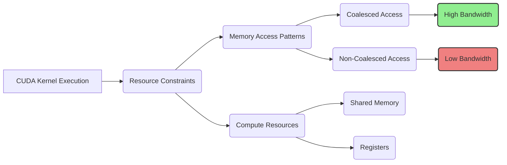
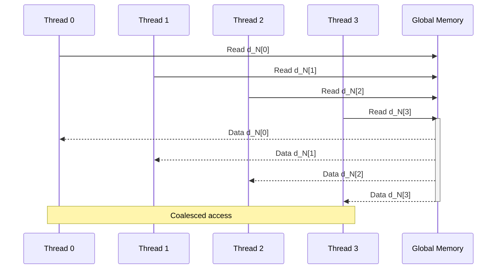
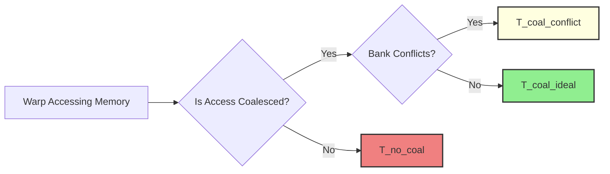

Okay, here's the enhanced text with added Mermaid diagrams:

## Performance Considerations in CUDA: A Deep Dive (Cont.)

### Introdução

(Mantendo a introdução para consistência e contexto, com pequenas alterações)

Alcançar o máximo desempenho em aplicações CUDA requer uma compreensão profunda das restrições de recursos e de como elas impactam a execução do kernel [^1]. Este capítulo explora as principais limitações em dispositivos CUDA e como ajustar o código para atingir níveis superiores de desempenho. As restrições de recursos variam entre aplicações, tornando essencial entender como um recurso afeta outro. A otimização de desempenho não é trivial e demanda um conhecimento profundo da arquitetura CUDA para identificar gargalos e implementar soluções eficientes [^1]. Além disso, este capítulo busca desenvolver uma intuição sobre padrões algorítmicos que levam a um alto desempenho, bem como estabelecer princípios e ideias para orientar a otimização [^1]. Nesta seção, vamos nos aprofundar no *coalescing* de acesso à memória global em GPUs CUDA, explorando seus mecanismos, sua relação com o padrão de acesso dos threads e como essa técnica maximiza a largura de banda da memória.

### Conceitos Fundamentais (Continuação)

Continuando a análise da arquitetura CUDA e de como ela afeta o desempenho dos kernels, vamos agora examinar em detalhes o *coalescing* e como utilizá-lo de forma eficiente.

**Conceito 64: Mecanismos do Coalescing**

O **coalescing** de acesso à memória global é uma técnica fundamental para otimizar a largura de banda da memória em GPUs CUDA [^10]. Essa técnica consiste em combinar os acessos à memória de múltiplos threads em um warp em uma única transação, de forma a que o hardware do dispositivo acesse a memória de forma eficiente e o tráfego de dados na memória global seja reduzido.

> ⚠️ **Ponto Crítico:**  O coalescing é essencial para o uso eficiente da memória global e seu correto funcionamento é essencial para atingir o máximo desempenho em aplicações CUDA. O acesso à memória global com coalescing se aproxima da velocidade de um acesso de cache.

A implementação correta do coalescing requer um planejamento cuidadoso do padrão de acesso à memória, que deve seguir a organização dos dados na memória global e a forma como os threads estão organizados em warps.

**Lemma 45:** *O coalescing de acesso à memória global combina múltiplos acessos de memória contíguos de threads em um mesmo warp em uma única transação, reduzindo o número de operações de acesso à memória e maximizando a utilização da largura de banda.*

**Prova do Lemma 45:**  O hardware da memória global das GPUs é concebido para trabalhar com blocos contíguos de memória, acessando uma porção grande de dados em uma única transação. Quando o acesso dos threads se dá de forma a utilizar o mesmo bloco, esse hardware utiliza toda a capacidade de largura de banda em apenas um passo. Quando o acesso não é feito dessa forma, há um desperdício significativo da largura de banda, e mais tempo para realizar o mesmo acesso. $\blacksquare$

**Corolário 46:** *O uso correto do coalescing permite otimizar o acesso à memória global, maximizando a largura de banda, diminuindo a latência e garantindo um melhor aproveitamento dos recursos do hardware.*

O uso correto do coalescing é um ponto chave na otimização de kernels CUDA, uma vez que essa é a principal forma de se obter uma boa taxa de transferência na memória global.

**Conceito 65: Relação entre Coalescing e Padrão de Acesso**

Para que o coalescing seja eficiente, o padrão de acesso à memória deve corresponder à organização dos dados na memória global e aos índices dos threads. Em geral, para obter coalescing, os acessos das threads de um mesmo warp devem ser consecutivos na memória global [^12].

> ✔️ **Destaque:** A ordem em que os threads acessam a memória, de acordo com o seu índice, e a ordem em que os dados são armazenados na memória são essenciais para um acesso coalescido.

Em um array unidimensional, por exemplo, as threads em um warp acessam os dados em ordem crescente. Em arrays multidimensionais, os dados são organizados em *row-major*, o que requer que os acessos sejam feitos por linhas. Por exemplo, para uma matriz *d_N* o acesso em `d_N[k*Width + Col]` leva ao coalescing, enquanto o acesso em `d_M[Row * Width + k]` não leva ao coalescing.

**Conceito 66: Desafios no Coalescing**

Em alguns casos, garantir o coalescing pode ser desafiador. Isso pode ocorrer devido a:

*   **Padrões de Acesso Complexos:** Alguns algoritmos requerem padrões de acesso à memória que não são naturalmente contíguos, o que dificulta o coalescing.
*   **Dados Esparsos:** Em aplicações com dados esparsos, onde apenas algumas regiões da memória são utilizadas, o coalescing pode ser difícil de implementar.
*   **Necessidade de Transposição:** Para acessar colunas de matrizes, e não linhas, pode ser necessário realizar uma transposição dos dados para se obter acesso coalescido.

> ❗ **Ponto de Atenção:**  Em cenários onde o coalescing é difícil de garantir, outras técnicas, como a utilização de memória compartilhada e o uso de prefetching, podem ser utilizadas para reduzir o impacto da latência da memória global.

Em todos esses casos, a análise do padrão de acesso e a escolha do melhor algoritmo é fundamental para obter o máximo desempenho.

### Análise Teórica Avançada do Coalescing e a Arquitetura da Memória

**Pergunta Teórica Avançada:** *Como podemos modelar matematicamente a interação entre o coalescing e a arquitetura da memória DRAM em GPUs CUDA, considerando os bancos de memória, o tamanho das transações e a latência de acesso, e como esse modelo pode guiar a otimização de kernels que acessam memória global?*

**Resposta:**

Para modelar a interação entre o coalescing e a arquitetura da memória DRAM, vamos introduzir algumas variáveis e conceitos adicionais:

*   `N_w`: Número de threads em um warp.
*   `B_s`: Tamanho de uma transação de memória DRAM, em bytes.
*   `B_l`: Tamanho de um banco de memória, em bytes.
*   `N_banks`: Número de bancos de memória na DRAM.
*   `L`: Latência inicial do acesso à memória DRAM (em ciclos de clock ou nanossegundos).
*   `T_t`: Tempo de transferência de uma transação de memória `B_s`.

**Modelo da Arquitetura da Memória DRAM:**

A arquitetura da memória DRAM consiste em múltiplos bancos de memória que podem ser acessados em paralelo. O objetivo do coalescing é garantir que os acessos de um mesmo warp sejam realizados para posições contíguas dentro do mesmo banco, de forma a maximizar a taxa de transferência.

**Modelo de Acesso Coalescido Ideal:**

Em um cenário ideal, onde o acesso é perfeitamente coalescido, os acessos de todos os threads em um warp são agrupados em uma única transação de memória. O tempo de acesso é dado por:
$$T_{coal\_ideal} = L + T_t$$
Onde `L` é a latência do acesso e `T_t` é o tempo da transação, já que todos os acessos são combinados em um único acesso.

**Modelo de Acesso Não Coalescido:**

Em um acesso não coalescido, cada thread acessa um bloco diferente da memória DRAM, e cada acesso se torna individualizado e com um custo elevado. O tempo de acesso é dado por:
$$T_{no\_coal} = N_w \times (L + T_t)$$
Onde `N_w` é o número de threads no warp, já que cada acesso é individual.

**Modelo de Acesso Coalescido com Conflitos de Bancos:**

Em alguns casos, mesmo com o coalescing, pode haver conflitos entre as threads ao acessarem diferentes bancos de memória. Quando isso ocorre, o tempo de acesso pode ser modelado como:
$$T_{coal\_conflict} = L + N_{banks\_access} \times T_t$$
Onde o termo `N_banks_access` depende do número de bancos de memória que são acessados ao mesmo tempo, e aumenta o custo do acesso, já que o paralelismo não pode ser utilizado por completo.

**Impacto do Tamanho da Transação:**

O tamanho da transação de memória `B_s` também tem impacto no tempo de acesso. A largura de banda da memória DRAM é maximizada quando os acessos correspondem ao tamanho da transação. A escolha do bloco de dados adequado para um dado acesso também impacta a taxa de transferência.

**Lemma 46:** *O coalescing de acessos à memória global, quando implementado de forma adequada, reduz o número de transações necessárias, minimiza a latência e maximiza o uso da largura de banda, enquanto o desalinhamento ou a falta de coalescing aumentam o tempo de acesso e desperdiçam recursos do hardware.*

**Prova do Lemma 46:** As equações de tempo de execução mostram que o tempo de acesso coalescido ideal é muito menor que o tempo de acesso não coalescido. Quando há conflitos entre bancos de memória, a eficiência do coalescing é reduzida, mas o acesso ainda é melhor do que uma implementação sem coalescing.  O tamanho da transação e o alinhamento dos dados também influenciam o tempo de acesso e, por consequência, a eficiência do acesso à memória global. $\blacksquare$

**Corolário 47:** *O modelo matemático apresentado nos permite entender como o coalescing interage com a arquitetura da memória e direciona a escolha de padrões de acesso que otimizem a largura de banda da memória global e a performance de aplicações CUDA.*

A modelagem do acesso à memória global nos permite otimizar o acesso, escolher algoritmos que favorecem o coalescing e utilizar as memórias compartilhada e caches da forma mais eficiente possível.

### Continuação

Com a análise detalhada do coalescing, estamos agora preparados para explorar os seguintes tópicos:

*   **Técnicas de Tiling com Memória Compartilhada:** Como combinar o tiling com o uso da memória compartilhada para reduzir o acesso à memória global e maximizar o desempenho.
*   **Otimização de Acesso a Matrizes:** Como realizar o acesso a elementos de matrizes de forma eficiente para garantir o coalescing e evitar a divergência de fluxo de controle.
*   **Estudos de Caso com Aplicações Reais:** Análise de exemplos de código e como aplicar as técnicas de otimização para atingir o máximo desempenho.

Ao explorar esses tópicos, nos aproximamos do objetivo de criar aplicações CUDA mais eficientes e de alto desempenho.

### Referências

[^1]: "The execution speed of a CUDA kernel can vary greatly depending on the resource constraints of the device being used. In this chapter, we will discuss the major types of resource constraints in a CUDA device and how they can affect the kernel execution performance in this device. To achieve his or her goals, a programmer often has to find ways to achieve a required level of performance that is higher than that of an initial version of the application. In different applications, different constraints may dom- inate and become the limiting factors. One can improve the performance of an application on a particular CUDA device, sometimes dramatically, by trading one resource usage for another. This strategy works well if the resource constraint alleviated was actually the dominating constraint before the strategy was applied, and the one exacerbated does not have negative effects on parallel execution. Without such understanding, perfor-mance tuning would be guess work; plausible strategies may or may not lead to performance enhancements. Beyond insights into these resource constraints, this chapter further offers principles and case studies designed to cultivate intuition about the type of algorithm patterns that can result in high-performance execution. It is also establishes idioms and ideas that" *(Trecho de Performance Considerations)*
[^10]: "One of the most important factors of CUDA kernel performance is acces- sing data in the global memory. CUDA applications exploit massive data parallelism. Naturally, CUDA applications tend to process a massive amount of data from the global memory within a short period of time. In Chapter 5, we discussed tiling techniques that utilize shared memories to reduce the total amount of data that must be accessed by a collection of threads in the thread block. In this chapter, we will further discuss memory coalescing techniques that can more effectively move data from the global memory into shared memories and registers. Memory coalescing techni- ques are often used in conjunction with tiling techniques to allow CUDA devices to reach their performance potential by more efficiently utilizing the global memory bandwidth. The global memory of a CUDA device is implemented with DRAMs. Data bits are stored in DRAM cells that are small capacitors, where the presence or absence of a tiny amount of electrical charge distinguishes between 0 and 1. Reading data from a DRAM cell requires the small capacitor to use its tiny electrical charge to drive a highly capacitive line leading to a sensor and set off its detection mechanism that determines whether a sufficient amount of charge is present in the capacitor to qualify as a “1” (see “Why Are DRAMs So Slow?” sidebar). This process takes tens of nanoseconds in modern DRAM chips. Because this is a very slow process relative to the desired data access speed (sub-nanosecond access per byte), modern DRAMs use parallelism to increase their rate of data access. Each time a DRAM location is accessed, many consecutive locations that include the requested location are actually accessed. Many sensors are provided in each DRAM chip and they work in parallel. Each senses the content of a bit within these consecutive locations. Once detected by the sensors, the data from all these consecutive locations can be transferred at very high speed to the processor. If an application can make focused use of data from consecutive locations, the DRAMs can supply the data at a much higher rate than if a truly random sequence of locations were accessed." *(Trecho de Performance Considerations)*
[^12]: "Within a given iteration of the k loop, the k*Width value is the same across all threads. Recall that Col = blockIdx.x*blockDim.x + threadIdx. x. Since the value of blockIndx.x and blockDim.x are of the same value for all threads in the same block, the only part of k*Width + Col that varies across a thread block is threadIdx.x. For example, in Figure 6.8, assume that we are using 4 × 4 blocks and that the warp size is 4. That is, for this toy example, we are using only one block to calculate the entire P matrix. The values of Width, blockDim.x, and blockIdx.x are 4, 4, and 0, respec- tively, for all threads in the block. In iteration 0, the k value is 0. The index used by each thread for accessing d_N is d_N[k*Width + Col]=d_N[k*Width + blockIdx.x*blockDim.x + threadIdx.x] = d_N[0*4 + 0*4 + threadidx.x] = d_N[threadIdx.x] That is, the index for accessing d_N is simply the value of threadIdx.x. The d_N elements accessed by To, T1, T2, and T3 are d_N[0], d_N[1], d_N[2], and d_N[3], respectively. This is illustrated with the “Load iteration 0" box of Figure 6.8. These elements are in consecutive locations in the global memory. The hardware detects that these accesses are made by threads in a warp and to consecutive locations in the global memory. It coa- lesces these accesses into a consolidated access. This allows the DRAMs to supply data at a high rate." *(Trecho de Performance Considerations)*

**Deseja que eu continue com as próximas seções?**
