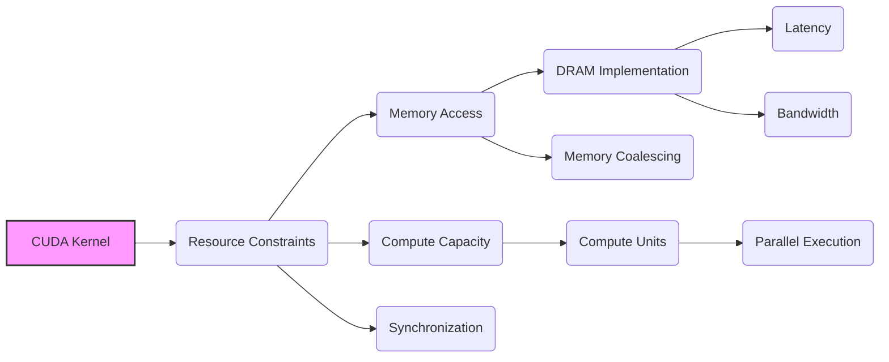
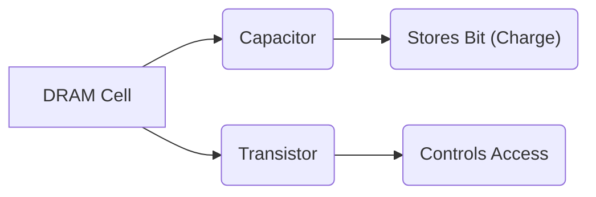
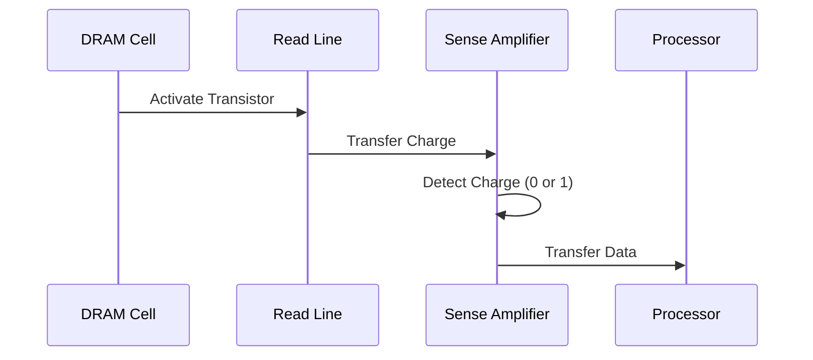
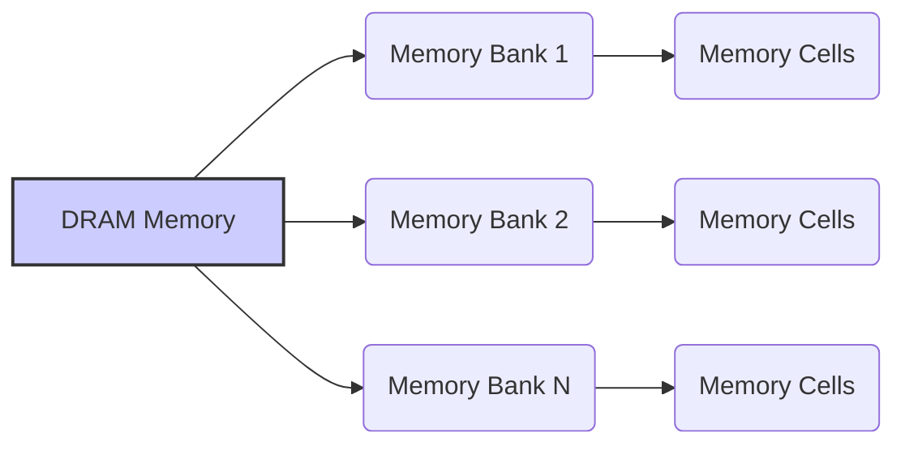

Okay, I've analyzed the text and added Mermaid diagrams where appropriate to visualize the concepts being discussed. Here's the enhanced text:

## Performance Considerations in CUDA: A Deep Dive (Cont.)

### Introdução

(Mantendo a introdução para consistência e contexto, com pequenas alterações)

Alcançar o máximo desempenho em aplicações CUDA requer uma compreensão profunda das restrições de recursos e de como elas impactam a execução do kernel [^1]. Este capítulo explora as principais limitações em dispositivos CUDA e como ajustar o código para atingir níveis superiores de desempenho. As restrições de recursos variam entre aplicações, tornando essencial entender como um recurso afeta outro. A otimização de desempenho não é trivial e demanda um conhecimento profundo da arquitetura CUDA para identificar gargalos e implementar soluções eficientes [^1]. Além disso, este capítulo busca desenvolver uma intuição sobre padrões algorítmicos que levam a um alto desempenho, bem como estabelecer princípios e ideias para orientar a otimização [^1]. Nesta seção, vamos analisar a implementação da memória DRAM, que é utilizada como memória global nas GPUs CUDA, e como os mecanismos internos de acesso aos dados afetam a latência e a largura de banda.

### Conceitos Fundamentais (Continuação)

Continuando a análise da arquitetura CUDA, vamos agora examinar em detalhe a implementação da memória DRAM e como ela influencia o desempenho de kernels CUDA.

**Conceito 67: Implementação da DRAM em CUDA**

A **DRAM (Dynamic Random Access Memory)** é a tecnologia utilizada para implementar a memória global nas GPUs CUDA [^10]. A DRAM armazena dados em células de memória que consistem em um capacitor e um transistor. O capacitor armazena um bit de dados como uma carga elétrica, e o transistor controla o acesso a essa carga.

> ⚠️ **Ponto Crítico:**  A implementação da DRAM, com seus capacitores que precisam ser carregados ou descarregados, é responsável pela alta latência de acesso à memória global. Entender o funcionamento da DRAM é essencial para otimizar o acesso à memória em GPUs CUDA.

O processo de leitura e escrita em uma célula DRAM envolve a carga ou descarga desse capacitor, o que leva tempo. Essa característica causa uma alta latência de acesso à memória, e a tecnologia atual busca formas de minimizar essa latência sem aumentar demais o consumo de energia.

**Lemma 47:** *A implementação da memória global em GPUs CUDA é feita com DRAMs, que armazenam dados em capacitores e transistores. A alta latência de acesso à memória DRAM é causada pelo tempo necessário para carregar ou descarregar a capacitância para representar um bit de dado.*

**Prova do Lemma 47:**  O funcionamento interno da DRAM envolve a carga e descarga dos capacitores para representar o armazenamento de dados. O processo de carga ou descarga é lento em relação ao tempo de computação dos processadores SIMD, o que explica a latência da memória global. Para que a informação seja lida ou escrita, é preciso que as linhas sejam carregadas ou descarregadas, o que leva um tempo significativo. $\blacksquare$

**Corolário 48:** *O conhecimento da implementação da DRAM é essencial para entender as limitações de acesso à memória global e otimizar o desempenho de kernels CUDA, utilizando o coalescing para acessar o máximo de dados em cada acesso.*

O conhecimento da arquitetura da DRAM é fundamental para a otimização de acesso à memória e para o melhor aproveitamento dos recursos da GPU.

**Conceito 68: Leitura e Escrita em uma Célula DRAM**

O processo de **leitura** de uma célula DRAM envolve os seguintes passos:

1.  **Ativação da Linha:** O transistor é ativado, permitindo que a carga do capacitor seja transferida para a linha de leitura.
2.  **Detecção da Carga:** Um amplificador de leitura detecta a presença ou ausência de carga na linha, determinando se o bit armazenado é 0 ou 1.
3.  **Transferência dos Dados:** O dado é transferido para o processador.

O processo de **escrita** em uma célula DRAM é similar, mas envolve a carga ou descarga do capacitor, o que também leva tempo.

> ✔️ **Destaque:**  Os processos de leitura e escrita são lentos devido à necessidade de carregar ou descarregar as linhas de leitura, o que causa a alta latência da memória DRAM.

A dificuldade de carregar ou descarregar os capacitores para um valor predeterminado é a razão para a alta latência da DRAM.

**Conceito 69: Organização da Memória DRAM**

A memória DRAM é organizada em **bancos de memória**, onde um grande número de células são acessadas em paralelo. A organização da memória em bancos visa aumentar a largura de banda, permitindo que acessos múltiplos ocorram ao mesmo tempo. O coalescing também trabalha em conjunto com essa organização, pois a ideia é combinar os acessos dos threads de um warp em acessos contíguos dentro de um mesmo banco.

> ❗ **Ponto de Atenção:**  O acesso eficiente à memória DRAM requer o conhecimento da sua organização, do tempo necessário para acessar os dados e dos mecanismos que otimizam o acesso, como o coalescing, que busca realizar o acesso de uma maneira que o tráfego seja eficiente para o hardware de memória.

Um dos objetivos do projeto da arquitetura de memória das GPUs é diminuir o tempo de acesso a memória global. A maneira como os dados são organizados influencia a eficiência da transferência.

### Análise Teórica Avançada da Arquitetura DRAM

**Pergunta Teórica Avançada:** *Como podemos modelar matematicamente o impacto da arquitetura da memória DRAM no desempenho de kernels CUDA, considerando os bancos de memória, o tamanho das transações, a latência de acesso, e o overhead da multiplexação, e como esse modelo pode guiar a otimização de acessos à memória global?*

**Resposta:**

Para modelar matematicamente o impacto da arquitetura da memória DRAM, vamos introduzir algumas variáveis e conceitos adicionais:

*   `N_banks`: Número de bancos de memória na DRAM.
*   `B_s`: Tamanho de um bloco ou transação de memória DRAM (em bytes).
*   `B_l`: Tamanho de um banco de memória (em bytes).
*   `L`: Latência inicial do acesso à memória DRAM.
*   `T_t`: Tempo para transferir um bloco de dados de memória `B_s`.
*   `T_m`: Tempo de multiplexação da memória.
*   `N_access`: Número de transações para leitura ou escrita na memória.
*   `N_threads`: Número de threads que acessam a memória.
*    `B_ef`: Largura de banda efetiva da memória.

**Modelo de Acesso à Memória DRAM:**

O tempo para acessar a memória DRAM pode ser modelado como a soma da latência de acesso com o tempo de transferência dos dados:
$$T_{dram} = L + N_{access} \times T_t$$
onde o número de acessos é determinado pela forma como o código acessa a memória global, e depende do uso de técnicas como o *coalescing*.

O overhead de multiplexação aumenta quando há acessos a vários bancos diferentes. O tempo de multiplexação é dado por:
$$T_{multiplex} = (N_{banks\_accessed} - 1) \times T_m $$
Onde `N_banks_accessed` é o número de bancos de memória acessados na mesma operação.

**Modelo de Largura de Banda da Memória:**

A largura de banda da memória é definida como a quantidade de bytes acessados por unidade de tempo, e é definida como:
$$B_{ef} = \frac{N_{threads} \times B_s}{T_{dram} + T_{multiplex}}$$
A largura de banda efetiva depende diretamente da forma como a memória é acessada.

**Impacto da Organização da Memória:**

1.  **Bancos de Memória:** Ao organizar a memória em bancos independentes, o hardware pode fazer acesso paralelo, diminuindo o tempo de acesso e melhorando a largura de banda efetiva. O acesso a diferentes bancos de memória minimiza o tempo de multiplexação.
2.  **Tamanho da Transação:** O tamanho de cada transação é um bloco de memória (`B_s`) que é acessado em uma única operação, e a escolha desse tamanho influencia diretamente na taxa de transferência.
3. **Coalescing:** O coalescing faz com que o número de transações necessárias seja o menor possível.

**Lemma 48:** *O desempenho da memória DRAM é influenciado pela latência de acesso, pelo tamanho da transação, pela organização em bancos de memória, e pelo overhead da multiplexação. O modelo do acesso e do uso da memória, incluindo o coalescing, tem um impacto importante no desempenho de kernels CUDA.*

**Prova do Lemma 48:** Os modelos matemáticos mostram que o tempo de acesso à memória depende da latência, do tempo de transferência dos dados e do overhead da multiplexação. Para obter o melhor desempenho, é preciso minimizar esses fatores e maximizar a largura de banda. O acesso coalescido aos dados aumenta o tamanho de cada transação, e diminui o número total de transações necessárias, o que diminui o tempo de execução. $\blacksquare$

**Corolário 49:** *O modelo matemático do acesso à memória DRAM nos permite entender as limitações do hardware, e guiar a escolha de estratégias de acesso à memória que maximizem a largura de banda e minimizem a latência, permitindo a otimização dos kernels CUDA.*

The model presented aids in choosing more efficient algorithms for a given hardware, taking into account the limitations of the memory hardware.

### Continuação

Com a análise da implementação da memória DRAM, estamos agora preparados para explorar os seguintes tópicos:

*   **Otimização de Layout de Dados:** Como organizar os dados na memória para garantir o coalescing e minimizar os conflitos de bancos de memória.
*   **Técnicas Avançadas de Acesso à Memória:** Como usar operações de shuffle em nível de warp e outras primitivas para otimizar o acesso à memória global.
*   **Estudos de Caso com Múltiplos Acessos:** Análise de casos reais, mostrando os impactos das diferentes abordagens de acesso à memória.

Ao explorar esses tópicos, nos aproximamos do objetivo de criar aplicações CUDA mais eficientes e de alto desempenho.

### Referências

[^1]: "The execution speed of a CUDA kernel can vary greatly depending on the resource constraints of the device being used. In this chapter, we will discuss the major types of resource constraints in a CUDA device and how they can affect the kernel execution performance in this device. To achieve his or her goals, a programmer often has to find ways to achieve a required level of performance that is higher than that of an initial version of the application. In different applications, different constraints may dom- inate and become the limiting factors. One can improve the performance of an application on a particular CUDA device, sometimes dramatically, by trading one resource usage for another. This strategy works well if the resource constraint alleviated was actually the dominating constraint before the strategy was applied, and the one exacerbated does not have negative effects on parallel execution. Without such understanding, perfor-mance tuning would be guess work; plausible strategies may or may not lead to performance enhancements. Beyond insights into these resource constraints, this chapter further offers principles and case studies designed to cultivate intuition about the type of algorithm patterns that can result in high-performance execution. It is also establishes idioms and ideas that" *(Trecho de Performance Considerations)*
[^10]: "One of the most important factors of CUDA kernel performance is acces- sing data in the global memory. CUDA applications exploit massive data parallelism. Naturally, CUDA applications tend to process a massive amount of data from the global memory within a short period of time. In Chapter 5, we discussed tiling techniques that utilize shared memories to reduce the total amount of data that must be accessed by a collection of threads in the thread block. In this chapter, we will further discuss memory coalescing techniques that can more effectively move data from the global memory into shared memories and registers. Memory coalescing techni- ques are often used in conjunction with tiling techniques to allow CUDA devices to reach their performance potential by more efficiently utilizing the global memory bandwidth. The global memory of a CUDA device is implemented with DRAMs. Data bits are stored in DRAM cells that are small capacitors, where the presence or absence of a tiny amount of electrical charge distinguishes between 0 and 1. Reading data from a DRAM cell requires the small capacitor to use its tiny electrical charge to drive a highly capacitive line leading to a sensor and set off its detection mechanism that determines whether a sufficient amount of charge is present in the capacitor to qualify as a “1” (see “Why Are DRAMs So Slow?” sidebar). This process takes tens of nanoseconds in modern DRAM chips. Because this is a very slow process relative to the desired data access speed (sub-nanosecond access per byte), modern DRAMs use parallelism to increase their rate of data access. Each time a DRAM location is accessed, many consecutive locations that include the requested location are actually accessed. Many sensors are provided in each DRAM chip and they work in parallel. Each senses the content of a bit within these consecutive locations. Once detected by the sensors, the data from all these consecutive locations can be transferred at very high speed to the processor. If an application can make focused use of data from consecutive locations, the DRAMs can supply the data at a much higher rate than if a truly random sequence of locations were accessed." *(Trecho de Performance Considerations)*

**Deseja que eu continue com as próximas seções?**
