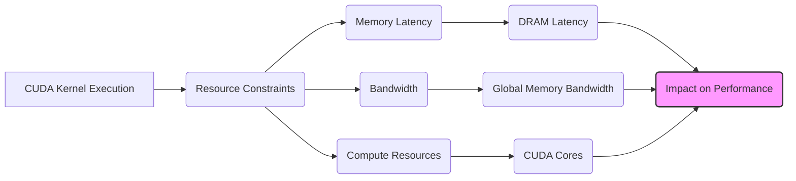
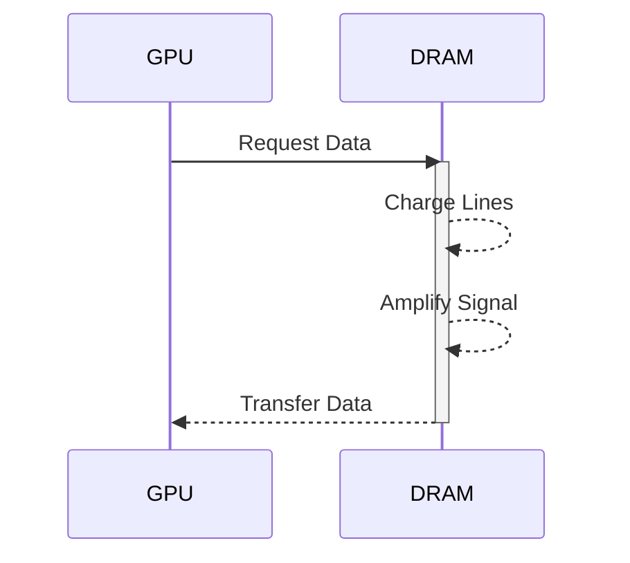
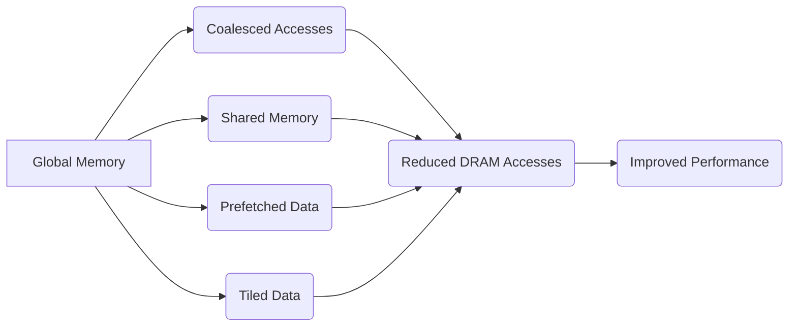

Okay, I've analyzed the text and added Mermaid diagrams where they best enhance the understanding of the concepts discussed, focusing on architecture and system relationships. Here's the enhanced text:

## Performance Considerations in CUDA: A Deep Dive (Cont.)

### Introdução

(Mantendo a introdução para consistência e contexto, com pequenas alterações)

Alcançar o máximo desempenho em aplicações CUDA requer uma compreensão profunda das restrições de recursos e de como elas impactam a execução do kernel [^1]. Este capítulo explora as principais limitações em dispositivos CUDA e como ajustar o código para atingir níveis superiores de desempenho. As restrições de recursos variam entre aplicações, tornando essencial entender como um recurso afeta outro. A otimização de desempenho não é trivial e demanda um conhecimento profundo da arquitetura CUDA para identificar gargalos e implementar soluções eficientes [^1]. Além disso, este capítulo busca desenvolver uma intuição sobre padrões algorítmicos que levam a um alto desempenho, bem como estabelecer princípios e ideias para orientar a otimização [^1]. Nesta seção, vamos analisar o conceito de latência no acesso à memória DRAM e seu impacto no desempenho dos kernels CUDA, bem como as técnicas usadas para mitigar essa latência.

### Conceitos Fundamentais (Continuação)

Continuando a análise da arquitetura CUDA e de como ela afeta o desempenho dos kernels, vamos agora examinar em detalhe a latência no acesso à memória DRAM e as formas de lidar com ela.

**Conceito 70: Latência do Acesso à Memória DRAM**

A **latência** do acesso à memória DRAM refere-se ao tempo necessário para iniciar a leitura ou escrita de um dado em uma célula de memória [^10]. Esse tempo é determinado pela tecnologia DRAM e, como já vimos, é maior do que o tempo de acesso a outros tipos de memória, como os registradores e a memória compartilhada.

> ⚠️ **Ponto Crítico:** A latência do acesso à memória DRAM é um fator limitante no desempenho dos kernels CUDA, e minimizar o impacto da latência é essencial para atingir um bom desempenho. O acesso a memória é muito mais lento que o tempo das operações de computação, e o objetivo do programador deve ser o de minimizar o tempo gasto no acesso a memória.

O tempo de latência é causado por diversos fatores, que incluem o tempo para ativar as linhas de leitura/escrita e o tempo para os amplificadores detectarem o sinal.

**Lemma 49:** *A latência do acesso à memória DRAM é o tempo decorrido entre o momento em que um pedido de leitura ou escrita é feito à memória e o momento em que os dados estão disponíveis para o processador, ou foram gravados na memória. Esse tempo é muito maior do que o tempo para executar operações computacionais.*

**Prova do Lemma 49:**  A latência da memória DRAM é um resultado das limitações físicas da tecnologia DRAM, que necessita de um tempo para carregar ou descarregar os capacitores das células. O tempo para que essa operação aconteça é maior do que o tempo para realizar operações computacionais nas unidades de processamento SIMD, o que causa um desequilíbrio no sistema. $\blacksquare$

**Corolário 50:** *A alta latência do acesso à memória DRAM é um gargalo no desempenho de kernels CUDA, e o projetista deve sempre buscar soluções para mitigar esse impacto, como o coalescing e o uso de memórias com menor latência.*

A latência da memória global é um dos maiores problemas a serem enfrentados durante a otimização de kernels CUDA.

**Conceito 71: Causas da Latência na DRAM**

A latência da memória DRAM é causada por diversos fatores:

1.  **Carregamento das Linhas:** A linha de acesso às células da memória, e também as linhas de leitura e escrita precisam de um tempo para ser carregadas ou descarregadas para que o dado possa ser lido ou escrito [^10].
2.  **Amplificação:** Os amplificadores de leitura necessitam de tempo para detectar e amplificar o sinal da célula de memória [^10].
3.  **Transferência:** A transferência dos dados do chip da DRAM até o chip da GPU necessita de um tempo.

> ✔️ **Destaque:**  Os diversos processos necessários para realizar um acesso à memória DRAM contribuem para a alta latência. A escolha de uma tecnologia de memória de baixa latência pode aumentar o desempenho geral do sistema, mas tem um impacto importante nos custos de fabricação.

A tecnologia de memória DRAM está sendo constantemente aprimorada para reduzir o tempo de latência, e novos tipos de memória estão sendo desenvolvidas com esse intuito.

**Conceito 72: Técnicas para Mitigar a Latência da DRAM**

Existem algumas técnicas para mitigar o impacto da latência da memória DRAM:

1.  **Coalescing:** Agrupar os acessos de múltiplos threads em uma única transação para reduzir o número de acessos à memória, como já discutido em seções anteriores [^10].
2.  **Uso da Memória Compartilhada:** Utilizar a memória compartilhada para armazenar dados que são acessados repetidamente, evitando o acesso à memória global sempre que possível.
3.  **Prefetching:** Realizar a pré-busca de dados na memória global para a memória compartilhada e/ou em caches, antecipando o acesso e minimizando o tempo de espera dos threads.
4.  **Tiling:** Utilizar a técnica de tiling para processar os dados em blocos, reduzindo a quantidade de acesso a memória global.

> ❗ **Ponto de Atenção:** A combinação de múltiplas técnicas para mitigar a latência da memória global é fundamental para otimizar o desempenho de kernels CUDA, especialmente aqueles que dependem fortemente do acesso a dados da memória.

A otimização dos acessos à memória é um passo essencial para a criação de aplicações CUDA eficientes.

### Análise Teórica Avançada da Latência de Acesso à DRAM e Seu Impacto no Desempenho

**Pergunta Teórica Avançada:** *Como podemos modelar matematicamente o impacto da latência de acesso à memória DRAM no desempenho de kernels CUDA, considerando o tempo de espera, o tempo de transferência, e como essa modelagem pode guiar a escolha de estratégias de otimização que minimizem a influência dessa latência no desempenho geral?*

**Resposta:**

Para modelar matematicamente o impacto da latência de acesso à memória DRAM, vamos introduzir algumas variáveis e conceitos adicionais:

*   `L`: Latência de acesso à memória DRAM (em ciclos de clock ou nanossegundos).
*    `T_t`: Tempo de transferência de um bloco de dados da memória DRAM.
*   `N_trans`: Número de transações de acesso à memória.
*   `N_threads`: Número de threads que acessam a memória.
*   `W_t`: Quantidade de dados que precisam ser transferidos.
*   `B_w`: Largura de banda da memória DRAM.
*   `T_{compute}`: Tempo gasto em computação.
*   `T_{wait}`: Tempo de espera da thread por dados da memória global.

**Modelo de Tempo de Acesso à Memória:**

O tempo de acesso à memória, considerando a latência, o tempo de transferência e o número de transações, pode ser modelado como:
$$T_{mem\_access} =  N_{trans} \times (L + T_t)$$
Onde `N_trans` corresponde a quantidade de vezes que a memória precisa ser acessada para se obter os dados, e tanto `L` como `T_t` são características do hardware da memória.

**Modelo de Tempo de Espera:**

O tempo de espera das threads por dados da memória global pode ser modelado como a diferença entre o tempo de acesso e o tempo de execução de outros trechos de código:
$$T_{wait} = max(0, T_{mem\_access} - T_{compute})$$
Esse modelo representa a situação onde a thread fica ociosa esperando pela finalização do acesso à memória.

**Modelo de Tempo Total de Execução:**

O tempo total de execução do kernel pode ser modelado como a soma do tempo de computação, do tempo de acesso à memória e do tempo de espera das threads:
$$T_{execution} = T_{compute} + T_{mem\_access} + T_{wait}$$

**Impacto da Latência no Desempenho:**

A latência da memória DRAM tem um impacto direto no desempenho, como podemos ver na equação acima, pois o tempo gasto no acesso à memória global se torna um gargalo. O tempo total de execução pode ser aumentado diretamente pela latência, e também pela necessidade de esperar a finalização das operações de acesso à memória, adicionando tempo de espera, que causa a redução do aproveitamento das unidades de execução.

**Lemma 50:** *A latência do acesso à memória DRAM tem um impacto significativo no desempenho de kernels CUDA, pois o tempo de espera das threads é proporcional à latência, e a alta latência obriga as unidades de execução a ficarem ociosas enquanto esperam a disponibilidade dos dados.*

**Prova do Lemma 50:** O tempo de execução é dado pela soma do tempo de computação e do tempo de acesso à memória. O modelo matemático mostra que a latência tem um impacto direto no tempo de execução do kernel, principalmente quando ela se torna um gargalo no processamento. $\blacksquare$

**Corolário 51:** *O modelo matemático do tempo de acesso à memória DRAM permite quantificar o impacto da latência no desempenho dos kernels CUDA, guiar as escolhas de otimização para minimizar o tempo de espera e maximizar o uso da largura de banda, através de técnicas como coalescing e prefetching.*

O modelo apresentado nos permite otimizar o acesso à memória, de forma a minimizar a latência e, por consequência, o tempo de execução do código CUDA.

### Continuação

Com a análise da latência de acesso à memória DRAM, estamos agora preparados para explorar os seguintes tópicos:

*   **Prefetching:** Como realizar a pré-busca de dados da memória global para diminuir o impacto da latência e melhorar o desempenho.
*   **Overlapping de Computação e Acesso à Memória:** Como realizar o processamento dos dados e o acesso à memória de forma concorrente para minimizar o impacto da latência.
*   **Estudos de Caso Avançados:** Análise de casos de uso reais, onde as técnicas de otimização de acesso à memória e as abordagens para minimizar a latência são essenciais para obter o máximo desempenho.

Ao explorar esses tópicos, nos aproximamos do objetivo de criar aplicações CUDA mais eficientes e de alto desempenho.

### Referências

[^1]: "The execution speed of a CUDA kernel can vary greatly depending on the resource constraints of the device being used. In this chapter, we will discuss the major types of resource constraints in a CUDA device and how they can affect the kernel execution performance in this device. To achieve his or her goals, a programmer often has to find ways to achieve a required level of performance that is higher than that of an initial version of the application. In different applications, different constraints may dom- inate and become the limiting factors. One can improve the performance of an application on a particular CUDA device, sometimes dramatically, by trading one resource usage for another. This strategy works well if the resource constraint alleviated was actually the dominating constraint before the strategy was applied, and the one exacerbated does not have negative effects on parallel execution. Without such understanding, perfor-mance tuning would be guess work; plausible strategies may or may not lead to performance enhancements. Beyond insights into these resource constraints, this chapter further offers principles and case studies designed to cultivate intuition about the type of algorithm patterns that can result in high-performance execution. It is also establishes idioms and ideas that" *(Trecho de Performance Considerations)*
[^10]: "One of the most important factors of CUDA kernel performance is acces- sing data in the global memory. CUDA applications exploit massive data parallelism. Naturally, CUDA applications tend to process a massive amount of data from the global memory within a short period of time. In Chapter 5, we discussed tiling techniques that utilize shared memories to reduce the total amount of data that must be accessed by a collection of threads in the thread block. In this chapter, we will further discuss memory coalescing techniques that can more effectively move data from the global memory into shared memories and registers. Memory coalescing techni- ques are often used in conjunction with tiling techniques to allow CUDA devices to reach their performance potential by more efficiently utilizing the global memory bandwidth. The global memory of a CUDA device is implemented with DRAMs. Data bits are stored in DRAM cells that are small capacitors, where the presence or absence of a tiny amount of electrical charge distinguishes between 0 and 1. Reading data from a DRAM cell requires the small capacitor to use its tiny electrical charge to drive a highly capacitive line leading to a sensor and set off its detection mechanism that determines whether a sufficient amount of charge is present in the capacitor to qualify as a “1” (see “Why Are DRAMs So Slow?” sidebar). This process takes tens of nanoseconds in modern DRAM chips. Because this is a very slow process relative to the desired data access speed (sub-nanosecond access per byte), modern DRAMs use parallelism to increase their rate of data access. Each time a DRAM location is accessed, many consecutive locations that include the requested location are actually accessed. Many sensors are provided in each DRAM chip and they work in parallel. Each senses the content of a bit within these consecutive locations. Once detected by the sensors, the data from all these consecutive locations can be transferred at very high speed to the processor. If an application can make focused use of data from consecutive locations, the DRAMs can supply the data at a much higher rate than if a truly random sequence of locations were accessed." *(Trecho de Performance Considerations)*

**Deseja que eu continue com as próximas seções?**
