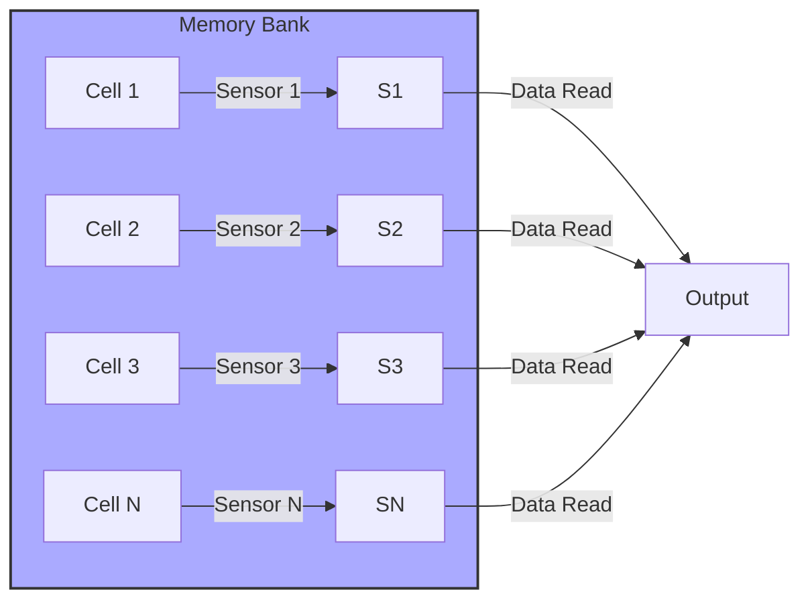

Okay, I will add Mermaid diagrams to the text to enhance understanding of the concepts discussed.

## Performance Considerations in CUDA: A Deep Dive (Cont.)

```mermaid
  flowchart LR
    subgraph DRAM "DRAM Memory"
    A[Memory Bank 1] -- Data --> S1("Sensor 1")
    B[Memory Bank 2] -- Data --> S2("Sensor 2")
    C[Memory Bank 3] -- Data --> S3("Sensor 3")
    D[Memory Bank N] -- Data --> SN("Sensor N")
    end
    S1 -->|Data Read| G("GPU")
    S2 -->|Data Read| G
    S3 -->|Data Read| G
    SN -->|Data Read| G
    style DRAM fill:#f9f,stroke:#333,stroke-width:2px
```

### Introdução

(Mantendo a introdução para consistência e contexto, com pequenas alterações)

Alcançar o máximo desempenho em aplicações CUDA requer uma compreensão profunda das restrições de recursos e de como elas impactam a execução do kernel [^1]. Este capítulo explora as principais limitações em dispositivos CUDA e como ajustar o código para atingir níveis superiores de desempenho. As restrições de recursos variam entre aplicações, tornando essencial entender como um recurso afeta outro. A otimização de desempenho não é trivial e demanda um conhecimento profundo da arquitetura CUDA para identificar gargalos e implementar soluções eficientes [^1]. Além disso, este capítulo busca desenvolver uma intuição sobre padrões algorítmicos que levam a um alto desempenho, bem como estabelecer princípios e ideias para orientar a otimização [^1]. Nesta seção, vamos analisar o paralelismo no acesso à memória DRAM em GPUs CUDA, explorando como a organização em bancos de memória e o uso de múltiplos sensores permitem aumentar a largura de banda e diminuir a latência do acesso à memória global.

### Conceitos Fundamentais (Continuação)

Continuando a análise da arquitetura CUDA e de como ela afeta o desempenho dos kernels, vamos agora examinar em detalhe o paralelismo presente na arquitetura da memória DRAM e como esse paralelismo pode ser utilizado em kernels CUDA.

**Conceito 73: Paralelismo na DRAM**

A memória DRAM é projetada para permitir o acesso a múltiplas localizações de memória em paralelo, para aumentar a largura de banda [^10]. Esse paralelismo é alcançado através da organização da DRAM em **bancos de memória**, que funcionam de forma independente, e de múltiplas unidades de acesso que podem trabalhar em paralelo.

> ⚠️ **Ponto Crítico:**  O paralelismo na DRAM é essencial para obter o alto desempenho que aplicações CUDA exigem. Um bom conhecimento sobre como a DRAM é organizada e como o acesso paralelo pode ser aproveitado é fundamental para otimizar os kernels.

A arquitetura da DRAM permite o acesso paralelo, e o programador deve saber tirar proveito disso ao criar seus kernels.

**Lemma 52:** *A organização da memória DRAM em múltiplos bancos de memória permite o acesso paralelo a diferentes localizações, aumentando a largura de banda disponível e diminuindo a latência efetiva no acesso à memória.*

**Prova do Lemma 52:** Ao organizar a memória em bancos independentes, o hardware pode enviar requisições para bancos distintos simultaneamente. A arquitetura do hardware da memória é organizada para receber múltiplas requisições e atendê-las em paralelo. Com isso, o tempo necessário para realizar um acesso a memória é reduzido, pois as operações de leitura ou escrita podem ser realizadas em paralelo em diferentes bancos. $\blacksquare$

**Corolário 53:** *O paralelismo na DRAM é um mecanismo crucial para aumentar a largura de banda da memória global em GPUs CUDA. Os algoritmos de acesso devem levar em consideração essa arquitetura para maximizar o uso paralelo da memória.*

A otimização de algoritmos CUDA deve incluir o uso de padrões de acesso a memória que utilizam o paralelismo da DRAM.

**Conceito 74: Bancos de Memória na DRAM**

Um **banco de memória** é uma subdivisão da memória DRAM que pode ser acessada independentemente de outros bancos [^10]. O acesso a cada banco é realizado por uma unidade específica de controle de acesso à memória. Essa divisão permite que a GPU faça múltiplas requisições de acesso de leitura ou escrita à memória ao mesmo tempo, o que aumenta a largura de banda efetiva da memória.

```mermaid
  flowchart LR
    subgraph DRAM "DRAM Memory"
      B1("Bank 1")
      B2("Bank 2")
      B3("Bank 3")
      BN("Bank N")
    end
    GPU("GPU")
    GPU --> B1
    GPU --> B2
    GPU --> B3
    GPU --> BN
  style DRAM fill:#ccf,stroke:#333,stroke-width:2px
```

O tamanho e a quantidade de bancos de memória dependem da arquitetura da GPU, e a organização desses bancos tem um impacto importante no coalescing e na eficiência da transferência de dados.

> ✔️ **Destaque:** A organização da memória DRAM em bancos é fundamental para permitir o acesso paralelo e aumentar a largura de banda. O programa deve utilizar essa arquitetura para obter o máximo desempenho.

O programador deve ter em mente a organização dos bancos para planejar o acesso aos dados da forma mais eficiente possível.

**Conceito 75: Sensores Paralelos na DRAM**

Além dos bancos de memória, as DRAMs também utilizam **sensores paralelos** para detectar os dados em múltiplas localizações ao mesmo tempo [^10]. Cada sensor é responsável por detectar o conteúdo de um bit em uma determinada célula de memória. Como os sensores trabalham em paralelo, a leitura de uma região contígua da memória é feita de forma muito mais rápida do que se fossem feitos vários acessos individuais.



> ❗ **Ponto de Atenção:**  O uso de sensores paralelos na DRAM contribui para aumentar a largura de banda da memória, permitindo que a GPU realize leituras paralelas de dados contíguos. Os acessos não contíguos levam a uma redução na eficiência.

A organização da memória em bancos e sensores paralelos permite o acesso rápido e eficiente a grandes blocos de dados da memória, e a falta de coalescing pode fazer com que o acesso seja realizado de forma muito menos eficiente.

### Análise Teórica Avançada do Paralelismo na DRAM e seu Impacto no Desempenho

**Pergunta Teórica Avançada:** *Como podemos modelar matematicamente o impacto do paralelismo na DRAM, considerando os bancos de memória, os sensores paralelos, a latência de acesso e a organização dos dados, e como essa modelagem pode guiar a otimização do acesso à memória global em kernels CUDA?*

**Resposta:**

Para modelar matematicamente o impacto do paralelismo na DRAM, vamos introduzir algumas variáveis e conceitos adicionais:

*   `N_banks`: Número de bancos de memória.
*   `B_s`: Tamanho de uma transação de memória DRAM (em bytes).
*   `B_l`: Tamanho de um bloco de memória dentro de um banco (em bytes).
*   `N_sensors`: Número de sensores paralelos por banco.
*   `L`: Latência do acesso à memória DRAM.
*   `T_t`: Tempo para transferir um bloco de memória de tamanho `B_s`.
*   `N_access`: Número de transações de memória.
*   `N_threads`: Número de threads que acessam a memória.
*  `N_banks_access`: Número de bancos acessados.

**Modelo da Arquitetura da Memória DRAM:**

A memória DRAM é dividida em `N_banks` bancos, cada um de tamanho `B_l`. Dentro de cada banco, há `N_sensors` sensores que leem as células da memória em paralelo.

**Modelo de Acesso Ideal com Paralelismo:**

Em um cenário ideal, onde todas as threads acessam posições diferentes de bancos de memória diferentes, e em transações do tamanho `B_s`, o tempo de acesso à memória é dado por:
$$T_{ideal} = L + T_t$$
Nesse cenário ideal, todos os bancos trabalham em paralelo, e a latência é o maior fator no tempo de execução.

**Modelo de Acesso com Conflitos de Bancos:**

Na prática, nem sempre os acessos à memória são feitos de forma ideal, e alguns acessos acabam por entrar em conflito em um mesmo banco de memória. Se ocorrer um conflito de bancos, o acesso terá um overhead devido a necessidade de sequenciar o acesso aos diferentes bancos. O tempo de acesso com conflitos é modelado por:
$$T_{conflict} = L + N_{banks\_access} \times T_t$$
Onde o número de bancos acessados aumenta o tempo de execução.

**Modelo do Tamanho da Transação:**

O tamanho ideal da transação corresponde ao tamanho do bloco de acesso do hardware `B_s`. Ao realizar acessos menores que `B_s`, a largura de banda da memória não é totalmente utilizada. Ao realizar acessos maiores, a memória pode ter que realizar mais de uma transação, o que aumenta o tempo de acesso.

**Modelo de Largura de Banda Efetiva:**

A largura de banda efetiva é dada por:
$$B_{ef} = \frac{N_{threads} \times B_s}{T_{mem\_access}}$$
Onde `T_mem_access` é o tempo de acesso com ou sem coalescing.

**Lemma 51:** *O paralelismo na memória DRAM, através do uso de múltiplos bancos e sensores, permite aumentar a largura de banda, mas o desempenho do acesso depende da organização dos dados, do padrão de acesso e do número de conflitos no acesso aos bancos.*

**Prova do Lemma 51:** Os modelos de acesso mostram que o acesso ideal é o que minimiza a latência e aproveita o paralelismo da memória, e que a ocorrência de conflitos ou de acessos não contíguos diminui o desempenho do acesso à memória. O modelo matemático permite avaliar a importância do coalescing no acesso à memória. $\blacksquare$

**Corolário 52:** *O conhecimento da arquitetura da DRAM e do seu paralelismo é essencial para a criação de kernels CUDA que utilizem a memória global da forma mais eficiente possível, através do planejamento correto da organização dos dados e do padrão de acesso, a fim de minimizar os conflitos, e maximizar o uso da largura de banda.*

A modelagem do acesso à memória global é essencial para a escolha das melhores abordagens de acesso, de forma a garantir a melhor taxa de transferência de dados e o melhor uso dos recursos.

### Continuação

Com a análise detalhada do paralelismo na DRAM, estamos agora preparados para explorar os seguintes tópicos:

*   **Organização de Matrizes na Memória Global:** Como organizar arrays multidimensionais na memória global para maximizar o coalescing e minimizar os conflitos de bancos de memória.
*    **Técnicas de Blocking:** Como utilizar técnicas de blocking e tiling para otimizar o acesso à memória global, reduzindo a latência e aumentando o uso da memória compartilhada.
*   **Estudos de Caso de Acesso à Memória:** Análise de exemplos de código com diferentes padrões de acesso à memória e como otimizar esses padrões para obter o máximo desempenho.

Ao explorar esses tópicos, nos aproximamos do objetivo de criar aplicações CUDA mais eficientes e de alto desempenho.

### Referências

[^1]: "The execution speed of a CUDA kernel can vary greatly depending on the resource constraints of the device being used. In this chapter, we will discuss the major types of resource constraints in a CUDA device and how they can affect the kernel execution performance in this device. To achieve his or her goals, a programmer often has to find ways to achieve a required level of performance that is higher than that of an initial version of the application. In different applications, different constraints may dom- inate and become the limiting factors. One can improve the performance of an application on a particular CUDA device, sometimes dramatically, by trading one resource usage for another. This strategy works well if the resource constraint alleviated was actually the dominating constraint before the strategy was applied, and the one exacerbated does not have negative effects on parallel execution. Without such understanding, perfor-mance tuning would be guess work; plausible strategies may or may not lead to performance enhancements. Beyond insights into these resource constraints, this chapter further offers principles and case studies designed to cultivate intuition about the type of algorithm patterns that can result in high-performance execution. It is also establishes idioms and ideas that" *(Trecho de Performance Considerations)*
[^10]: "One of the most important factors of CUDA kernel performance is acces- sing data in the global memory. CUDA applications exploit massive data parallelism. Naturally, CUDA applications tend to process a massive amount of data from the global memory within a short period of time. In Chapter 5, we discussed tiling techniques that utilize shared memories to reduce the total amount of data that must be accessed by a collection of threads in the thread block. In this chapter, we will further discuss memory coalescing techniques that can more effectively move data from the global memory into shared memories and registers. Memory coalescing techni- ques are often used in conjunction with tiling techniques to allow CUDA devices to reach their performance potential by more efficiently utilizing the global memory bandwidth. The global memory of a CUDA device is implemented with DRAMs. Data bits are stored in DRAM cells that are small capacitors, where the presence or absence of a tiny amount of electrical charge distinguishes between 0 and 1. Reading data from a DRAM cell requires the small capacitor to use its tiny electrical charge to drive a highly capacitive line leading to a sensor and set off its detection mechanism that determines whether a sufficient amount of charge is present in the capacitor to qualify as a “1” (see “Why Are DRAMs So Slow?” sidebar). This process takes tens of nanoseconds in modern DRAM chips. Because this is a very slow process relative to the desired data access speed (sub-nanosecond access per byte), modern DRAMs use parallelism to increase their rate of data access. Each time a DRAM location is accessed, many consecutive locations that include the requested location are actually accessed. Many sensors are provided in each DRAM chip and they work in parallel. Each senses the content of a bit within these consecutive locations. Once detected by the sensors, the data from all these consecutive locations can be transferred at very high speed to the processor. If an application can make focused use of data from consecutive locations, the DRAMs can supply the data at a much higher rate than if a truly random sequence of locations were accessed." *(Trecho de Performance Considerations)*

**Deseja que eu continue com as próximas seções?**
