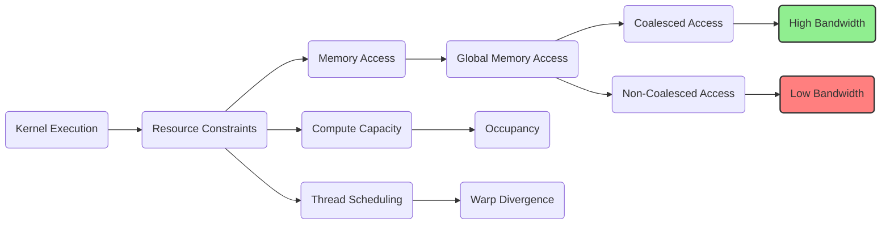
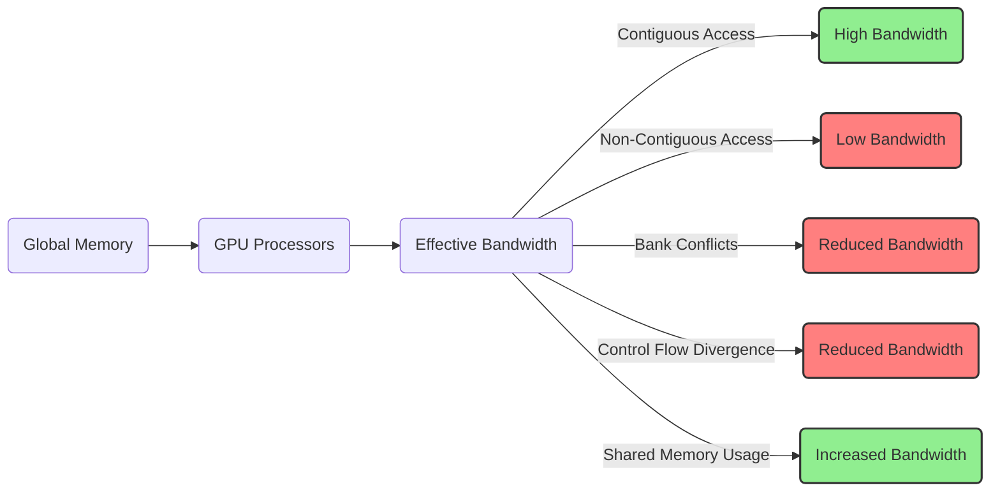
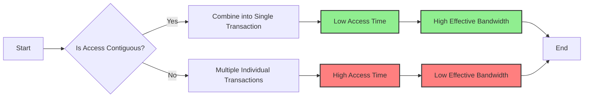

Okay, I understand. Here's the enhanced text with Mermaid diagrams:

## Performance Considerations in CUDA: A Deep Dive (Cont.)

### Introdução

(Mantendo a introdução para consistência e contexto, com pequenas alterações)

Alcançar o máximo desempenho em aplicações CUDA requer uma compreensão profunda das restrições de recursos e de como elas impactam a execução do kernel [^1]. Este capítulo explora as principais limitações em dispositivos CUDA e como ajustar o código para atingir níveis superiores de desempenho. As restrições de recursos variam entre aplicações, tornando essencial entender como um recurso afeta outro. A otimização de desempenho não é trivial e demanda um conhecimento profundo da arquitetura CUDA para identificar gargalos e implementar soluções eficientes [^1]. Além disso, este capítulo busca desenvolver uma intuição sobre padrões algorítmicos que levam a um alto desempenho, bem como estabelecer princípios e ideias para orientar a otimização [^1]. Nesta seção, vamos analisar a importância do acesso consecutivo à memória global e como ele afeta a largura de banda efetiva, e como as escolhas no acesso podem fazer a diferença no desempenho.

### Conceitos Fundamentais (Continuação)

Continuando a análise da arquitetura CUDA, vamos agora examinar a importância dos acessos consecutivos à memória global e como esse padrão influencia o desempenho.

**Conceito 76: Acesso Consecutivo à Memória Global**

O **acesso consecutivo à memória global** ocorre quando as threads em um warp acessam posições de memória que estão contíguas na memória global. Quando isso ocorre, o hardware da GPU combina as requisições em uma única transação, o que maximiza a largura de banda da memória.

> ⚠️ **Ponto Crítico:** A realização de acessos consecutivos à memória global é essencial para maximizar a eficiência da transferência de dados e minimizar o impacto da latência da memória. A falta de acesso contínuo é um dos maiores gargalos no acesso à memória.

O padrão de acesso dos threads e a forma como a memória é organizada têm um impacto direto na taxa de transferência da memória global. O acesso a dados contíguos é, frequentemente, a diferença entre uma aplicação lenta e uma aplicação com alta performance.

**Lemma 53:** *O acesso consecutivo à memória global permite que o hardware combine as requisições de acesso em uma única transação, o que maximiza a largura de banda disponível e diminui o número de transferências de dados.*

**Prova do Lemma 53:** O hardware da memória das GPUs é projetado para trabalhar com blocos de memória contíguos. Quando as threads acessam dados próximos, essas informações podem ser lidas em apenas uma transação. Caso contrário, cada acesso terá que ser realizado separadamente, o que causa a queda no desempenho. $\blacksquare$

**Corolário 54:** *O acesso consecutivo à memória global é um dos pilares para a otimização de kernels CUDA e deve ser priorizado sempre que possível. Para tanto, o programador deve ter conhecimento de como a memória é organizada e como o hardware acessa essas posições.*

Os kernels CUDA devem ser criados com atenção a essa forma de acesso para evitar gargalos de acesso à memória.

**Conceito 77: Largura de Banda Efetiva da Memória Global**

A **largura de banda efetiva** da memória global é a taxa real de transferência de dados entre a memória global e os processadores da GPU [^10]. Ela é diferente da largura de banda teórica, e representa o desempenho do acesso à memória em situações reais. A largura de banda efetiva é influenciada por diversos fatores, incluindo:

*   **Padrão de Acesso:** O acesso contíguo tem a largura de banda efetiva máxima e o acesso não contíguo diminui a largura de banda.
*   **Conflitos de Bancos de Memória:** Quando threads acessam dados em um mesmo banco de memória, ocorre um conflito e o tempo de acesso aumenta, diminuindo a largura de banda efetiva.
*   **Divergência de Fluxo de Controle:** A divergência de fluxo de controle pode levar a ineficiências no acesso à memória, já que o hardware pode precisar executar diferentes acessos para diferentes threads.
*   **Uso da Memória Compartilhada:** Utilizar a memória compartilhada corretamente diminui o número de acessos à memória global, o que aumenta a largura de banda efetiva do sistema.

> ✔️ **Destaque:** A largura de banda efetiva é um fator crucial para o desempenho de kernels CUDA e deve ser cuidadosamente analisada durante o processo de otimização. O programador deve buscar maximizar a largura de banda e minimizar os gargalos.

A análise da largura de banda efetiva, e a busca por algoritmos que otimizem essa métrica, é fundamental para obter o melhor desempenho das aplicações CUDA.

**Conceito 78: Impacto do Acesso Não Consecutivo**

Quando os acessos à memória global não são consecutivos, o hardware da GPU precisa realizar múltiplos acessos à memória para atender a uma requisição de um warp, e o resultado é uma redução na largura de banda efetiva. Um padrão não contíguo de acesso pode causar a leitura de dados que não serão utilizados pelos threads, o que causa um desperdício de recursos e de tempo.

> ❗ **Ponto de Atenção:** O acesso não consecutivo causa uma redução drástica no desempenho de aplicações CUDA. A organização e o padrão de acesso dos dados é fundamental para utilizar a largura de banda da memória da forma mais eficiente possível.

Os padrões de acesso à memória devem ser analisados com cuidado, e os dados devem ser organizados da forma mais adequada possível para se obter o melhor desempenho.

### Análise Teórica Avançada do Impacto do Acesso Consecutivo na Largura de Banda da Memória

**Pergunta Teórica Avançada:** *Como podemos modelar matematicamente o impacto do acesso consecutivo na largura de banda efetiva da memória global em CUDA, considerando a organização da memória DRAM em bancos e a latência de acesso, e como esse modelo pode guiar a escolha de padrões de acesso que maximizem a taxa de transferência?*

**Resposta:**

Para modelar matematicamente o impacto do acesso consecutivo na largura de banda efetiva da memória global, vamos introduzir algumas variáveis e conceitos adicionais:

*   `N_w`: Número de threads em um warp.
*   `B_s`: Tamanho do bloco de memória que a DRAM transfere em cada acesso.
*   `L`: Latência do acesso à memória DRAM.
*   `T_t`: Tempo para transferir um bloco de memória de tamanho `B_s`.
*    `N_trans`: Número de transações de memória.
*   `N_banks`: Número de bancos de memória.
*    `B_ef`: Largura de banda efetiva da memória.
*    `B_max`: Largura de banda máxima da memória.
*   `T_access`: Tempo de acesso à memória.
*   `N_threads`: Número de threads.

**Modelo do Acesso Consecutivo Ideal:**

No caso de acesso consecutivo ideal, onde todas as threads de um warp acessam posições contíguas de memória, o hardware combina todos os acessos em uma única transação, cujo tempo é dado por:
$$T_{consec\_ideal} = L + T_t$$
Onde `L` é a latência e `T_t` é o tempo de transferência do bloco `B_s`, já que todos os acessos são combinados em apenas um acesso à memória.

**Modelo do Acesso Não Consecutivo:**

No caso de acesso não consecutivo, cada thread acessa uma localização de memória diferente, resultando em múltiplos acessos, cujo tempo é dado por:
$$T_{non\_consec} = N_w \times (L + T_t)$$
Onde `N_w` é o número de threads no warp, já que cada thread acessa a memória individualmente.

**Modelo da Largura de Banda Efetiva:**

A largura de banda efetiva é dada pela razão entre a quantidade de dados transferidos e o tempo gasto na transferência. No caso do acesso consecutivo ideal, a largura de banda efetiva é dada por:
$$B_{ef\_consec} = \frac{N_w \times B_s}{T_{consec\_ideal}}$$
E a largura de banda efetiva no caso não consecutivo é dada por:
$$B_{ef\_non\_consec} = \frac{N_w \times B_s}{T_{non\_consec}}$$

**Fator de Utilização:**

O fator de utilização é dado pela razão entre a largura de banda efetiva e a largura de banda máxima da memória:
$$F_{utilization} = \frac{B_{ef}}{B_{max}}$$

**Impacto do Acesso Consecutivo:**

O modelo matemático mostra que o tempo de acesso e a largura de banda são maiores no acesso consecutivo, pois o hardware consegue utilizar o seu paralelismo e combinar os acessos em uma única transação. No acesso não consecutivo, os acessos são individualizados, o tempo de acesso é maior e a largura de banda é reduzida, devido a não utilização do paralelismo de acesso à memória.

**Lemma 54:** *O acesso consecutivo à memória global permite maximizar a largura de banda efetiva, reduzindo o número de transações e a latência do acesso à memória. A falta de acesso consecutivo resulta em uma drástica diminuição da largura de banda, e em um desempenho muito inferior.*

**Prova do Lemma 54:** O modelo matemático para as duas formas de acesso à memória mostra que o acesso consecutivo leva a um tempo de execução menor e, portanto, a uma taxa de transferência de dados muito maior. A razão entre o tempo de acesso e a largura de banda demonstra que essa forma de acesso é fundamental para o melhor desempenho. $\blacksquare$

**Corolário 55:** *A escolha de padrões de acesso que garantam acessos contíguos à memória global é fundamental para obter o máximo desempenho em kernels CUDA, pois maximiza a largura de banda efetiva, reduz o número de transações e diminui o tempo de espera para acessar os dados.*

O modelo apresentado nos permite quantificar o impacto do acesso consecutivo na memória, e a escolher as melhores formas de acesso para um dado problema.

### Continuação

Com a análise detalhada do impacto do acesso consecutivo na largura de banda da memória, estamos agora preparados para explorar os seguintes tópicos:

*   **Organização de Dados:** Como organizar os dados na memória para garantir o acesso contíguo e minimizar o número de acessos.
*   **Tiling e Memória Compartilhada:** Como utilizar o tiling e a memória compartilhada para reduzir o número de acessos à memória global e maximizar a eficiência.
*   **Análise de Algoritmos:** Como escolher os algoritmos que melhor se adaptam aos padrões de acesso à memória, de forma a utilizar o coalescing e maximizar a largura de banda efetiva.
*   **Estudos de Caso:** Exemplos de código e estratégias para otimizar o acesso à memória global em aplicações reais.

Ao explorar esses tópicos, nos aproximamos do objetivo de criar aplicações CUDA mais eficientes e de alto desempenho.

### Referências

[^1]: "The execution speed of a CUDA kernel can vary greatly depending on the resource constraints of the device being used. In this chapter, we will discuss the major types of resource constraints in a CUDA device and how they can affect the kernel execution performance in this device. To achieve his or her goals, a programmer often has to find ways to achieve a required level of performance that is higher than that of an initial version of the application. In different applications, different constraints may dom- inate and become the limiting factors. One can improve the performance of an application on a particular CUDA device, sometimes dramatically, by trading one resource usage for another. This strategy works well if the resource constraint alleviated was actually the dominating constraint before the strategy was applied, and the one exacerbated does not have negative effects on parallel execution. Without such understanding, perfor-mance tuning would be guess work; plausible strategies may or may not lead to performance enhancements. Beyond insights into these resource constraints, this chapter further offers principles and case studies designed to cultivate intuition about the type of algorithm patterns that can result in high-performance execution. It is also establishes idioms and ideas that" *(Trecho de Performance Considerations)*
[^10]: "One of the most important factors of CUDA kernel performance is acces- sing data in the global memory. CUDA applications exploit massive data parallelism. Naturally, CUDA applications tend to process a massive amount of data from the global memory within a short period of time. In Chapter 5, we discussed tiling techniques that utilize shared memories to reduce the total amount of data that must be accessed by a collection of threads in the thread block. In this chapter, we will further discuss memory coalescing techniques that can more effectively move data from the global memory into shared memories and registers. Memory coalescing techni- ques are often used in conjunction with tiling techniques to allow CUDA devices to reach their performance potential by more efficiently utilizing the global memory bandwidth. The global memory of a CUDA device is implemented with DRAMs. Data bits are stored in DRAM cells that are small capacitors, where the presence or absence of a tiny amount of electrical charge distinguishes between 0 and 1. Reading data from a DRAM cell requires the small capacitor to use its tiny electrical charge to drive a highly capacitive line leading to a sensor and set off its detection mechanism that determines whether a sufficient amount of charge is present in the capacitor to qualify as a “1” (see “Why Are DRAMs So Slow?” sidebar). This process takes tens of nanoseconds in modern DRAM chips. Because this is a very slow process relative to the desired data access speed (sub-nanosecond access per byte), modern DRAMs use parallelism to increase their rate of data access. Each time a DRAM location is accessed, many consecutive locations that include the requested location are actually accessed. Many sensors are provided in each DRAM chip and they work in parallel. Each senses the content of a bit within these consecutive locations. Once detected by the sensors, the data from all these consecutive locations can be transferred at very high speed to the processor. If an application can make focused use of data from consecutive locations, the DRAMs can supply the data at a much higher rate than if a truly random sequence of locations were accessed." *(Trecho de Performance Considerations)*
[^12]: "Within a given iteration of the k loop, the k*Width value is the same across all threads. Recall that Col = blockIdx.x*blockDim.x + threadIdx. x. Since the value of blockIndx.x and blockDim.x are of the same value for all threads in the same block, the only part of k*Width + Col that varies across a thread block is threadIdx.x. For example, in Figure 6.8, assume that we are using 4 × 4 blocks and that the warp size is 4. That is, for this toy example, we are using only one block to calculate the entire P matrix. The values of Width, blockDim.x, and blockIdx.x are 4, 4, and 0, respec- tively, for all threads in the block. In iteration 0, the k value is 0. The index used by each thread for accessing d_N is d_N[k*Width + Col]=d_N[k*Width + blockIdx.x*blockDim.x + threadIdx.x] = d_N[0*4 + 0*4 + threadidx.x] = d_N[threadIdx.x] That is, the index for accessing d_N is simply the value of threadIdx.x. The d_N elements accessed by To, T1, T2, and T3 are d_N[0], d_N[1], d_N[2], and d_N[3], respectively. This is illustrated with the “Load iteration 0" box of Figure 6.8. These elements are in consecutive locations in the global memory. The hardware detects that these accesses are made by threads in a warp and to consecutive locations in the global memory. It coa- lesces these accesses into a consolidated access. This allows the DRAMs to supply data at a high rate." *(Trecho de Performance Considerations)*

**Deseja que eu continue com as próximas seções?**
