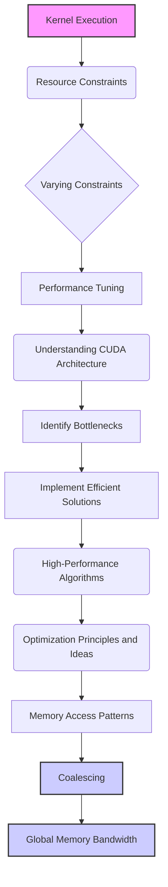
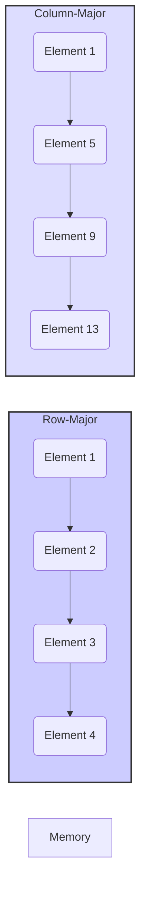
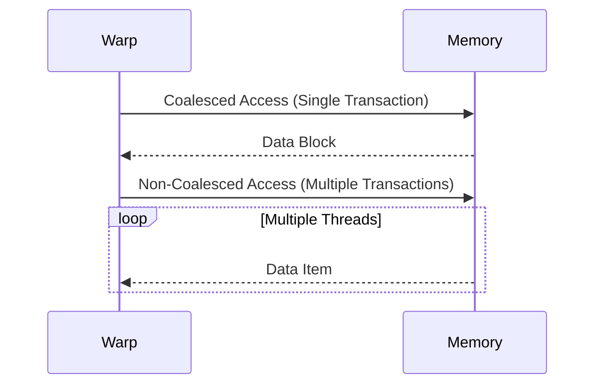

Okay, I understand. Here's the enhanced text with Mermaid diagrams added where appropriate:

## Performance Considerations in CUDA: A Deep Dive (Cont.)

### Introdução

(Mantendo a introdução para consistência e contexto, com pequenas alterações)

Alcançar o máximo desempenho em aplicações CUDA requer uma compreensão profunda das restrições de recursos e de como elas impactam a execução do kernel [^1]. Este capítulo explora as principais limitações em dispositivos CUDA e como ajustar o código para atingir níveis superiores de desempenho. As restrições de recursos variam entre aplicações, tornando essencial entender como um recurso afeta outro. A otimização de desempenho não é trivial e demanda um conhecimento profundo da arquitetura CUDA para identificar gargalos e implementar soluções eficientes [^1]. Além disso, este capítulo busca desenvolver uma intuição sobre padrões algorítmicos que levam a um alto desempenho, bem como estabelecer princípios e ideias para orientar a otimização [^1]. Nesta seção, vamos explorar detalhadamente os diferentes padrões de acesso à memória em CUDA, focando nos acessos a matrizes multidimensionais e como esses padrões afetam o *coalescing* e a largura de banda da memória global.

### Conceitos Fundamentais (Continuação)

Continuando a análise da arquitetura CUDA, vamos agora examinar os diferentes padrões de acesso à memória global que podem ocorrer em kernels CUDA, e como eles impactam a eficiência de acesso aos dados.

**Conceito 79: Padrões de Acesso à Memória em CUDA**

Os **padrões de acesso à memória** em CUDA referem-se à forma como as threads em um warp acessam os dados na memória global. Esses padrões podem variar amplamente, dependendo do algoritmo, da estrutura de dados e da organização das threads. O tipo de acesso tem um impacto direto no desempenho, já que um acesso inadequado causa a redução da largura de banda e causa latência desnecessária.

> ⚠️ **Ponto Crítico:** A escolha correta de um padrão de acesso à memória é um dos fatores mais importantes para otimizar o desempenho de kernels CUDA. O padrão de acesso impacta diretamente a largura de banda efetiva da memória global e a eficiência do coalescing.

O programador deve buscar por padrões que permitam o coalescing dos dados, de forma a utilizar todo o potencial da GPU.

**Lemma 56:** *Os padrões de acesso à memória determinam a forma como as threads em um warp acessam a memória global, e essa forma de acesso influencia diretamente o coalescing, a largura de banda efetiva e, portanto, o desempenho do kernel.*

**Prova do Lemma 56:** O hardware de acesso a memória das GPUs foi projetado para maximizar o uso da largura de banda quando há um acesso consecutivo aos dados, por isso, quando os acessos não seguem esse padrão, a taxa de transferência diminui e o tempo gasto na transferência aumenta. A escolha do padrão de acesso correto é, portanto, uma decisão fundamental para obter a melhor performance do código. $\blacksquare$

**Corolário 57:** *Um entendimento profundo dos padrões de acesso à memória e suas implicações é essencial para a criação de kernels CUDA eficientes, e um padrão de acesso otimizado é capaz de aumentar o desempenho e diminuir o tempo de execução.*

Os padrões de acesso a memória são uma das maiores dificuldades na otimização de código CUDA, e requerem uma atenção especial.

**Conceito 80: Acesso a Matrizes Multidimensionais**

Em aplicações CUDA, é comum o uso de **matrizes multidimensionais** para representar os dados. A organização desses dados na memória global, geralmente por meio de *row-major*  e a forma como os threads acessam esses dados influencia o coalescing e a largura de banda da memória.

*   **Acesso *row-major***: O acesso *row-major* significa que os elementos de uma mesma linha da matriz são armazenados consecutivamente na memória. Esse padrão é o padrão utilizado em C e também em CUDA [^11].  Para que os dados sejam acessados de forma coalescida, as threads de um mesmo warp devem acessar dados em uma mesma linha, por exemplo utilizando o índice `d_N[k*Width + Col]`, onde `Col` varia para cada thread dentro do mesmo warp.
*    **Acesso *column-major***: O acesso *column-major* significa que os elementos de uma mesma coluna são armazenados consecutivamente na memória. Este padrão não é o padrão utilizado em C e CUDA, e por isso, para que o acesso seja coalescido, pode ser necessário utilizar uma transposição da matriz, o que pode aumentar o overhead.

> ✔️ **Destaque:**  Em CUDA, o acesso a matrizes deve ser feito considerando o padrão *row-major* para garantir o coalescing e maximizar a largura de banda da memória global. O acesso à coluna geralmente não é coalescido, a não ser que a memória seja transposta.

Ao acessar uma matriz, o programador deve ter atenção à ordem na qual a memória é acessada, e a forma como isso afeta o coalescing, a fim de obter o máximo desempenho.

**Conceito 81: Acesso Coalescido e Não Coalescido**

A diferença entre **acesso coalescido** e **acesso não coalescido** é fundamental para entender a otimização do acesso à memória global.

*   **Acesso Coalescido:** Quando todas as threads em um warp acessam posições de memória contíguas e alinhadas, o hardware combina esses acessos em uma única transação, o que maximiza a largura de banda da memória.
*   **Acesso Não Coalescido:** Quando os acessos não são contíguos ou alinhados corretamente, o hardware executa cada acesso separadamente, o que aumenta a latência e diminui a largura de banda efetiva da memória [^10].

> ❗ **Ponto de Atenção:** O acesso não coalescido leva a uma utilização muito inferior da largura de banda da memória. O kernel CUDA deve ser planejado de forma a maximizar o coalescing e evitar padrões não coalescidos.

A análise do código deve garantir o acesso contínuo à memória, evitando *strides* e acessos aleatórios.

### Análise Teórica Avançada dos Padrões de Acesso à Memória Global

**Pergunta Teórica Avançada:** *Como podemos modelar matematicamente a relação entre os diferentes padrões de acesso à memória global em matrizes multidimensionais (row-major e column-major), o coalescing, e a largura de banda efetiva da memória em GPUs CUDA, e como esse modelo pode guiar a escolha de padrões de acesso que maximizem o desempenho?*

**Resposta:**

Para modelar matematicamente a relação entre os padrões de acesso e o desempenho da memória, vamos introduzir algumas variáveis e conceitos adicionais:

*   `N_w`: Número de threads em um warp.
*   `B_s`: Tamanho de uma transação de memória (em bytes).
*   `L`: Latência de acesso à memória.
*   `T_t`: Tempo para transferir um bloco de memória `B_s`.
*   `Width`: Largura da matriz.
*   `Height`: Altura da matriz.
*   `T_mem_access`: Tempo de acesso à memória.
*   `B_ef`: Largura de banda efetiva da memória.

**Modelo de Acesso Row-Major:**

No acesso row-major, as threads de um warp acessam dados contíguos em uma linha da matriz, o que garante coalescing. O tempo de acesso é dado por:
$$T_{row\_major} = L + T_t$$
Onde `L` é a latência e `T_t` é o tempo da transação de tamanho `B_s`.

**Modelo de Acesso Column-Major (Sem Transposição):**

No acesso column-major, cada thread acessa uma posição de uma coluna, e como os dados são organizados em row-major, o acesso não é coalescido. O tempo de acesso é dado por:
$$T_{column\_major} = N_w \times (L + T_t)$$
Onde cada thread acessa a memória de forma separada, e o tempo aumenta com o tamanho do warp.

**Modelo de Acesso Column-Major (Com Transposição):**

Para realizar acesso coalescido na coluna, os dados podem ser transpostos. A transposição tem um custo computacional que pode ser modelado por:
$$T_{transpose} = \frac{Width \times Height}{N_{threads}} \times T_c$$
Onde `T_c` é o tempo da operação de transposição. Após a transposição, o tempo de acesso passa a ser o tempo de acesso em row-major:
$$T_{transpose\_access} = L + T_t$$
O tempo total com transposição é a soma dos dois termos.

**Largura de Banda Efetiva:**

A largura de banda efetiva para o acesso *row-major* é dada por:
$$B_{ef\_row} = \frac{N_w \times B_s}{T_{row\_major}}$$
E a largura de banda efetiva para o acesso *column-major* (sem transposição) é dada por:
$$B_{ef\_column} = \frac{N_w \times B_s}{T_{column\_major}}$$

**Impacto nos Padrões de Acesso:**

Os modelos matemáticos mostram que o acesso *row-major* sem transposição tem um tempo de execução muito menor e, portanto, uma largura de banda muito maior. A transposição tem um custo, e mesmo após a transposição o acesso coalescido em *column-major* tem um tempo de acesso e largura de banda iguais ao acesso coalescido em *row-major*. O acesso *column-major* sem transposição é sempre muito menos eficiente.

**Lemma 55:** *O padrão de acesso row-major garante o coalescing e maximiza a largura de banda da memória em operações de leitura e escrita em matrizes multidimensionais. Acesso column-major sem transposição é sempre menos eficiente, enquanto o acesso column-major após a transposição se torna tão eficiente quanto o acesso row-major.*

**Prova do Lemma 55:**  Os modelos matemáticos apresentados mostram que o tempo de execução do acesso *row-major* é menor, o que gera um aumento significativo na largura de banda, mostrando que essa abordagem é a mais adequada. $\blacksquare$

**Corolário 56:** *O modelo matemático apresentado permite quantificar o impacto das diferentes abordagens de acesso à memória e auxilia na escolha de algoritmos e padrões de acesso que maximizem o coalescing e a largura de banda da memória.*

A análise da matemática por trás do acesso à memória permite a escolha dos algoritmos e a organização dos dados para um melhor desempenho, e isso só é possível com um profundo conhecimento do hardware da GPU.

### Continuação

Com a análise detalhada dos padrões de acesso à memória global, estamos agora preparados para explorar os seguintes tópicos:

*   **Técnicas de Tiling:** Como combinar o tiling com a organização de dados para maximizar o coalescing e o uso da memória compartilhada.
*   **Otimização de Multiplicação de Matrizes:** Como implementar algoritmos de multiplicação de matrizes eficientes, utilizando o coalescing, a memória compartilhada e minimizando a divergência de fluxo de controle.
*   **Estudos de Caso:** Análise de casos de uso práticos que ilustram as técnicas de otimização de acesso à memória em diferentes aplicações.

Ao explorar esses tópicos, nos aproximamos do objetivo de criar aplicações CUDA mais eficientes e de alto desempenho.

### Referências

[^1]: "The execution speed of a CUDA kernel can vary greatly depending on the resource constraints of the device being used. In this chapter, we will discuss the major types of resource constraints in a CUDA device and how they can affect the kernel execution performance in this device. To achieve his or her goals, a programmer often has to find ways to achieve a required level of performance that is higher than that of an initial version of the application. In different applications, different constraints may dom- inate and become the limiting factors. One can improve the performance of an application on a particular CUDA device, sometimes dramatically, by trading one resource usage for another. This strategy works well if the resource constraint alleviated was actually the dominating constraint before the strategy was applied, and the one exacerbated does not have negative effects on parallel execution. Without such understanding, perfor-mance tuning would be guess work; plausible strategies may or may not lead to performance enhancements. Beyond insights into these resource constraints, this chapter further offers principles and case studies designed to cultivate intuition about the type of algorithm patterns that can result in high-performance execution. It is also establishes idioms and ideas that" *(Trecho de Performance Considerations)*
[^11]: "multidimensional array elements. As we showed in Chapter 4 (Figure 4.3, replicated as Figure 6.6 for convenience), multidimensional array elements in C and CUDA are placed into the linearly addressed memory space according to the row-major convention. That is, the elements of row 0 of a matrix are first placed in order into consecutive locations. They are followed by the ele- ments of row 1 of the matrix, and so on. In other words, all elements in a row are placed into consecutive locations and entire rows are placed one after another. The term row major refers to the fact that the placement of data pre- serves the structure of rows: all adjacent elements in a row are placed into consecutive locations in the address space. Figure 6.6 shows a small example where the 16 elements of a 4 × 4 matrix M are placed into linearly addressed locations. The four elements of row 0 are first placed in their order of appear- ance in the row. Elements in row 1 are then placed, followed by elements of row 2, followed by elements of row 3. It should be clear that M0,0 and M1,0, though they appear to be consecutive in the 2D matrix, are placed four loca- tions away in the linearly addressed memory." *(Trecho de Performance Considerations)*
[^12]: "Within a given iteration of the k loop, the k*Width value is the same across all threads. Recall that Col = blockIdx.x*blockDim.x + threadIdx. x. Since the value of blockIndx.x and blockDim.x are of the same value for all threads in the same block, the only part of k*Width + Col that varies across a thread block is threadIdx.x. For example, in Figure 6.8, assume that we are using 4 × 4 blocks and that the warp size is 4. That is, for this toy example, we are using only one block to calculate the entire P matrix. The values of Width, blockDim.x, and blockIdx.x are 4, 4, and 0, respec- tively, for all threads in the block. In iteration 0, the k value is 0. The index used by each thread for accessing d_N is d_N[k*Width + Col]=d_N[k*Width + blockIdx.x*blockDim.x + threadIdx.x] = d_N[0*4 + 0*4 + threadidx.x] = d_N[threadIdx.x] That is, the index for accessing d_N is simply the value of threadIdx.x. The d_N elements accessed by To, T1, T2, and T3 are d_N[0], d_N[1], d_N[2], and d_N[3], respectively. This is illustrated with the “Load iteration 0" box of Figure 6.8. These elements are in consecutive locations in the global memory. The hardware detects that these accesses are made by threads in a warp and to consecutive locations in the global memory. It coa- lesces these accesses into a consolidated access. This allows the DRAMs to supply data at a high rate." *(Trecho de Performance Considerations)*

**Deseja que eu continue com as próximas seções?**
