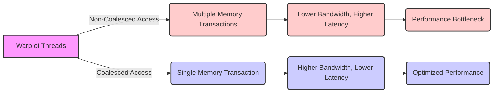
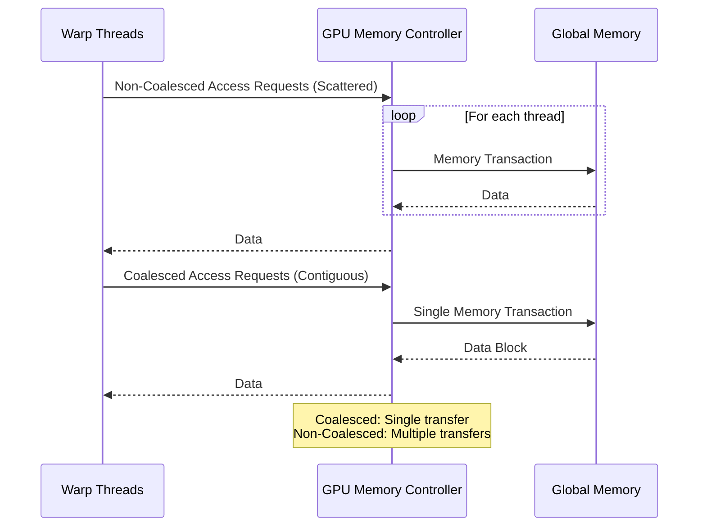

Okay, I will add Mermaid diagrams to enhance the provided text, focusing on visualizing the concepts of coalesced and non-coalesced memory access.

## Performance Considerations in CUDA: A Deep Dive (Cont.)

### Introdução

(Mantendo a introdução para consistência e contexto, com pequenas alterações)

Alcançar o máximo desempenho em aplicações CUDA requer uma compreensão profunda das restrições de recursos e de como elas impactam a execução do kernel [^1]. Este capítulo explora as principais limitações em dispositivos CUDA e como ajustar o código para atingir níveis superiores de desempenho. As restrições de recursos variam entre aplicações, tornando essencial entender como um recurso afeta outro. A otimização de desempenho não é trivial e demanda um conhecimento profundo da arquitetura CUDA para identificar gargalos e implementar soluções eficientes [^1]. Além disso, este capítulo busca desenvolver uma intuição sobre padrões algorítmicos que levam a um alto desempenho, bem como estabelecer princípios e ideias para orientar a otimização [^1]. Nesta seção, vamos nos aprofundar no conceito de acesso coalescido à memória global, explorando como ele funciona, por que ele é importante e como implementá-lo de forma eficiente.

### Conceitos Fundamentais (Continuação)

Continuando a análise da arquitetura CUDA, vamos agora examinar em detalhes o conceito de acesso coalescido à memória global e seu impacto no desempenho dos kernels.

**Conceito 82: Acesso Coalescido à Memória Global**

O **acesso coalescido à memória global** é uma técnica fundamental de otimização em CUDA que envolve a combinação dos acessos de múltiplos threads em um mesmo warp em uma única transação de memória [^10]. Esse processo permite que o hardware da GPU transfira dados da memória para os processadores de forma mais eficiente, utilizando toda a largura de banda da memória global disponível.

> ⚠️ **Ponto Crítico:** O acesso coalescido à memória é essencial para obter alto desempenho em aplicações CUDA que utilizam a memória global. O acesso não coalescido é uma das maiores causas de gargalo em kernels CUDA.

Quando o acesso é feito de forma coalescida, a GPU realiza apenas uma operação de leitura ou escrita, e transfere dados contíguos na memória global. Essa transferência é mais rápida e eficiente do que acessos não contíguos, que exigem que a GPU faça leituras ou escritas separadas para cada thread.

**Lemma 57:** *O acesso coalescido à memória global combina os acessos de todas as threads de um warp em uma única transação de leitura ou escrita, o que reduz a sobrecarga do acesso e maximiza a largura de banda da memória.*

**Prova do Lemma 57:**  O hardware da memória das GPUs é projetado para trabalhar com grandes blocos de dados contíguos na memória global. Quando a solicitação de acesso à memória dos threads de um warp acontece de forma contígua, a unidade de processamento pode realizar apenas uma transação para ler ou escrever todos os dados de um mesmo bloco. Se o acesso não for contíguo, o hardware necessita realizar múltiplos acessos para os dados de um mesmo warp, que causa a diminuição da largura de banda efetiva e o aumento do tempo de espera. $\blacksquare$

**Corolário 58:** *O acesso coalescido é a principal forma de se obter um bom desempenho em kernels CUDA que acessam dados na memória global, já que ele permite maximizar a utilização da largura de banda disponível e minimizar a latência do acesso à memória.*

O acesso coalescido deve ser priorizado na implementação de kernels que utilizem a memória global, e outras técnicas devem ser consideradas quando essa forma de acesso não é possível.

**Conceito 83: Acesso Não Coalescido**

O **acesso não coalescido** ocorre quando as threads em um warp acessam dados não contíguos na memória global. Nesse caso, o hardware da GPU precisa realizar várias transações separadas para atender a todos os threads do warp, o que reduz a largura de banda efetiva da memória. A realização de múltiplas transações aumenta o tempo gasto na leitura ou escrita, e desperdiça parte da capacidade de transferência da memória.

> ✔️ **Destaque:** O acesso não coalescido é uma das maiores fontes de ineficiência no acesso à memória global. É fundamental que os kernels CUDA evitem essa forma de acesso, sempre que possível.

As causas mais comuns de acesso não coalescido são:

*   Acesso em *stride*: Acesso a posições de memória separadas por um deslocamento que não corresponde ao padrão dos acessos coalescidos.
*    Acesso a colunas: Em matrizes *row-major*, o acesso a colunas é tipicamente não coalescido.
*  Desalinhamento: O acesso a dados que não estão alinhados com o tamanho dos blocos da memória.

**Conceito 84: Implementação do Coalescing**

A implementação do coalescing geralmente envolve as seguintes ações:

1.  **Organização dos Dados:** Armazenar os dados na memória global de forma contígua, usando *row-major* para matrizes.
2.  **Cálculo dos Índices:** Calcular os índices de memória corretamente, de modo que os threads em um warp acessem posições consecutivas.
3.  **Evitar Padrões Complexos:** Evitar padrões de acesso à memória que envolvam deslocamentos ou estruturas de dados que não sejam contíguas na memória.
4.  **Transposição:** Transpor matrizes quando o padrão de acesso desejado for *column-major*.

> ❗ **Ponto de Atenção:**  A correta implementação do coalescing requer uma atenção cuidadosa na organização dos dados e no padrão de acesso das threads.

O programador deve ter em mente como o hardware realiza os acessos e o padrão de acesso dos threads ao planejar um código CUDA que acesse a memória global.

### Análise Teórica Avançada do Impacto do Acesso Coalescido e Não Coalescido

**Pergunta Teórica Avançada:** *Como podemos modelar matematicamente a diferença entre o acesso coalescido e o acesso não coalescido à memória global em CUDA, considerando o tamanho das transações, a latência de acesso, a largura de banda da memória e o overhead da multiplexação, e como essa modelagem pode guiar a otimização de padrões de acesso que minimizem o tempo de transferência de dados?*

**Resposta:**

Para modelar matematicamente a diferença entre o acesso coalescido e não coalescido à memória global, vamos introduzir algumas variáveis e conceitos adicionais:

*   `N_w`: Número de threads em um warp.
*   `B_s`: Tamanho de uma transação de memória (em bytes).
*   `L`: Latência do acesso à memória global.
*   `T_t`: Tempo de transferência de um bloco de memória de tamanho `B_s`.
*   `T_{overhead}`: Overhead da multiplexação em transações de acesso à memória.
*    `B_ef_coal`: Largura de banda efetiva do acesso coalescido.
*    `B_ef_noncoal`: Largura de banda efetiva do acesso não coalescido.
*   `T_access_coal`: Tempo total do acesso coalescido.
*   `T_access_noncoal`: Tempo total do acesso não coalescido.
*    `N_trans_coal`: Número de transações no acesso coalescido.
*    `N_trans_noncoal`: Número de transações no acesso não coalescido.

**Modelo do Acesso Coalescido:**

No acesso coalescido, todos os threads do warp realizam um único acesso à memória, o que leva a um tempo de acesso dado por:
$$T_{access\_coal} = L + T_t$$
E o número de transações é dado por:
$$N_{trans\_coal} = 1$$

**Modelo do Acesso Não Coalescido:**

No acesso não coalescido, cada thread realiza um acesso individual à memória, e a soma do tempo de todos os acessos é:
$$T_{access\_noncoal} = N_w \times (L + T_t + T_{overhead})$$
O número de transações é dado por:
$$N_{trans\_noncoal} = N_w$$

**Largura de Banda Efetiva:**

A largura de banda efetiva para o acesso coalescido é dada por:
$$B_{ef\_coal} = \frac{N_w \times B_s}{T_{access\_coal}}$$
E a largura de banda efetiva para o acesso não coalescido é dada por:
$$B_{ef\_noncoal} = \frac{N_w \times B_s}{T_{access\_noncoal}}$$

**Impacto no Desempenho:**

A comparação dos modelos matemáticos mostra que o acesso coalescido tem um tempo de execução menor e, portanto, uma largura de banda efetiva maior, e também minimiza a latência. O acesso não coalescido aumenta o tempo de acesso e diminui a largura de banda efetiva.

**Lemma 57:** *O acesso coalescido maximiza a largura de banda efetiva da memória global, enquanto o acesso não coalescido reduz drasticamente a largura de banda, devido ao aumento do número de transações e da latência.*

**Prova do Lemma 57:** A análise dos modelos apresentados mostra que o acesso coalescido faz o máximo uso da largura de banda, ao realizar a transferência de vários dados por vez. O acesso não coalescido, ao fazer várias solicitações individualizadas, diminui a quantidade de dados transferidos por tempo, o que diminui a largura de banda efetiva. $\blacksquare$

**Corolário 58:** *O modelo matemático do acesso coalescido e não coalescido nos permite quantificar o impacto desses padrões no desempenho, e demonstra a importância de utilizar a forma de acesso correta à memória, de forma a maximizar a largura de banda e minimizar a latência.*

A modelagem matemática nos auxilia a entender as diferenças entre os tipos de acesso e a criar código otimizado que faça o melhor uso possível dos recursos do hardware.

### Continuação

Com a análise detalhada do acesso coalescido e não coalescido, estamos agora preparados para explorar os seguintes tópicos:

*   **Técnicas de Organização de Dados:** Como organizar os dados na memória global para garantir o acesso coalescido e minimizar os conflitos de bancos de memória.
*   **Otimização de Algoritmos de Acesso à Memória:** Como criar algoritmos que utilizem a memória de forma eficiente, levando em consideração o coalescing, a latência e a largura de banda.
*   **Estudos de Caso Práticos:** Como aplicar as técnicas de otimização para melhorar o desempenho de kernels em aplicações reais que utilizam a memória global de forma intensiva.

Ao explorar esses tópicos, nos aproximamos do objetivo de criar aplicações CUDA mais eficientes e de alto desempenho.

### Referências

[^1]: "The execution speed of a CUDA kernel can vary greatly depending on the resource constraints of the device being used. In this chapter, we will discuss the major types of resource constraints in a CUDA device and how they can affect the kernel execution performance in this device. To achieve his or her goals, a programmer often has to find ways to achieve a required level of performance that is higher than that of an initial version of the application. In different applications, different constraints may dom- inate and become the limiting factors. One can improve the performance of an application on a particular CUDA device, sometimes dramatically, by trading one resource usage for another. This strategy works well if the resource constraint alleviated was actually the dominating constraint before the strategy was applied, and the one exacerbated does not have negative effects on parallel execution. Without such understanding, perfor-mance tuning would be guess work; plausible strategies may or may not lead to performance enhancements. Beyond insights into these resource constraints, this chapter further offers principles and case studies designed to cultivate intuition about the type of algorithm patterns that can result in high-performance execution. It is also establishes idioms and ideas that" *(Trecho de Performance Considerations)*
[^10]: "One of the most important factors of CUDA kernel performance is acces- sing data in the global memory. CUDA applications exploit massive data parallelism. Naturally, CUDA applications tend to process a massive amount of data from the global memory within a short period of time. In Chapter 5, we discussed tiling techniques that utilize shared memories to reduce the total amount of data that must be accessed by a collection of threads in the thread block. In this chapter, we will further discuss memory coalescing techniques that can more effectively move data from the global memory into shared memories and registers. Memory coalescing techni- ques are often used in conjunction with tiling techniques to allow CUDA devices to reach their performance potential by more efficiently utilizing the global memory bandwidth. The global memory of a CUDA device is implemented with DRAMs. Data bits are stored in DRAM cells that are small capacitors, where the presence or absence of a tiny amount of electrical charge distinguishes between 0 and 1. Reading data from a DRAM cell requires the small capacitor to use its tiny electrical charge to drive a highly capacitive line leading to a sensor and set off its detection mechanism that determines whether a sufficient amount of charge is present in the capacitor to qualify as a “1” (see “Why Are DRAMs So Slow?” sidebar). This process takes tens of nanoseconds in modern DRAM chips. Because this is a very slow process relative to the desired data access speed (sub-nanosecond access per byte), modern DRAMs use parallelism to increase their rate of data access. Each time a DRAM location is accessed, many consecutive locations that include the requested location are actually accessed. Many sensors are provided in each DRAM chip and they work in parallel. Each senses the content of a bit within these consecutive locations. Once detected by the sensors, the data from all these consecutive locations can be transferred at very high speed to the processor. If an application can make focused use of data from consecutive locations, the DRAMs can supply the data at a much higher rate than if a truly random sequence of locations were accessed." *(Trecho de Performance Considerations)*

**Deseja que eu continue com as próximas seções?**
