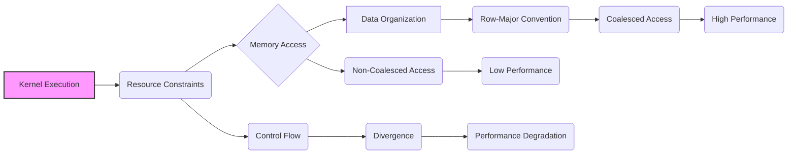
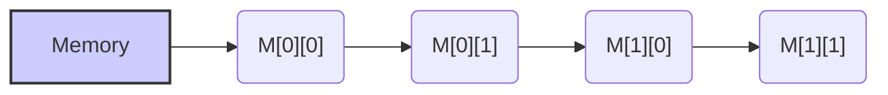
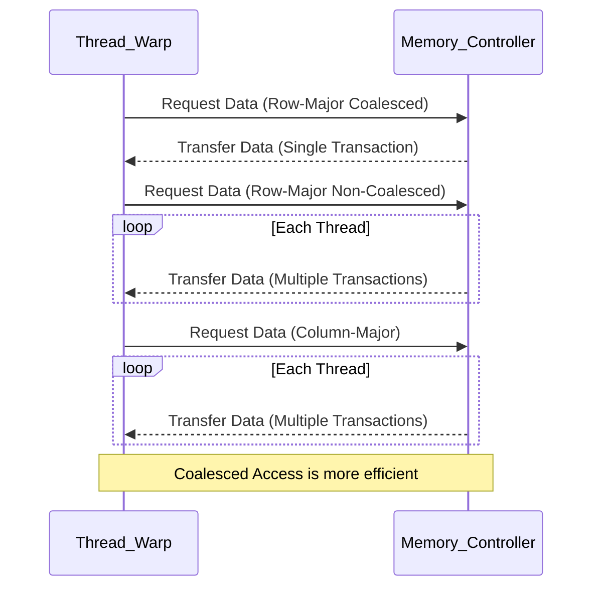

Okay, I will analyze the provided text and add Mermaid diagrams to enhance understanding, focusing on architectural and system relationships.

## Performance Considerations in CUDA: A Deep Dive (Cont.)

### Introdução

(Mantendo a introdução para consistência e contexto, com pequenas alterações)

Alcançar o máximo desempenho em aplicações CUDA requer uma compreensão profunda das restrições de recursos e de como elas impactam a execução do kernel [^1]. Este capítulo explora as principais limitações em dispositivos CUDA e como ajustar o código para atingir níveis superiores de desempenho. As restrições de recursos variam entre aplicações, tornando essencial entender como um recurso afeta outro. A otimização de desempenho não é trivial e demanda um conhecimento profundo da arquitetura CUDA para identificar gargalos e implementar soluções eficientes [^1]. Além disso, este capítulo busca desenvolver uma intuição sobre padrões algorítmicos que levam a um alto desempenho, bem como estabelecer princípios e ideias para orientar a otimização [^1]. Nesta seção, vamos analisar a organização dos dados na memória global, com foco na convenção *row-major* e como ela influencia o acesso eficiente aos dados em kernels CUDA.

### Conceitos Fundamentais (Continuação)

Continuando a análise da arquitetura CUDA e de como ela afeta o desempenho dos kernels, vamos agora examinar em detalhes a organização dos dados na memória, com foco na convenção *row-major*.

**Conceito 85: Organização dos Dados na Memória Global**

A forma como os dados são organizados na **memória global** tem um impacto fundamental no desempenho de kernels CUDA [^11]. A organização dos dados na memória é a forma como os dados são armazenados linearmente na memória, e isso influencia diretamente a forma como as threads acessam os dados, e, por consequência, a largura de banda e o desempenho do acesso à memória.

> ⚠️ **Ponto Crítico:** Uma organização inadequada dos dados na memória global pode levar a acessos não coalescidos, ao aumento da divergência de fluxo de controle, ao desperdício de largura de banda e, como consequência, a uma diminuição significativa do desempenho.

O programador deve conhecer como os dados estão dispostos na memória e como eles devem ser acessados, a fim de atingir o melhor desempenho.

**Lemma 59:** *A organização dos dados na memória global define a ordem linear em que os elementos são armazenados, o que tem um impacto direto no padrão de acesso dos threads e, por consequência, no desempenho do kernel.*

**Prova do Lemma 59:**  A memória global é, por definição, um arranjo linear de dados. A forma como os dados são organizados nesse espaço, seja por linhas, por colunas ou por qualquer outro padrão, tem um impacto direto na forma com que os threads irão acessar as diferentes posições de memória. O projetista do kernel deve conhecer e levar em consideração essa forma de armazenamento ao criar o código, e o modelo row-major é o mais comum em C e CUDA. $\blacksquare$

**Corolário 60:** *O entendimento da organização dos dados na memória global é essencial para criar kernels CUDA eficientes, e o programador deve escolher a organização de dados mais adequada para cada situação específica.*

A forma como os dados são organizados na memória e acessados é um dos fatores mais importantes no desempenho do kernel.

**Conceito 86: Convenção *Row-Major***

A **convenção *row-major*** é a forma como arrays multidimensionais são armazenados na memória linear em C e em CUDA [^11]. De acordo com essa convenção, os elementos de uma mesma linha são armazenados consecutivamente na memória, e as linhas são armazenadas uma após a outra.

> ✔️ **Destaque:**  A convenção *row-major* é a forma padrão de organização de dados na memória global em CUDA. É fundamental entender o *row-major* para escrever código que realize acessos coalescidos à memória e maximize o uso da largura de banda.

Por exemplo, em uma matriz 2x2, os elementos seriam armazenados na ordem: `M[0][0]`, `M[0][1]`, `M[1][0]`, `M[1][1]`. Essa ordem é importante para que o acesso a matriz seja o mais eficiente possível.

**Conceito 87: Acesso a Matrizes com a Convenção *Row-Major***

Ao acessar matrizes multidimensionais, o acesso deve ser feito de forma a seguir a ordem em que os dados foram armazenados na memória, de acordo com a convenção *row-major*. Por exemplo:

*   **Acesso Coalescido:** Quando os threads de um warp acessam elementos consecutivos em uma mesma linha, o acesso é coalescido, e o hardware consegue combinar esses acessos em uma única transação, maximizando o uso da largura de banda da memória.
*   **Acesso Não Coalescido:** Quando os acessos são feitos a elementos em diferentes linhas ou em diferentes colunas (sem considerar que a memória segue uma ordem *row-major*), o acesso não é coalescido, o que diminui a eficiência da transferência.

> ❗ **Ponto de Atenção:**  O acesso a colunas de matrizes (e não linhas) em um padrão *row-major* geralmente leva a um acesso não coalescido, que é ineficiente. Para realizar um acesso coalescido a colunas, uma transposição da matriz é necessária.

O entendimento de como os dados são armazenados na memória e acessados é fundamental para a otimização da memória.

### Análise Teórica Avançada da Convenção *Row-Major* e seu Impacto no Acesso à Memória

**Pergunta Teórica Avançada:** *Como podemos modelar matematicamente a relação entre a convenção row-major, o acesso coalescido e a largura de banda efetiva da memória global em CUDA, considerando diferentes padrões de acesso a matrizes multidimensionais, e como esse modelo pode guiar a criação de algoritmos mais eficientes em termos de acesso à memória?*

**Resposta:**

Para modelar matematicamente a relação entre a convenção row-major, o acesso coalescido e a largura de banda efetiva da memória, vamos introduzir algumas variáveis e conceitos adicionais:

*   `N_w`: Número de threads em um warp.
*   `B_s`: Tamanho do bloco de memória que a DRAM transfere por acesso (em bytes).
*   `L`: Latência de acesso à memória global.
*   `T_t`: Tempo para transferir um bloco de memória `B_s`.
*   `Width`: Largura da matriz.
*   `Height`: Altura da matriz.
*   `Row`: Índice da linha atual.
*   `Col`: Índice da coluna atual.
*   `T_mem_access`: Tempo de acesso à memória global.
*    `B_ef`: Largura de banda efetiva da memória.

**Modelo de Acesso Row-Major Coalescido:**

No acesso *row-major* com coalescing, as threads acessam elementos contíguos de uma mesma linha. O índice de memória é dado por `Row * Width + Col`, onde `Col` varia para cada thread do warp. O tempo de acesso a memória é modelado como:
$$T_{row\_coal} = L + T_t$$

**Modelo de Acesso Row-Major Não Coalescido:**

No acesso *row-major* não coalescido, as threads acessam elementos de diferentes linhas. O tempo de acesso à memória é modelado como:
$$T_{row\_noncoal} = N_w \times (L + T_t)$$

**Modelo de Acesso Column-Major (Sem Transposição):**

No acesso *column-major*, as threads acessam elementos de uma mesma coluna. O índice de memória é dado por `Col * Width + Row`, onde `Row` varia para cada thread do warp. Esse acesso não é coalescido no modelo *row-major*, e o tempo de acesso é modelado como:
$$T_{col\_noncoal} = N_w \times (L + T_t)$$

**Modelo de Acesso Column-Major (Com Transposição):**

No acesso *column-major* com transposição, os dados são transpostos para que o acesso seja contíguo. Essa transposição tem um custo que pode ser modelado como:
$$T_{trans} =  \frac{Width \times Height}{N_threads} \times T_c$$
Onde `T_c` é o custo computacional de cada thread para fazer a transposição. Após a transposição, o tempo de acesso é semelhante ao *row-major*:
$$T_{col\_trans\_access} =  L + T_t$$

**Largura de Banda Efetiva:**

A largura de banda efetiva para cada um dos modelos é definida como a razão entre o tamanho da transação e o tempo de acesso.

**Impacto do *Row-Major* e Coalescing:**

A modelagem matemática dos diferentes tipos de acesso mostra que o acesso *row-major* com coalescing leva a um menor tempo de acesso e, portanto, à maior largura de banda efetiva. O acesso *row-major* sem coalescing e o acesso *column-major* sem transposição mostram uma largura de banda muito inferior.

**Lemma 58:** *A convenção row-major, quando utilizada corretamente, permite a realização de acessos coalescidos, o que maximiza a largura de banda da memória e diminui a latência. A organização dos dados na memória, em conjunto com a forma como os threads acessam a memória, tem um impacto direto no desempenho.*

**Prova do Lemma 58:** A matemática apresentada nas equações acima mostra que a o padrão de acesso row-major com acesso coalescido minimiza a quantidade de transações necessárias, e o tempo de acesso para os dados, maximizando a largura de banda efetiva. $\blacksquare$

**Corolário 59:** *O modelo matemático do acesso à memória com a convenção row-major nos permite quantificar o impacto dos diferentes padrões de acesso, e guiar a escolha de algoritmos e a organização dos dados que maximizem o coalescing e o desempenho dos kernels CUDA.*

A modelagem apresentada nos auxilia a fazer escolhas adequadas na organização dos dados e no padrão de acesso, de forma a maximizar o desempenho de kernels CUDA que dependem do acesso à memória.

### Continuação

Com a análise detalhada da convenção *row-major* e seu impacto no acesso à memória, estamos agora preparados para explorar os seguintes tópicos:

*   **Transposição de Matrizes:** Como implementar a transposição de matrizes na memória global de forma eficiente para obter acesso coalescido em colunas.
*   **Tiling com Memória Compartilhada:** Como usar o tiling e a memória compartilhada para reduzir o impacto da latência da memória global.
*   **Estudos de Casos Práticos:** Análise de diferentes padrões de acesso à memória global em aplicações reais e como otimizar esses padrões para obter o máximo desempenho.

Ao explorar esses tópicos, nos aproximamos do objetivo de criar aplicações CUDA mais eficientes e de alto desempenho.

### Referências

[^1]: "The execution speed of a CUDA kernel can vary greatly depending on the resource constraints of the device being used. In this chapter, we will discuss the major types of resource constraints in a CUDA device and how they can affect the kernel execution performance in this device. To achieve his or her goals, a programmer often has to find ways to achieve a required level of performance that is higher than that of an initial version of the application. In different applications, different constraints may dom- inate and become the limiting factors. One can improve the performance of an application on a particular CUDA device, sometimes dramatically, by trading one resource usage for another. This strategy works well if the resource constraint alleviated was actually the dominating constraint before the strategy was applied, and the one exacerbated does not have negative effects on parallel execution. Without such understanding, perfor-mance tuning would be guess work; plausible strategies may or may not lead to performance enhancements. Beyond insights into these resource constraints, this chapter further offers principles and case studies designed to cultivate intuition about the type of algorithm patterns that can result in high-performance execution. It is also establishes idioms and ideas that" *(Trecho de Performance Considerations)*
[^11]: "multidimensional array elements. As we showed in Chapter 4 (Figure 4.3, replicated as Figure 6.6 for convenience), multidimensional array elements in C and CUDA are placed into the linearly addressed memory space according to the row-major convention. That is, the elements of row 0 of a matrix are first placed in order into consecutive locations. They are followed by the ele- ments of row 1 of the matrix, and so on. In other words, all elements in a row are placed into consecutive locations and entire rows are placed one after another. The term row major refers to the fact that the placement of data pre- serves the structure of rows: all adjacent elements in a row are placed into consecutive locations in the address space. Figure 6.6 shows a small example where the 16 elements of a 4 × 4 matrix M are placed into linearly addressed locations. The four elements of row 0 are first placed in their order of appear- ance in the row. Elements in row 1 are then placed, followed by elements of row 2, followed by elements of row 3. It should be clear that M0,0 and M1,0, though they appear to be consecutive in the 2D matrix, are placed four loca- tions away in the linearly addressed memory." *(Trecho de Performance Considerations)*

**Deseja que eu continue com as próximas seções?**
