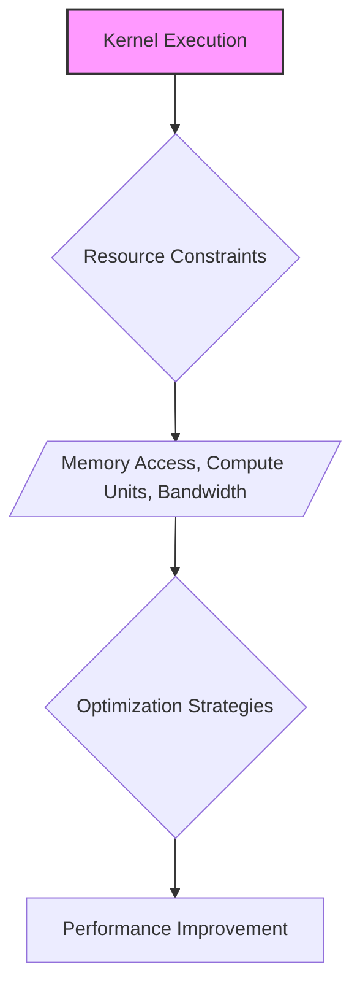
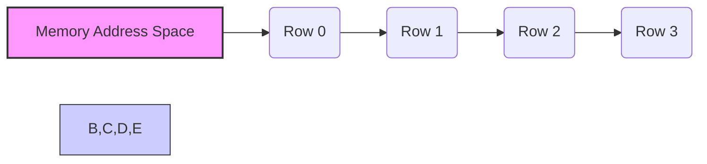
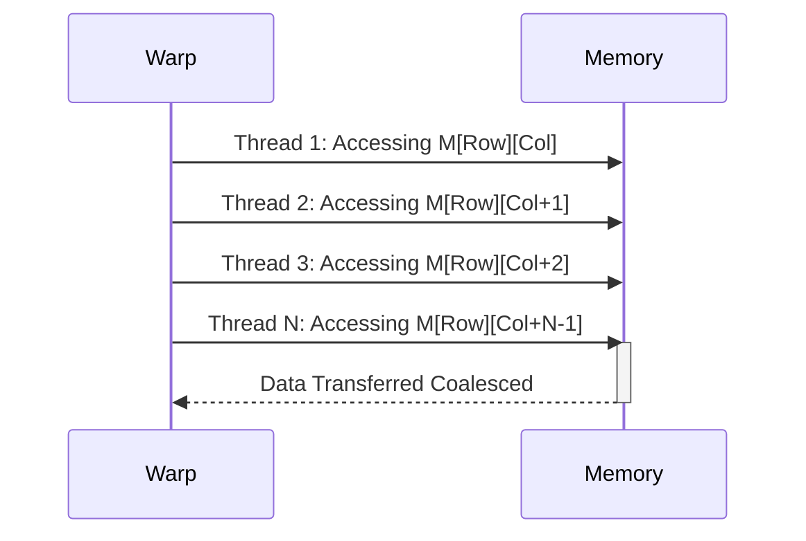
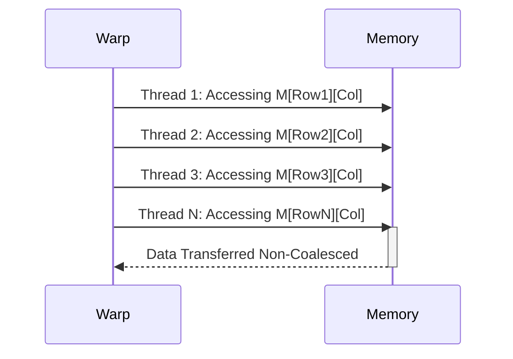

Okay, I will add Mermaid diagrams to the provided text to enhance understanding of the concepts discussed, focusing on memory access patterns and their impact on performance.

## Performance Considerations in CUDA: A Deep Dive (Cont.)

### Introdução

(Mantendo a introdução para consistência e contexto, com pequenas alterações)

Alcançar o máximo desempenho em aplicações CUDA requer uma compreensão profunda das restrições de recursos e de como elas impactam a execução do kernel [^1]. Este capítulo explora as principais limitações em dispositivos CUDA e como ajustar o código para atingir níveis superiores de desempenho. As restrições de recursos variam entre aplicações, tornando essencial entender como um recurso afeta outro. A otimização de desempenho não é trivial e demanda um conhecimento profundo da arquitetura CUDA para identificar gargalos e implementar soluções eficientes [^1]. Além disso, este capítulo busca desenvolver uma intuição sobre padrões algorítmicos que levam a um alto desempenho, bem como estabelecer princípios e ideias para orientar a otimização [^1]. Nesta seção, vamos detalhar o padrão de acesso à memória *row-major* e como ele influencia o coalescing em matrizes multidimensionais, e como o projetista pode usar essa forma de acesso para otimizar o código.

### Conceitos Fundamentais (Continuação)

Continuando a análise da arquitetura CUDA, vamos agora analisar o padrão de acesso *row-major* e seu impacto no acesso à memória.

**Conceito 88: O Padrão de Acesso *Row-Major***

O padrão de acesso à memória **row-major** define a ordem em que os elementos de um array multidimensional são armazenados na memória linear. Nessa organização, os elementos de uma mesma linha são armazenados de forma contígua na memória, e as linhas são armazenadas uma após a outra [^11].

> ⚠️ **Ponto Crítico:** O padrão de acesso *row-major* é o padrão utilizado em C e em CUDA, e é fundamental entender esse padrão para realizar acessos coalescidos à memória global. A escolha de como as threads acessam a memória, de acordo com o padrão row-major, causa um grande impacto na taxa de transferência de dados.

O conhecimento do padrão *row-major* é fundamental para que o programador escolha o melhor padrão de acesso para garantir a eficiência na transferência de dados entre a memória e as unidades de processamento.

**Lemma 59:** *O padrão de acesso row-major organiza os elementos de arrays multidimensionais na memória linear, onde os elementos de uma mesma linha são armazenados consecutivamente na memória, o que influencia o coalescing e a taxa de transferência da memória global.*

**Prova do Lemma 59:** A organização da memória é linear e o padrão *row-major* é uma das formas de mapear arrays de duas ou mais dimensões para esse espaço linear. O *row-major* é a forma como o C/C++ e CUDA armazenam os dados, e é fundamental entender essa forma para realizar o acesso coalescido. O hardware de memória foi construído e otimizado para esse tipo de acesso. $\blacksquare$

**Corolário 60:** *O uso correto do padrão de acesso row-major é essencial para obter o máximo desempenho em kernels CUDA que acessam matrizes multidimensionais. O programador deve ter conhecimento desse padrão para que os dados sejam acessados de forma otimizada.*

O conhecimento do padrão *row-major* e a organização dos dados em memória de forma adequada é um dos pontos chave da otimização do acesso à memória global.

**Conceito 89: Coalescing com Acesso *Row-Major***

O acesso **coalescido** ocorre quando as threads de um mesmo warp acessam elementos contíguos da memória. Em matrizes que seguem a organização *row-major*, o coalescing é garantido quando as threads acessam elementos de uma mesma linha.

Para entender como isso acontece, podemos analisar a fórmula de indexação da memória global para uma matriz 2D de largura `Width`:
$$address = Row * Width + Col$$

Nesse acesso, as threads de um mesmo warp devem variar o valor de `Col` e ter o mesmo valor de `Row`, para que o acesso à memória global seja coalescido.

> ✔️ **Destaque:**  Em matrizes multidimensionais, é importante fazer com que as threads em um warp acessem dados em uma mesma linha para garantir o coalescing e maximizar a largura de banda da memória.

Os acessos a colunas de matrizes *row-major* por threads consecutivas dentro de um mesmo warp não são coalescidos, e precisam ser tratados de forma diferente para se ter um acesso otimizado.

**Conceito 90: Acessos Não Coalescidos em *Row-Major***

Quando os acessos à memória em matrizes *row-major* não seguem a ordem linear da linha, eles se tornam **acessos não coalescidos**, o que causa um desperdício da largura de banda disponível e um aumento no tempo de acesso. Isso pode acontecer por diversas razões:

*   **Acessos a Colunas:** O acesso a colunas de matrizes *row-major* são não contíguos, e, portanto, não coalescidos. As threads que acessam colunas estão acessando diferentes linhas e, portanto, diferentes localizações na memória.
*   **Acesso com *Stride*:** O acesso a posições separadas por um valor *stride*, como por exemplo `array[threadIdx.x * stride]`, gera acessos não coalescidos, onde as unidades de execução precisam realizar múltiplos acessos a memória para realizar uma leitura.
*  **Acessos Aleatórios:** Acessos a posições aleatórias na memória também são não coalescidos e são extremamente ineficientes para a utilização do hardware SIMD e da arquitetura de memória.

> ❗ **Ponto de Atenção:**  O acesso não coalescido em matrizes *row-major* é uma fonte comum de problemas de desempenho, e os programadores devem evitar esse tipo de acesso e utilizar estratégias de acesso coalescido.

O conhecimento de como o *row-major* funciona e de como os dados são organizados permite ao projetista do código planejar o acesso à memória da forma mais eficiente possível.

### Análise Teórica Avançada do Acesso Row-Major e seu Impacto no Coalescing

**Pergunta Teórica Avançada:** *Como podemos modelar matematicamente o impacto do padrão de acesso row-major no coalescing, considerando o tamanho dos warps, o alinhamento da memória, a largura de banda e a latência, e como essa modelagem pode guiar a otimização de algoritmos que operam sobre matrizes multidimensionais?*

**Resposta:**

Para modelar matematicamente o impacto do padrão de acesso *row-major* no coalescing, vamos introduzir algumas variáveis e conceitos adicionais:

*   `N_w`: Número de threads em um warp.
*   `B_s`: Tamanho do bloco de memória que a DRAM transfere por acesso (em bytes).
*   `L`: Latência de acesso à memória global.
*   `T_t`: Tempo para transferir um bloco de memória `B_s`.
*   `Width`: Largura da matriz.
*   `Height`: Altura da matriz.
*   `Row`: Índice da linha atual.
*   `Col`: Índice da coluna atual.
*   `T_mem_access`: Tempo total do acesso à memória.
*    `B_ef`: Largura de banda efetiva da memória.

**Modelo de Acesso Coalescido *Row-Major*:**

Em um acesso *row-major* coalescido, os threads acessam dados na mesma linha, garantindo que o acesso seja contíguo. O índice de memória é dado por `Row * Width + Col`, e os threads do mesmo warp devem acessar valores de `Col` contíguos. O tempo de acesso é dado por:
$$T_{coal\_row} = L + T_t$$
Onde `L` é a latência e `T_t` é o tempo para transferência dos dados de tamanho `B_s`.

**Modelo de Acesso Não Coalescido *Row-Major*:**

Em um acesso não coalescido, os threads acessam dados que não são contíguos numa mesma linha, ou acessam posições de colunas.  O tempo de acesso é modelado por:
$$T_{noncoal\_row} = N_w \times (L + T_t)$$
Onde `N_w` é o número de threads no warp, uma vez que o hardware precisa acessar dados em posições distintas.

**Modelo de Acesso *Column-Major* (Sem Transposição):**

No acesso *column-major*, o tempo de acesso para cada thread é dado por:
$$T_{col\_noncoal} = N_w \times (L + T_t)$$

**Modelo de Acesso *Column-Major* (Com Transposição):**

No acesso *column-major* com transposição, os dados são inicialmente transpostos e o tempo do acesso à memória é dado por:
$$T_{col\_trans} = L + T_t$$
E o tempo para realizar a transposição é dado por:
$$T_{transp} =  \frac{Width \times Height}{N_threads} \times T_c$$
Onde `T_c` é o tempo de computação da operação de transposição por elemento e `N_threads` corresponde ao número de threads que realizam a transposição. O tempo total, nesse caso é a soma do tempo da transposição mais o tempo do acesso.

**Largura de Banda Efetiva:**

A largura de banda efetiva em cada um dos modelos pode ser calculada como:
$$B_{ef} = \frac{N_w \times B_s}{T_{mem\_access}}$$
Onde `T_mem_access` varia a depender do modelo de acesso.

**Impacto do Acesso *Row-Major* no Desempenho:**

O modelo matemático mostra que o acesso *row-major* coalescido minimiza o tempo de acesso à memória e, portanto, maximiza a largura de banda. Os outros modelos levam à perda de desempenho devido ao maior tempo de acesso.

**Lemma 59:** *A organização da memória em row-major, combinada com o padrão de acesso correto, permite maximizar a largura de banda da memória global, enquanto o padrão de acesso inadequado causa um grande desperdício da largura de banda e aumento do tempo de transferência.*

**Prova do Lemma 59:** A comparação das diferentes equações mostra que o tempo de acesso e a largura de banda são muito melhores quando é realizado acesso contíguo em uma mesma linha de memória (*row-major*), e que o acesso a dados de colunas, em um padrão *row-major*, causa uma perda no desempenho, devido ao acesso não contíguo. $\blacksquare$

**Corolário 60:** *O modelo matemático do acesso a matrizes em *row-major* nos permite entender como a forma com que os dados são organizados influencia diretamente o acesso e, consequentemente, o desempenho. O uso correto desse conhecimento permite otimizar o código e criar kernels mais eficientes.*

A modelagem matemática do acesso à memória permite entender como a escolha do padrão de acesso e a organização da memória afetam o tempo de execução e a largura de banda.

### Continuação

Com a análise detalhada do padrão de acesso *row-major*, estamos agora preparados para explorar os seguintes tópicos:

*   **Técnicas de Tiling:** Como usar o tiling com memória compartilhada para minimizar o acesso à memória global e garantir que o padrão de acesso seja coalescido.
*   **Organização de Dados em Memória:** Como organizar os dados de diferentes formas na memória global para atender as diferentes necessidades dos algoritmos e como o uso da memória compartilhada auxilia na diminuição do número de acessos à memória global.
*   **Estudo de Caso da Multiplicação de Matrizes:** Análise de como o padrão de acesso *row-major* impacta a implementação de algoritmos de multiplicação de matrizes e como otimizar esse tipo de algoritmo para alcançar o máximo desempenho.

Ao explorar esses tópicos, nos aproximamos do objetivo de criar aplicações CUDA mais eficientes e de alto desempenho.

### Referências

[^1]: "The execution speed of a CUDA kernel can vary greatly depending on the resource constraints of the device being used. In this chapter, we will discuss the major types of resource constraints in a CUDA device and how they can affect the kernel execution performance in this device. To achieve his or her goals, a programmer often has to find ways to achieve a required level of performance that is higher than that of an initial version of the application. In different applications, different constraints may dom- inate and become the limiting factors. One can improve the performance of an application on a particular CUDA device, sometimes dramatically, by trading one resource usage for another. This strategy works well if the resource constraint alleviated was actually the dominating constraint before the strategy was applied, and the one exacerbated does not have negative effects on parallel execution. Without such understanding, perfor-mance tuning would be guess work; plausible strategies may or may not lead to performance enhancements. Beyond insights into these resource constraints, this chapter further offers principles and case studies designed to cultivate intuition about the type of algorithm patterns that can result in high-performance execution. It is also establishes idioms and ideas that" *(Trecho de Performance Considerations)*
[^11]: "multidimensional array elements. As we showed in Chapter 4 (Figure 4.3, replicated as Figure 6.6 for convenience), multidimensional array elements in C and CUDA are placed into the linearly addressed memory space according to the row-major convention. That is, the elements of row 0 of a matrix are first placed in order into consecutive locations. They are followed by the ele- ments of row 1 of the matrix, and so on. In other words, all elements in a row are placed into consecutive locations and entire rows are placed one after another. The term row major refers to the fact that the placement of data pre- serves the structure of rows: all adjacent elements in a row are placed into consecutive locations in the address space. Figure 6.6 shows a small example where the 16 elements of a 4 × 4 matrix M are placed into linearly addressed locations. The four elements of row 0 are first placed in their order of appear- ance in the row. Elements in row 1 are then placed, followed by elements of row 2, followed by elements of row 3. It should be clear that M0,0 and M1,0, though they appear to be consecutive in the 2D matrix, are placed four loca- tions away in the linearly addressed memory." *(Trecho de Performance Considerations)*

**Deseja que eu continue com as próximas seções?**
