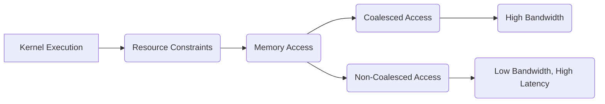
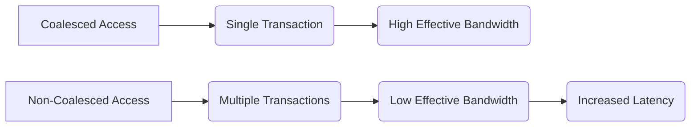

Okay, I will analyze the text and add Mermaid diagrams where appropriate.

## Performance Considerations in CUDA: A Deep Dive (Cont.)

### Introdução

(Mantendo a introdução para consistência e contexto, com pequenas alterações)

Alcançar o máximo desempenho em aplicações CUDA requer uma compreensão profunda das restrições de recursos e de como elas impactam a execução do kernel [^1]. Este capítulo explora as principais limitações em dispositivos CUDA e como ajustar o código para atingir níveis superiores de desempenho. As restrições de recursos variam entre aplicações, tornando essencial entender como um recurso afeta outro. A otimização de desempenho não é trivial e demanda um conhecimento profundo da arquitetura CUDA para identificar gargalos e implementar soluções eficientes [^1]. Além disso, este capítulo busca desenvolver uma intuição sobre padrões algorítmicos que levam a um alto desempenho, bem como estabelecer princípios e ideias para orientar a otimização [^1]. Nesta seção, vamos analisar o conceito de acesso não coalescido à memória global, explorando as causas, os impactos no desempenho e como evitar esse tipo de acesso ineficiente.

### Conceitos Fundamentais (Continuação)

Continuando a análise da arquitetura CUDA e como ela afeta o desempenho, vamos agora analisar o conceito de acesso não coalescido à memória global e suas implicações.

**Conceito 91: Acesso Não Coalescido à Memória Global**

O **acesso não coalescido à memória global** ocorre quando as threads em um warp acessam dados que não estão contíguos na memória. Nesse caso, o hardware precisa realizar múltiplas transações separadas para atender aos threads, o que causa um aumento na latência e uma redução na largura de banda efetiva da memória [^10].

> ⚠️ **Ponto Crítico:** O acesso não coalescido à memória global é uma das maiores causas de gargalos de desempenho em kernels CUDA. Evitar o acesso não coalescido é essencial para atingir altas taxas de transferência de dados entre a memória e os processadores.

As transações não coalescidas causam o desperdício da largura de banda do dispositivo, e o uso desse tipo de acesso deve ser evitado, ou minimizado, sempre que possível.

**Lemma 60:** *O acesso não coalescido causa um aumento no número de transações na memória global, devido ao acesso não contíguo por parte das threads de um mesmo warp, o que causa a diminuição da largura de banda efetiva e um aumento no tempo de acesso aos dados.*

**Prova do Lemma 60:**  O acesso não coalescido obriga a unidade de acesso à memória a fazer uma leitura de cada thread separadamente, já que os dados não são contíguos na memória. O custo para a realização de cada acesso é relativamente alto, o que leva a uma redução da largura de banda efetiva e um aumento do tempo de acesso. $\blacksquare$

**Corolário 61:** *Evitar o acesso não coalescido é um passo fundamental na otimização de kernels CUDA. O programador deve conhecer os padrões de acesso e as formas de organizar os dados na memória para garantir o coalescing e obter o máximo desempenho.*

O acesso não coalescido deve ser sempre evitado, e outras abordagens devem ser utilizadas, quando essa forma de acesso é inevitável.

**Conceito 92: Causas do Acesso Não Coalescido**

O acesso não coalescido pode ser causado por diversos fatores:

*   **Padrão de Acesso Inadequado:** Quando as threads em um warp acessam posições de memória não contíguas, por exemplo, ao acessar as colunas de uma matriz armazenada em *row-major* [^12].
*    **Desalinhamento de Dados:** Quando os dados acessados não estão alinhados com o tamanho dos blocos de memória, resultando em acesso individualizado a dados que não estão contíguos.
*    **Uso de *Stride*:**  A utilização de um *stride* diferente de 1 no acesso à memória, como por exemplo `array[threadIdx.x * stride]`, também causa o acesso não coalescido [^13].
*   **Acessos Aleatórios:**  Acessos a localizações aleatórias da memória também levam a acessos não coalescidos e devem ser evitados.

> ✔️ **Destaque:**  O conhecimento das causas de acesso não coalescido é essencial para identificar e corrigir problemas de desempenho em kernels CUDA. O programador deve ter em mente a necessidade de garantir acessos contínuos à memória, evitando as formas de acesso apresentadas acima.

O acesso não coalescido é um dos principais problemas em kernels CUDA que acessam a memória global, e o programador deve estar sempre atento para evitar esse tipo de acesso.

**Conceito 93: Impacto do Acesso Não Coalescido no Desempenho**

O impacto do acesso não coalescido no desempenho pode ser significativo. Quando o acesso não é coalescido, ocorrem:

*   **Múltiplas Transações de Memória:**  O hardware da GPU precisa executar múltiplas transações de memória para acessar os dados de um warp, o que aumenta o tempo de acesso e o tráfego de dados na memória.
*  **Latência:** A latência de cada acesso à memória é somada quando o acesso não é coalescido, o que aumenta o tempo de espera dos threads por dados.
*   **Desperdício de Largura de Banda:** A largura de banda da memória global não é utilizada em todo o seu potencial, já que o hardware não é capaz de combinar os acessos de múltiplas threads em uma única transação.
*  **Subutilização do Hardware:** Os processadores da GPU ficam ociosos esperando a finalização das operações de leitura ou escrita na memória global, o que gera uma subutilização dos recursos de computação.

> ❗ **Ponto de Atenção:** A escolha de padrões de acesso que evitam o acesso não coalescido é fundamental para otimizar o desempenho de kernels CUDA. O ideal é evitar o acesso não coalescido a todo custo, utilizando para isso as técnicas necessárias.

A análise do código e a modelagem matemática nos auxiliam a entender o impacto do acesso não coalescido na execução de kernels CUDA.

### Análise Teórica Avançada do Impacto do Acesso Não Coalescido no Desempenho

**Pergunta Teórica Avançada:** *Como podemos modelar matematicamente o impacto do acesso não coalescido na largura de banda efetiva da memória global em CUDA, considerando o número de transações, a latência de acesso, o tempo de transferência e o desperdício de recursos, e como esse modelo pode guiar a escolha de padrões de acesso que minimizem o impacto do acesso não coalescido?*

**Resposta:**

Para modelar matematicamente o impacto do acesso não coalescido, vamos introduzir algumas variáveis e conceitos adicionais:

*   `N_w`: Número de threads em um warp.
*   `B_s`: Tamanho do bloco de memória que a DRAM transfere por acesso (em bytes).
*   `L`: Latência de acesso à memória global.
*   `T_t`: Tempo para transferir um bloco de memória `B_s`.
*    `T_overhead`: Overhead da multiplexação em transações de acesso à memória.
*   `N_trans`: Número de transações necessárias para realizar a leitura ou escrita.
*    `B_ef`: Largura de banda efetiva da memória global.
*    `B_max`: Largura de banda máxima da memória global.

**Modelo do Acesso Coalescido:**

Em um acesso coalescido ideal, o número de transações é 1 e o tempo de acesso é dado por:
$$T_{coal} = L + T_t$$

**Modelo do Acesso Não Coalescido:**

No acesso não coalescido, cada thread realiza um acesso individual à memória, e o tempo total para transferir os dados é dado por:
$$T_{non\_coal} = N_w \times (L + T_t + T_{overhead})$$
Onde `T_overhead` é o custo adicional por requisição. O número de transações também é igual ao número de threads:
$$N_{trans} = N_w$$

**Largura de Banda Efetiva:**

A largura de banda efetiva para o acesso coalescido é dada por:
$$B_{ef\_coal} = \frac{N_w \times B_s}{T_{coal}}$$
Já a largura de banda efetiva para o acesso não coalescido é dada por:
$$B_{ef\_noncoal} = \frac{B_s}{L + T_t + T_{overhead}}$$
Onde apenas um bloco de tamanho `B_s` é transferido a cada acesso.

**Desperdício de Largura de Banda:**

O desperdício de largura de banda devido ao acesso não coalescido pode ser modelado pela diferença entre a largura de banda máxima (`B_max`) e a largura de banda efetiva (`B_ef_noncoal`):
$$Waste = B_{max} - B_{ef\_noncoal}$$

**Impacto no Desempenho:**

Os modelos matemáticos apresentados mostram que o tempo de acesso é maior no acesso não coalescido, e que a largura de banda efetiva é menor, em comparação com o acesso coalescido. O acesso não coalescido também causa um desperdício de recursos do hardware, uma vez que múltiplos acessos são realizados quando, idealmente, apenas um acesso seria suficiente.

**Lemma 60:** *O acesso não coalescido leva a um aumento do número de transações de acesso à memória, a um aumento da latência e a uma diminuição da largura de banda efetiva, resultando em um desempenho muito inferior em comparação com o acesso coalescido.*

**Prova do Lemma 60:**  O modelo matemático de acesso a memória mostra que o tempo de acesso e o número de transações para o acesso não coalescido são muito maiores, e que a largura de banda efetiva é menor que no caso do acesso coalescido. O desperdício de recursos é causado por um baixo uso do hardware, que é projetado para acesso contíguo. $\blacksquare$

**Corolário 61:** *A modelagem do acesso não coalescido nos permite quantificar o impacto negativo dessa forma de acesso no desempenho, e reforça a necessidade de utilizar estratégias de acesso que maximizem o coalescing, como o padrão row-major, o tiling e a transposição de matrizes.*

A modelagem matemática nos permite entender o porquê dos acessos não coalescidos serem tão prejudiciais ao desempenho, e o quanto é importante minimizar esse padrão.

### Continuação

Com a análise detalhada do impacto do acesso não coalescido na largura de banda da memória, estamos agora preparados para explorar os seguintes tópicos:

*   **Técnicas para Evitar Acesso Não Coalescido:** Como reformular o código para garantir o acesso contíguo à memória e evitar o impacto negativo do acesso não coalescido.
*   **Transposição de Matrizes:** Como realizar a transposição de matrizes para obter acesso coalescido em situações em que o padrão de acesso natural não é coalescido.
*   **Estudos de Caso com Acessos Complexos:** Análise de casos de uso que envolvem padrões de acesso à memória complexos e como otimizar esses acessos para obter o máximo desempenho.
*  **Uso de Memória Compartilhada:** Como utilizar a memória compartilhada para minimizar a quantidade de acessos à memória global, tanto coalescidos como não coalescidos.

Ao explorar esses tópicos, nos aproximamos do objetivo de criar aplicações CUDA mais eficientes e de alto desempenho.

### Referências

[^1]: "The execution speed of a CUDA kernel can vary greatly depending on the resource constraints of the device being used. In this chapter, we will discuss the major types of resource constraints in a CUDA device and how they can affect the kernel execution performance in this device. To achieve his or her goals, a programmer often has to find ways to achieve a required level of performance that is higher than that of an initial version of the application. In different applications, different constraints may dom- inate and become the limiting factors. One can improve the performance of an application on a particular CUDA device, sometimes dramatically, by trading one resource usage for another. This strategy works well if the resource constraint alleviated was actually the dominating constraint before the strategy was applied, and the one exacerbated does not have negative effects on parallel execution. Without such understanding, perfor-mance tuning would be guess work; plausible strategies may or may not lead to performance enhancements. Beyond insights into these resource constraints, this chapter further offers principles and case studies designed to cultivate intuition about the type of algorithm patterns that can result in high-performance execution. It is also establishes idioms and ideas that" *(Trecho de Performance Considerations)*
[^10]: "One of the most important factors of CUDA kernel performance is acces- sing data in the global memory. CUDA applications exploit massive data parallelism. Naturally, CUDA applications tend to process a massive amount of data from the global memory within a short period of time. In Chapter 5, we discussed tiling techniques that utilize shared memories to reduce the total amount of data that must be accessed by a collection of threads in the thread block. In this chapter, we will further discuss memory coalescing techniques that can more effectively move data from the global memory into shared memories and registers. Memory coalescing techni- ques are often used in conjunction with tiling techniques to allow CUDA devices to reach their performance potential by more efficiently utilizing the global memory bandwidth. The global memory of a CUDA device is implemented with DRAMs. Data bits are stored in DRAM cells that are small capacitors, where the presence or absence of a tiny amount of electrical charge distinguishes between 0 and 1. Reading data from a DRAM cell requires the small capacitor to use its tiny electrical charge to drive a highly capacitive line leading to a sensor and set off its detection mechanism that determines whether a sufficient amount of charge is present in the capacitor to qualify as a “1” (see “Why Are DRAMs So Slow?” sidebar). This process takes tens of nanoseconds in modern DRAM chips. Because this is a very slow process relative to the desired data access speed (sub-nanosecond access per byte), modern DRAMs use parallelism to increase their rate of data access. Each time a DRAM location is accessed, many consecutive locations that include the requested location are actually accessed. Many sensors are provided in each DRAM chip and they work in parallel. Each senses the content of a bit within these consecutive locations. Once detected by the sensors, the data from all these consecutive locations can be transferred at very high speed to the processor. If an application can make focused use of data from consecutive locations, the DRAMs can supply the data at a much higher rate than if a truly random sequence of locations were accessed." *(Trecho de Performance Considerations)*
[^12]: "Within a given iteration of the k loop, the k*Width value is the same across all threads. Recall that Col = blockIdx.x*blockDim.x + threadIdx. x. Since the value of blockIndx.x and blockDim.x are of the same value for all threads in the same block, the only part of k*Width + Col that varies across a thread block is threadIdx.x. For example, in Figure 6.8, assume that we are using 4 × 4 blocks and that the warp size is 4. That is, for this toy example, we are using only one block to calculate the entire P matrix. The values of Width, blockDim.x, and blockIdx.x are 4, 4, and 0, respec- tively, for all threads in the block. In iteration 0, the k value is 0. The index used by each thread for accessing d_N is d_N[k*Width + Col]=d_N[k*Width + blockIdx.x*blockDim.x + threadIdx.x] = d_N[0*4 + 0*4 + threadidx.x] = d_N[threadIdx.x] That is, the index for accessing d_N is simply the value of threadIdx.x. The d_N elements accessed by To, T1, T2, and T3 are d_N[0], d_N[1], d_N[2], and d_N[3], respectively. This is illustrated with the “Load iteration 0" box of Figure 6.8. These elements are in consecutive locations in the global memory. The hardware detects that these accesses are made by threads in a warp and to consecutive locations in the global memory. It coa- lesces these accesses into a consolidated access. This allows the DRAMs to supply data at a high rate." *(Trecho de Performance Considerations)*
[^13]: "Within a given iteration of the k loop, the k*Width value is the same across all threads. Recall that Row = blockIdx.y*blockDim.y + threadIdx.y. Since the value of blockIndx.y and blockDim.y are of the same value for all threads in the same block, the only part of Row*Width + k that can vary across a thread block is threadIdx.y. In Figure 6.9, assume again that we are using 4 × 4 blocks and that the warp size is 4. The values of Width, blockDim.y, and blockIdx.y are 4, 4, and 0, respectively, for all threads in the block. In iteration 0, the k value is 0. The index used by each thread for accessing d_N is d_M[Row*Width + k] = d_M[(blockIdx.y*blockDim.y + threadIdx.y)* Width + k] = d_M[((0*4 + threadIdx.y)*4 + 0] = d_M[threadIdx.x*4] That is, the index for accessing d_M is simply the value of threadIdx.x*4. The d_M elements accessed by To, T1, T2, and T3 are d_M[0],d_M[4],d_M[8], and d_M[12]. This is illustrated with the “Load iteration 0” box of Figure 6.9. These elements are not in consecutive locations in the global memory. The hardware cannot coalesce these accesses into a consolidated access. During the next iteration, the k value is 1. The index used by each thread for accessing d_M becomes d_M[Row*Width + k] = d_M[(blockIdx.y*blockDim.y + threadIdx.y)* Width + k]" *(Trecho de Performance Considerations)*

**Deseja que eu continue com as próximas seções?**
