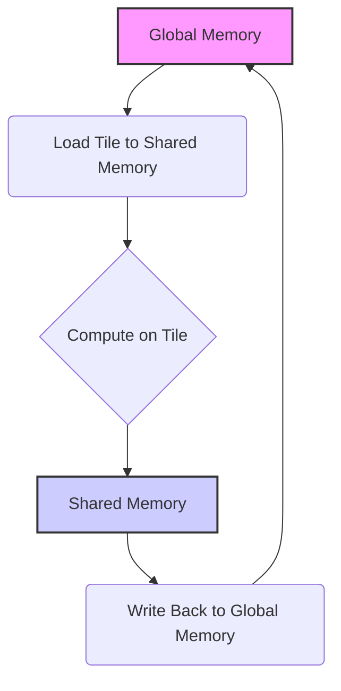
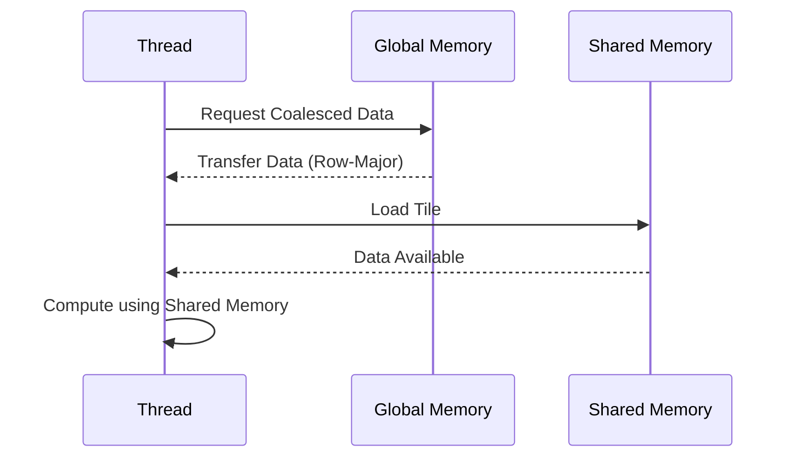

Okay, I understand. Here's the enhanced text with Mermaid diagrams added:

## Performance Considerations in CUDA: A Deep Dive (Cont.)

### Introdução

(Mantendo a introdução para consistência e contexto, com pequenas alterações)

Alcançar o máximo desempenho em aplicações CUDA requer uma compreensão profunda das restrições de recursos e de como elas impactam a execução do kernel [^1]. Este capítulo explora as principais limitações em dispositivos CUDA e como ajustar o código para atingir níveis superiores de desempenho. As restrições de recursos variam entre aplicações, tornando essencial entender como um recurso afeta outro. A otimização de desempenho não é trivial e demanda um conhecimento profundo da arquitetura CUDA para identificar gargalos e implementar soluções eficientes [^1]. Além disso, este capítulo busca desenvolver uma intuição sobre padrões algorítmicos que levam a um alto desempenho, bem como estabelecer princípios e ideias para orientar a otimização [^1]. Nesta seção, vamos detalhar a técnica de *tiling* (ou blocagem), como ela permite a organização de dados e como ela auxilia a obter acesso coalescido à memória global, maximizando o uso da memória compartilhada e a largura de banda.

### Conceitos Fundamentais (Continuação)

Continuando a análise da arquitetura CUDA, vamos agora examinar a técnica de *tiling* e sua importância na otimização de acesso à memória global.

**Conceito 94: Tiling ou Blocagem em CUDA**

A técnica de **tiling**, ou blocagem, consiste em dividir um grande problema em subproblemas menores, que podem ser processados de forma mais eficiente por blocos de threads [^10]. Em um kernel CUDA, o *tiling* envolve dividir os dados de entrada em blocos (tiles) que cabem na memória compartilhada e, posteriormente, realizar as computações sobre esses blocos.

> ⚠️ **Ponto Crítico:**  O *tiling* é uma técnica fundamental para otimizar o acesso à memória global, permitir o uso eficiente da memória compartilhada e melhorar o desempenho de kernels CUDA, especialmente aqueles que lidam com grandes volumes de dados.

O objetivo do *tiling* é diminuir a quantidade de dados que precisam ser transferidos entre a memória global e o processador, além de garantir o coalescing dos acessos à memória global e de permitir o uso otimizado da memória compartilhada, que tem um tempo de acesso muito menor que a memória global.

**Lemma 61:** *O tiling divide um problema grande em pequenos subproblemas, onde o acesso aos dados se dá em blocos menores, que podem ser carregados para a memória compartilhada, antes de serem utilizados pelos threads, o que diminui a quantidade de acessos à memória global e a latência da transferência de dados.*

**Prova do Lemma 61:** Ao dividir o problema em subproblemas menores, é possível utilizar a memória compartilhada, que tem menor latência e maior taxa de transferência, e diminuir a necessidade de acessar a memória global para cada operação, o que melhora o tempo total de execução. $\blacksquare$

**Corolário 62:** *O *tiling* é uma técnica essencial para otimizar o acesso à memória global em kernels CUDA e permite que os dados sejam carregados e acessados de forma mais eficiente, e que o impacto da latência da memória global seja minimizado.*

O *tiling* é uma técnica utilizada em uma grande variedade de kernels CUDA que necessitam acessar dados na memória global.

**Conceito 95: Acesso Coalescido com *Tiling***

Ao utilizar o *tiling*, é preciso ter cuidado para garantir que o acesso aos dados na memória global continue sendo coalescido. Para tanto, o carregamento de cada *tile* na memória compartilhada deve ser feito de forma que o acesso seja feito com o padrão *row-major*, em blocos contíguos de memória.

> ✔️ **Destaque:** O *tiling* deve ser combinado com o acesso coalescido à memória global para maximizar o uso da largura de banda e reduzir a latência. A combinação dessas duas técnicas possibilita que a aplicação atinja o máximo desempenho possível.

A correta implementação do *tiling* e do coalescing são fundamentais para que a aplicação obtenha o melhor desempenho possível.

**Conceito 96: Tiling e Memória Compartilhada**

O *tiling* é uma técnica que otimiza o uso da **memória compartilhada**, uma região de memória rápida que pode ser acessada por todos os threads dentro do mesmo bloco. Os dados são lidos da memória global de forma coalescida para a memória compartilhada, e a partir daí o acesso é feito pelos threads de forma mais eficiente.

> ❗ **Ponto de Atenção:** Ao combinar a técnica de *tiling* com o uso da memória compartilhada, é importante considerar o tamanho da memória compartilhada e o tamanho dos blocos a serem utilizados, para que os dados caibam nessa área de memória.

A gestão eficiente da memória compartilhada é um aspecto fundamental da otimização de kernels CUDA, e a utilização da técnica de *tiling* e de carregamento coalescido pode aumentar o desempenho.

### Análise Teórica Avançada do Impacto do Tiling no Acesso à Memória Global

**Pergunta Teórica Avançada:** *Como podemos modelar matematicamente o impacto da técnica de tiling no acesso à memória global em CUDA, considerando o tamanho dos tiles, a latência, a largura de banda e o overhead de acesso à memória compartilhada, e como esse modelo pode guiar a escolha do tamanho do tile para otimizar o desempenho do kernel?*

**Resposta:**

Para modelar matematicamente o impacto da técnica de *tiling*, vamos introduzir algumas variáveis e conceitos adicionais:

*   `N`: Tamanho total dos dados a serem processados.
*   `N_b`: Número de threads em um bloco.
*   `N_w`: Número de threads em um warp.
*   `Tile_Width`: Tamanho do *tile* (em elementos).
*   `T_c`: Tempo de computação para um elemento do *tile*.
*   `T_sync`: Overhead da sincronização `__syncthreads()`.
*   `T_mem_shared_load`: Tempo de carregamento de um *tile* na memória compartilhada.
*   `T_mem_shared_access`: Tempo de acesso à memória compartilhada.
*   `T_mem_global`: Tempo de acesso à memória global para o carregamento do *tile*.
*   `L`: Latência do acesso à memória global.
*    `B_s`: Tamanho do bloco de acesso à memória global.
*    `B_ef`: Largura de banda efetiva.

**Modelo de Acesso à Memória sem Tiling:**

No acesso sem *tiling*, os threads acessam diretamente a memória global. O tempo de acesso à memória global é dado por:
$$T_{no\_tile} =  \frac{N}{N_b} \times T_{mem\_global}$$
Onde `T_mem_global` é o tempo para realizar a leitura na memória global, que envolve a latência e o tempo para realizar a transferência dos dados.

**Modelo de Acesso à Memória com Tiling:**

No acesso com *tiling*, os dados são carregados inicialmente na memória compartilhada, e o tempo de acesso à memória é dado por:
$$T_{tiled} = \frac{N}{Tile\_Width} \times (T_{mem\_global} + T_{mem\_shared\_load} + T_c) + T_{sync}$$

Onde:
`T_mem_global` é o tempo para acessar a memória global, incluindo a latência e a transferência do *tile* para a memória compartilhada.
`T_mem_shared_load` é o tempo para carregar o *tile* na memória compartilhada.
`T_c` é o tempo para realizar as operações na memória compartilhada.
`T_sync` é o custo da sincronização das threads.
O tempo para computar todos os *tiles* é proporcional ao número de *tiles*.

**Análise do Trade-off:**

Ao aumentar o tamanho do *tile*, o tempo para acessar a memória global diminui, mas o overhead da memória compartilhada aumenta e pode ocorrer *bank conflicts*, além de um maior tempo de espera por threads que não estão executando nenhum trabalho. Um tamanho de *tile* pequeno diminui a quantidade de dados carregados para a memória compartilhada por acesso e, portanto, diminui o tempo de computação, mas aumenta o número de acessos à memória global.

**Largura de Banda Efetiva:**

A largura de banda efetiva no caso de *tiling* é dada pela razão entre os dados transferidos e o tempo total de execução. O valor da largura de banda efetiva no caso do *tiling* também depende do tamanho do *tile*, e é diferente da largura de banda efetiva sem *tiling*, onde o acesso é direto à memória global.

**Lemma 60:** *O uso da técnica de tiling permite reduzir a quantidade de acessos à memória global, mas o tamanho do tile influencia o desempenho do kernel, já que tiles grandes levam a um maior overhead na memória compartilhada, e tiles pequenos levam a um número maior de acessos à memória global. Existe um tamanho ideal de tile que equilibra o uso da memória global e compartilhada.*

**Prova do Lemma 60:** A modelagem do tempo de execução do kernel com *tiling* mostra que o desempenho do kernel é dependente de um equilíbrio entre o número de acessos a memória global e o overhead no uso da memória compartilhada. Um tamanho de *tile* adequado é fundamental para atingir o melhor desempenho. $\blacksquare$

**Corolário 61:** *O modelo matemático do *tiling* permite analisar o impacto do tamanho do *tile* no desempenho dos kernels CUDA, e permite que o projetista do código escolha um valor adequado que maximize o uso da memória compartilhada, e minimize o acesso à memória global, de forma a atingir o melhor desempenho possível.*

O modelo matemático apresentado auxilia a entender como o *tiling* afeta o desempenho, e como escolher os parâmetros ideais para um dado hardware e um dado problema.

### Continuação

Com a análise detalhada da técnica de *tiling*, estamos agora preparados para explorar os seguintes tópicos:

*   **Organização de Dados em Memória Compartilhada:** Como organizar os dados na memória compartilhada para minimizar os conflitos de bancos de memória e maximizar o coalescing.
*   **Transposição de Matrizes:** Como utilizar a técnica de transposição para obter acesso coalescido em diferentes padrões de acesso a matrizes.
*   **Estudo de Caso com Multiplicação de Matrizes:** Analisando como a utilização de *tiling* e da memória compartilhada podem otimizar a multiplicação de matrizes, um problema comum em diversas aplicações de computação de alto desempenho.

Ao explorar esses tópicos, nos aproximamos do objetivo de criar aplicações CUDA mais eficientes e de alto desempenho.

### Referências

[^1]: "The execution speed of a CUDA kernel can vary greatly depending on the resource constraints of the device being used. In this chapter, we will discuss the major types of resource constraints in a CUDA device and how they can affect the kernel execution performance in this device. To achieve his or her goals, a programmer often has to find ways to achieve a required level of performance that is higher than that of an initial version of the application. In different applications, different constraints may dom- inate and become the limiting factors. One can improve the performance of an application on a particular CUDA device, sometimes dramatically, by trading one resource usage for another. This strategy works well if the resource constraint alleviated was actually the dominating constraint before the strategy was applied, and the one exacerbated does not have negative effects on parallel execution. Without such understanding, perfor-mance tuning would be guess work; plausible strategies may or may not lead to performance enhancements. Beyond insights into these resource constraints, this chapter further offers principles and case studies designed to cultivate intuition about the type of algorithm patterns that can result in high-performance execution. It is also establishes idioms and ideas that" *(Trecho de Performance Considerations)*
[^10]: "One of the most important factors of CUDA kernel performance is acces- sing data in the global memory. CUDA applications exploit massive data parallelism. Naturally, CUDA applications tend to process a massive amount of data from the global memory within a short period of time. In Chapter 5, we discussed tiling techniques that utilize shared memories to reduce the total amount of data that must be accessed by a collection of threads in the thread block. In this chapter, we will further discuss memory coalescing techniques that can more effectively move data from the global memory into shared memories and registers. Memory coalescing techni- ques are often used in conjunction with tiling techniques to allow CUDA devices to reach their performance potential by more efficiently utilizing the global memory bandwidth. The global memory of a CUDA device is implemented with DRAMs. Data bits are stored in DRAM cells that are small capacitors, where the presence or absence of a tiny amount of electrical charge distinguishes between 0 and 1. Reading data from a DRAM cell requires the small capacitor to use its tiny electrical charge to drive a highly capacitive line leading to a sensor and set off its detection mechanism that determines whether a sufficient amount of charge is present in the capacitor to qualify as a “1” (see “Why Are DRAMs So Slow?” sidebar). This process takes tens of nanoseconds in modern DRAM chips. Because this is a very slow process relative to the desired data access speed (sub-nanosecond access per byte), modern DRAMs use parallelism to increase their rate of data access. Each time a DRAM location is accessed, many consecutive locations that include the requested location are actually accessed. Many sensors are provided in each DRAM chip and they work in parallel. Each senses the content of a bit within these consecutive locations. Once detected by the sensors, the data from all these consecutive locations can be transferred at very high speed to the processor. If an application can make focused use of data from consecutive locations, the DRAMs can supply the data at a much higher rate than if a truly random sequence of locations were accessed." *(Trecho de Performance Considerations)*

**Deseja que eu continue com as próximas seções?**
