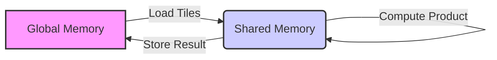
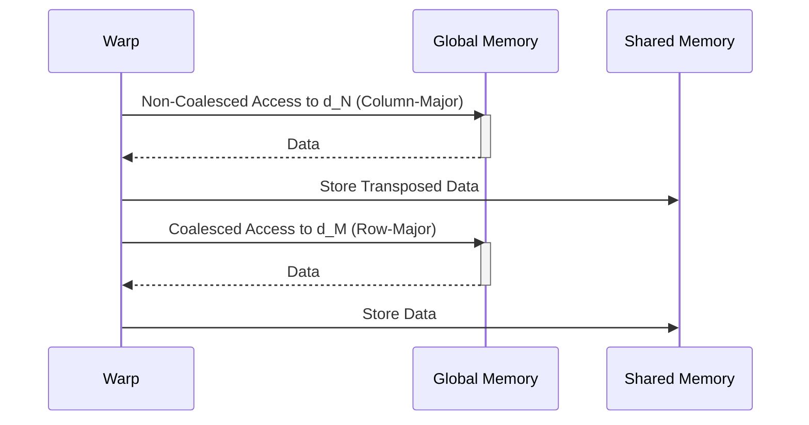
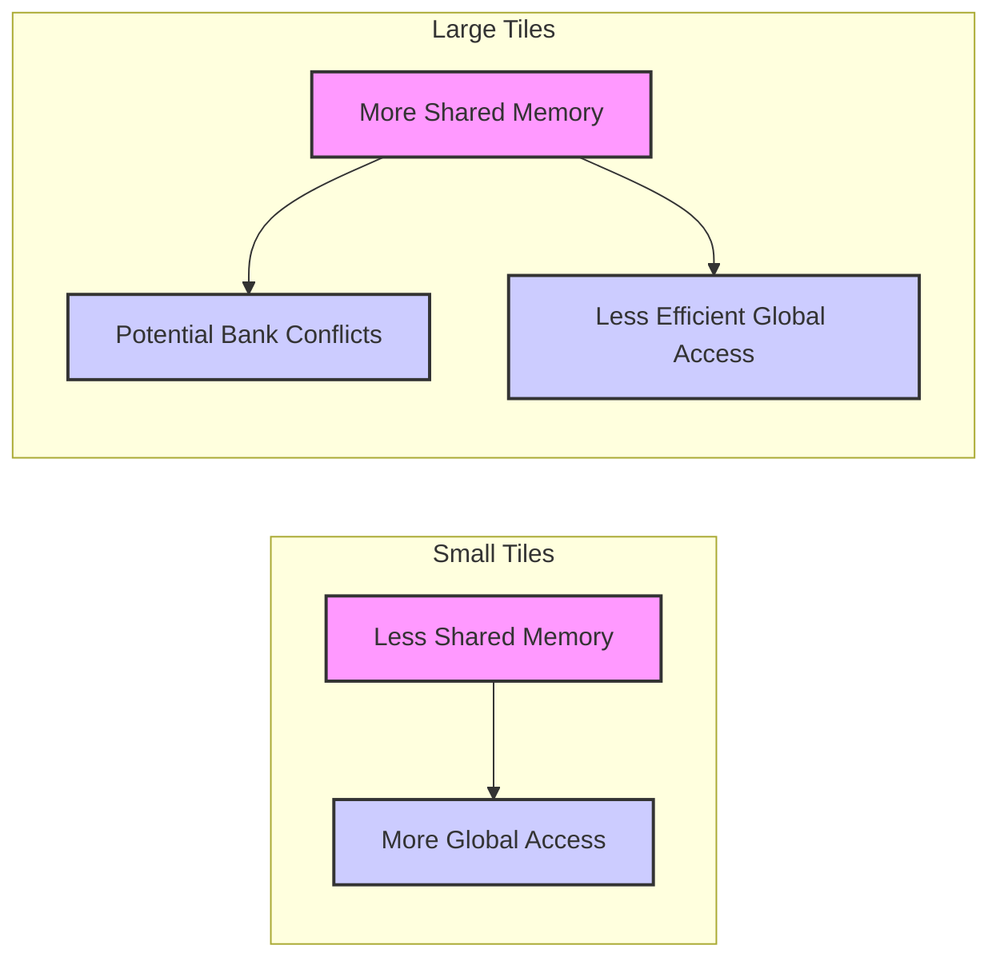

Okay, I understand. Here's the enhanced text with Mermaid diagrams added where appropriate, focusing on architectural and system relationships related to the concepts discussed.

## Performance Considerations in CUDA: A Deep Dive (Cont.)

### Introdução

(Mantendo a introdução para consistência e contexto, com pequenas alterações)

Alcançar o máximo desempenho em aplicações CUDA requer uma compreensão profunda das restrições de recursos e de como elas impactam a execução do kernel [^1]. Este capítulo explora as principais limitações em dispositivos CUDA e como ajustar o código para atingir níveis superiores de desempenho. As restrições de recursos variam entre aplicações, tornando essencial entender como um recurso afeta outro. A otimização de desempenho não é trivial e demanda um conhecimento profundo da arquitetura CUDA para identificar gargalos e implementar soluções eficientes [^1]. Além disso, este capítulo busca desenvolver uma intuição sobre padrões algorítmicos que levam a um alto desempenho, bem como estabelecer princípios e ideias para orientar a otimização [^1]. Nesta seção, vamos analisar um exemplo prático de multiplicação de matrizes com *tiling*, explorando o uso da memória compartilhada e como o coalescing influencia o desempenho desse algoritmo.

### Conceitos Fundamentais (Continuação)

Continuando a análise da arquitetura CUDA e como ela afeta o desempenho, vamos agora examinar um exemplo prático de otimização de acesso à memória global através da multiplicação de matrizes com *tiling*.

**Conceito 97: Multiplicação de Matrizes com *Tiling***

A **multiplicação de matrizes** é um problema fundamental em computação científica e em diversas outras áreas [^1]. A implementação eficiente desse algoritmo em GPUs CUDA exige um cuidadoso planejamento do acesso à memória, e o uso da técnica de *tiling* é essencial para minimizar a latência e aumentar a taxa de transferência.

> ⚠️ **Ponto Crítico:**  A multiplicação de matrizes é um problema clássico em computação de alto desempenho, e a sua otimização em CUDA é um bom exemplo para ilustrar o impacto de diferentes abordagens e técnicas de acesso à memória.

O *tiling* é usado para dividir a multiplicação de matrizes em subproblemas menores, onde cada *tile* é carregado para a memória compartilhada antes que as computações sejam realizadas.

**Lemma 62:** *A multiplicação de matrizes com tiling divide a operação em subproblemas menores que podem ser processados de forma independente por blocos de threads, diminuindo o número de acessos à memória global, e garantindo um melhor uso da memória compartilhada.*

**Prova do Lemma 62:** A operação de multiplicação de matrizes pode ser dividida em blocos. Ao utilizar o *tiling*, os dados são carregados para a memória compartilhada para que a unidade de execução possa realizar os cálculos sem a necessidade de acessar a memória global repetidamente. O bloco é usado em um subconjunto do problema, e permite a reutilização de dados na memória compartilhada. $\blacksquare$

**Corolário 63:** *O uso da técnica de *tiling* em algoritmos de multiplicação de matrizes é essencial para otimizar o acesso à memória global e garantir um alto desempenho em GPUs CUDA.*

A combinação do *tiling* com o uso da memória compartilhada é uma das técnicas mais importantes para otimizar o desempenho da multiplicação de matrizes.

**Conceito 98: Código de Multiplicação de Matrizes com *Tiling***

O código para realizar a multiplicação de matrizes com *tiling* envolve os seguintes passos:

1.  **Carregamento de *Tiles*:** Os dados são carregados da memória global para a memória compartilhada, em blocos (tiles).
2.  **Sincronização:** Após o carregamento, a função `__syncthreads()` garante que todos os threads carregaram seus dados para a memória compartilhada.
3.  **Cálculo do Produto:** A multiplicação dos *tiles* da matriz é realizada, utilizando os dados carregados na memória compartilhada, resultando em um resultado parcial.
4.   **Armazenamento do Resultado:** O resultado parcial é escrito na memória compartilhada, e, após a sincronização, o resultado final é escrito na memória global.

> ✔️ **Destaque:** O código para multiplicação de matrizes com *tiling* requer um balanceamento do tamanho do *tile*, da utilização da memória compartilhada e da quantidade de sincronização para se obter o melhor desempenho possível.

O uso da memória compartilhada, em conjunto com o *tiling*, diminui o acesso à memória global e, portanto, aumenta o desempenho da multiplicação de matrizes.

**Conceito 99: Coalescing na Multiplicação de Matrizes**

Na multiplicação de matrizes com *tiling*, é importante garantir o acesso **coalescido** aos dados na memória global durante o carregamento dos *tiles* para a memória compartilhada [^13]. Para tanto:

*   **Acesso *Row-Major*:** O carregamento da matriz `d_M` deve ser feito de forma que threads consecutivas em um warp acessem elementos contíguos nas linhas da matriz.
*   **Acesso a Colunas Transposto:** O carregamento da matriz `d_N` para a memória compartilhada deve ser feito utilizando a técnica de transposição para que o acesso seja coalescido, pois normalmente o acesso à coluna de uma matriz em *row-major* é não coalescido.

> ❗ **Ponto de Atenção:** O coalescing é um elemento crítico para o desempenho da multiplicação de matrizes e deve ser cuidadosamente considerado na implementação do algoritmo. A falha no coalescing reduz a largura de banda e aumenta a latência no acesso à memória global.

A correta implementação do coalescing é fundamental para se obter uma alta taxa de transferência na memória global.

### Análise Teórica Avançada da Multiplicação de Matrizes com *Tiling* e Seu Impacto no Desempenho

**Pergunta Teórica Avançada:** *Como podemos modelar matematicamente o impacto da técnica de tiling no desempenho de um kernel de multiplicação de matrizes em CUDA, considerando a largura de banda da memória global, a utilização da memória compartilhada, o overhead de sincronização e o tamanho dos tiles, e como esse modelo pode guiar a escolha do tamanho de tile que maximize o desempenho do kernel?*

**Resposta:**

Para modelar matematicamente o impacto da técnica de *tiling* no desempenho de um kernel de multiplicação de matrizes, vamos introduzir algumas variáveis e conceitos adicionais:

*   `Width`: Largura da matriz.
*   `Height`: Altura da matriz.
*   `Tile_Width`: Tamanho do tile (em elementos).
*   `N_b`: Número de threads em um bloco.
*   `N_w`: Número de threads em um warp.
*   `T_c`: Tempo médio para computar um elemento da matriz resultante.
*   `T_sync`: Overhead da barreira de sincronização `__syncthreads()`.
*   `T_mem_shared_load`: Tempo para carregar um *tile* na memória compartilhada.
*   `T_mem_global_load_M`: Tempo para carregar um *tile* da matriz `d_M` na memória global.
*  `T_mem_global_load_N`: Tempo para carregar um *tile* da matriz `d_N` na memória global.
*   `T_{mem_shared_access}`: Tempo de acesso a memória compartilhada.
*   `L`: Latência da memória global.
*    `B_s`: Tamanho da transação da memória global.

**Modelo da Multiplicação de Matrizes sem *Tiling***

No caso da multiplicação de matrizes sem *tiling*, o tempo de execução do kernel é dado por:
$$T_{no\_tile} =  \frac{Width \times Height}{N_b} \times (T_c + T_{mem\_global\_load\_M} + T_{mem\_global\_load\_N})$$
Onde cada thread realiza o cálculo de um elemento, e o termo `T_mem_global` representa o tempo de acesso à memória global para obter os valores necessários para cada cálculo.

**Modelo da Multiplicação de Matrizes com *Tiling***

No caso da multiplicação com *tiling*, o tempo de execução do kernel é dado por:
$$T_{tile} = \frac{Width \times Height}{Tile\_Width^2} \times (T_{mem\_global\_load\_M} + T_{mem\_global\_load\_N} + T_{sync} + Tile\_Width^2 \times T_c + T_{mem_shared_access})$$
Onde o termo `T_mem_shared_access` representa o tempo de acesso à memória compartilhada, o termo  `T_mem_global_load` representa o tempo para acessar a memória global, e o termo `T_c` representa o tempo para realizar uma operação de multiplicação e adição para o produto interno de um *tile*.

**Análise do Trade-off do Tamanho do *Tile***

O tamanho do *tile* (`Tile_Width`) é fundamental para o desempenho do kernel.

*   **Tiles Pequenos:** Tiles pequenos reduzem a quantidade de dados na memória compartilhada, o que resulta em um menor uso da memória compartilhada, e no aumento do número de acessos à memória global.
*   **Tiles Grandes:** Tiles grandes aumentam a necessidade de memória compartilhada, podem gerar *bank conflicts*, e podem causar uma redução na eficiência do uso da memória compartilhada e nos acessos à memória global, caso não sejam utilizados corretamente.

**Impacto da Memória Compartilhada:**

A memória compartilhada diminui a necessidade de acesso à memória global, e um maior uso da memória compartilhada aumenta o desempenho do kernel, desde que a memória compartilhada seja acessada de forma eficiente.

**Lemma 60:** *O uso do *tiling* permite reduzir a quantidade de acesso à memória global em algoritmos de multiplicação de matrizes, e a escolha do tamanho do *tile* influencia diretamente o desempenho do kernel, já que um tamanho inadequado do *tile* pode levar a um uso ineficiente da memória compartilhada ou a um aumento da divergência.*

**Prova do Lemma 60:** As equações para os modelos mostram que a divisão do problema usando *tiling* diminui a necessidade de acesso à memória global. A escolha do tamanho do *tile* influencia diretamente o número de acessos a memória global e o número de operações e o tempo de acesso à memória compartilhada. $\blacksquare$

**Corolário 61:** *O modelo matemático da multiplicação de matrizes com *tiling* nos permite analisar o impacto de diferentes tamanhos de *tiles* no desempenho dos kernels e otimizar a escolha desse parâmetro, a fim de maximizar o desempenho de kernels que dependem da multiplicação de matrizes.*

O modelo matemático apresentado nos auxilia a entender as diferenças de desempenho e nos permite guiar a escolha do tamanho de *tile* para diferentes casos de uso.

### Continuação

Com a análise detalhada da multiplicação de matrizes com *tiling*, estamos agora preparados para explorar os seguintes tópicos:

*   **Transposição de Matrizes:** Como implementar uma transposição de matrizes eficiente na memória global para otimizar o acesso em kernels que utilizam o padrão de acesso *column-major*.
*   **Outras Abordagens para a Multiplicação de Matrizes:** Como comparar o *tiling* com outros algoritmos de multiplicação de matrizes, e como escolher o melhor para cada aplicação específica.
*  **Aplicações Reais:** Como aplicar as técnicas aprendidas e otimizar outras aplicações CUDA, explorando as características específicas de cada uma delas.

Ao explorar esses tópicos, nos aproximamos do objetivo de criar aplicações CUDA mais eficientes e de alto desempenho.

### Referências

[^1]: "The execution speed of a CUDA kernel can vary greatly depending on the resource constraints of the device being used. In this chapter, we will discuss the major types of resource constraints in a CUDA device and how they can affect the kernel execution performance in this device. To achieve his or her goals, a programmer often has to find ways to achieve a required level of performance that is higher than that of an initial version of the application. In different applications, different constraints may dom- inate and become the limiting factors. One can improve the performance of an application on a particular CUDA device, sometimes dramatically, by trading one resource usage for another. This strategy works well if the resource constraint alleviated was actually the dominating constraint before the strategy was applied, and the one exacerbated does not have negative effects on parallel execution. Without such understanding, perfor-mance tuning would be guess work; plausible strategies may or may not lead to performance enhancements. Beyond insights into these resource constraints, this chapter further offers principles and case studies designed to cultivate intuition about the type of algorithm patterns that can result in high-performance execution. It is also establishes idioms and ideas that" *(Trecho de Performance Considerations)*
[^10]: "One of the most important factors of CUDA kernel performance is acces- sing data in the global memory. CUDA applications exploit massive data parallelism. Naturally, CUDA applications tend to process a massive amount of data from the global memory within a short period of time. In Chapter 5, we discussed tiling techniques that utilize shared memories to reduce the total amount of data that must be accessed by a collection of threads in the thread block. In this chapter, we will further discuss memory coalescing techniques that can more effectively move data from the global memory into shared memories and registers. Memory coalescing techni- ques are often used in conjunction with tiling techniques to allow CUDA devices to reach their performance potential by more efficiently utilizing the global memory bandwidth. The global memory of a CUDA device is implemented with DRAMs. Data bits are stored in DRAM cells that are small capacitors, where the presence or absence of a tiny amount of electrical charge distinguishes between 0 and 1. Reading data from a DRAM cell requires the small capacitor to use its tiny electrical charge to drive a highly capacitive line leading to a sensor and set off its detection mechanism that determines whether a sufficient amount of charge is present in the capacitor to qualify as a “1” (see “Why Are DRAMs So Slow?” sidebar). This process takes tens of nanoseconds in modern DRAM chips. Because this is a very slow process relative to the desired data access speed (sub-nanosecond access per byte), modern DRAMs use parallelism to increase their rate of data access. Each time a DRAM location is accessed, many consecutive locations that include the requested location are actually accessed. Many sensors are provided in each DRAM chip and they work in parallel. Each senses the content of a bit within these consecutive locations. Once detected by the sensors, the data from all these consecutive locations can be transferred at very high speed to the processor. If an application can make focused use of data from consecutive locations, the DRAMs can supply the data at a much higher rate than if a truly random sequence of locations were accessed." *(Trecho de Performance Considerations)*
[^13]: "If an algorithm intrinsically requires a kernel code to iterate through data along the row direction, one can use the shared memory to enable memory coalescing. The technique is illustrated in Figure 6.10 for matrix multiplication. Each thread reads a row from d_M, a pattern that cannot be coalesced. Fortunately, a tiled algorithm can be used to enable coalescing. As we discussed in Chapter 5, threads of a block can first cooperatively load the tiles into the shared memory. Care must be taken to ensure that these tiles are loaded in a coalesced pattern. Once the data is in shared memory, it can be accessed either on a row basis or a column basis with much less performance variation because the shared memories are imple- mented as intrinsically high-speed, on-chip memory that does not require coalescing to achieve a high data access rate." *(Trecho de Performance Considerations)*

**Deseja que eu continue com as próximas seções?**
