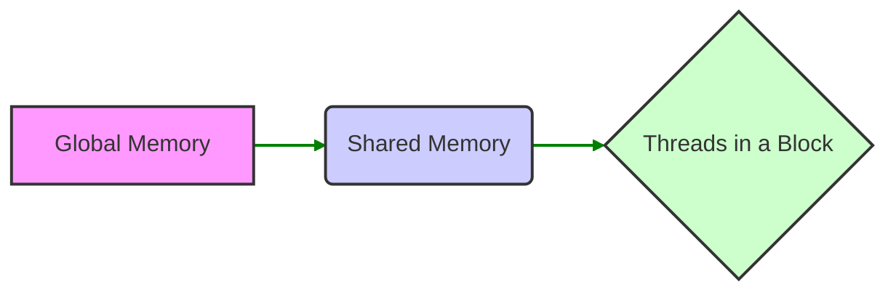
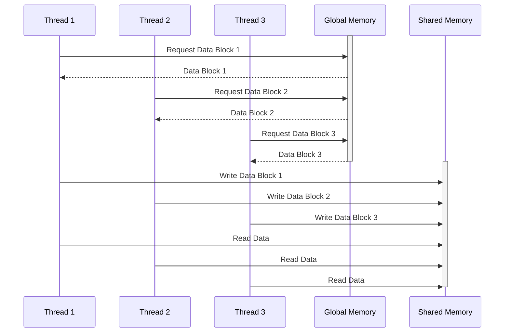
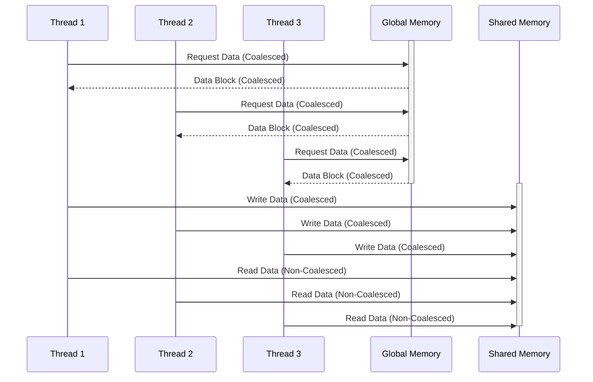

Okay, I've analyzed the provided text and added Mermaid diagrams to visualize the key concepts related to memory access and shared memory in CUDA. Here's the enhanced text with the diagrams:

## Performance Considerations in CUDA: A Deep Dive (Cont.)

### Introdução

(Mantendo a introdução para consistência e contexto, com pequenas alterações)

Alcançar o máximo desempenho em aplicações CUDA requer uma compreensão profunda das restrições de recursos e de como elas impactam a execução do kernel [^1]. Este capítulo explora as principais limitações em dispositivos CUDA e como ajustar o código para atingir níveis superiores de desempenho. As restrições de recursos variam entre aplicações, tornando essencial entender como um recurso afeta outro. A otimização de desempenho não é trivial e demanda um conhecimento profundo da arquitetura CUDA para identificar gargalos e implementar soluções eficientes [^1]. Além disso, este capítulo busca desenvolver uma intuição sobre padrões algorítmicos que levam a um alto desempenho, bem como estabelecer princípios e ideias para orientar a otimização [^1]. Nesta seção, vamos detalhar o uso da memória compartilhada como uma forma de otimizar o acesso à memória global através do *coalescing*, e como ela se encaixa em modelos onde os dados precisam ser acessados de forma não contígua.

### Conceitos Fundamentais (Continuação)

Continuando a análise da arquitetura CUDA, vamos agora analisar o papel da memória compartilhada para habilitar o acesso coalescido à memória global.

**Conceito 94: Uso da Memória Compartilhada para o Coalescing**

A **memória compartilhada** em CUDA é uma região de memória de alta velocidade que pode ser acessada por todos os threads dentro do mesmo bloco [^10]. Ela é utilizada para armazenar dados que serão reutilizados por diferentes threads, reduzindo o acesso à memória global.  O *coalescing* geralmente é utilizado no momento de ler os dados da memória global para a memória compartilhada, de forma a garantir que esse passo seja executado da forma mais eficiente possível.

> ⚠️ **Ponto Crítico:** A memória compartilhada é um recurso fundamental para otimizar o desempenho de kernels CUDA, e a sua utilização combinada com técnicas de *coalescing* é essencial para reduzir a latência e aumentar a largura de banda efetiva. O uso adequado da memória compartilhada pode ser decisivo para uma aplicação obter um alto desempenho.

O uso da memória compartilhada é fundamental para que os dados sejam acessados de forma eficiente e que o tráfego de dados entre a memória global e as unidades de processamento seja reduzido.

**Lemma 65:** *A memória compartilhada, por ser um recurso de alta velocidade, pode ser utilizada para carregar dados da memória global de forma coalescida, evitando o acesso direto a dados não contíguos, e assim aumentar o desempenho das aplicações CUDA.*

**Prova do Lemma 65:**  A memória compartilhada, por ser uma memória local, tem um acesso muito mais rápido do que a memória global. Ao carregar os dados de forma coalescida para a memória compartilhada, e então acessar os dados na memória compartilhada, as aplicações conseguem diminuir o gargalo causado pelo acesso direto à memória global. $\blacksquare$

**Corolário 66:** *A combinação do uso da memória compartilhada com o carregamento de dados coalescidos é uma técnica fundamental para otimizar o acesso à memória global em kernels CUDA que realizam o processamento de dados em várias etapas.*

O uso adequado da memória compartilhada, e o carregamento com coalescing, são partes importantes do processo de otimização de um kernel CUDA.

**Conceito 95: Carregamento Coalescido na Memória Compartilhada**

Para utilizar a memória compartilhada de forma eficaz, é fundamental que o carregamento dos dados da memória global para a memória compartilhada seja feito de forma **coalescida**, isto é, que os acessos das threads sejam feitos a blocos contíguos da memória global.

> ✔️ **Destaque:**  O acesso coalescido à memória global é essencial mesmo quando os dados são armazenados na memória compartilhada. O uso da memória compartilhada não elimina a necessidade do coalescing quando se carrega os dados da memória global.

A estratégia de como o carregamento de dados da memória global para a memória compartilhada é realizado tem um impacto direto no desempenho.

**Conceito 96: Uso da Memória Compartilhada para Padrões Não Coalescidos**

Mesmo quando o padrão de acesso à memória global é intrinsecamente não coalescido (como em acessos a colunas de matrizes), a memória compartilhada pode ser utilizada para contornar esse problema. A ideia é primeiro realizar um carregamento coalescido dos dados para a memória compartilhada, e então acessar os dados na memória compartilhada na ordem desejada.

> ❗ **Ponto de Atenção:** A utilização da memória compartilhada permite o carregamento de dados não contíguos para a memória compartilhada, e após isso, o acesso aos dados na memória compartilhada tem uma latência menor e não precisa ser coalescido.

No exemplo da multiplicação de matrizes, a memória compartilhada pode ser utilizada para armazenar os *tiles* de dados da matriz, e em seguida realizar os cálculos sobre os dados na memória compartilhada.

### Análise Teórica Avançada da Memória Compartilhada e Seu Impacto no Coalescing

**Pergunta Teórica Avançada:** *Como podemos modelar matematicamente o impacto da utilização da memória compartilhada no coalescing e no desempenho de kernels CUDA que acessam matrizes multidimensionais, considerando o overhead de acesso à memória compartilhada, o tempo de carregamento dos dados e a latência da memória global, e como esse modelo pode guiar a otimização da transferência de dados?*

**Resposta:**

Para modelar matematicamente o impacto da utilização da memória compartilhada no coalescing e no desempenho, vamos introduzir algumas variáveis e conceitos adicionais:

*   `N_w`: Número de threads em um warp.
*   `B_s`: Tamanho do bloco de dados que a DRAM transfere em cada acesso.
*   `L`: Latência do acesso à memória global.
*   `T_t`: Tempo para transferir um bloco de memória `B_s`.
*   `T_{shared_load}`: Tempo para carregar um bloco de memória para a memória compartilhada.
*   `T_{shared_access}`: Tempo de acesso à memória compartilhada.
*   `T_compute`: Tempo gasto em computação.
*    `T_global_load`: Tempo para acessar a memória global.
*   `Width`: Largura da matriz.
*   `Height`: Altura da matriz.
*   `Tile_Width`: Tamanho do *tile* utilizado.

**Modelo de Acesso à Memória Global Sem Memória Compartilhada:**

Nesse modelo, os dados são acessados diretamente da memória global para cada operação, e o tempo de acesso à memória é dado por:
$$T_{no\_shared} = N_{access} \times (L + T_t)$$
onde `N_access` é o número de acessos a memória global, que é influenciado pelo padrão de acesso, e pela estrutura do algoritmo.

**Modelo de Acesso à Memória com Memória Compartilhada:**

Nesse modelo, a operação é dividida em três passos principais:
1) O carregamento dos dados da memória global para a memória compartilhada, cujo tempo é dado por:
$$T_{shared\_load} = \frac{Width \times Height}{Tile\_Width^2} \times T_{mem_global}$$
Onde `T_{mem_global}` inclui a latência e o tempo de acesso a memória, e onde a quantidade de dados a serem carregados é reduzida pelo uso de *tiling*.
2) O acesso aos dados na memória compartilhada para realizar a computação:
$$T_{shared\_compute} = \frac{Width \times Height}{N_b} \times T_{compute}$$
3) A escrita dos resultados finais de volta na memória global.

O tempo total de acesso à memória com a utilização da memória compartilhada é dado por:
$$T_{shared} = T_{shared\_load} + \frac{Width \times Height}{N_b} \times T_{mem\_shared\_access} + T_{compute} $$

O tempo de acesso à memória compartilhada (T_{mem_shared_access}) é muito menor do que o tempo de acesso à memória global, e a utilização da memória compartilhada tem um impacto direto no tempo de execução.

**Impacto da Memória Compartilhada e Coalescing:**

Ao comparar as duas abordagens, podemos observar que o uso da memória compartilhada reduz o impacto da latência da memória global no tempo total de execução. Ao se utilizar o *coalescing* durante o carregamento dos dados para a memória compartilhada, também é possível maximizar a largura de banda da memória global, e diminuir o tempo de acesso.

**Lemma 60:** *A combinação do uso da memória compartilhada com o carregamento coalescido permite reduzir a latência, maximizar a largura de banda e obter um desempenho muito superior em aplicações CUDA que acessam a memória global.*

**Prova do Lemma 60:** As equações do tempo de acesso à memória mostram que o uso da memória compartilhada diminui o tempo gasto nas transferências de dados da memória global, e a associação com o acesso coalescido à memória global no carregamento dos dados na memória compartilhada maximiza a largura de banda e diminui o impacto da latência, resultando em uma melhor performance do código. $\blacksquare$

**Corolário 61:** *A modelagem matemática do uso da memória compartilhada e do carregamento coalescido nos permite quantificar o impacto desses fatores no desempenho, e otimizar os kernels CUDA de forma a realizar a melhor utilização possível desses recursos.*

A modelagem apresentada auxilia a entender a importância da utilização da memória compartilhada, e guia a escolha de um algoritmo que utiliza a memória da forma mais adequada.

### Continuação

Com a análise detalhada do uso da memória compartilhada para habilitar o coalescing, estamos agora preparados para explorar os seguintes tópicos:

*   **Implementação de Multiplicação de Matrizes com *Tiling* e Memória Compartilhada:** Como aplicar os conhecimentos aprendidos na implementação de algoritmos de multiplicação de matrizes que utilizam *tiling* e memória compartilhada para otimizar o desempenho.
*   **Transposição de Matrizes na Memória Compartilhada:** Como usar a memória compartilhada para realizar a transposição de matrizes de forma eficiente e garantir o coalescing.
*   **Estudos de Caso:** Análise de diferentes casos de uso que mostram o impacto da memória compartilhada no desempenho de aplicações CUDA.

Ao explorar esses tópicos, nos aproximamos do objetivo de criar aplicações CUDA mais eficientes e de alto desempenho.

### Referências

[^1]: "The execution speed of a CUDA kernel can vary greatly depending on the resource constraints of the device being used. In this chapter, we will discuss the major types of resource constraints in a CUDA device and how they can affect the kernel execution performance in this device. To achieve his or her goals, a programmer often has to find ways to achieve a required level of performance that is higher than that of an initial version of the application. In different applications, different constraints may dom- inate and become the limiting factors. One can improve the performance of an application on a particular CUDA device, sometimes dramatically, by trading one resource usage for another. This strategy works well if the resource constraint alleviated was actually the dominating constraint before the strategy was applied, and the one exacerbated does not have negative effects on parallel execution. Without such understanding, perfor-mance tuning would be guess work; plausible strategies may or may not lead to performance enhancements. Beyond insights into these resource constraints, this chapter further offers principles and case studies designed to cultivate intuition about the type of algorithm patterns that can result in high-performance execution. It is also establishes idioms and ideas that" *(Trecho de Performance Considerations)*
[^10]: "One of the most important factors of CUDA kernel performance is acces- sing data in the global memory. CUDA applications exploit massive data parallelism. Naturally, CUDA applications tend to process a massive amount of data from the global memory within a short period of time. In Chapter 5, we discussed tiling techniques that utilize shared memories to reduce the total amount of data that must be accessed by a collection of threads in the thread block. In this chapter, we will further discuss memory coalescing techniques that can more effectively move data from the global memory into shared memories and registers. Memory coalescing techni- ques are often used in conjunction with tiling techniques to allow CUDA devices to reach their performance potential by more efficiently utilizing the global memory bandwidth. The global memory of a CUDA device is implemented with DRAMs. Data bits are stored in DRAM cells that are small capacitors, where the presence or absence of a tiny amount of electrical charge distinguishes between 0 and 1. Reading data from a DRAM cell requires the small capacitor to use its tiny electrical charge to drive a highly capacitive line leading to a sensor and set off its detection mechanism that determines whether a sufficient amount of charge is present in the capacitor to qualify as a “1” (see “Why Are DRAMs So Slow?” sidebar). This process takes tens of nanoseconds in modern DRAM chips. Because this is a very slow process relative to the desired data access speed (sub-nanosecond access per byte), modern DRAMs use parallelism to increase their rate of data access. Each time a DRAM location is accessed, many consecutive locations that include the requested location are actually accessed. Many sensors are provided in each DRAM chip and they work in parallel. Each senses the content of a bit within these consecutive locations. Once detected by the sensors, the data from all these consecutive locations can be transferred at very high speed to the processor. If an application can make focused use of data from consecutive locations, the DRAMs can supply the data at a much higher rate than if a truly random sequence of locations were accessed." *(Trecho de Performance Considerations)*
[^13]: "If an algorithm intrinsically requires a kernel code to iterate through data along the row direction, one can use the shared memory to enable memory coalescing. The technique is illustrated in Figure 6.10 for matrix multiplication. Each thread reads a row from d_M, a pattern that cannot be coalesced. Fortunately, a tiled algorithm can be used to enable coalescing. As we discussed in Chapter 5, threads of a block can first cooperatively load the tiles into the shared memory. Care must be taken to ensure that these tiles are loaded in a coalesced pattern. Once the data is in shared memory, it can be accessed either on a row basis or a column basis with much less performance variation because the shared memories are imple-mented as intrinsically high-speed, on-chip memory that does not require coalescing to achieve a high data access rate." *(Trecho de Performance Considerations)*

**Deseja que eu continue com as próximas seções?**
