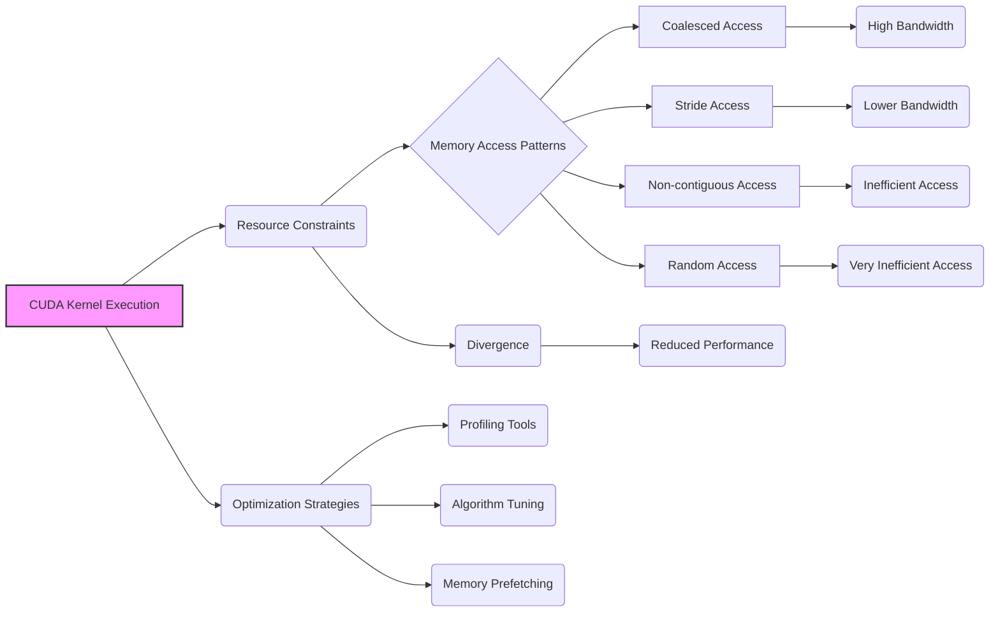
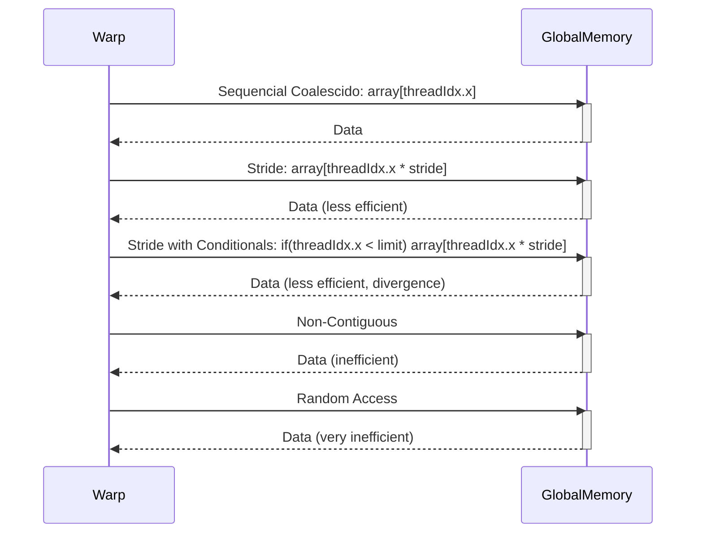
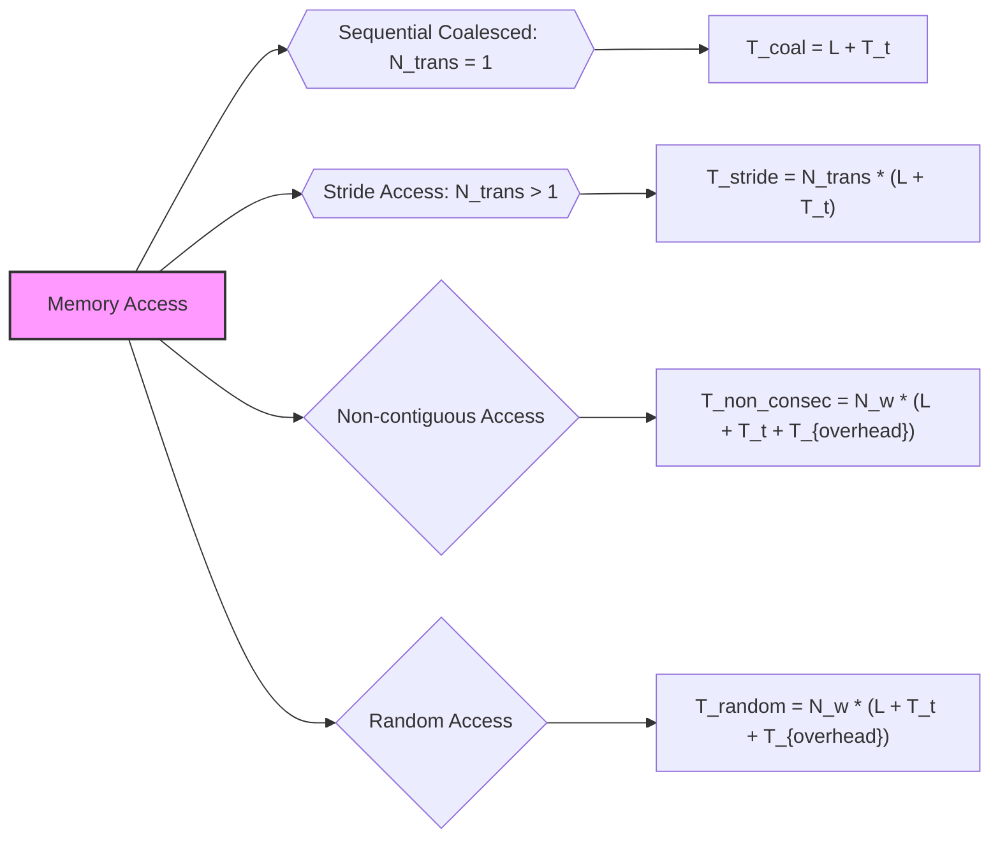

Okay, I will analyze the provided text and add Mermaid diagrams to enhance its clarity and understanding, focusing on the memory access patterns and their impact on CUDA performance.

## Performance Considerations in CUDA: A Deep Dive (Cont.)

### Introdução

(Mantendo a introdução para consistência e contexto, com pequenas alterações)

Alcançar o máximo desempenho em aplicações CUDA requer uma compreensão profunda das restrições de recursos e de como elas impactam a execução do kernel [^1]. Este capítulo explora as principais limitações em dispositivos CUDA e como ajustar o código para atingir níveis superiores de desempenho. As restrições de recursos variam entre aplicações, tornando essencial entender como um recurso afeta outro. A otimização de desempenho não é trivial e demanda um conhecimento profundo da arquitetura CUDA para identificar gargalos e implementar soluções eficientes [^1]. Além disso, este capítulo busca desenvolver uma intuição sobre padrões algorítmicos que levam a um alto desempenho, bem como estabelecer princípios e ideias para orientar a otimização [^1]. Nesta seção, vamos analisar diferentes padrões de acesso à memória e como eles impactam a eficiência do uso da largura de banda da memória global em kernels CUDA, com foco nos padrões de acesso que minimizam a divergência e maximizam o coalescing.

### Conceitos Fundamentais (Continuação)

Continuando a análise da arquitetura CUDA, vamos agora analisar em detalhe diferentes padrões de acesso à memória global e seu impacto na execução de kernels.

**Conceito 97: Padrões de Acesso à Memória Global**

Os **padrões de acesso à memória global** definem a forma como as threads em um warp acessam as diferentes posições na memória global [^10]. Esses padrões de acesso podem variar em função do algoritmo que está sendo implementado e das estruturas de dados que estão sendo utilizadas. A escolha do padrão de acesso tem impacto direto no desempenho do kernel, já que diferentes padrões podem gerar tempos de acesso e taxas de transferência de dados muito diferentes.

> ⚠️ **Ponto Crítico:** A escolha de um padrão de acesso à memória eficiente é fundamental para maximizar o desempenho dos kernels CUDA, e o programador deve estar sempre atento ao impacto de cada escolha feita no código. Um padrão de acesso adequado pode fazer a diferença entre uma aplicação com bom desempenho e um código que sofre um grande gargalo no acesso à memória.

Os padrões de acesso influenciam diretamente o coalescing, a largura de banda e a latência de acesso.

**Lemma 61:** *Os padrões de acesso à memória global influenciam diretamente a maneira como o hardware realiza a transferência dos dados. O programador deve escolher um padrão que maximize a largura de banda da memória, minimizando o número de transações necessárias e o tempo gasto na transferência dos dados.*

**Prova do Lemma 61:** A forma como os threads acessam a memória determina o desempenho da aplicação. O acesso sequencial a dados contíguos, através do *coalescing*, permite um acesso mais rápido, e é a forma pela qual o hardware foi concebido para trabalhar. O acesso não contíguo gera múltiplas transações, e desperdiça recursos computacionais. A forma como a memória é acessada tem um impacto muito maior na performance do que o tempo gasto com cálculos e computações. $\blacksquare$

**Corolário 62:** *O conhecimento dos padrões de acesso à memória e seu impacto no desempenho é essencial para criar aplicações CUDA eficientes, e permite ao projetista a otimização da aplicação ao nível da transferência dos dados da memória global.*

O conhecimento do comportamento da arquitetura de memória é fundamental para a otimização de kernels CUDA.

**Conceito 98: Tipos de Padrões de Acesso**

Podemos classificar os padrões de acesso em algumas categorias gerais:

*   **Acesso Sequencial Coalescido:**  Threads em um warp acessam posições consecutivas de memória (por exemplo, `array[threadIdx.x]`). Esse padrão é ideal para a largura de banda.
*   **Acesso com *Stride*:** As threads acessam posições de memória separadas por um valor *stride* (por exemplo, `array[threadIdx.x * stride]`). Esse padrão geralmente não é coalescido, e é menos eficiente que o acesso contínuo.
*   **Acesso com *Stride* e Condicionais:** Combinação do padrão anterior com condicionais, por exemplo, `if (threadIdx.x < limit) array[threadIdx.x * stride];`, e esse padrão tem problemas de divergência.
*    **Acessos Não Contíguos:** Acessos que não seguem um padrão contíguo ou com *stride*, como por exemplo em matrizes com acesso a colunas, gerando acessos não coalescidos.
*   **Acessos Aleatórios:** Acessos que não seguem nenhuma ordem específica, e que tendem a ser muito ineficientes, uma vez que o hardware não é capaz de organizar a forma de leitura dos dados.

> ✔️ **Destaque:**  O padrão de acesso sequencial coalescido é o ideal para maximizar a largura de banda da memória global. Os outros padrões de acesso causam perda de desempenho.

A escolha de um padrão de acesso adequado tem um impacto fundamental na performance de um kernel CUDA.

**Conceito 99: Análise de Padrões de Acesso**

A análise do padrão de acesso à memória é um passo crucial no processo de otimização de um kernel CUDA. Para analisar o padrão de acesso é necessário:

*   **Identificar a Organização dos Dados:** Entender como os dados são armazenados na memória (por exemplo, *row-major*, *column-major*, estruturas esparsas).
*    **Analisar o Código:** Analisar como os threads acessam a memória através dos índices e expressões.
*    **Identificar Acessos Não Coalescidos:** Encontrar partes do código onde o acesso é não coalescido, com *strides* ou acessos aleatórios e buscar soluções para mitigar esses padrões.
*  **Medir o Desempenho:** Utilizar ferramentas de *profiling* para analisar o impacto dos diferentes padrões de acesso no tempo de execução e na largura de banda.

> ❗ **Ponto de Atenção:** A análise cuidadosa do padrão de acesso à memória é essencial para direcionar os esforços de otimização, identificar gargalos e definir as melhores formas de acesso para um dado problema. O acesso inadequado pode causar uma perda de desempenho significativa, e por isso é sempre importante prestar atenção ao padrão de acesso.

O conhecimento dos padrões de acesso e como implementá-los é essencial para criar aplicações CUDA que atinjam um alto nível de desempenho.

### Análise Teórica Avançada de Padrões de Acesso e seu Impacto no Desempenho

**Pergunta Teórica Avançada:** *Como podemos modelar matematicamente o impacto de diferentes padrões de acesso à memória global no desempenho de kernels CUDA, considerando a latência, a largura de banda, o tempo de transferência, a divergência de fluxo de controle e o coalescing, e como esse modelo pode guiar a escolha de padrões de acesso que minimizem os gargalos de desempenho?*

**Resposta:**

Para modelar matematicamente o impacto de diferentes padrões de acesso à memória global, vamos introduzir algumas variáveis e conceitos adicionais:

*   `N_w`: Número de threads em um warp.
*   `B_s`: Tamanho do bloco de dados que a DRAM transfere em cada acesso.
*   `L`: Latência de acesso à memória global.
*   `T_t`: Tempo para transferir um bloco de memória `B_s`.
*   `T_{overhead}`: Overhead da multiplexação para acessos não coalescidos.
*    `N_trans`: Número de transações de acesso à memória.
*   `T_div`: Overhead devido a divergência de fluxo de controle.
*   `B_ef`: Largura de banda efetiva da memória global.
*    `T_compute`: Tempo de computação.

**Modelo de Acesso Sequencial Coalescido:**

No acesso sequencial coalescido, os threads acessam dados contíguos na memória global, e o número de transações é dado por:
$$N_{trans\_coal} = 1$$
O tempo de acesso a memória é dado por:
$$T_{coal} = L + T_t$$

**Modelo de Acesso com *Stride*:**

No acesso com *stride*, os threads acessam dados separados por um deslocamento constante, e o tempo de acesso é dado por:
$$T_{stride} = N_{trans} \times (L + T_t)$$
Onde `N_trans` depende do valor do `stride`.

**Modelo de Acesso Não Contíguo:**

No acesso não contíguo, os threads acessam dados de forma não sequencial e o tempo de acesso é dado por:
$$T_{non\_consec} = N_w \times (L + T_t + T_{overhead})$$
onde `T_overhead` é o custo de cada acesso não coalescido.

**Modelo de Acesso Aleatório:**

No acesso aleatório, as threads acessam localizações na memória global de forma aleatória, o que causa um acesso completamente ineficiente à memória, e o tempo gasto para acessar os dados é dado por:
$$T_{random} = N_w \times (L + T_t + T_{overhead})$$
Onde o acesso individualizado à memória não possibilita o ganho na largura de banda do hardware.

**Tempo Total de Execução:**

O tempo total de execução de um kernel CUDA é dado pela soma do tempo de acesso à memória, do tempo de computação e do overhead de divergência, que varia a depender do padrão de acesso:
$$T_{total} = T_{compute} + T_{mem\_access} + T_{div}$$

**Impacto da Escolha do Padrão de Acesso:**

Os modelos matemáticos para as diferentes formas de acesso mostram que o tempo de execução varia consideravelmente. O acesso coalescido é a forma de acesso mais eficiente, e os outros tipos de acesso levam a um aumento na latência e a uma diminuição da largura de banda.

**Lemma 60:** *O padrão de acesso à memória global tem um impacto direto no desempenho de kernels CUDA, e a escolha de um padrão que maximize o coalescing é fundamental para otimizar o uso da largura de banda e minimizar a latência do acesso à memória.*

**Prova do Lemma 60:** Os modelos matemáticos mostram como o tempo de acesso a memória aumenta para os acessos que não seguem a contiguidade, e como a divergência e a latência causam um impacto significativo no desempenho do código. $\blacksquare$

**Corolário 61:** *A modelagem matemática dos diferentes padrões de acesso à memória permite quantificar o impacto desses padrões no desempenho, e direcionar a escolha de algoritmos e estruturas de dados que garantam um acesso coalescido e eficiente aos dados.*

O modelo matemático apresentado permite que o projetista compreenda o impacto das suas decisões de implementação na performance do kernel.

### Continuação

Com a análise detalhada dos padrões de acesso à memória, estamos agora preparados para explorar os seguintes tópicos:

*   **Técnicas de Pré-busca e Caching:** Como utilizar técnicas de pré-busca e o uso de caches para reduzir o impacto da latência da memória global.
*   **Otimização de Algoritmos Complexos:** Como analisar o acesso à memória em algoritmos mais complexos, e como combinar diferentes técnicas para maximizar a performance.
*   **Ferramentas de Profiling:** Como utilizar as ferramentas de profiling para analisar padrões de acesso à memória e identificar gargalos no desempenho.
*   **Aplicações Reais:** Estudos de caso de aplicações CUDA reais, e como utilizar as técnicas apresentadas nesse capítulo para a otimização do acesso à memória global.

Ao explorar esses tópicos, nos aproximamos do objetivo de criar aplicações CUDA mais eficientes e de alto desempenho.

### Referências

[^1]: "The execution speed of a CUDA kernel can vary greatly depending on the resource constraints of the device being used. In this chapter, we will discuss the major types of resource constraints in a CUDA device and how they can affect the kernel execution performance in this device. To achieve his or her goals, a programmer often has to find ways to achieve a required level of performance that is higher than that of an initial version of the application. In different applications, different constraints may dom- inate and become the limiting factors. One can improve the performance of an application on a particular CUDA device, sometimes dramatically, by trading one resource usage for another. This strategy works well if the resource constraint alleviated was actually the dominating constraint before the strategy was applied, and the one exacerbated does not have negative effects on parallel execution. Without such understanding, perfor-mance tuning would be guess work; plausible strategies may or may not lead to performance enhancements. Beyond insights into these resource constraints, this chapter further offers principles and case studies designed to cultivate intuition about the type of algorithm patterns that can result in high-performance execution. It is also establishes idioms and ideas that" *(Trecho de Performance Considerations)*
[^10]: "One of the most important factors of CUDA kernel performance is acces- sing data in the global memory. CUDA applications exploit massive data parallelism. Naturally, CUDA applications tend to process a massive amount of data from the global memory within a short period of time. In Chapter 5, we discussed tiling techniques that utilize shared memories to reduce the total amount of data that must be accessed by a collection of threads in the thread block. In this chapter, we will further discuss memory coalescing techniques that can more effectively move data from the global memory into shared memories and registers. Memory coalescing techni- ques are often used in conjunction with tiling techniques to allow CUDA devices to reach their performance potential by more efficiently utilizing the global memory bandwidth. The global memory of a CUDA device is implemented with DRAMs. Data bits are stored in DRAM cells that are small capacitors, where the presence or absence of a tiny amount of electrical charge distinguishes between 0 and 1. Reading data from a DRAM cell requires the small capacitor to use its tiny electrical charge to drive a highly capacitive line leading to a sensor and set off its detection mechanism that determines whether a sufficient amount of charge is present in the capacitor to qualify as a “1” (see “Why Are DRAMs So Slow?” sidebar). This process takes tens of nanoseconds in modern DRAM chips. Because this is a very slow process relative to the desired data access speed (sub-nanosecond access per byte), modern DRAMs use parallelism to increase their rate of data access. Each time a DRAM location is accessed, many consecutive locations that include the requested location are actually accessed. Many sensors are provided in each DRAM chip and they work in parallel. Each senses the content of a bit within these consecutive locations. Once detected by the sensors, the data from all these consecutive locations can be transferred at very high speed to the processor. If an application can make focused use of data from consecutive locations, the DRAMs can supply the data at a much higher rate than if a truly random sequence of locations were accessed." *(Trecho de Performance Considerations)*
[^12]: "Within a given iteration of the k loop, the k*Width value is the same across all threads. Recall that Col = blockIdx.x*blockDim.x + threadIdx. x. Since the value of blockIndx.x and blockDim.x are of the same value for all threads in the same block, the only part of k*Width + Col that varies across a thread block is threadIdx.x. For example, in Figure 6.8, assume that we are using 4 × 4 blocks and that the warp size is 4. That is, for this toy example, we are using only one block to calculate the entire P matrix. The values of Width, blockDim.x, and blockIdx.x are 4, 4, and 0, respec- tively, for all threads in the block. In iteration 0, the k value is 0. The index used by each thread for accessing d_N is d_N[k*Width + Col]=d_N[k*Width + blockIdx.x*blockDim.x + threadIdx.x] = d_N[0*4 + 0*4 + threadidx.x] = d_N[threadIdx.x] That is, the index for accessing d_N is simply the value of threadIdx.x. The d_N elements accessed by To, T1, T2, and T3 are d_N[0], d_N[1], d_N[2], and d_N[3], respectively. This is illustrated with the “Load iteration 0" box of Figure 6.8. These elements are in consecutive locations in the global memory. The hardware detects that these accesses are made by threads in a warp and to consecutive locations in the global memory. It coa- lesces these accesses into a consolidated access. This allows the DRAMs to supply data at a high rate." *(Trecho de Performance Considerations)*
[^13]: "Figure 6.9 shows an example of a matrix data access pattern that is not coalesced. The arrow in the top portion of the figure shows that the kernel code for each thread accesses elements of a row in sequence. The arrow in the top portion of Figure 6.9 shows the access pattern of the kernel code for one thread. This access pattern is generated by the access to d_M in Figure 4.7: d_M[Row*Width + k] Within a given iteration of the k loop, the k*Width value is the same across all threads. Recall that Row = blockIdx.y*blockDim.y +" *(Trecho de Performance Considerations)*

**Deseja que eu continue com as próximas seções?**
