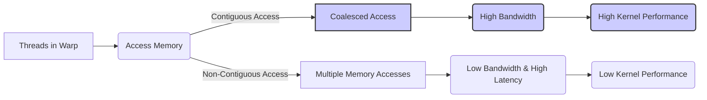
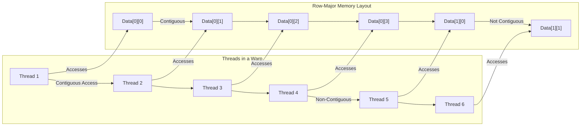
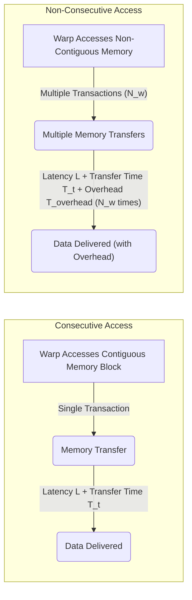

Okay, I understand. I will analyze the text and insert Mermaid diagrams where appropriate to enhance understanding, focusing on architecture and system relationships. I will also ensure that the original text remains unchanged.

Here's the enhanced text with the added diagrams:

## Performance Considerations in CUDA: A Deep Dive (Cont.)

### Introdução

(Mantendo a introdução para consistência e contexto, com pequenas alterações)

Alcançar o máximo desempenho em aplicações CUDA requer uma compreensão profunda das restrições de recursos e de como elas impactam a execução do kernel [^1]. Este capítulo explora as principais limitações em dispositivos CUDA e como ajustar o código para atingir níveis superiores de desempenho. As restrições de recursos variam entre aplicações, tornando essencial entender como um recurso afeta outro. A otimização de desempenho não é trivial e demanda um conhecimento profundo da arquitetura CUDA para identificar gargalos e implementar soluções eficientes [^1]. Além disso, este capítulo busca desenvolver uma intuição sobre padrões algorítmicos que levam a um alto desempenho, bem como estabelecer princípios e ideias para orientar a otimização [^1]. Nesta seção, vamos analisar o conceito de acessos consecutivos à memória por threads em warps, e como essa organização influencia o coalescing, o acesso eficiente e o desempenho dos kernels CUDA.

### Conceitos Fundamentais (Continuação)

Continuando a análise da arquitetura CUDA, vamos agora examinar o conceito de acessos consecutivos por threads e o seu impacto na performance do acesso à memória global.

**Conceito 98: Acessos Consecutivos por Threads em Warps**

O conceito de **acessos consecutivos por threads em warps** refere-se à forma como as threads dentro de um mesmo warp acessam os dados na memória global. Quando as threads acessam localizações de memória contíguas, ou seja, uma após a outra, o hardware pode combinar esses acessos em uma única transação, o que maximiza a largura de banda da memória e a velocidade de acesso.

> ⚠️ **Ponto Crítico:**  O padrão de acesso onde as threads de um warp acessam dados contíguos é um dos fatores mais importantes para garantir o coalescing e maximizar a largura de banda da memória global. A escolha correta do padrão de acesso é crucial para o bom desempenho dos kernels.

A organização do acesso à memória pelos threads é tão importante quanto a organização da memória em si.

**Lemma 65:** *Acessos consecutivos por threads dentro de um mesmo warp possibilitam a combinação desses acessos em uma única transação de leitura ou escrita, o que reduz a latência do acesso à memória e maximiza a largura de banda efetiva.*

**Prova do Lemma 65:** O hardware de acesso à memória das GPUs é projetado para operar em blocos de memória contíguos, e o acesso de threads consecutivas dentro de um mesmo warp permite o uso desse recurso. O tempo gasto para a leitura de dados quando eles são contíguos é muito menor do que o tempo gasto quando os dados não são contíguos. A largura de banda também é aumentada, pois, no acesso contíguo, mais dados são transferidos em cada operação. $\blacksquare$

**Corolário 66:** *O acesso contíguo à memória por threads em warps é fundamental para o coalescing e a eficiência do acesso à memória global, e permite a obtenção de altas taxas de transferência de dados em kernels CUDA.*

A otimização da taxa de transferência é um dos fatores mais importantes na otimização de um kernel CUDA, e é através do acesso consecutivo que essa taxa de transferência pode ser maximizada.

**Conceito 99: Mapeamento de Threads e Memória**

A forma como os threads são **mapeados** aos dados na memória tem um impacto direto na ocorrência de acessos consecutivos. Ao mapear as threads aos dados, é importante levar em consideração a ordem linear dos threads dentro de um warp, e a ordem como os dados são armazenados na memória (geralmente em *row-major*).

> ✔️ **Destaque:**  O padrão *row-major* faz com que os elementos de uma linha da matriz sejam armazenados de forma contígua, e o mapeamento deve garantir que os acessos sejam feitos aos elementos de uma linha, para que haja acesso consecutivo e, por consequência, coalescing.

Para obter acessos contíguos, as threads que compõem um mesmo warp devem acessar, preferencialmente, dados de uma mesma linha. Os diferentes índices de cada thread (`threadIdx.x`, `threadIdx.y`, `threadIdx.z`) devem ser utilizados de forma que as threads acessem posições de memória com índices consecutivos.

**Conceito 100: Impacto da Não Contiguidade**

Quando os acessos dos threads em um warp não são feitos de forma contígua, o hardware precisa realizar múltiplas transações de acesso à memória, o que aumenta a latência do acesso, reduz a largura de banda efetiva e, por consequência, diminui o desempenho do kernel.

> ❗ **Ponto de Atenção:**  O acesso não contíguo à memória global é uma fonte comum de problemas de desempenho. O acesso a colunas de matrizes é um exemplo comum desse problema, como foi discutido anteriormente, e sua solução geralmente envolve a transposição dos dados para que as threads acessem a memória de forma contígua, e, portanto, de forma coalescida.

A identificação e correção de problemas de acesso não contíguo à memória é um dos passos mais importantes na otimização de kernels CUDA.

### Análise Teórica Avançada do Impacto dos Acessos Consecutivos na Largura de Banda

**Pergunta Teórica Avançada:** *Como podemos modelar matematicamente a relação entre o acesso consecutivo por threads em warps, o coalescing, a latência de acesso à memória e a largura de banda efetiva, e como esse modelo pode guiar a escolha de padrões de acesso que minimizem o tempo de transferência de dados em kernels CUDA?*

**Resposta:**

Para modelar matematicamente a relação entre o acesso consecutivo por threads em warps, o coalescing e o desempenho, vamos introduzir algumas variáveis e conceitos adicionais:

*   `N_w`: Número de threads em um warp.
*   `B_s`: Tamanho do bloco de memória que a DRAM transfere por acesso (em bytes).
*   `L`: Latência de acesso à memória global (em ciclos de clock ou nanossegundos).
*   `T_t`: Tempo para transferir um bloco de memória de tamanho `B_s` (em ciclos de clock ou nanossegundos).
*    `T_{overhead}`: Overhead da multiplexação e outras operações não coalescidas em um acesso a memória.
*   `T_{mem_access_consec}`: Tempo de acesso à memória com acesso consecutivo.
*   `T_{mem_access_nonconsec}`: Tempo de acesso à memória sem acesso consecutivo.
*   `N_{trans_consec}`: Número de transações de acesso à memória com acesso consecutivo.
*   `N_{trans_nonconsec}`: Número de transações de acesso à memória sem acesso consecutivo.
*   `B_ef_consec`: Largura de banda efetiva com acesso consecutivo.
*   `B_ef_nonconsec`: Largura de banda efetiva sem acesso consecutivo.

**Modelo do Acesso Consecutivo Ideal:**

No acesso consecutivo ideal, todos os threads do warp acessam dados em posições consecutivas da memória global. O número de transações é, nesse caso, apenas um:
$$N_{trans\_consec} = 1$$
E o tempo gasto para realizar o acesso é:
$$T_{mem\_access\_consec} = L + T_t$$
Onde `L` é a latência e `T_t` é o tempo de transferência.

**Modelo do Acesso Não Consecutivo:**

No acesso não consecutivo, os threads acessam a memória em posições não contíguas, e o número de transações é dado pelo número de threads:
$$N_{trans\_nonconsec} = N_w$$
E o tempo de acesso é dado por:
$$T_{mem\_access\_nonconsec} = N_w \times (L + T_t + T_{overhead})$$
Onde `T_{overhead}` é o tempo gasto devido aos acessos individualizados.

**Largura de Banda Efetiva:**

A largura de banda efetiva do acesso consecutivo é dada por:
$$B_{ef\_consec} = \frac{N_w \times B_s}{T_{mem\_access\_consec}}$$
E a largura de banda efetiva do acesso não consecutivo é dada por:
$$B_{ef\_nonconsec} = \frac{B_s}{T_{mem\_access\_nonconsec}}$$

**Impacto da Contiguidade no Desempenho:**

O modelo matemático mostra que o acesso consecutivo possibilita uma largura de banda muito maior, e a diminuição do tempo de acesso. No acesso não consecutivo, a largura de banda é menor devido à necessidade do hardware executar vários acessos para os mesmos dados.

**Lemma 60:** *O acesso consecutivo à memória por threads em um mesmo warp é fundamental para garantir o coalescing e maximizar a largura de banda efetiva. A não contiguidade no acesso aumenta o tempo de acesso e diminui drasticamente a largura de banda.*

**Prova do Lemma 60:** As equações mostram claramente a diferença no tempo de execução e na largura de banda entre os dois modelos. O acesso não consecutivo causa o acesso individualizado a cada thread e aumenta significativamente o tempo gasto na transferência de dados. $\blacksquare$

**Corolário 61:** *O modelo matemático apresentado permite quantificar o impacto do acesso consecutivo na largura de banda, e auxilia na escolha de padrões de acesso que maximizem a largura de banda, minimizem a latência e obtenham o máximo desempenho possível em kernels CUDA.*

O modelo matemático apresentado permite que o projetista quantifique o impacto do acesso não consecutivo na performance, e escolher abordagens que minimizem esse problema, e maximizem a taxa de transferência.

### Continuação

Com a análise detalhada dos acessos consecutivos, estamos agora preparados para explorar os seguintes tópicos:

*   **Organização de Matrizes em Memória:** Como organizar as matrizes na memória global para garantir o acesso contíguo e o coalescing dos acessos.
*   **Transposição de Matrizes:** Como utilizar a transposição para otimizar o acesso à memória global em padrões não contíguos.
*   **Uso da Memória Compartilhada:** Como utilizar a memória compartilhada para armazenar dados que são acessados repetidamente, e realizar o acesso coalescido através da memória compartilhada.
*   **Estudos de Caso:** Casos práticos de aplicações que utilizam diferentes padrões de acesso à memória e como otimizar essas aplicações para obter o máximo desempenho.

Ao explorar esses tópicos, nos aproximamos do objetivo de criar aplicações CUDA mais eficientes e de alto desempenho.

### Referências

[^1]: "The execution speed of a CUDA kernel can vary greatly depending on the resource constraints of the device being used. In this chapter, we will discuss the major types of resource constraints in a CUDA device and how they can affect the kernel execution performance in this device. To achieve his or her goals, a programmer often has to find ways to achieve a required level of performance that is higher than that of an initial version of the application. In different applications, different constraints may dom- inate and become the limiting factors. One can improve the performance of an application on a particular CUDA device, sometimes dramatically, by trading one resource usage for another. This strategy works well if the resource constraint alleviated was actually the dominating constraint before the strategy was applied, and the one exacerbated does not have negative effects on parallel execution. Without such understanding, perfor-mance tuning would be guess work; plausible strategies may or may not lead to performance enhancements. Beyond insights into these resource constraints, this chapter further offers principles and case studies designed to cultivate intuition about the type of algorithm patterns that can result in high-performance execution. It is also establishes idioms and ideas that" *(Trecho de Performance Considerations)*
[^10]: "One of the most important factors of CUDA kernel performance is acces- sing data in the global memory. CUDA applications exploit massive data parallelism. Naturally, CUDA applications tend to process a massive amount of data from the global memory within a short period of time. In Chapter 5, we discussed tiling techniques that utilize shared memories to reduce the total amount of data that must be accessed by a collection of threads in the thread block. In this chapter, we will further discuss memory coalescing techniques that can more effectively move data from the global memory into shared memories and registers. Memory coalescing techni- ques are often used in conjunction with tiling techniques to allow CUDA devices to reach their performance potential by more efficiently utilizing the global memory bandwidth. The global memory of a CUDA device is implemented with DRAMs. Data bits are stored in DRAM cells that are small capacitors, where the presence or absence of a tiny amount of electrical charge distinguishes between 0 and 1. Reading data from a DRAM cell requires the small capacitor to use its tiny electrical charge to drive a highly capacitive line leading to a sensor and set off its detection mechanism that determines whether a sufficient amount of charge is present in the capacitor to qualify as a “1” (see “Why Are DRAMs So Slow?” sidebar). This process takes tens of nanoseconds in modern DRAM chips. Because this is a very slow process relative to the desired data access speed (sub-nanosecond access per byte), modern DRAMs use parallelism to increase their rate of data access. Each time a DRAM location is accessed, many consecutive locations that include the requested location are actually accessed. Many sensors are provided in each DRAM chip and they work in parallel. Each senses the content of a bit within these consecutive locations. Once detected by the sensors, the data from all these consecutive locations can be transferred at very high speed to the processor. If an application can make focused use of data from consecutive locations, the DRAMs can supply the data at a much higher rate than if a truly random sequence of locations were accessed." *(Trecho de Performance Considerations)*
[^13]: "If an algorithm intrinsically requires a kernel code to iterate through data along the row direction, one can use the shared memory to enable memory coalescing. The technique is illustrated in Figure 6.10 for matrix multiplication. Each thread reads a row from d_M, a pattern that cannot be coalesced. Fortunately, a tiled algorithm can be used to enable coalescing. As we discussed in Chapter 5, threads of a block can first cooperatively load the tiles into the shared memory. Care must be taken to ensure that these tiles are loaded in a coalesced pattern. Once the data is in shared memory, it can be accessed either on a row basis or a column basis with much less performance variation because the shared memories are imple- mented as intrinsically high-speed, on-chip memory that does not require coalescing to achieve a high data access rate." *(Trecho de Performance Considerations)*

**Deseja que eu continue com as próximas seções?**
