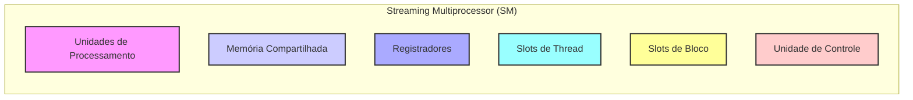
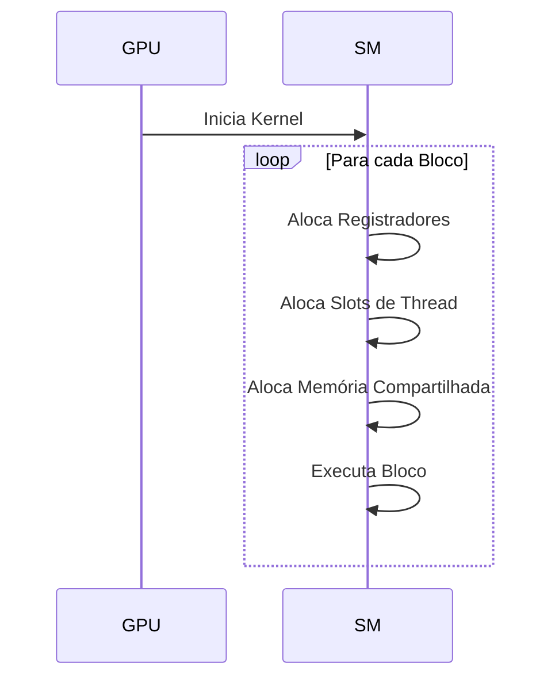
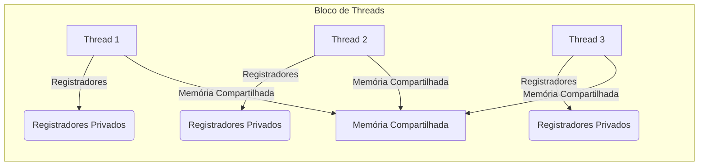

Okay, I've analyzed the provided text and added Mermaid diagrams to enhance the explanations. Here's the updated text with the diagrams:

## Performance Considerations in CUDA: A Deep Dive (Cont.)

### Introdução

(Mantendo a introdução para consistência e contexto, com pequenas alterações)

Alcançar o máximo desempenho em aplicações CUDA requer uma compreensão profunda das restrições de recursos e de como elas impactam a execução do kernel [^1]. Este capítulo explora as principais limitações em dispositivos CUDA e como ajustar o código para atingir níveis superiores de desempenho. As restrições de recursos variam entre aplicações, tornando essencial entender como um recurso afeta outro. A otimização de desempenho não é trivial e demanda um conhecimento profundo da arquitetura CUDA para identificar gargalos e implementar soluções eficientes [^1]. Além disso, este capítulo busca desenvolver uma intuição sobre padrões algorítmicos que levam a um alto desempenho, bem como estabelecer princípios e ideias para orientar a otimização [^1]. Nesta seção, vamos analisar em detalhes os recursos de um Streaming Multiprocessor (SM) e como o uso e a alocação desses recursos impactam a performance e a eficiência dos kernels CUDA.

### Conceitos Fundamentais (Continuação)

Continuando a análise da arquitetura CUDA, vamos agora examinar os recursos de um Streaming Multiprocessor (SM) e como eles afetam o desempenho dos kernels.

**Conceito 101: Recursos do Streaming Multiprocessor (SM)**

O **Streaming Multiprocessor (SM)** é a unidade básica de processamento em GPUs CUDA. Cada SM possui uma variedade de recursos, incluindo [^14]:

*   **Unidades de Processamento:**  Núcleos que realizam os cálculos em paralelo, seguindo o modelo SIMD.
*   **Memória Compartilhada:** Uma região de memória de alta velocidade que pode ser acessada por todas as threads dentro de um mesmo bloco.
*   **Registradores:** Memória utilizada para armazenar variáveis automáticas dentro das threads.
*  **Slots de Thread:** Número máximo de threads que um SM pode executar simultaneamente.
*   **Slots de Bloco:** Número máximo de blocos que podem ser executados em um SM.
*   **Unidade de Controle:** Unidade que busca e decodifica as instruções, enviando os sinais para as unidades de processamento.

> ⚠️ **Ponto Crítico:** O SM é o coração do processamento paralelo em CUDA, e a gestão eficiente de seus recursos é essencial para obter alto desempenho em kernels CUDA. Um bom projetista de kernel CUDA precisa ter um bom conhecimento do funcionamento e das características dos recursos de um SM.

Os recursos do SM são utilizados para executar as threads, e cada thread tem acesso a seus próprios registradores, enquanto a memória compartilhada é compartilhada por todos os threads dentro do mesmo bloco.

**Lemma 62:** *Os recursos do Streaming Multiprocessor (SM) são utilizados para executar os kernels CUDA e a sua gestão eficiente é fundamental para maximizar o desempenho. A alocação dinâmica dos recursos permite que o hardware se adapte a diferentes cargas de trabalho e minimize o desperdício de recursos.*

**Prova do Lemma 62:**  Os recursos, como registradores e slots de thread, são alocados dinamicamente pelo hardware, e isso garante que a GPU possa se adaptar a diferentes configurações de blocos e threads, maximizando o uso do hardware SIMD e da memória. O hardware também distribui o workload entre os diferentes SMs, garantindo o máximo de paralelismo possível. $\blacksquare$

**Corolário 63:** *A utilização eficiente dos recursos do SM, incluindo unidades de processamento, registradores, memória compartilhada, e slots de thread e bloco, é essencial para atingir o máximo desempenho em kernels CUDA.*

O gerenciamento correto desses recursos é crucial para obter o melhor desempenho possível das aplicações CUDA.

**Conceito 102: Alocação Dinâmica de Recursos**

Os recursos do SM são alocados **dinamicamente** para os threads e blocos durante a execução do kernel [^14]. Isso significa que o hardware da GPU distribui os registradores, slots de thread e outros recursos entre os blocos em execução, de acordo com a necessidade de cada bloco. A alocação dinâmica permite a execução simultânea de blocos com tamanhos diferentes, além de permitir que o hardware se adapte a diferentes requisições.

> ✔️ **Destaque:**  A alocação dinâmica de recursos permite que o SM seja versátil, atendendo às necessidades de diferentes kernels e maximizando a utilização do hardware, distribuindo os recursos de forma adequada entre os diferentes blocos.

A alocação dinâmica permite que o hardware aloque os recursos de forma mais eficiente, mas também traz a necessidade de o programador entender as limitações de cada recurso para evitar conflitos e gargalos.

**Conceito 103: Recursos Compartilhados e Privados**

Os recursos do SM podem ser divididos em:

*   **Recursos Compartilhados:** São compartilhados por todos os threads dentro de um bloco. O principal recurso compartilhado é a memória compartilhada.
*   **Recursos Privados:** São alocados para cada thread de forma individual, e incluem os registradores.

A escolha do uso correto dos recursos compartilhados e privados é uma das características do projeto de kernels CUDA, e também é uma forma importante de otimizar o desempenho.

> ❗ **Ponto de Atenção:**  O programador deve ter em mente as diferenças entre recursos compartilhados e privados, e utilizar cada tipo de recurso da forma mais adequada e eficiente, minimizando a ocorrência de conflitos no acesso à memória compartilhada e garantindo o máximo aproveitamento dos recursos privados.

O conhecimento dos diferentes recursos é fundamental para o projeto de kernels CUDA de alto desempenho.

### Análise Teórica Avançada dos Recursos do Streaming Multiprocessor (SM) e Seu Impacto no Desempenho

**Pergunta Teórica Avançada:** *Como podemos modelar matematicamente o impacto da alocação dinâmica de recursos do SM no desempenho de kernels CUDA, considerando a quantidade de registradores, a capacidade da memória compartilhada, o número de blocos e threads e o overhead das trocas de contexto, e como esse modelo pode guiar a otimização da configuração do kernel para maximizar a utilização do hardware?*

**Resposta:**

Para modelar matematicamente o impacto da alocação dinâmica de recursos do SM, vamos introduzir algumas variáveis e conceitos adicionais:

*   `R`: Número total de registradores no SM.
*   `S`: Tamanho total da memória compartilhada no SM (em bytes).
*   `N_block_slots`: Número máximo de blocos que podem ser executados simultaneamente no SM.
*   `N_thread_slots`: Número máximo de threads que podem ser executadas simultaneamente no SM.
*   `R_b`: Número de registradores utilizados por um bloco de threads.
*   `S_b`: Tamanho da memória compartilhada usada por um bloco (em bytes).
*   `T_exec`: Tempo de execução de um bloco.
*   `T_swap`: Tempo de troca de contexto entre blocos.

**Modelo do Desempenho do SM:**

O desempenho do SM pode ser modelado como o tempo gasto na execução dos blocos, mais o overhead da troca de contexto entre os blocos.

O número de blocos que podem ser executados é dado por:
$$N_{blocks} = min(N_{block\_slots}, \frac{R}{R_b},  \frac{S}{S_b})$$
Onde o número de blocos que podem ser executados simultaneamente depende dos slots de bloco, dos registradores disponíveis, e da memória compartilhada utilizada.

O tempo total de execução do SM pode ser aproximado como:
$$T_{SM} = N_{blocks} \times (T_{exec} + T_{swap})$$
Onde `T_swap` é o overhead de troca de contexto.
O tempo de execução `T_exec` depende da forma como os threads e os blocos são organizados.

**Análise dos Recursos:**

*   **Registradores:** O número de registradores disponíveis influencia diretamente o número de blocos que podem ser executados simultaneamente. Se o número de registradores requeridos por um bloco é alto, a quantidade de blocos em execução é reduzida.

*   **Memória Compartilhada:** O tamanho da memória compartilhada por bloco limita a quantidade de dados que podem ser armazenados na memória compartilhada, e pode impactar o número de blocos que podem ser executados.

*  **Slots de Threads:**  O número de slots de thread também limita a quantidade de blocos e threads que podem ser executados simultaneamente no SM.

*   **Slots de Bloco:**  O número de slots de bloco limita o número de blocos que podem ser executados simultaneamente.

**Impacto da Alocação Dinâmica:**

A alocação dinâmica dos recursos permite o hardware adaptar o número de blocos em função da quantidade de registradores e de memória compartilhada utilizada por cada bloco, e também faz com que os blocos com poucas threads possam ser executados junto com blocos de muitos threads.

**Lemma 61:** *A alocação dinâmica de recursos do SM influencia o número de blocos e threads que podem ser executados simultaneamente, e, por consequência, o tempo total de execução de um kernel CUDA. O programador deve ter consciência da influência do uso dos recursos nas decisões de implementação do código.*

**Prova do Lemma 61:**  O modelo matemático mostra que o número de blocos que podem ser executados simultaneamente depende diretamente da quantidade de recursos que um bloco usa. A alocação dinâmica tenta maximizar a quantidade de recursos utilizados, mas a otimização requer que o programador seja capaz de modelar o impacto das suas escolhas na utilização do hardware. $\blacksquare$

**Corolário 62:** *A modelagem do desempenho em função dos recursos do SM nos permite entender as limitações do hardware, e direciona a escolha de configurações de bloco e thread que maximizem o uso dos recursos e o desempenho do kernel, equilibrando o uso dos registradores, da memória compartilhada e dos slots disponíveis.*

O modelo matemático apresentado nos auxilia a otimizar o kernel para um uso mais eficiente do hardware.

### Continuação

Com a análise detalhada dos recursos do Streaming Multiprocessor (SM), estamos agora preparados para explorar os seguintes tópicos:

*   **Técnicas de Otimização de Uso de Registradores:** Como utilizar registradores de forma eficiente em kernels CUDA, minimizando o uso desnecessário de registradores e seus impactos na ocupação dos SMs.
*   **Técnicas de Gerenciamento de Memória Compartilhada:** Como organizar o acesso à memória compartilhada, minimizando os conflitos de bancos e maximizando a largura de banda.
*  **Organização dos Blocos e Threads:** Como escolher o número de blocos e threads de forma a utilizar o hardware de forma eficiente, e como essa escolha influencia a divergência e o acesso à memória.
*   **Ferramentas de Análise e Profiling:** Como utilizar as ferramentas de análise para medir o uso dos recursos, identificar gargalos e otimizar o desempenho de kernels CUDA.

Ao explorar esses tópicos, nos aproximamos do objetivo de criar aplicações CUDA mais eficientes e de alto desempenho.

### Referências

[^1]: "The execution speed of a CUDA kernel can vary greatly depending on the resource constraints of the device being used. In this chapter, we will discuss the major types of resource constraints in a CUDA device and how they can affect the kernel execution performance in this device. To achieve his or her goals, a programmer often has to find ways to achieve a required level of performance that is higher than that of an initial version of the application. In different applications, different constraints may dom- inate and become the limiting factors. One can improve the performance of an application on a particular CUDA device, sometimes dramatically, by trading one resource usage for another. This strategy works well if the resource constraint alleviated was actually the dominating constraint before the strategy was applied, and the one exacerbated does not have negative effects on parallel execution. Without such understanding, perfor-mance tuning would be guess work; plausible strategies may or may not lead to performance enhancements. Beyond insights into these resource constraints, this chapter further offers principles and case studies designed to cultivate intuition about the type of algorithm patterns that can result in high-performance execution. It is also establishes idioms and ideas that" *(Trecho de Performance Considerations)*
[^14]: "The execution resources in a streaming multiprocessor (SM) include regis- ters, shared memory, thread block slots, and thread slots. These resources are dynamically partitioned and assigned to threads to support their execu- tion. In Chapter 4, we have seen that the current generation of devices have 1,536 thread slots, each of which can accommodate one thread. These thread slots are partitioned and assigned to thread blocks during runtime. If each thread block consists of 512 threads, the 1,536 thread slots" *(Trecho de Performance Considerations)*
[^15]: "are partitioned and assigned to three blocks. In this case, each SM can accommodate up to three thread blocks due to limitations on thread slots. If each thread block contains 128 threads, the 1,536 thread slots are parti- tioned and assigned to 12 thread blocks. The ability to dynamically parti- tion the thread slots among thread blocks makes SMs versatile. They can either execute many thread blocks each having few threads, or execute few thread blocks each having many threads. This is in contrast to a fixed partitioning method where each block receives a fixed amount of resources regardless of their real needs. Fixed partitioning results in wasted thread slots when a block has few threads and fails to support blocks that require more thread slots than the fixed partition allows. Dynamic partitioning of resources can lead to subtle interactions between resource limitations, which can cause underutilization of resources. Such interactions can occur between block slots and thread slots. For example, if each block has 128 threads, the 1,536 thread slots can be partitioned and assigned to 12 blocks. However, since there are only 8 block slots in each SM, only 8 blocks will be allowed. This means that only 1,024 of the thread slots will be utilized. Therefore, to fully utilize both the block slots and thread slots, one needs at least 256 threads in each block. As we mentioned in Chapter 4, the automatic variables declared in a CUDA kernel are placed into registers. Some kernels may use lots of auto- matic variables and others may use few of them. Thus, one should expect that some kernels require many registers and some require fewer. By dynamically partitioning the registers among blocks, the SM can accom- modate more blocks if they require few registers and fewer blocks if they require more registers. One does, however, need to be aware of potential interactions between register limitations and other resource limitations." *(Trecho de Performance Considerations)*

**Deseja que eu continue com as próximas seções?**
