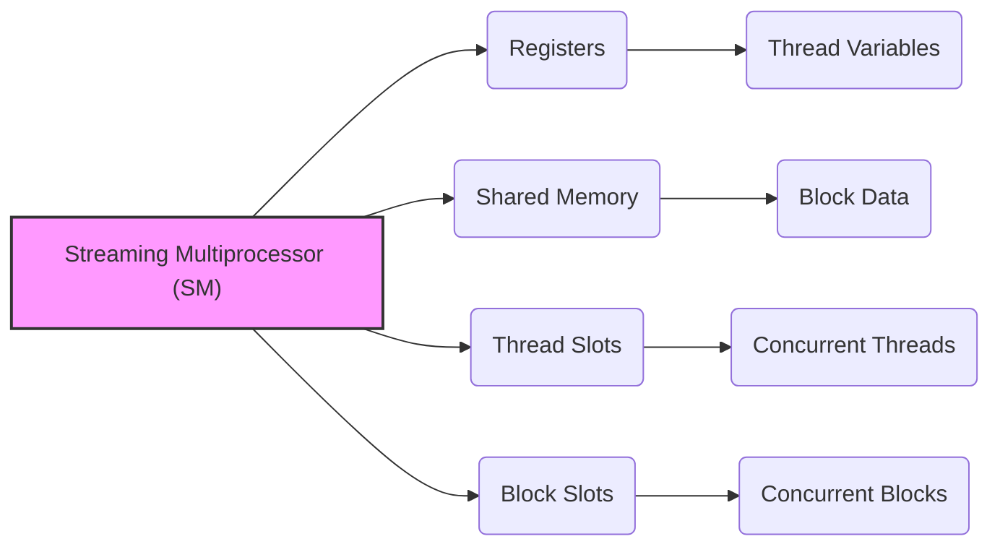
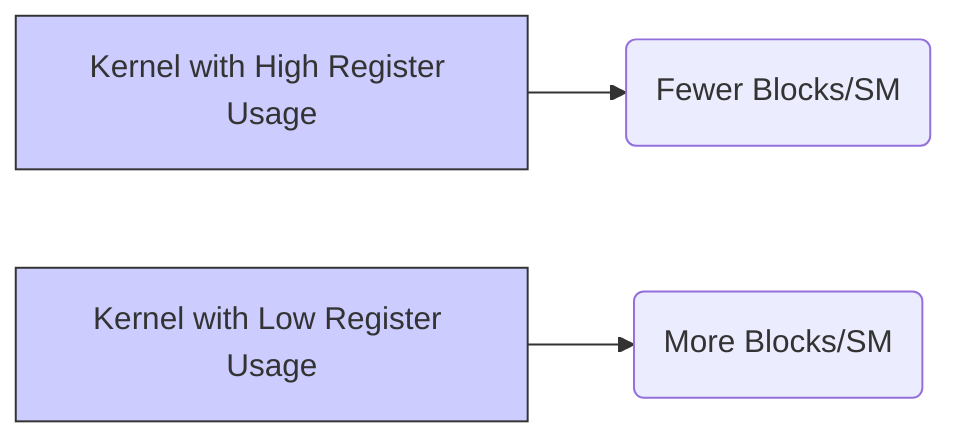
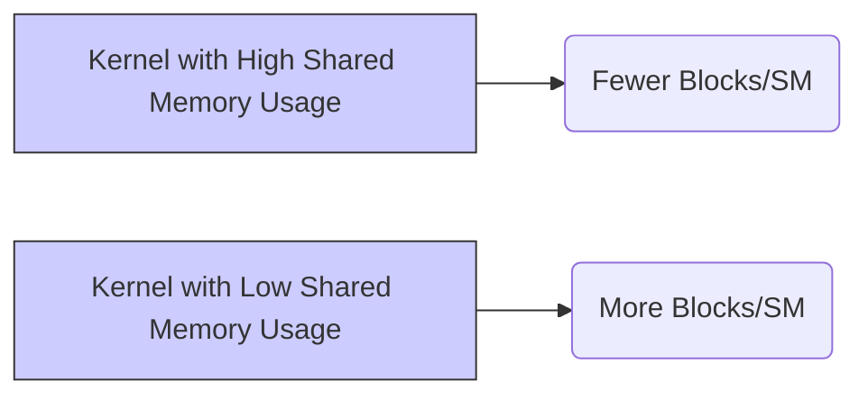

Okay, I will analyze the text and add Mermaid diagrams as requested. Here's the enhanced text with the diagrams:

## Performance Considerations in CUDA: A Deep Dive (Cont.)

### Introdução

(Mantendo a introdução para consistência e contexto, com pequenas alterações)

Alcançar o máximo desempenho em aplicações CUDA requer uma compreensão profunda das restrições de recursos e de como elas impactam a execução do kernel [^1]. Este capítulo explora as principais limitações em dispositivos CUDA e como ajustar o código para atingir níveis superiores de desempenho. As restrições de recursos variam entre aplicações, tornando essencial entender como um recurso afeta outro. A otimização de desempenho não é trivial e demanda um conhecimento profundo da arquitetura CUDA para identificar gargalos e implementar soluções eficientes [^1]. Além disso, este capítulo busca desenvolver uma intuição sobre padrões algorítmicos que levam a um alto desempenho, bem como estabelecer princípios e ideias para orientar a otimização [^1]. Nesta seção, vamos analisar em detalhes o conceito de partição dinâmica de recursos no Streaming Multiprocessor (SM) e como essa alocação flexível influencia o desempenho de kernels CUDA.

### Conceitos Fundamentais (Continuação)

Continuando a análise da arquitetura CUDA, vamos agora examinar em detalhe a partição dinâmica de recursos e suas implicações no desempenho dos kernels.

**Conceito 102: Partição Dinâmica de Recursos no SM**

A **partição dinâmica de recursos** refere-se à capacidade do Streaming Multiprocessor (SM) de alocar seus recursos de forma flexível entre os blocos de threads em execução [^14]. Esses recursos incluem:

*   **Registradores:** Espaço de memória rápida usado por threads para armazenar variáveis.
*   **Memória Compartilhada:** Memória de acesso rápido compartilhada por threads de um bloco.
*   **Slots de Threads:**  Número máximo de threads que podem ser executadas simultaneamente no SM.
*   **Slots de Bloco:**  Número máximo de blocos de threads que podem ser executados simultaneamente no SM.

> ⚠️ **Ponto Crítico:** A partição dinâmica de recursos permite que o hardware da GPU adapte a alocação de recursos às necessidades de cada kernel, otimizando a utilização e o desempenho. A alocação dinâmica flexibiliza a forma como os recursos são alocados e distribuídos, maximizando o uso e minimizando o desperdício.

Em vez de uma alocação estática, a alocação dinâmica permite que um kernel utilize mais ou menos registradores, memória compartilhada e slots de threads, a depender da sua necessidade.

**Lemma 66:** *A partição dinâmica de recursos do SM permite que o hardware aloque os recursos de forma flexível entre os blocos de threads em execução, o que garante o máximo uso dos recursos de cada SM e uma utilização melhor do hardware.*

**Prova do Lemma 66:**  A arquitetura do hardware foi concebida para que os recursos possam ser utilizados de forma dinâmica. A alocação de recursos depende das necessidades do código e da quantidade de threads e blocos em execução, de forma que o hardware possa alocar mais recursos para blocos que exigem mais processamento ou mais espaço de memória. $\blacksquare$

**Corolário 67:** *A partição dinâmica de recursos é essencial para a versatilidade das GPUs CUDA, e permite que elas se adaptem a diferentes tipos de kernels e a diferentes cargas de trabalho, maximizando o uso do hardware e otimizando o desempenho da aplicação.*

A alocação dinâmica permite a execução de uma gama maior de aplicações e garante o melhor uso dos recursos do hardware.

**Conceito 103: Impacto no Uso de Registradores**

A alocação dinâmica de registradores influencia o número de blocos de threads que podem ser executados simultaneamente no SM [^15]. Se um kernel utiliza muitos registradores, o número de blocos que podem ser executados simultaneamente é menor, já que cada bloco tem um overhead do uso de registradores. Se um kernel utiliza poucos registradores, é possível aumentar o número de blocos em execução simultânea, e, portanto, aumentar o desempenho do kernel.

> ✔️ **Destaque:**  A alocação dinâmica de registradores permite que o SM execute um número maior de blocos que utilizam poucos registradores e menos blocos que utilizam muitos registradores. A escolha do uso adequado de registradores pode influenciar diretamente o desempenho do código.

O projetista do código CUDA deve escolher a quantidade de registradores para cada thread com cuidado, já que essa decisão tem um impacto direto no desempenho do código.

**Conceito 104: Alocação da Memória Compartilhada**

O tamanho da **memória compartilhada** utilizada por cada bloco também impacta o número de blocos que podem ser executados simultaneamente em um SM. A quantidade de memória compartilhada é um recurso limitado e a alocação desse recurso também é feita dinamicamente.

> ❗ **Ponto de Atenção:**  A alocação dinâmica de memória compartilhada permite o balanceamento do uso da memória compartilhada por diferentes blocos, mas exige que o programador tenha consciência das limitações desse recurso, pois um valor muito alto para a memória compartilhada por bloco pode fazer com que um número menor de blocos seja executado no SM.

A escolha do tamanho da memória compartilhada deve equilibrar a necessidade de memória com a quantidade de blocos que podem ser executados em um mesmo SM.

### Análise Teórica Avançada da Partição Dinâmica de Recursos

**Pergunta Teórica Avançada:** *Como podemos modelar matematicamente o impacto da alocação dinâmica de registradores e da memória compartilhada no desempenho de kernels CUDA, considerando o número de blocos, o número de threads, a latência da troca de contexto e a forma como o uso dos recursos afeta a largura de banda e a divergência de fluxo de controle, e como esse modelo pode nos guiar na otimização da configuração dos kernels?*

**Resposta:**

Para modelar matematicamente o impacto da alocação dinâmica de registradores e da memória compartilhada, vamos introduzir algumas variáveis e conceitos adicionais:

*   `R`: Número total de registradores no SM.
*   `S`: Tamanho total da memória compartilhada no SM.
*   `N_block_slots`: Número máximo de blocos que podem ser executados simultaneamente no SM.
*   `N_thread_slots`: Número máximo de threads que podem ser executadas simultaneamente no SM.
*   `R_b`: Número de registradores utilizados por um bloco de threads.
*   `S_b`: Tamanho da memória compartilhada usada por um bloco (em bytes).
*   `N_threads_b`: Número de threads por bloco.
*   `T_exec`: Tempo de execução de um bloco.
*   `T_swap`: Tempo de troca de contexto entre blocos.

**Modelo de Alocação Dinâmica de Recursos:**

O número máximo de blocos que podem ser executados simultaneamente em um SM é dado por:
$$N_{blocks} = min\left(N_{block\_slots}, \frac{R}{R_b}, \frac{S}{S_b},  \frac{N_{thread\_slots}}{N_{threads\_b}} \right)$$
Onde o número de blocos é limitado pelos slots de bloco, pelos registradores, pela memória compartilhada e pelo número de threads.

O tempo total de execução do SM pode ser aproximado como:
$$T_{SM} = N_{blocks} \times (T_{exec} + T_{swap})$$
Onde `T_exec` é o tempo de execução de cada bloco e `T_swap` é o tempo da troca de contexto.

**Impacto da Alocação Dinâmica nos Recursos:**

*   **Registradores:** Um aumento no uso de registradores por bloco (`R_b`) reduz o número de blocos que podem ser executados simultaneamente, diminuindo o paralelismo, e vice-versa.
*  **Memória Compartilhada:** Um aumento no uso de memória compartilhada (`S_b`) reduz o número de blocos que podem ser executados simultaneamente, o que diminui o paralelismo, mas permite que cada bloco acesse mais dados.
*   **Slots de Threads:** Um maior número de threads por bloco, aumenta a necessidade de slots de thread, e diminui o número de blocos que podem ser executados simultaneamente, e consequentemente o paralelismo.

**Impacto no Desempenho:**

O impacto da alocação dinâmica de recursos no desempenho do kernel pode ser modelado como uma função que considera o número de blocos em execução simultânea, o overhead de troca de contexto e o tempo gasto em cada bloco.

**Lemma 61:** *A partição dinâmica de registradores, memória compartilhada e slots de threads influencia o desempenho de kernels CUDA, e o programador deve balancear a alocação dos recursos em cada bloco para maximizar o paralelismo e a utilização do hardware SIMD.*

**Prova do Lemma 61:** O modelo matemático apresentado mostra que a quantidade de blocos que podem ser executados simultaneamente depende da quantidade de recursos que cada bloco precisa, e que existe um equilíbrio ideal a ser atingido, e que o ideal é maximizar a quantidade de blocos, respeitando os limites de registradores, memória compartilhada e slots de threads e blocos. $\blacksquare$

**Corolário 62:** *A modelagem matemática da alocação dinâmica de recursos auxilia na escolha da melhor configuração de bloco para cada situação, maximizando o uso dos recursos do hardware, e otimizando o desempenho de kernels CUDA.*

O modelo matemático apresentado permite quantificar o impacto das escolhas na alocação dos recursos e a encontrar a melhor combinação possível para um dado problema.

### Continuação

Com a análise detalhada da partição dinâmica de recursos do SM, estamos agora preparados para explorar os seguintes tópicos:

*   **Otimização de Loops:** Como organizar os loops para reduzir o overhead de divergência de fluxo de controle.
*  **Prefetching:** Como realizar o prefetching de dados da memória global para diminuir o impacto da latência no desempenho.
*   **Estudos de Caso Avançados:** Análise de exemplos práticos que ilustram como a escolha adequada da configuração dos blocos, do uso da memória compartilhada, e dos padrões de acesso à memória influencia o desempenho geral de aplicações CUDA.

Ao explorar esses tópicos, nos aproximamos do objetivo de criar aplicações CUDA mais eficientes e de alto desempenho.

### Referências

[^1]: "The execution speed of a CUDA kernel can vary greatly depending on the resource constraints of the device being used. In this chapter, we will discuss the major types of resource constraints in a CUDA device and how they can affect the kernel execution performance in this device. To achieve his or her goals, a programmer often has to find ways to achieve a required level of performance that is higher than that of an initial version of the application. In different applications, different constraints may dom- inate and become the limiting factors. One can improve the performance of an application on a particular CUDA device, sometimes dramatically, by trading one resource usage for another. This strategy works well if the resource constraint alleviated was actually the dominating constraint before the strategy was applied, and the one exacerbated does not have negative effects on parallel execution. Without such understanding, perfor-mance tuning would be guess work; plausible strategies may or may not lead to performance enhancements. Beyond insights into these resource constraints, this chapter further offers principles and case studies designed to cultivate intuition about the type of algorithm patterns that can result in high-performance execution. It is also establishes idioms and ideas that" *(Trecho de Performance Considerations)*
[^14]: "The execution resources in a streaming multiprocessor (SM) include regis- ters, shared memory, thread block slots, and thread slots. These resources are dynamically partitioned and assigned to threads to support their execu- tion. In Chapter 4, we have seen that the current generation of devices have 1,536 thread slots, each of which can accommodate one thread. These thread slots are partitioned and assigned to thread blocks during runtime. If each thread block consists of 512 threads, the 1,536 thread slots" *(Trecho de Performance Considerations)*
[^15]: "are partitioned and assigned to three blocks. In this case, each SM can accommodate up to three thread blocks due to limitations on thread slots. If each thread block contains 128 threads, the 1,536 thread slots are parti- tioned and assigned to 12 thread blocks. The ability to dynamically parti- tion the thread slots among thread blocks makes SMs versatile. They can either execute many thread blocks each having few threads, or execute few thread blocks each having many threads. This is in contrast to a fixed partitioning method where each block receives a fixed amount of resources regardless of their real needs. Fixed partitioning results in wasted thread slots when a block has few threads and fails to support blocks that require more thread slots than the fixed partition allows. Dynamic partitioning of resources can lead to subtle interactions between resource limitations, which can cause underutilization of resources. Such interactions can occur between block slots and thread slots. For example, if each block has 128 threads, the 1,536 thread slots can be partitioned and assigned to 12 blocks. However, since there are only 8 block slots in each SM, only 8 blocks will be allowed. This means that only 1,024 of the thread slots will be utilized. Therefore, to fully utilize both the block slots and thread slots, one needs at least 256 threads in each block. As we mentioned in Chapter 4, the automatic variables declared in a CUDA kernel are placed into registers. Some kernels may use lots of auto- matic variables and others may use few of them. Thus, one should expect that some kernels require many registers and some require fewer. By dynamically partitioning the registers among blocks, the SM can accom- modate more blocks if they require few registers and fewer blocks if they require more registers. One does, however, need to be aware of potential interactions between register limitations and other resource limitations." *(Trecho de Performance Considerations)*

**Deseja que eu continue com as próximas seções?**
