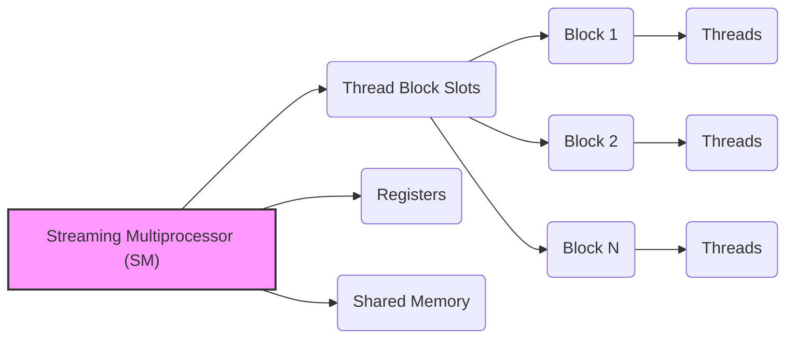
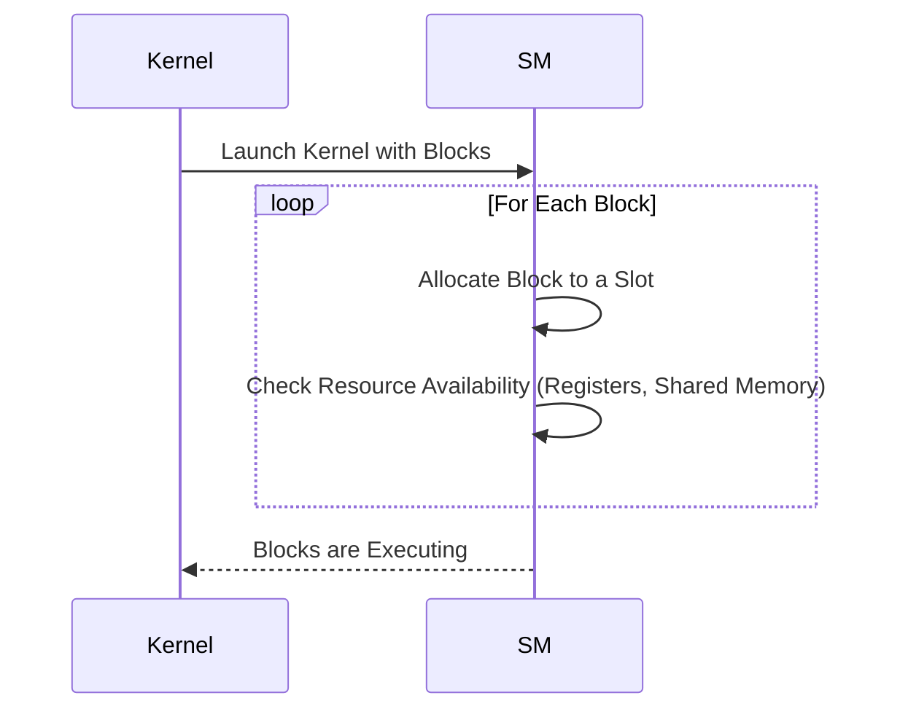
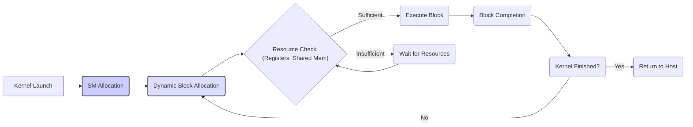

Okay, I will add Mermaid diagrams to enhance the provided text, focusing on visualizing the architecture and relationships discussed.

### Introdução

(Mantendo a introdução para consistência e contexto, com pequenas alterações)

Alcançar o máximo desempenho em aplicações CUDA requer uma compreensão profunda das restrições de recursos e de como elas impactam a execução do kernel [^1]. Este capítulo explora as principais limitações em dispositivos CUDA e como ajustar o código para atingir níveis superiores de desempenho. As restrições de recursos variam entre aplicações, tornando essencial entender como um recurso afeta outro. A otimização de desempenho não é trivial e demanda um conhecimento profundo da arquitetura CUDA para identificar gargalos e implementar soluções eficientes [^1]. Além disso, este capítulo busca desenvolver uma intuição sobre padrões algorítmicos que levam a um alto desempenho, bem como estabelecer princípios e ideias para orientar a otimização [^1]. Nesta seção, vamos analisar em detalhe a alocação dinâmica dos slots de blocos de threads nos Streaming Multiprocessors (SM), e como essa alocação influencia o número de blocos em execução simultânea e, consequentemente, o desempenho dos kernels CUDA.

### Conceitos Fundamentais (Continuação)

Continuando a análise da arquitetura CUDA, vamos agora analisar o conceito dos *thread block slots* e como eles influenciam o desempenho de kernels CUDA.

**Conceito 104: Slots de Blocos de Threads no SM**

Os **slots de blocos de threads** são recursos de hardware dentro de um Streaming Multiprocessor (SM) que definem o número máximo de blocos que podem ser executados simultaneamente em um SM [^15]. Cada bloco de threads utiliza um desses slots, e a disponibilidade dos slots de bloco é um fator crucial para a utilização do hardware e, consequentemente, para o desempenho do kernel.

> ⚠️ **Ponto Crítico:**  A quantidade de slots de bloco em um SM é um recurso limitado e sua alocação dinâmica tem um impacto direto no paralelismo e no desempenho de kernels CUDA. O número de blocos em execução simultânea no SM, por sua vez, influencia o paralelismo da aplicação.

O número de slots de blocos, junto com outros recursos como registradores e memória compartilhada, definem quantos blocos podem ser executados ao mesmo tempo em um SM.

**Lemma 63:** *Os slots de bloco são recursos limitados no hardware do SM que definem a quantidade máxima de blocos de threads que podem ser executados simultaneamente. A alocação dinâmica desses slots tem um impacto direto no número de blocos que podem ser executados ao mesmo tempo.*

**Prova do Lemma 63:** O hardware da GPU possui um número fixo de slots de blocos em cada SM. Esse número define a quantidade máxima de blocos que podem estar em execução. Quando um kernel é executado, os blocos são alocados para os SMs, e esses blocos precisam ser alocados nos slots de bloco, que são limitados. Essa limitação afeta o desempenho da aplicação. $\blacksquare$

**Corolário 64:** *A compreensão do conceito de slots de bloco é fundamental para otimizar a execução de kernels CUDA, e o número de slots, junto com os outros recursos, influencia o desempenho do código.*

A utilização adequada dos slots de bloco e o entendimento das suas limitações permite que o projetista obtenha o máximo desempenho da aplicação.

**Conceito 105: Alocação Dinâmica dos Slots de Bloco**

A alocação dos slots de bloco é **dinâmica**, o que significa que o hardware da GPU decide quantos blocos são executados em cada SM, de acordo com os recursos necessários por cada bloco.

> ✔️ **Destaque:** A alocação dinâmica dos slots de bloco aumenta a flexibilidade e a eficiência do uso dos recursos do SM. A alocação dinâmica é uma característica importante da arquitetura CUDA, e permite um melhor uso dos recursos.

Se os blocos exigem muitos registradores ou muita memória compartilhada, o número de blocos que podem ser executados simultaneamente diminui. Ao contrário, quando blocos utilizam poucos registradores e pouca memória compartilhada, é possível aumentar o número de blocos em execução no mesmo SM.

**Conceito 106: Impacto da Alocação Dinâmica no Desempenho**

A alocação dinâmica dos slots de bloco tem um impacto significativo no desempenho do kernel:

*   **Paralelismo:** Um número maior de blocos em execução simultânea aumenta o paralelismo, o que leva a um melhor desempenho.
*   **Utilização do Hardware:** A alocação dinâmica permite que o hardware do SM seja utilizado de forma mais eficiente, já que ele se adapta à necessidade dos diferentes blocos.
*   **Overhead:** Uma quantidade muito grande de blocos pode causar um overhead de troca de contexto, diminuindo o desempenho em alguns casos.

> ❗ **Ponto de Atenção:** A alocação dinâmica dos slots de bloco busca maximizar o uso do hardware, mas a escolha inadequada do tamanho dos blocos pode levar a uma subutilização do hardware, a problemas de divergência e a acessos não coalescidos, diminuindo o desempenho do kernel.

Para atingir o máximo desempenho, o programador deve escolher um tamanho de bloco que utilize bem os recursos do hardware, evitando a subutilização e minimizando a sobrecarga.

### Análise Teórica Avançada da Partição Dinâmica de Slots de Bloco e seu Impacto no Desempenho

**Pergunta Teórica Avançada:** *Como podemos modelar matematicamente o impacto da alocação dinâmica de slots de bloco no desempenho de kernels CUDA, considerando a quantidade de blocos, o tamanho dos blocos, o overhead da troca de contexto e a latência de acesso à memória, e como esse modelo pode guiar a escolha de uma configuração de kernel que maximize a utilização do hardware?*

**Resposta:**

Para modelar matematicamente o impacto da alocação dinâmica de slots de bloco, vamos introduzir algumas variáveis e conceitos adicionais:

*   `N_SM`: Número de Streaming Multiprocessors (SMs).
*   `N_block_slots`: Número máximo de slots de blocos por SM.
*    `N_thread_slots`: Número máximo de slots de threads por SM.
*   `R`: Número total de registradores no SM.
*  `S`: Tamanho total da memória compartilhada no SM (em bytes).
*   `R_b`: Número de registradores utilizados por um bloco de threads.
*   `S_b`: Tamanho da memória compartilhada utilizada por um bloco (em bytes).
*    `N_threads_b`: Número de threads por bloco.
*   `T_exec`: Tempo de execução de um bloco.
*   `T_swap`: Tempo de troca de contexto entre blocos.
*   `T_mem_access`: Tempo de acesso à memória global.
*  `T_compute`: Tempo de computação.

**Modelo da Alocação Dinâmica de Blocos:**

O número máximo de blocos que podem ser executados simultaneamente em um SM é dado por:
$$N_{blocks} = \min\left(N_{block\_slots}, \frac{R}{R_b}, \frac{S}{S_b}, \frac{N_{thread\_slots}}{N_{threads\_b}} \right)$$
Onde o número de blocos depende do número de slots de bloco, registradores, memória compartilhada e slots de threads.

O tempo total de execução de um SM é dado por:
$$T_{SM} = N_{blocks} \times (T_{exec} + T_{swap})$$

**Impacto da Alocação Dinâmica no Paralelismo:**

*   **Número de Blocos:** A alocação dinâmica permite que mais blocos sejam executados simultaneamente quando cada bloco utiliza menos recursos, o que aumenta o paralelismo do código e a utilização do hardware.
*  **Tamanho do Bloco:** O tamanho do bloco influencia diretamente o número de blocos em execução, além de influenciar a divergência, o coalescing e o uso da memória compartilhada.
*   **Overhead da Troca de Contexto:** A execução de muitos blocos pequenos pode levar a um grande overhead, diminuindo o desempenho.

**Modelo do Tempo de Execução de um Kernel:**

O tempo total de execução de um kernel é dado por:
$$T_{kernel} =  \frac{N_{total}}{N_{blocks} \times N_{threads\_b}} \times T_{SM} $$
Onde `N_total` é o número total de threads, `N_blocks` é o número de blocos e `N_threads_b` é o número de threads por bloco.

**Impacto no Desempenho:**

O modelo matemático mostra que um número maior de blocos nem sempre leva a um desempenho melhor. É importante fazer um equilíbrio entre a quantidade de blocos, a quantidade de threads por bloco, o uso de memória compartilhada e de registradores, e também entre a divergência do código, para obter um código otimizado.

**Lemma 62:** *A alocação dinâmica de slots de blocos influencia o desempenho do kernel CUDA.  O número de blocos que podem ser executados simultaneamente no SM depende da alocação dinâmica, e a escolha adequada do tamanho dos blocos é essencial para o uso eficiente dos recursos do hardware.*

**Prova do Lemma 62:** Os modelos matemáticos mostram que o número de blocos que podem ser executados simultaneamente depende dos recursos requeridos por cada bloco. Uma distribuição adequada desses recursos permite que o código seja executado de forma mais rápida e eficiente. $\blacksquare$

**Corolário 63:** *O modelo matemático da alocação dinâmica de slots de blocos nos permite analisar o impacto da escolha do tamanho dos blocos e do uso dos recursos, e direcionar a criação de kernels CUDA que maximizem o uso do hardware e diminuam a latência e o overhead, aumentando a performance da aplicação.*

A modelagem matemática nos auxilia a fazer escolhas adequadas, e a ter uma melhor intuição sobre a relação entre os diferentes recursos do SM.

### Continuação

Com a análise detalhada da alocação dinâmica de slots de bloco, estamos agora preparados para explorar os seguintes tópicos:

*   **Otimização da Hierarquia de Memória:** Como utilizar a hierarquia de memória em GPUs CUDA, combinando a memória global, a memória compartilhada e os registradores de forma eficiente.
*   **Técnicas de Balanceamento de Carga:** Como distribuir o trabalho entre as threads de forma equilibrada, minimizando a espera e maximizando a utilização dos recursos do SM.
*   **Análise do Código e do Desempenho:** Como analisar o código de um kernel CUDA para identificar gargalos e oportunidades de otimização, usando os conceitos e as ferramentas apresentadas nesse capítulo.

Ao explorar esses tópicos, nos aproximamos do objetivo de criar aplicações CUDA mais eficientes e de alto desempenho.

### Referências

[^1]: "The execution speed of a CUDA kernel can vary greatly depending on the resource constraints of the device being used. In this chapter, we will discuss the major types of resource constraints in a CUDA device and how they can affect the kernel execution performance in this device. To achieve his or her goals, a programmer often has to find ways to achieve a required level of performance that is higher than that of an initial version of the application. In different applications, different constraints may dom- inate and become the limiting factors. One can improve the performance of an application on a particular CUDA device, sometimes dramatically, by trading one resource usage for another. This strategy works well if the resource constraint alleviated was actually the dominating constraint before the strategy was applied, and the one exacerbated does not have negative effects on parallel execution. Without such understanding, perfor-mance tuning would be guess work; plausible strategies may or may not lead to performance enhancements. Beyond insights into these resource constraints, this chapter further offers principles and case studies designed to cultivate intuition about the type of algorithm patterns that can result in high-performance execution. It is also establishes idioms and ideas that" *(Trecho de Performance Considerations)*
[^14]: "The execution resources in a streaming multiprocessor (SM) include regis- ters, shared memory, thread block slots, and thread slots. These resources are dynamically partitioned and assigned to threads to support their execu- tion. In Chapter 4, we have seen that the current generation of devices have 1,536 thread slots, each of which can accommodate one thread. These thread slots are partitioned and assigned to thread blocks during runtime. If each thread block consists of 512 threads, the 1,536 thread slots" *(Trecho de Performance Considerations)*
[^15]: "are partitioned and assigned to three blocks. In this case, each SM can accommodate up to three thread blocks due to limitations on thread slots. If each thread block contains 128 threads, the 1,536 thread slots are parti- tioned and assigned to 12 thread blocks. The ability to dynamically parti- tion the thread slots among thread blocks makes SMs versatile. They can either execute many thread blocks each having few threads, or execute few thread blocks each having many threads. This is in contrast to a fixed partitioning method where each block receives a fixed amount of resources regardless of their real needs. Fixed partitioning results in wasted thread slots when a block has few threads and fails to support blocks that require more thread slots than the fixed partition allows. Dynamic partitioning of resources can lead to subtle interactions between resource limitations, which can cause underutilization of resources. Such interactions can occur between block slots and thread slots. For example, if each block has 128 threads, the 1,536 thread slots can be partitioned and assigned to 12 blocks. However, since there are only 8 block slots in each SM, only 8 blocks will be allowed. This means that only 1,024 of the thread slots will be utilized. Therefore, to fully utilize both the block slots and thread slots, one needs at least 256 threads in each block. As we mentioned in Chapter 4, the automatic variables declared in a CUDA kernel are placed into registers. Some kernels may use lots of auto- matic variables and others may use few of them. Thus, one should expect that some kernels require many registers and some require fewer. By dynamically partitioning the registers among blocks, the SM can accom- modate more blocks if they require few registers and fewer blocks if they require more registers. One does, however, need to be aware of potential interactions between register limitations and other resource limitations." *(Trecho de Performance Considerations)*

**Deseja que eu continue com as próximas seções?**
