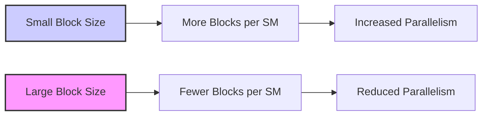
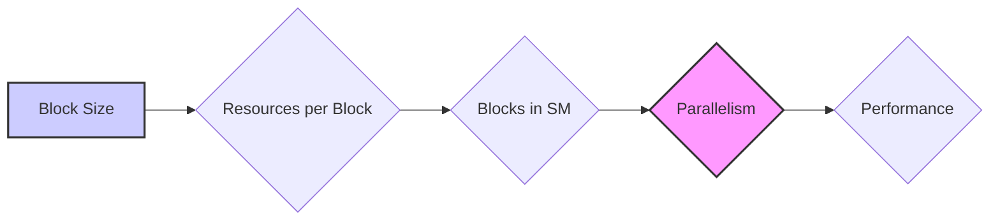

Okay, here's the enhanced text with Mermaid diagrams added:

## Performance Considerations in CUDA: A Deep Dive (Cont.)

```mermaid
flowchart LR
    subgraph Streaming Multiprocessor (SM)
    A["Block 1"] -->|Registers, Shared Memory, Thread Slots| SM
    B["Block 2"] -->|Registers, Shared Memory, Thread Slots| SM
    C["Block 3"] -->|Registers, Shared Memory, Thread Slots| SM
    end
    SM --> D["Global Memory"]
    D --> E["Host CPU"]
    style A fill:#f9f,stroke:#333,stroke-width:2px
    style B fill:#ccf,stroke:#333,stroke-width:2px
    style C fill:#aaf,stroke:#333,stroke-width:2px
```

### Introdução

(Mantendo a introdução para consistência e contexto, com pequenas alterações)

Alcançar o máximo desempenho em aplicações CUDA requer uma compreensão profunda das restrições de recursos e de como elas impactam a execução do kernel [^1]. Este capítulo explora as principais limitações em dispositivos CUDA e como ajustar o código para atingir níveis superiores de desempenho. As restrições de recursos variam entre aplicações, tornando essencial entender como um recurso afeta outro. A otimização de desempenho não é trivial e demanda um conhecimento profundo da arquitetura CUDA para identificar gargalos e implementar soluções eficientes [^1]. Além disso, este capítulo busca desenvolver uma intuição sobre padrões algorítmicos que levam a um alto desempenho, bem como estabelecer princípios e ideias para orientar a otimização [^1]. Nesta seção, vamos analisar em detalhes como os recursos são alocados para os blocos de threads em um Streaming Multiprocessor (SM), e como a escolha do tamanho do bloco influencia o uso desses recursos e, por consequência, o desempenho do kernel.

### Conceitos Fundamentais (Continuação)

Continuando a análise da arquitetura CUDA, vamos agora analisar o impacto da alocação de recursos em blocos de threads e como essa alocação influencia o desempenho.

**Conceito 108: Alocação de Recursos para Blocos de Threads**

A alocação de recursos para **blocos de threads** é feita de forma dinâmica pelo Streaming Multiprocessor (SM), e essa alocação envolve a distribuição dos seguintes recursos:

*   **Registradores:** Os registradores são usados para armazenar variáveis automáticas de cada thread, e a quantidade de registradores utilizada por cada thread impacta o número de blocos que podem ser executados simultaneamente em um SM.
*   **Memória Compartilhada:** A memória compartilhada é utilizada por todos os threads dentro de um mesmo bloco, e sua quantidade é um dos fatores que definem o número de blocos que podem ser executados em um SM [^15].
*   **Slots de Threads:** O número de slots de threads define o número máximo de threads que podem ser executadas em um SM, e esse valor influencia a escolha do número de threads por bloco.
*   **Slots de Blocos:** O número de slots de bloco define o número máximo de blocos que podem ser executados simultaneamente em um SM [^15].

> ⚠️ **Ponto Crítico:** A alocação de recursos para blocos de threads é um fator crucial no desempenho de kernels CUDA, e a escolha do tamanho dos blocos influencia diretamente a forma como os recursos são utilizados e o paralelismo que pode ser alcançado. A escolha inadequada do tamanho do bloco leva à diminuição do número de blocos em execução, ou a uma subutilização dos recursos, o que diminui o desempenho.

O projetista do kernel deve balancear cuidadosamente o tamanho dos blocos com as limitações dos recursos do hardware.

**Lemma 64:** *A alocação de recursos para blocos de threads envolve um trade-off entre o número de blocos em execução simultânea, a quantidade de registradores e memória compartilhada utilizada por bloco e a quantidade de threads dentro do bloco.  Essa escolha influencia o paralelismo da aplicação, e o número de threads ativas em cada SM, que por sua vez influenciam a eficiência do uso da arquitetura SIMD e a largura de banda da memória.*

**Prova do Lemma 64:** O hardware da GPU possui um número fixo de recursos em cada SM. A distribuição dinâmica desses recursos entre diferentes blocos implica que a quantidade de um recurso que é utilizada por um bloco afeta a quantidade de recursos que ficam disponíveis para os outros blocos no mesmo SM. Uma configuração inadequada pode diminuir a quantidade de blocos em execução, resultando em um desempenho ruim. $\blacksquare$

**Corolário 65:** *A escolha do tamanho dos blocos deve ser feita com cuidado, buscando um equilíbrio entre o número de blocos, o tamanho dos blocos e o uso dos recursos do SM, a fim de maximizar o desempenho do kernel.*

A escolha correta do tamanho do bloco é uma decisão importante durante o desenvolvimento de kernels CUDA.

**Conceito 109: Impacto do Tamanho do Bloco nos Registradores**

A quantidade de **registradores** utilizados por thread em um bloco tem um impacto direto no número de blocos que podem ser executados simultaneamente em um SM. Quanto mais registradores forem utilizados por thread, menor será o número de blocos que podem ser executados simultaneamente, e vice-versa.



> ✔️ **Destaque:** A escolha da quantidade de registradores por thread deve ser feita com atenção ao tamanho dos blocos para maximizar o paralelismo. A escolha do tamanho do bloco é essencial para obter o máximo desempenho, e o projetista deve ter conhecimento sobre a necessidade de recursos do seu código e as limitações do hardware.

As variáveis automáticas são alocadas em registradores, e por isso o programador deve tentar diminuir a quantidade de variáveis automáticas para diminuir a quantidade de registradores necessários, o que, por consequência, aumenta o paralelismo.

**Conceito 110: Impacto do Tamanho do Bloco na Memória Compartilhada**

O tamanho do bloco também influencia o uso da **memória compartilhada**. O tamanho de um *tile* que é carregado na memória compartilhada deve ser definido com atenção, já que existe uma limitação na quantidade de memória compartilhada por bloco [^15]. Um bloco que utilize muita memória compartilhada pode impedir a execução de outros blocos nesse mesmo SM.

> ❗ **Ponto de Atenção:**  A escolha do tamanho do bloco deve levar em consideração o tamanho da memória compartilhada e o número de threads que acessam a mesma região de memória, e o projetista deve equilibrar o tamanho do *tile* com a necessidade de memória compartilhada do seu código e as limitações do hardware.

A escolha do tamanho dos blocos deve considerar tanto as limitações da memória compartilhada, quanto a quantidade de threads, e as necessidades computacionais.

### Análise Teórica Avançada do Impacto da Alocação de Recursos nos Blocos de Threads

**Pergunta Teórica Avançada:** *Como podemos modelar matematicamente o impacto do tamanho do bloco de threads no desempenho de kernels CUDA, considerando a latência do acesso à memória, o overhead de troca de contexto, a alocação de registradores e memória compartilhada e a utilização do hardware SIMD, e como esse modelo pode guiar a escolha de um tamanho de bloco ideal que maximize o desempenho?*

**Resposta:**

Para modelar o impacto do tamanho do bloco de threads, vamos introduzir algumas variáveis e conceitos adicionais:

*   `N_b`: Número de threads em um bloco.
*   `N_w`: Número de threads em um warp.
*   `R`: Número total de registradores por SM.
*   `S`: Tamanho total da memória compartilhada por SM (em bytes).
*   `N_block_slots`: Número máximo de slots de bloco por SM.
*   `R_t`: Número de registradores utilizados por thread.
*   `S_b`: Tamanho da memória compartilhada utilizada por um bloco.
*  `T_exec`: Tempo de execução do bloco.
*  `T_swap`: Overhead de troca de contexto entre blocos.
*   `L`: Latência de acesso a memória global.
*   `T_mem_global`: Tempo de acesso à memória global.
*   `T_compute`: Tempo de computação.
*    `T_div`: Overhead da divergência de fluxo de controle.

**Modelo da Alocação Dinâmica de Recursos:**

O número máximo de blocos que podem ser executados simultaneamente em um SM é dado por:
$$N_{blocks} = min \left(N_{block\_slots}, \frac{R}{R_t \times N_b}, \frac{S}{S_b}  \right)$$

Onde o número de blocos em execução simultânea depende dos slots de bloco, da quantidade de registradores e da quantidade de memória compartilhada utilizada por bloco.

**Modelo do Tempo de Execução do Bloco:**

O tempo de execução do bloco depende de diversos fatores:
$$T_{exec} = T_{compute} + T_{mem\_global} + T_{div}$$
Onde `T_compute` representa o tempo para realizar as computações, `T_mem_global` o tempo para acessar a memória global, e `T_div` representa o tempo gasto devido a divergência de fluxo de controle.

**Modelo do Tempo de Execução do SM:**

O tempo total de execução do SM é modelado por:
$$T_{SM} = N_{blocks} \times (T_{exec} + T_{swap})$$

**Impacto do Tamanho do Bloco no Desempenho:**

O tamanho do bloco `N_b` tem um impacto significativo no desempenho, pois ele influencia a quantidade de registradores e memória compartilhada utilizados, que limitam a quantidade de blocos em execução. Um tamanho de bloco muito grande leva a uma diminuição do número de blocos executando simultaneamente, e um tamanho muito pequeno pode gerar um overhead de troca de contexto.



**Lemma 63:** *O tamanho do bloco de threads afeta a alocação de recursos em um SM e, por consequência, o paralelismo, a divergência de fluxo de controle e o desempenho de kernels CUDA, pois influencia o número de blocos em execução, o tempo gasto nas operações computacionais e o tempo de acesso a memória.*

**Prova do Lemma 63:** A modelagem matemática mostra que a quantidade de blocos em execução é inversamente proporcional à quantidade de recursos utilizada por cada bloco. Um número muito pequeno de blocos diminui o paralelismo da aplicação, e um número muito grande de blocos leva a overhead de sincronização, e ambos os casos levam à subutilização dos recursos do hardware. $\blacksquare$

**Corolário 64:** *O modelo matemático do desempenho de kernels CUDA em função do tamanho do bloco de threads nos permite entender a influência desse parâmetro na alocação de recursos, na latência, no coalescing e na divergência. A otimização do código envolve a escolha de um tamanho de bloco adequado que maximize o uso dos recursos do SM, equilibre a necessidade de recursos e minimize o overhead.*

A modelagem matemática permite quantificar os efeitos das escolhas de implementação e a encontrar o equilíbrio ideal para maximizar a performance.

### Continuação

Com a análise detalhada da alocação de recursos para blocos de threads, estamos agora preparados para explorar os seguintes tópicos:

*   **Otimização do Acesso à Memória Compartilhada:** Como utilizar a memória compartilhada de forma eficiente, evitando conflitos de acesso e maximizando a largura de banda.
*  **Técnicas de Balanceamento de Carga:** Como distribuir o trabalho entre threads e blocos de forma equilibrada para maximizar a utilização do hardware.
*  **Otimização de Loops:** Como organizar loops para reduzir a divergência e o overhead.
*   **Estudo de Caso: Aplicações Reais:** Análise de casos reais, mostrando o impacto do tamanho dos blocos no desempenho de diferentes aplicações CUDA.

Ao explorar esses tópicos, nos aproximamos do objetivo de criar aplicações CUDA mais eficientes e de alto desempenho.

### Referências

[^1]: "The execution speed of a CUDA kernel can vary greatly depending on the resource constraints of the device being used. In this chapter, we will discuss the major types of resource constraints in a CUDA device and how they can affect the kernel execution performance in this device. To achieve his or her goals, a programmer often has to find ways to achieve a required level of performance that is higher than that of an initial version of the application. In different applications, different constraints may dom- inate and become the limiting factors. One can improve the performance of an application on a particular CUDA device, sometimes dramatically, by trading one resource usage for another. This strategy works well if the resource constraint alleviated was actually the dominating constraint before the strategy was applied, and the one exacerbated does not have negative effects on parallel execution. Without such understanding, perfor-mance tuning would be guess work; plausible strategies may or may not lead to performance enhancements. Beyond insights into these resource constraints, this chapter further offers principles and case studies designed to cultivate intuition about the type of algorithm patterns that can result in high-performance execution. It is also establishes idioms and ideas that" *(Trecho de Performance Considerations)*
[^15]: "are partitioned and assigned to three blocks. In this case, each SM can accommodate up to three thread blocks due to limitations on thread slots. If each thread block contains 128 threads, the 1,536 thread slots are parti- tioned and assigned to 12 thread blocks. The ability to dynamically parti- tion the thread slots among thread blocks makes SMs versatile. They can either execute many thread blocks each having few threads, or execute few thread blocks each having many threads. This is in contrast to a fixed partitioning method where each block receives a fixed amount of resources regardless of their real needs. Fixed partitioning results in wasted thread slots when a block has few threads and fails to support blocks that require more thread slots than the fixed partition allows. Dynamic partitioning of resources can lead to subtle interactions between resource limitations, which can cause underutilization of resources. Such interactions can occur between block slots and thread slots. For example, if each block has 128 threads, the 1,536 thread slots can be partitioned and assigned to 12 blocks. However, since there are only 8 block slots in each SM, only 8 blocks will be allowed. This means that only 1,024 of the thread slots will be utilized. Therefore, to fully utilize both the block slots and thread slots, one needs at least 256 threads in each block. As we mentioned in Chapter 4, the automatic variables declared in a CUDA kernel are placed into registers. Some kernels may use lots of auto- matic variables and others may use few of them. Thus, one should expect that some kernels require many registers and some require fewer. By dynamically partitioning the registers among blocks, the SM can accom- modate more blocks if they require few registers and fewer blocks if they require more registers. One does, however, need to be aware of potential interactions between register limitations and other resource limitations." *(Trecho de Performance Considerations)*

**Deseja que eu continue com as próximas seções?**
