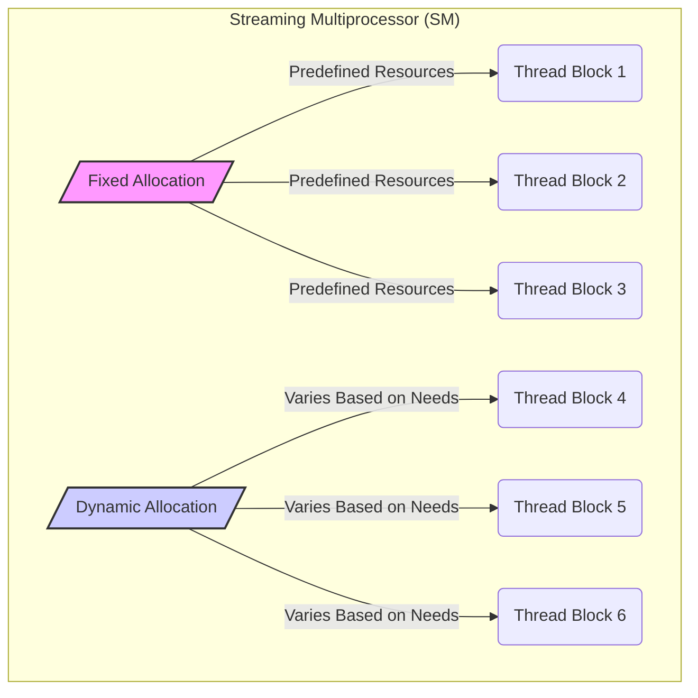
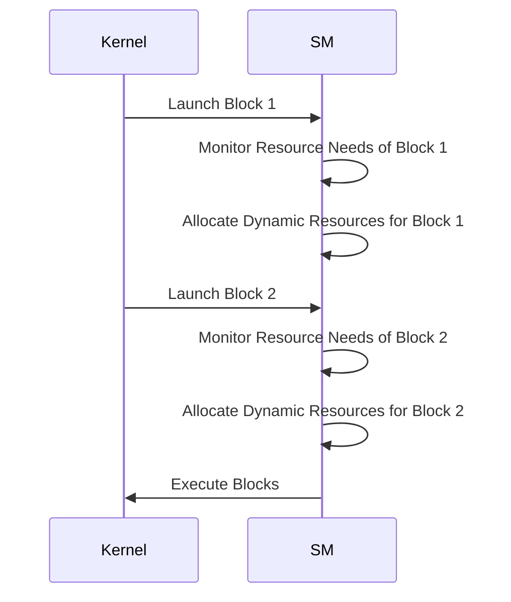
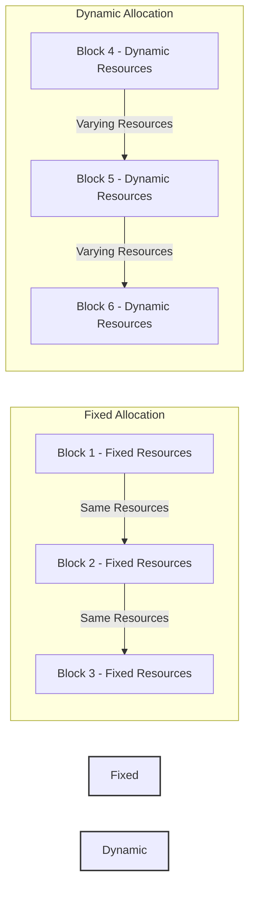

Okay, I will analyze the provided text and add Mermaid diagrams where appropriate to enhance understanding.

## Performance Considerations in CUDA: A Deep Dive (Cont.)

### Introdução

(Mantendo a introdução para consistência e contexto, com pequenas alterações)

Alcançar o máximo desempenho em aplicações CUDA requer uma compreensão profunda das restrições de recursos e de como elas impactam a execução do kernel [^1]. Este capítulo explora as principais limitações em dispositivos CUDA e como ajustar o código para atingir níveis superiores de desempenho. As restrições de recursos variam entre aplicações, tornando essencial entender como um recurso afeta outro. A otimização de desempenho não é trivial e demanda um conhecimento profundo da arquitetura CUDA para identificar gargalos e implementar soluções eficientes [^1]. Além disso, este capítulo busca desenvolver uma intuição sobre padrões algorítmicos que levam a um alto desempenho, bem como estabelecer princípios e ideias para orientar a otimização [^1]. Nesta seção, vamos analisar em detalhes a diferença entre a alocação fixa e a alocação dinâmica de recursos em Streaming Multiprocessors (SM), explorando como a alocação dinâmica permite o uso mais eficiente dos recursos e como ela influencia o desempenho dos kernels.

### Conceitos Fundamentais (Continuação)

Continuando a análise da arquitetura CUDA, vamos agora examinar as diferenças entre a alocação dinâmica e a alocação fixa de recursos e o seu impacto no desempenho.

**Conceito 111: Alocação Fixa de Recursos**

A **alocação fixa de recursos** refere-se à distribuição de recursos de um Streaming Multiprocessor (SM) onde cada bloco de threads recebe uma quantidade predefinida de recursos, independentemente das suas necessidades [^15]. Nesse cenário, cada bloco é configurado com um número fixo de registradores, um tamanho fixo de memória compartilhada e um número fixo de slots de threads.

> ⚠️ **Ponto Crítico:** A alocação fixa de recursos é uma abordagem mais simples de implementar, mas pode levar à subutilização do hardware, especialmente quando há uma variação grande nas necessidades de recursos entre diferentes blocos de threads.

Nessa forma de alocação, os blocos são alocados de forma homogênea nos SMs, e a quantidade de threads e de recursos que um bloco utiliza não varia.

**Lemma 67:** *A alocação fixa de recursos aloca uma quantidade predefinida de recursos para cada bloco, e essa abordagem simplifica o processo de alocação, mas pode levar à subutilização dos recursos quando as necessidades entre os blocos variam.*

**Prova do Lemma 67:** Na alocação fixa, cada bloco recebe uma quantidade de registradores e memória compartilhada definidas pelo projetista, que pode não corresponder às necessidades reais do código. Essa forma de alocação resulta num uso menos eficiente do hardware, já que alguns blocos podem precisar de mais recursos, enquanto outros usam menos do que foi disponibilizado. $\blacksquare$

**Corolário 68:** *A alocação fixa de recursos pode levar ao desperdício de recursos quando um bloco não utiliza todos os recursos alocados. Essa abordagem apresenta maior risco de subutilização do hardware SIMD e da memória.*

Essa abordagem tem a vantagem de ser mais simples, mas a sua eficiência pode ser baixa em diferentes situações.

**Conceito 112: Alocação Dinâmica de Recursos**

Na **alocação dinâmica de recursos**, o SM aloca seus recursos (registradores, memória compartilhada, slots de thread, etc) de forma flexível, de acordo com as necessidades de cada bloco em execução [^14]. Nesse cenário, o hardware monitora o uso dos recursos de cada bloco, e aloca a quantidade de recursos que cada bloco necessita.

> ✔️ **Destaque:** A alocação dinâmica de recursos permite que o SM adapte a alocação de recursos para cada bloco, o que aumenta a utilização do hardware e minimiza o desperdício de recursos, melhorando o desempenho geral do código.

A alocação dinâmica de recursos permite que os recursos do SM sejam usados de forma mais eficiente e que blocos com necessidades distintas possam ser executados simultaneamente no mesmo SM.

**Conceito 113: Vantagens da Alocação Dinâmica**

A alocação dinâmica de recursos oferece diversas vantagens em comparação com a alocação fixa:

*   **Melhor Utilização do Hardware:** Os recursos são alocados de acordo com a demanda, o que reduz o desperdício e maximiza a utilização do hardware.
*   **Adaptabilidade:** O hardware se adapta às necessidades específicas de cada kernel, o que melhora o desempenho em uma variedade de aplicações.
*   **Paralelismo:** A alocação dinâmica permite que mais blocos com poucos recursos sejam executados simultaneamente, aumentando o paralelismo.
* **Flexibilidade:** A alocação dinâmica é flexível o bastante para se adaptar a uma variedade de aplicações com diferentes necessidades de recursos.

> ❗ **Ponto de Atenção:** A alocação dinâmica de recursos pode gerar problemas de desempenho quando não é combinada com uma escolha adequada de tamanho de bloco. Para atingir o melhor desempenho possível, o projetista do kernel deve balancear a necessidade de recursos com o potencial de paralelismo.

A alocação dinâmica tem um papel fundamental no desempenho dos kernels CUDA, e deve ser utilizada ao projetar o código para que o máximo desempenho seja atingido.

### Análise Teórica Avançada da Alocação Fixa vs Dinâmica de Recursos

**Pergunta Teórica Avançada:** *Como podemos modelar matematicamente o impacto da alocação fixa versus alocação dinâmica de registradores e memória compartilhada no desempenho de kernels CUDA, considerando a utilização do hardware, o tempo de execução, o overhead da alocação, e como esse modelo pode guiar a escolha de uma estratégia de alocação que maximize o desempenho?*

**Resposta:**

Para modelar matematicamente o impacto da alocação fixa e da alocação dinâmica de recursos, vamos introduzir algumas variáveis e conceitos adicionais:

*   `R`: Número total de registradores no SM.
*   `S`: Tamanho total da memória compartilhada no SM (em bytes).
*   `N_block_slots`: Número máximo de slots de blocos por SM.
*   `N_thread_slots`: Número máximo de slots de threads por SM.
*   `R_b`: Número de registradores utilizados por bloco na alocação fixa.
*   `S_b`: Tamanho da memória compartilhada utilizada por bloco na alocação fixa (em bytes).
*   `R_bi`: Número de registradores utilizados pelo bloco `i` na alocação dinâmica.
*   `S_bi`: Tamanho da memória compartilhada utilizada pelo bloco `i` na alocação dinâmica.
*   `T_exec`: Tempo de execução de um bloco.
*   `T_swap`: Tempo de troca de contexto entre blocos.
*    `N_blocks_fixed`: Número de blocos em execução com alocação fixa.
*    `N_blocks_dynamic`: Número de blocos em execução com alocação dinâmica.

**Modelo de Alocação Fixa:**

Na alocação fixa, o número de blocos que podem ser executados simultaneamente é dado por:
$$N_{blocks\_fixed} = min \left(N_{block\_slots}, \frac{R}{R_b}, \frac{S}{S_b},  \frac{N_{thread\_slots}}{N_{threads\_b}} \right)$$
Onde o número de blocos é limitado pelo menor número entre o número máximo de slots de bloco e a quantidade de blocos que podem ser executados considerando os registradores, a memória compartilhada e os slots de thread.
O tempo total de execução no SM é dado por:
$$T_{SM\_fixed} = N_{blocks\_fixed} \times (T_{exec} + T_{swap})$$
Essa alocação é feita de forma estática, e todos os blocos tem a mesma quantidade de recursos, independente da necessidade real.

**Modelo de Alocação Dinâmica:**

Na alocação dinâmica, o número de blocos que podem ser executados simultaneamente é dado por:
$$\sum_{i=1}^{N_{blocks\_dynamic}} min \left(N_{block\_slots}, \frac{R}{\sum_{i}R_{bi}},  \frac{S}{\sum_{i}S_{bi}} \right) \le N_{block\_slots}$$
Onde a quantidade de blocos é dada pela soma das necessidades de todos os blocos executando em simultâneo, com a condição que essa quantidade não pode ser maior que os slots de blocos disponíveis no SM.
O tempo de execução no SM é dado por:
$$T_{SM\_dynamic} = N_{blocks\_dynamic} \times (T_{exec} + T_{swap})$$

**Impacto na Utilização do Hardware:**

1. **Alocação Fixa:** A alocação fixa é mais fácil de implementar, mas ela pode causar uma subutilização dos recursos, se as necessidades entre os diferentes blocos variam muito.
2. **Alocação Dinâmica:** A alocação dinâmica permite que o SM aloque os recursos de forma mais eficiente, utilizando o paralelismo ao máximo e diminuindo o desperdício de recursos.

**Lemma 64:** *A alocação dinâmica de recursos em um SM possibilita uma melhor utilização dos recursos e um maior desempenho, principalmente quando as necessidades de recursos variam entre os diferentes blocos, enquanto a alocação fixa pode levar à subutilização dos recursos e, por consequência, a um desempenho inferior.*

**Prova do Lemma 64:** Os modelos matemáticos mostram que a alocação dinâmica permite que o hardware se adapte às necessidades dos diferentes blocos, garantindo uma maior utilização dos recursos. A alocação fixa, devido à utilização de uma configuração padronizada, causa um uso sub-ótimo do hardware, já que os recursos alocados para cada bloco não são utilizados por completo. $\blacksquare$

**Corolário 65:** *A alocação dinâmica de recursos é essencial para maximizar o desempenho de kernels CUDA, e a escolha de um tamanho de bloco que utilize os recursos do SM de forma eficiente pode aumentar o paralelismo, e diminuir o tempo de execução, o que resulta em uma melhor performance para a aplicação.*

O modelo matemático nos permite quantificar a vantagem da alocação dinâmica e a entender a importância da escolha adequada do tamanho do bloco.

### Continuação

Com a análise detalhada da alocação fixa e dinâmica de recursos, estamos agora preparados para explorar os seguintes tópicos:

*   **Otimização do Uso de Registradores:** Como minimizar o uso de registradores em kernels CUDA para maximizar o paralelismo e a quantidade de blocos que podem ser executados em um SM.
*   **Técnicas de Balanceamento de Carga Dinâmico:** Como distribuir o trabalho entre blocos e threads de forma dinâmica para garantir que todos os processadores sejam utilizados de forma eficiente.
*    **Estudo de Caso: Multiplicação de Matrizes com Alocação Dinâmica:** Como utilizar os conceitos de alocação dinâmica para otimizar a multiplicação de matrizes e outros kernels comuns em aplicações CUDA.

Ao explorar esses tópicos, nos aproximamos do objetivo de criar aplicações CUDA mais eficientes e de alto desempenho.

### Referências

[^1]: "The execution speed of a CUDA kernel can vary greatly depending on the resource constraints of the device being used. In this chapter, we will discuss the major types of resource constraints in a CUDA device and how they can affect the kernel execution performance in this device. To achieve his or her goals, a programmer often has to find ways to achieve a required level of performance that is higher than that of an initial version of the application. In different applications, different constraints may dom- inate and become the limiting factors. One can improve the performance of an application on a particular CUDA device, sometimes dramatically, by trading one resource usage for another. This strategy works well if the resource constraint alleviated was actually the dominating constraint before the strategy was applied, and the one exacerbated does not have negative effects on parallel execution. Without such understanding, perfor-mance tuning would be guess work; plausible strategies may or may not lead to performance enhancements. Beyond insights into these resource constraints, this chapter further offers principles and case studies designed to cultivate intuition about the type of algorithm patterns that can result in high-performance execution. It is also establishes idioms and ideas that" *(Trecho de Performance Considerations)*
[^14]: "The execution resources in a streaming multiprocessor (SM) include regis- ters, shared memory, thread block slots, and thread slots. These resources are dynamically partitioned and assigned to threads to support their execu- tion. In Chapter 4, we have seen that the current generation of devices have 1,536 thread slots, each of which can accommodate one thread. These thread slots are partitioned and assigned to thread blocks during runtime. If each thread block consists of 512 threads, the 1,536 thread slots" *(Trecho de Performance Considerations)*
[^15]: "are partitioned and assigned to three blocks. In this case, each SM can accommodate up to three thread blocks due to limitations on thread slots. If each thread block contains 128 threads, the 1,536 thread slots are parti- tioned and assigned to 12 thread blocks. The ability to dynamically parti- tion the thread slots among thread blocks makes SMs versatile. They can either execute many thread blocks each having few threads, or execute few thread blocks each having many threads. This is in contrast to a fixed partitioning method where each block receives a fixed amount of resources regardless of their real needs. Fixed partitioning results in wasted thread slots when a block has few threads and fails to support blocks that require more thread slots than the fixed partition allows. Dynamic partitioning of resources can lead to subtle interactions between resource limitations, which can cause underutilization of resources. Such interactions can occur between block slots and thread slots. For example, if each block has 128 threads, the 1,536 thread slots can be partitioned and assigned to 12 blocks. However, since there are only 8 block slots in each SM, only 8 blocks will be allowed. This means that only 1,024 of the thread slots will be utilized. Therefore, to fully utilize both the block slots and thread slots, one needs at least 256 threads in each block. As we mentioned in Chapter 4, the automatic variables declared in a CUDA kernel are placed into registers. Some kernels may use lots of auto- matic variables and others may use few of them. Thus, one should expect that some kernels require many registers and some require fewer. By dynamically partitioning the registers among blocks, the SM can accom- modate more blocks if they require few registers and fewer blocks if they require more registers. One does, however, need to be aware of potential interactions between register limitations and other resource limitations." *(Trecho de Performance Considerations)*

**Deseja que eu continue com as próximas seções?**
