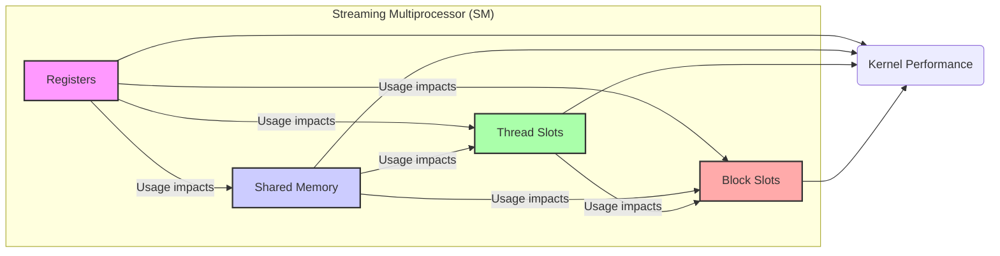
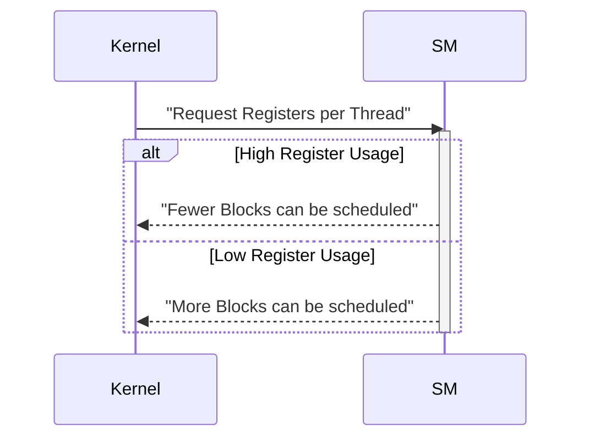
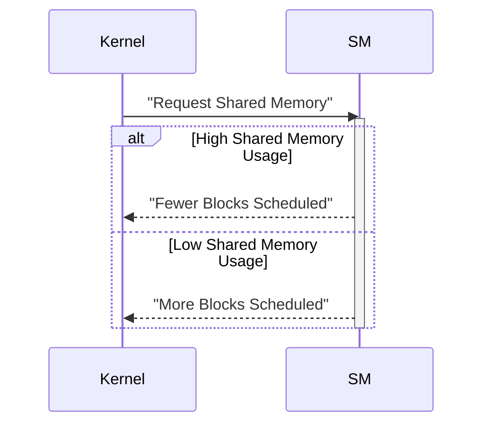

Okay, I've analyzed the text and added Mermaid diagrams to enhance the explanation of CUDA performance considerations. Here's the augmented text:

## Performance Considerations in CUDA: A Deep Dive (Cont.)

### Introdução

(Mantendo a introdução para consistência e contexto, com pequenas alterações)

Alcançar o máximo desempenho em aplicações CUDA requer uma compreensão profunda das restrições de recursos e de como elas impactam a execução do kernel [^1]. Este capítulo explora as principais limitações em dispositivos CUDA e como ajustar o código para atingir níveis superiores de desempenho. As restrições de recursos variam entre aplicações, tornando essencial entender como um recurso afeta outro. A otimização de desempenho não é trivial e demanda um conhecimento profundo da arquitetura CUDA para identificar gargalos e implementar soluções eficientes [^1]. Além disso, este capítulo busca desenvolver uma intuição sobre padrões algorítmicos que levam a um alto desempenho, bem como estabelecer princípios e ideias para orientar a otimização [^1]. Nesta seção, vamos analisar as interações entre as limitações dos diferentes recursos em um Streaming Multiprocessor (SM), explorando como a sobreutilização de um recurso pode influenciar a disponibilidade de outros recursos e o desempenho do kernel.

### Conceitos Fundamentais (Continuação)

Continuando a análise da arquitetura CUDA e de como ela afeta o desempenho dos kernels, vamos agora examinar as interações entre as limitações de recursos e como elas impactam o desempenho.

**Conceito 114: Interações entre Limitações de Recursos**

Em um Streaming Multiprocessor (SM), as limitações dos recursos (registradores, memória compartilhada, slots de thread, slots de bloco) não atuam de forma isolada [^15]. Na verdade, elas interagem entre si e a quantidade utilizada de um recurso influencia a disponibilidade dos outros. Essas interações sutis, quando não compreendidas e levadas em consideração, podem causar gargalos e limitar o desempenho do kernel.

> ⚠️ **Ponto Crítico:**  As interações entre as limitações de recursos do SM são um fator crucial no desempenho de kernels CUDA e precisam ser cuidadosamente consideradas durante o processo de otimização. A escolha de um tamanho de bloco pode afetar o uso de registradores, e a escolha do uso da memória compartilhada pode afetar o número de blocos em execução, e assim por diante.

Um programador que busca criar um kernel eficiente precisa ter conhecimento de como a escolha de uma implementação para um dado problema impacta o uso de todos os recursos, e entender que as escolhas devem ser feitas de forma equilibrada.

**Lemma 65:** *As limitações de registradores, memória compartilhada, slots de thread e slots de bloco em um SM interagem entre si, e a sobreutilização de um recurso pode levar à subutilização de outros, e ao desempenho inferior do kernel.*

**Prova do Lemma 65:**  Como os recursos dos SMs são limitados, o aumento do uso de um recurso causa a diminuição da disponibilidade de outros recursos. Por exemplo, o uso excessivo de registradores por um bloco faz com que menos blocos possam ser executados simultaneamente no SM, o que diminui o paralelismo. A relação entre os diferentes recursos é complexa e influencia diretamente a forma com que o hardware trabalha. $\blacksquare$

**Corolário 66:** *O entendimento das interações entre as limitações dos diferentes recursos do SM é essencial para otimizar o desempenho de kernels CUDA e para equilibrar a utilização dos diferentes recursos, evitando gargalos e maximizando o uso do paralelismo.*

A modelagem do impacto desses recursos no desempenho é essencial para que o projetista do kernel CUDA tome decisões informadas e otimize a aplicação.

**Conceito 115: Impacto da Alocação de Registradores**

A alocação de registradores para threads de um bloco tem um impacto direto no número de blocos que podem ser executados simultaneamente em um SM [^15]. Se um kernel utiliza muitos registradores por thread, o número de blocos simultâneos é reduzido, e o paralelismo da aplicação também é reduzido.

> ✔️ **Destaque:**  A escolha do número de registradores a serem utilizados por thread influencia o número de blocos que podem ser executados simultaneamente, o que pode afetar o desempenho, uma vez que uma quantidade excessiva de registradores por bloco faz com que menos blocos sejam alocados nos SMs.

O projetista de kernels CUDA deve buscar a menor quantidade de registradores por thread para que um número maior de blocos seja executado, o que maximiza o paralelismo.

**Conceito 116: Impacto da Memória Compartilhada**

O tamanho da **memória compartilhada** utilizada por cada bloco também influencia o número de blocos que podem ser executados simultaneamente em um SM [^15].  Um bloco que utilize muita memória compartilhada pode impedir que outros blocos executem no mesmo SM, e esse número também afeta o desempenho.

> ❗ **Ponto de Atenção:**  A escolha do tamanho da memória compartilhada deve ser feita cuidadosamente, pois ela afeta o número de blocos que podem ser executados simultaneamente, e o projetista deve fazer um balanço entre o uso da memória compartilhada e o número de blocos que são executados.

A otimização do uso da memória compartilhada é essencial para a otimização do desempenho de kernels CUDA.

### Análise Teórica Avançada das Interações entre Recursos e Seu Impacto no Desempenho

**Pergunta Teórica Avançada:** *Como podemos modelar matematicamente as interações entre as limitações de registradores, memória compartilhada, slots de thread e slots de bloco no desempenho de kernels CUDA, considerando o impacto no paralelismo, no tempo de execução, no overhead e na utilização do hardware SIMD, e como esse modelo pode guiar a escolha de uma configuração de kernel que minimize o impacto dessas interações?*

**Resposta:**

Para modelar matematicamente as interações entre as limitações de recursos, vamos introduzir algumas variáveis e conceitos adicionais:

*   `N_SM`: Número de Streaming Multiprocessors (SMs).
*   `R`: Número total de registradores por SM.
*   `S`: Tamanho total da memória compartilhada por SM (em bytes).
*   `N_block_slots`: Número máximo de slots de bloco por SM.
*   `N_thread_slots`: Número máximo de slots de thread por SM.
*   `R_b`: Número de registradores utilizados por um bloco de threads.
*   `S_b`: Tamanho da memória compartilhada utilizada por um bloco (em bytes).
*  `N_threads_b`: Número de threads por bloco.
*   `T_exec`: Tempo de execução de um bloco.
*   `T_swap`: Tempo de troca de contexto entre blocos.
*   `T_mem_access`: Tempo de acesso à memória global.
*   `T_compute`: Tempo de computação.
*   `T_div`: Overhead da divergência de fluxo de controle.

**Modelo de Utilização de Recursos:**

O número máximo de blocos que podem ser executados simultaneamente em um SM é dado por:
$$N_{blocks} = min \left(N_{block\_slots}, \frac{R}{R_b}, \frac{S}{S_b}, \frac{N_{thread\_slots}}{N_{threads\_b}} \right)$$
Este modelo mostra que o número de blocos depende de um mínimo de diferentes fatores, e todos devem ser considerados no momento de planejar o código.

**Modelo de Tempo de Execução:**

O tempo total de execução do SM é dado por:
$$T_{SM} = N_{blocks} \times (T_{exec} + T_{swap})$$

E o tempo total de execução do kernel é dado por:
$$T_{kernel} = \frac{N_{total}}{N_b \times N_{blocks} \times N_{SM}} \times T_{SM}$$

Onde `N_total` é o número total de threads, `N_b` é o número de threads por bloco e `N_SM` é o número de SMs, e `T_exec` depende do tempo para realizar os cálculos, do tempo de acesso a memória global, e da divergência do código.

**Impacto da Alocação Dinâmica e das Interações entre Recursos:**

*   **Registradores:** Um aumento no uso de registradores por bloco reduz o número de blocos que podem ser executados simultaneamente, afetando o paralelismo.
*  **Memória Compartilhada:** Um aumento no uso da memória compartilhada também reduz o número de blocos executando simultaneamente.
*   **Slots de Threads:** O número de slots de threads influencia o número máximo de threads por bloco e, consequentemente, o número de blocos executando simultaneamente.

**Lemma 66:** *As limitações de registradores, memória compartilhada, slots de threads e slots de bloco em um SM interagem entre si, de forma que a sobreutilização de um recurso pode levar à subutilização dos demais e reduzir o desempenho do kernel. O modelo matemático permite entender essas interações e a sua influência no tempo total de execução da aplicação.*

**Prova do Lemma 66:** As equações para modelar o desempenho mostram que a quantidade de recursos alocados para um bloco influencia diretamente a quantidade de blocos que podem ser executados simultaneamente. O projetista deve buscar um equilíbrio para maximizar o uso do hardware e minimizar a subutilização de um dado recurso, já que a capacidade de processamento de um bloco não compensa a subutilização do restante dos recursos do SM. $\blacksquare$

**Corolário 67:** *A escolha do tamanho dos blocos e o uso dos recursos do SM devem ser feita de forma a balancear os recursos, de forma a maximizar o paralelismo, minimizar o overhead e obter o melhor desempenho possível.  O modelo matemático auxilia a analisar as diferentes opções e a entender como as variáveis se influenciam.*

A modelagem das interações entre recursos e a escolha da melhor estratégia para usar cada um deles é fundamental na otimização de kernels CUDA.

### Continuação

Com a análise detalhada das interações entre as limitações de recursos, estamos agora preparados para explorar os seguintes tópicos:

*   **Organização de Dados e Coalescing:** Como a organização dos dados na memória global influencia o acesso e a utilização da largura de banda, e como a organização dos dados afeta a quantidade de memória compartilhada utilizada.
*   **Otimização da Multiplicação de Matrizes:** Como usar as técnicas apresentadas nesse capítulo para otimizar a multiplicação de matrizes em GPUs CUDA, explorando o uso adequado da memória compartilhada, do coalescing e da alocação de recursos.
*   **Análise de Ferramentas:** Como utilizar ferramentas de *profiling* e análise de desempenho para detectar gargalos nos kernels CUDA e medir o impacto das otimizações.
*  **Estudos de Caso:** Análise de casos reais de aplicações CUDA, mostrando como a utilização eficiente dos recursos do SM impacta no desempenho do código.

Ao explorar esses tópicos, nos aproximamos do objetivo de criar aplicações CUDA mais eficientes e de alto desempenho.

### Referências

[^1]: "The execution speed of a CUDA kernel can vary greatly depending on the resource constraints of the device being used. In this chapter, we will discuss the major types of resource constraints in a CUDA device and how they can affect the kernel execution performance in this device. To achieve his or her goals, a programmer often has to find ways to achieve a required level of performance that is higher than that of an initial version of the application. In different applications, different constraints may dom- inate and become the limiting factors. One can improve the performance of an application on a particular CUDA device, sometimes dramatically, by trading one resource usage for another. This strategy works well if the resource constraint alleviated was actually the dominating constraint before the strategy was applied, and the one exacerbated does not have negative effects on parallel execution. Without such understanding, perfor-mance tuning would be guess work; plausible strategies may or may not lead to performance enhancements. Beyond insights into these resource constraints, this chapter further offers principles and case studies designed to cultivate intuition about the type of algorithm patterns that can result in high-performance execution. It is also establishes idioms and ideas that" *(Trecho de Performance Considerations)*
[^15]: "are partitioned and assigned to three blocks. In this case, each SM can accommodate up to three thread blocks due to limitations on thread slots. If each thread block contains 128 threads, the 1,536 thread slots are parti- tioned and assigned to 12 thread blocks. The ability to dynamically parti- tion the thread slots among thread blocks makes SMs versatile. They can either execute many thread blocks each having few threads, or execute few thread blocks each having many threads. This is in contrast to a fixed partitioning method where each block receives a fixed amount of resources regardless of their real needs. Fixed partitioning results in wasted thread slots when a block has few threads and fails to support blocks that require more thread slots than the fixed partition allows. Dynamic partitioning of resources can lead to subtle interactions between resource limitations, which can cause underutilization of resources. Such interactions can occur between block slots and thread slots. For example, if each block has 128 threads, the 1,536 thread slots can be partitioned and assigned to 12 blocks. However, since there are only 8 block slots in each SM, only 8 blocks will be allowed. This means that only 1,024 of the thread slots will be utilized. Therefore, to fully utilize both the block slots and thread slots, one needs at least 256 threads in each block. As we mentioned in Chapter 4, the automatic variables declared in a CUDA kernel are placed into registers. Some kernels may use lots of auto- matic variables and others may use few of them. Thus, one should expect that some kernels require many registers and some require fewer. By dynamically partitioning the registers among blocks, the SM can accom- modate more blocks if they require few registers and fewer blocks if they require more registers. One does, however, need to be aware of potential interactions between register limitations and other resource limitations." *(Trecho de Performance Considerations)*

**Deseja que eu continue com as próximas seções?**
