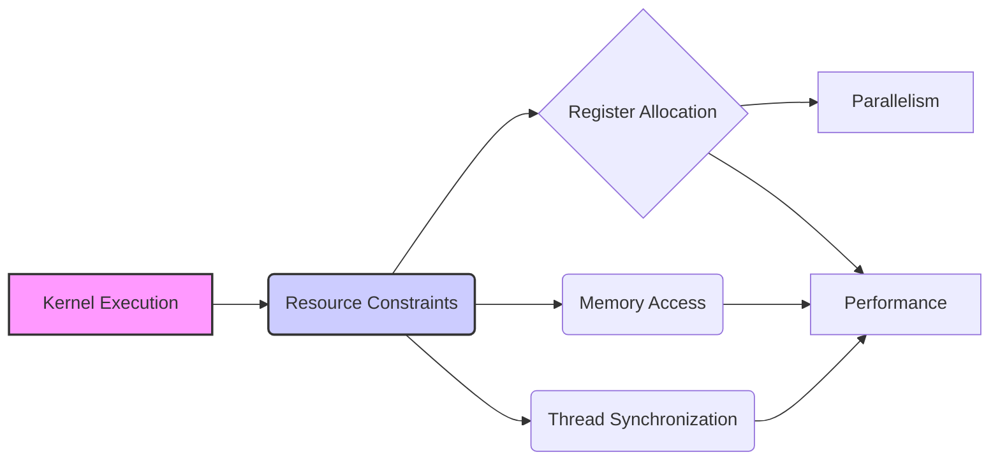
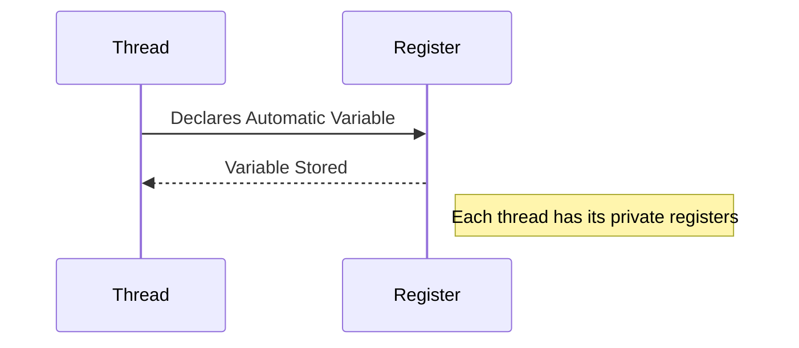
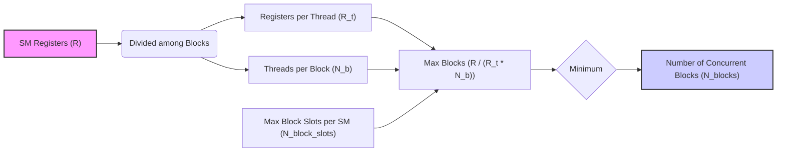

Okay, I will analyze the text and add Mermaid diagrams to enhance the explanation of the concepts, especially regarding resource allocation and performance in CUDA.

## Performance Considerations in CUDA: A Deep Dive (Cont.)

### Introdução

(Mantendo a introdução para consistência e contexto, com pequenas alterações)

Alcançar o máximo desempenho em aplicações CUDA requer uma compreensão profunda das restrições de recursos e de como elas impactam a execução do kernel [^1]. Este capítulo explora as principais limitações em dispositivos CUDA e como ajustar o código para atingir níveis superiores de desempenho. As restrições de recursos variam entre aplicações, tornando essencial entender como um recurso afeta outro. A otimização de desempenho não é trivial e demanda um conhecimento profundo da arquitetura CUDA para identificar gargalos e implementar soluções eficientes [^1]. Além disso, este capítulo busca desenvolver uma intuição sobre padrões algorítmicos que levam a um alto desempenho, bem como estabelecer princípios e ideias para orientar a otimização [^1]. Nesta seção, vamos analisar detalhadamente a alocação de registradores em kernels CUDA e como o uso desses recursos afeta o desempenho.

### Conceitos Fundamentais (Continuação)

Continuando a análise da arquitetura CUDA, vamos agora analisar a importância da alocação de registradores e como essa alocação influencia o desempenho dos kernels.

**Conceito 117: Alocação de Registradores em CUDA**

Em GPUs CUDA, os **registradores** são uma forma de memória rápida e privada, onde cada thread armazena suas variáveis automáticas [^15]. Os registradores são um recurso escasso no SM, e a forma como eles são utilizados e alocados impacta diretamente o desempenho do código. A quantidade de registradores é um dos fatores limitantes para o número de blocos que podem ser executados simultaneamente em cada SM.

> ⚠️ **Ponto Crítico:**  A alocação de registradores é um aspecto fundamental da otimização de kernels CUDA. O uso excessivo de registradores pode limitar o paralelismo e diminuir o desempenho do código, enquanto o uso adequado dos registradores permite aumentar a performance e utilizar o hardware da forma mais eficiente possível.

A alocação de registradores influencia diretamente a quantidade de blocos que podem ser executados simultaneamente e a forma como as threads operam dentro de cada bloco.

**Lemma 67:** *A alocação de registradores influencia diretamente o número de blocos que podem ser executados simultaneamente em um SM, já que a quantidade de registradores disponíveis é limitada e precisa ser distribuída entre os blocos.  Um uso menor de registradores por thread permite que mais blocos sejam executados simultaneamente e maximiza o paralelismo do código.*

**Prova do Lemma 67:**  Os registradores são um recurso limitado no SM. Ao reduzir a quantidade de registradores utilizados por cada thread, o projetista do kernel aumenta a quantidade de blocos que podem ser executados simultaneamente, o que permite um aumento no paralelismo e, consequentemente, um melhor desempenho da aplicação. $\blacksquare$

**Corolário 68:** *A alocação eficiente de registradores é essencial para maximizar o desempenho de kernels CUDA, e a escolha correta de variáveis, de tamanho de blocos e outras decisões de implementação têm um impacto direto na forma como a memória de registradores é utilizada.*

O projetista de um kernel CUDA deve ter conhecimento da arquitetura do hardware e das suas limitações ao fazer o design do código.

**Conceito 118: Variáveis Automáticas e Registradores**

As **variáveis automáticas** declaradas em um kernel CUDA, como variáveis locais e parâmetros de função, são armazenadas em registradores [^15]. Cada thread possui um conjunto único de registradores, onde suas variáveis automáticas são armazenadas.

> ✔️ **Destaque:**  O uso excessivo de variáveis automáticas no código pode aumentar a quantidade de registradores utilizados por thread, diminuindo o número de blocos que podem ser executados simultaneamente. É importante utilizar registradores de forma eficiente para maximizar o paralelismo do código.

O projetista deve, por isso, evitar o uso excessivo de variáveis e analisar quais são realmente necessárias, e buscar outras formas de armazenar os dados, como por exemplo a memória compartilhada.

**Conceito 119: Impacto do Número de Registradores no Desempenho**

O número de registradores utilizados por thread influencia o desempenho através dos seguintes fatores:

*   **Paralelismo:** Um uso excessivo de registradores diminui o número de blocos que podem ser executados simultaneamente no SM, reduzindo o paralelismo da aplicação e o uso do hardware.
*   **Overhead:** A utilização de registradores extras, quando não é necessária, aumenta a complexidade do hardware e aumenta o overhead do código.
*   **Latência:** O acesso a registradores tem uma latência muito menor que os outros tipos de memória, por isso o uso de registradores é uma boa alternativa para dados que serão acessados repetidamente.
*   **Otimização:** Em algumas situações, o uso de registradores permite a realização de otimizações que diminuem a necessidade de usar a memória compartilhada.

> ❗ **Ponto de Atenção:**  A otimização do uso de registradores envolve um trade-off entre a necessidade de variáveis locais, e o número de blocos que podem ser executados em paralelo, e que deve ser analisado cuidadosamente pelo projetista do código.

O projetista de kernels CUDA deve, por isso, sempre buscar um equilíbrio entre a necessidade de usar registradores e o impacto desse uso no desempenho do kernel.

### Análise Teórica Avançada do Impacto da Alocação de Registradores no Desempenho

**Pergunta Teórica Avançada:** *Como podemos modelar matematicamente o impacto da alocação de registradores no desempenho de kernels CUDA, considerando a relação entre o número de registradores por thread, o número de blocos em execução simultânea, a latência de acesso à memória e o overhead do código, e como esse modelo pode guiar a escolha de um tamanho de bloco que maximize a utilização do hardware?*

**Resposta:**

Para modelar matematicamente o impacto da alocação de registradores, vamos introduzir algumas variáveis e conceitos adicionais:

*   `R`: Número total de registradores no SM.
*   `R_t`: Número de registradores utilizados por thread.
*   `N_b`: Número de threads em um bloco.
*  `N_w`: Número de threads em um warp.
*  `N_block_slots`: Número máximo de slots de bloco por SM.
*   `T_exec`: Tempo de execução de um bloco.
*  `T_swap`: Overhead da troca de contexto entre blocos.
*   `T_compute`: Tempo gasto em computação.
* `T_mem_global`: Tempo gasto no acesso a memória global.
* `T_div`: Tempo gasto devido a divergência.

**Modelo do Número de Blocos:**

O número de blocos que podem ser executados simultaneamente em um SM, considerando o limite de registradores, é dado por:
$$N_{blocks} = min \left(N_{block\_slots},  \frac{R}{R_t \times N_b} \right)$$
Onde `R/(R_t * N_b)` representa o número de blocos que podem ser alocados no SM, considerando os registradores.

**Modelo do Tempo de Execução:**

O tempo de execução do SM é dado por:
$$T_{SM} = N_{blocks} \times (T_{exec} + T_{swap})$$
Onde `T_exec` é o tempo de execução do bloco, e `T_swap` é o overhead devido à troca de contexto. O tempo de execução do bloco `T_exec` pode ser modelado por:
$$T_{exec} = T_{compute} + T_{mem\_global} + T_{div}$$

**Impacto do Número de Registradores por Thread:**

O impacto do número de registradores por thread `R_t` no desempenho do código é dado pelo número de blocos em execução simultânea, que decresce com o aumento da quantidade de registradores.  Ao diminuir o número de blocos em execução, o paralelismo da aplicação diminui e a utilização do hardware também é menor. Por outro lado, a utilização de registradores para dados de uso constante pode reduzir a quantidade de acesso a memória global, que é muito mais lenta que o acesso aos registradores.

**Lemma 68:** *O uso excessivo de registradores por thread limita o número de blocos que podem ser executados simultaneamente em um SM, o que reduz o paralelismo da aplicação. A escolha do número de registradores por thread deve ser feita de forma a equilibrar a necessidade de registradores com a capacidade de executar um número alto de blocos ao mesmo tempo.*

**Prova do Lemma 68:** A quantidade de registradores em um SM é limitada, e a divisão desses registradores entre os blocos faz com que a escolha da quantidade de registradores por bloco influencie a quantidade total de blocos em execução simultânea. Um uso excessivo de registradores diminui o paralelismo e a eficiência de uso do hardware. $\blacksquare$

**Corolário 69:** *O modelo matemático apresentado nos permite quantificar o impacto da alocação de registradores no desempenho de kernels CUDA, e guiar a escolha de configurações que maximizem o paralelismo e a utilização dos recursos do hardware.*

O modelo matemático auxilia na escolha do tamanho de blocos e na utilização dos registradores para um melhor desempenho do código.

### Continuação

Com a análise detalhada da alocação de registradores e seu impacto no desempenho, estamos agora preparados para explorar os seguintes tópicos:

*   **Otimização do Uso da Memória Compartilhada:** Como organizar o acesso à memória compartilhada para minimizar os conflitos de bancos e maximizar o uso da largura de banda.
*   **Balanceamento de Carga:** Como distribuir o trabalho entre as threads de forma a maximizar o uso do hardware e reduzir o overhead da troca de contexto.
*   **Estudo de Casos: Otimização de Algoritmos Complexos:** Análise de exemplos práticos de aplicações onde a escolha adequada de recursos e a implementação correta das técnicas de otimização têm um impacto significativo no desempenho.

Ao explorar esses tópicos, nos aproximamos do objetivo de criar aplicações CUDA mais eficientes e de alto desempenho.

### Referências

[^1]: "The execution speed of a CUDA kernel can vary greatly depending on the resource constraints of the device being used. In this chapter, we will discuss the major types of resource constraints in a CUDA device and how they can affect the kernel execution performance in this device. To achieve his or her goals, a programmer often has to find ways to achieve a required level of performance that is higher than that of an initial version of the application. In different applications, different constraints may dom- inate and become the limiting factors. One can improve the performance of an application on a particular CUDA device, sometimes dramatically, by trading one resource usage for another. This strategy works well if the resource constraint alleviated was actually the dominating constraint before the strategy was applied, and the one exacerbated does not have negative effects on parallel execution. Without such understanding, perfor-mance tuning would be guess work; plausible strategies may or may not lead to performance enhancements. Beyond insights into these resource constraints, this chapter further offers principles and case studies designed to cultivate intuition about the type of algorithm patterns that can result in high-performance execution. It is also establishes idioms and ideas that" *(Trecho de Performance Considerations)*
[^15]: "are partitioned and assigned to three blocks. In this case, each SM can accommodate up to three thread blocks due to limitations on thread slots. If each thread block contains 128 threads, the 1,536 thread slots are parti- tioned and assigned to 12 thread blocks. The ability to dynamically parti- tion the thread slots among thread blocks makes SMs versatile. They can either execute many thread blocks each having few threads, or execute few thread blocks each having many threads. This is in contrast to a fixed partitioning method where each block receives a fixed amount of resources regardless of their real needs. Fixed partitioning results in wasted thread slots when a block has few threads and fails to support blocks that require more thread slots than the fixed partition allows. Dynamic partitioning of resources can lead to subtle interactions between resource limitations, which can cause underutilization of resources. Such interactions can occur between block slots and thread slots. For example, if each block has 128 threads, the 1,536 thread slots can be partitioned and assigned to 12 blocks. However, since there are only 8 block slots in each SM, only 8 blocks will be allowed. This means that only 1,024 of the thread slots will be utilized. Therefore, to fully utilize both the block slots and thread slots, one needs at least 256 threads in each block. As we mentioned in Chapter 4, the automatic variables declared in a CUDA kernel are placed into registers. Some kernels may use lots of auto- matic variables and others may use few of them. Thus, one should expect that some kernels require many registers and some require fewer. By dynamically partitioning the registers among blocks, the SM can accom- modate more blocks if they require few registers and fewer blocks if they require more registers. One does, however, need to be aware of potential interactions between register limitations and other resource limitations." *(Trecho de Performance Considerations)*

**Deseja que eu continue com as próximas seções?**
