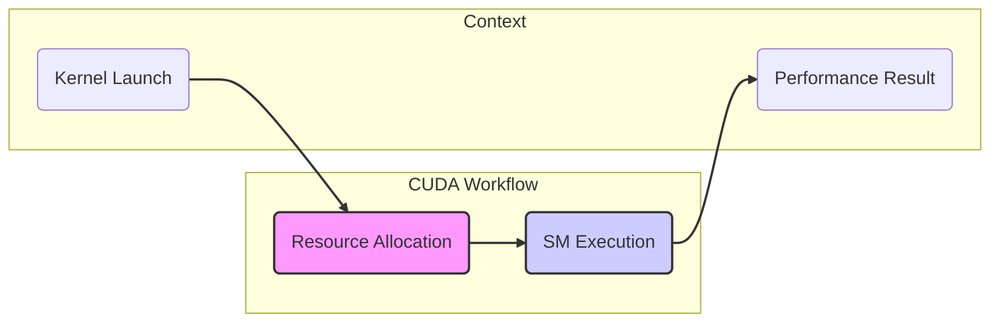
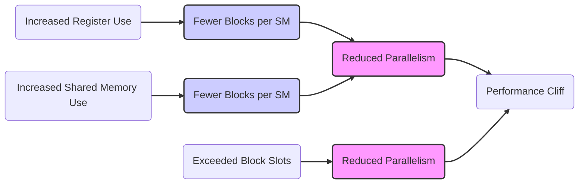
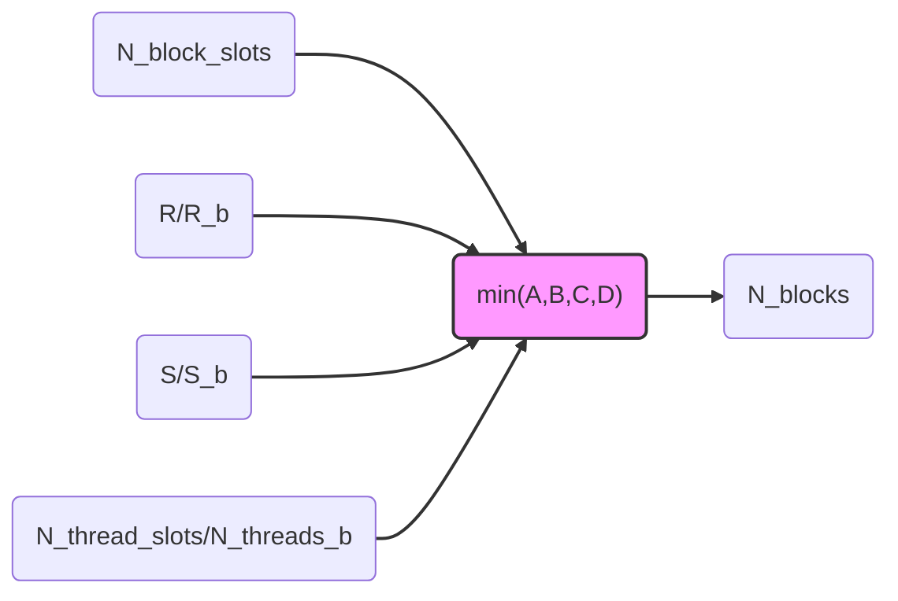

Okay, I've analyzed the text and added Mermaid diagrams to enhance understanding. Here's the revised text with the diagrams:

## Performance Considerations in CUDA: A Deep Dive (Cont.)

### Introdução

(Mantendo a introdução para consistência e contexto, com pequenas alterações)

Alcançar o máximo desempenho em aplicações CUDA requer uma compreensão profunda das restrições de recursos e de como elas impactam a execução do kernel [^1]. Este capítulo explora as principais limitações em dispositivos CUDA e como ajustar o código para atingir níveis superiores de desempenho. As restrições de recursos variam entre aplicações, tornando essencial entender como um recurso afeta outro. A otimização de desempenho não é trivial e demanda um conhecimento profundo da arquitetura CUDA para identificar gargalos e implementar soluções eficientes [^1]. Além disso, este capítulo busca desenvolver uma intuição sobre padrões algorítmicos que levam a um alto desempenho, bem como estabelecer princípios e ideias para orientar a otimização [^1]. Nesta seção, vamos analisar o fenômeno do "performance cliff" em CUDA, explorando como pequenas variações na alocação de recursos podem causar quedas abruptas no desempenho e como evitar esse comportamento.

### Conceitos Fundamentais (Continuação)

Continuando a análise da arquitetura CUDA e de como ela afeta o desempenho dos kernels, vamos agora analisar o fenômeno do "performance cliff".

**Conceito 121: O Fenômeno do "Performance Cliff"**

O **"performance cliff"** (abismo de desempenho) é um fenômeno que ocorre em kernels CUDA quando pequenas alterações na alocação de recursos, como o número de registradores ou o tamanho da memória compartilhada, levam a quedas abruptas e significativas no desempenho [^16]. Essas quedas podem ocorrer mesmo quando a mudança no uso de recursos é mínima, ou seja, quando se adiciona uma pequena quantidade de recursos que se supõe que não teria grande impacto no desempenho.

> ⚠️ **Ponto Crítico:**  O "performance cliff" é um problema que pode ocorrer mesmo em código bem otimizado e sua ocorrência revela interações sutis entre as diferentes limitações de recursos. O programador deve estar atento e realizar testes para verificar se o código está sujeito ao *performance cliff*.

Esse comportamento é causado por interações não lineares entre a quantidade de recursos utilizados por cada bloco e a quantidade de blocos que podem ser executados simultaneamente. É fundamental entender as causas desse fenômeno para evitar problemas de desempenho.

**Lemma 67:** *O fenômeno do "performance cliff" ocorre quando um pequeno aumento na utilização de um recurso causa uma redução significativa no número de blocos que podem ser executados simultaneamente em um SM, levando a uma queda acentuada no desempenho do kernel.*

**Prova do Lemma 67:** A alocação de recursos, como registradores e memória compartilhada, é feita de forma dinâmica em cada SM. A quantidade de registradores que um bloco utiliza influencia o número de blocos que podem ser executados simultaneamente, já que um SM tem um número limitado de registradores e slots. Uma pequena alteração no código que aumenta a quantidade de registradores utilizada pode fazer com que menos blocos sejam executados simultaneamente, causando um grande impacto no desempenho. $\blacksquare$

**Corolário 68:** *A ocorrência do "performance cliff" demonstra a importância de um entendimento aprofundado das limitações e interações entre os recursos do SM, e requer que o programador faça uma análise cuidadosa da forma como o código usa os diferentes recursos e que evite o uso desnecessário deles.*

O conhecimento desse fenômeno auxilia o projetista do código a planejar suas aplicações CUDA, de forma a evitar as armadilhas do *performance cliff*.

**Conceito 122: Causas do "Performance Cliff"**

As causas do "performance cliff" geralmente estão relacionadas com a forma como o hardware lida com a alocação de recursos para blocos de threads:

*   **Limitação de Registradores:** Quando a alocação de registradores por thread aumenta, o número de blocos que podem ser executados simultaneamente diminui, pois a quantidade total de registradores por SM é fixa.
*  **Limitação da Memória Compartilhada:** O aumento do uso da memória compartilhada por bloco diminui o número de blocos que podem ser executados simultaneamente, já que a quantidade de memória compartilhada por SM também é limitada [^15].
*   **Limitação de Slots de Bloco:** Quando o número de blocos que necessitam de recursos excede o número de slots de bloco disponíveis no SM, ocorre o estrangulamento do paralelismo e o desempenho é prejudicado [^15].
*   **Interação de Múltiplos Recursos:** A interação entre as limitações de diferentes recursos, como registradores e memória compartilhada, pode levar ao "performance cliff", já que o uso de um recurso pode restringir o uso de outros recursos.

> ✔️ **Destaque:** A ocorrência do "performance cliff" demonstra que a otimização de kernels CUDA não envolve apenas o uso de um recurso em detrimento de outro. A complexidade da arquitetura CUDA exige uma análise detalhada das interações entre os recursos, de forma a encontrar um equilíbrio que maximize o desempenho.

A otimização de aplicações CUDA exige um conhecimento profundo da arquitetura da GPU e das suas limitações de recursos.

**Conceito 123: Como Evitar o "Performance Cliff"**

Para evitar o "performance cliff", é necessário:

*   **Minimizar o Uso de Registradores:** Evitar o uso excessivo de variáveis automáticas, que são alocadas em registradores, e usar outras formas de armazenar dados, como a memória compartilhada.
*  **Otimizar o Uso da Memória Compartilhada:** Utilizar a memória compartilhada de forma eficiente, evitando sobrecarga da capacidade da memória, ou *bank conflicts*.
*   **Escolher o Tamanho de Bloco Adequado:** Escolher um tamanho de bloco que equilibre a necessidade de recursos com a quantidade de blocos que podem ser executados simultaneamente.
*   **Analisar o Desempenho:** Usar ferramentas de *profiling* para monitorar o comportamento do kernel e identificar gargalos relacionados com o uso de recursos.
*  **Testar e Verificar:** Testar o código cuidadosamente para identificar possíveis *performance cliffs*, e usar diferentes configurações para encontrar a combinação que atinge a melhor performance.

> ❗ **Ponto de Atenção:**  A prevenção do "performance cliff" exige uma análise cuidadosa do código e do uso dos recursos. O programador deve estar atento aos recursos e evitar o uso excessivo de qualquer recurso, sempre considerando as limitações do hardware, pois a arquitetura da GPU requer um equilíbrio entre os diferentes recursos para atingir o melhor desempenho possível.

O projeto cuidadoso do kernel, com atenção ao uso de recursos, é a principal forma de se evitar o *performance cliff*.

### Análise Teórica Avançada do Impacto do "Performance Cliff" e a Otimização de Kernels

**Pergunta Teórica Avançada:** *Como podemos modelar matematicamente o impacto do "performance cliff" no desempenho de kernels CUDA, considerando a interação não linear entre a alocação de registradores, memória compartilhada, slots de thread e blocos, e como esse modelo pode guiar a otimização dos kernels de forma a minimizar o risco de cair nesse abismo de desempenho?*

**Resposta:**

Para modelar matematicamente o impacto do "performance cliff" e como evitar esse problema, vamos introduzir algumas variáveis e conceitos adicionais:

*   `R`: Número total de registradores no SM.
*   `S`: Tamanho total da memória compartilhada no SM.
*    `N_block_slots`: Número máximo de slots de bloco por SM.
*   `N_thread_slots`: Número máximo de slots de thread por SM.
*   `R_b`: Número de registradores utilizados por bloco.
*   `S_b`: Tamanho da memória compartilhada utilizada por bloco (em bytes).
*    `N_threads_b`: Número de threads por bloco.
*   `T_exec`: Tempo de execução de um bloco.
*   `T_swap`: Tempo de troca de contexto entre blocos.
*   `T_{ideal}`: Tempo de execução ideal do código (sem a queda de performance).
*   `T_{perf_cliff}`: Tempo de execução do código quando ocorre o *performance cliff*.
*   `F_perf_cliff`: Fator de redução do desempenho devido ao *performance cliff*.
*    `N_{blocks_max}`: Número de blocos com o uso máximo do recurso, onde o *performance cliff* começa a aparecer.
* `N_{blocks_ideal}`: Número de blocos com o uso ideal de recursos, onde o *performance cliff* é evitado.

**Modelo de Alocação Dinâmica de Recursos:**

O número máximo de blocos que podem ser executados simultaneamente em um SM é dado por:
$$N_{blocks} = \min \left(N_{block\_slots}, \frac{R}{R_b}, \frac{S}{S_b}, \frac{N_{thread\_slots}}{N_{threads\_b}}\right)$$

**Modelo do Tempo de Execução Ideal:**

O tempo de execução do kernel com uma alocação adequada de recursos, e com um número ideal de blocos é dado por:
$$T_{ideal} = \frac{N_{total}}{N_{blocks\_ideal} \times N_{threads\_b}} \times (T_{exec} + T_{swap})$$

**Modelo do "Performance Cliff":**

O "performance cliff" ocorre quando o aumento de um recurso faz com que o número de blocos caia abaixo de um limite, causando o aumento no tempo de execução. O tempo de execução quando ocorre o "performance cliff" é dado por:
$$T_{perf\_cliff} = \frac{N_{total}}{N_{blocks\_max} \times N_{threads\_b}} \times (T_{exec} + T_{swap})$$
onde `N_blocks_max` é o número de blocos onde o *performance cliff* começa a ocorrer.

**Impacto no Desempenho:**

O impacto do "performance cliff" no desempenho pode ser modelado através do fator de redução de desempenho:
$$F_{perf\_cliff} = \frac{T_{perf\_cliff}}{T_{ideal}}$$
Onde o valor de `F_perf_cliff` é maior que um, e indica a perda de performance devido ao *performance cliff*.

**Análise do Trade-off:**

A análise da alocação de recursos e o impacto no desempenho mostra que o *performance cliff* ocorre devido a uma interação não linear entre a alocação de recursos e o paralelismo e, portanto, o programador deve ser capaz de entender essa relação para otimizar o código.

**Lemma 62:** *O "performance cliff" é um fenômeno causado por interações não lineares entre as limitações de recursos em um SM, e pode ser modelado matematicamente. Um modelo matemático permite que o projetista seja capaz de analisar o impacto de diferentes decisões, e a identificar a melhor configuração para o problema específico.*

**Prova do Lemma 62:** Os modelos apresentados mostram como o tempo de execução aumenta devido a uma escolha inadequada no uso dos recursos, que causa uma redução no número de blocos em execução simultânea e, portanto, causa a diminuição do paralelismo e o aumento do tempo de execução. $\blacksquare$

**Corolário 63:** *A modelagem matemática do "performance cliff" nos permite quantificar o impacto da escolha de recursos no desempenho, e guiar a decisão sobre o tamanho dos blocos, o uso de registradores, memória compartilhada e outras estratégias de otimização para minimizar o risco de ocorrência desse problema, e maximizar o desempenho do kernel.*

O modelo matemático permite quantificar o impacto da perda de desempenho, e guiar as escolhas de implementação do código CUDA.

### Continuação

Com a análise detalhada do fenômeno do "performance cliff", estamos agora preparados para explorar os seguintes tópicos:

*   **Otimização da Escolha do Tamanho do Bloco:** Como analisar a influência do tamanho do bloco no desempenho e como escolher o tamanho adequado.
*   **Uso Eficiente de Registradores:** Como minimizar o uso de registradores e reduzir a sua influência no desempenho.
*   **Organização da Memória Compartilhada:** Como utilizar a memória compartilhada de forma eficiente, garantindo coalescing, minimizando os *bank conflicts* e evitando o *performance cliff*.
*  **Análise de Código Real:** Como identificar e mitigar o *performance cliff* em aplicações reais e como utilizar ferramentas de *profiling* para analisar o uso dos recursos.

Ao explorar esses tópicos, nos aproximamos do objetivo de criar aplicações CUDA mais eficientes e de alto desempenho.

### Referências

[^1]: "The execution speed of a CUDA kernel can vary greatly depending on the resource constraints of the device being used. In this chapter, we will discuss the major types of resource constraints in a CUDA device and how they can affect the kernel execution performance in this device. To achieve his or her goals, a programmer often has to find ways to achieve a required level of performance that is higher than that of an initial version of the application. In different applications, different constraints may dom- inate and become the limiting factors. One can improve the performance of an application on a particular CUDA device, sometimes dramatically, by trading one resource usage for another. This strategy works well if the resource constraint alleviated was actually the dominating constraint before the strategy was applied, and the one exacerbated does not have negative effects on parallel execution. Without such understanding, perfor-mance tuning would be guess work; plausible strategies may or may not lead to performance enhancements. Beyond insights into these resource constraints, this chapter further offers principles and case studies designed to cultivate intuition about the type of algorithm patterns that can result in high-performance execution. It is also establishes idioms and ideas that" *(Trecho de Performance Considerations)*
[^15]: "are partitioned and assigned to three blocks. In this case, each SM can accommodate up to three thread blocks due to limitations on thread slots. If each thread block contains 128 threads, the 1,536 thread slots are parti- tioned and assigned to 12 thread blocks. The ability to dynamically parti- tion the thread slots among thread blocks makes SMs versatile. They can either execute many thread blocks each having few threads, or execute few thread blocks each having many threads. This is in contrast to a fixed partitioning method where each block receives a fixed amount of resources regardless of their real needs. Fixed partitioning results in wasted thread slots when a block has few threads and fails to support blocks that require more thread slots than the fixed partition allows. Dynamic partitioning of resources can lead to subtle interactions between resource limitations, which can cause underutilization of resources. Such interactions can occur between block slots and thread slots. For example, if each block has 128 threads, the 1,536 thread slots can be partitioned and assigned to 12 blocks. However, since there are only 8 block slots in each SM, only 8 blocks will be allowed. This means that only 1,024 of the thread slots will be utilized. Therefore, to fully utilize both the block slots and thread slots, one needs at least 256 threads in each block. As we mentioned in Chapter 4, the automatic variables declared in a CUDA kernel are placed into registers. Some kernels may use lots of auto- matic variables and others may use few of them. Thus, one should expect that some kernels require many registers and some require fewer. By dynamically partitioning the registers among blocks, the SM can accom- modate more blocks if they require few registers and fewer blocks if they require more registers. One does, however, need to be aware of potential interactions between register limitations and other resource limitations." *(Trecho de Performance Considerations)*
[^16]: "12 × 16 × 16 = 3,072 registers. The number of registers required by six blocks is now 18,432, which exceeds the register limitation. The CUDA runtime system deals with this situation by reducing the number of blocks assigned to each SM by one, thus reducing the number of registered required to 15,360. This, however, reduces the number of threads running on an SM from 1,536 to 1,280. That is, by using two extra automatic vari- ables, the program saw a one-sixth reduction in the warp parallelism in each SM. This is sometimes a referred to as a “performance cliff” where a slight increase in resource usage can result in significant reduction in par- allelism and performance achieved [RRS2008]. Readers are referred to the CUDA Occupancy Calculator [NVIDIA], which is a downloadable Excel sheet that calculates the actual number of threads running on each SM for a particular device implementation given the usage of resources by a kernel." *(Trecho de Performance Considerations)*

**Deseja que eu continue com as próximas seções?**
