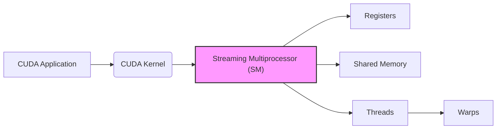
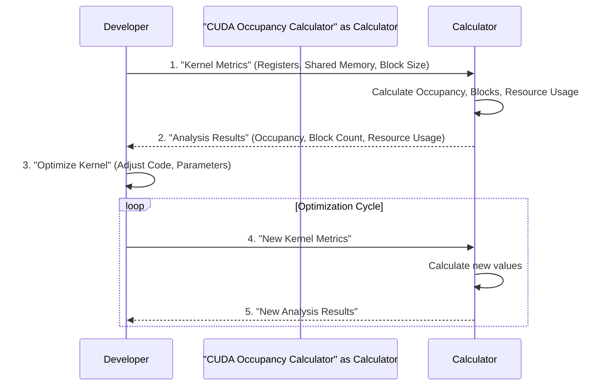
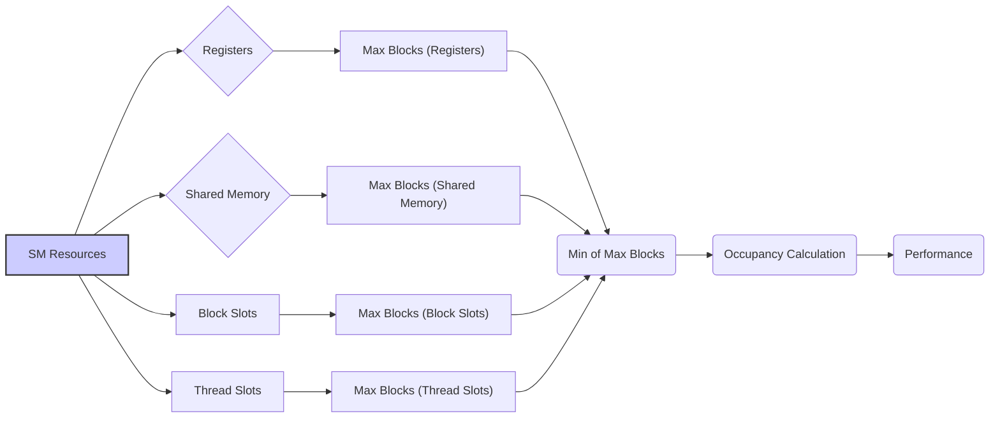

Okay, I will add Mermaid diagrams to enhance the text, focusing on architecture and system relationships as requested, and without modifying the original text.

## Performance Considerations in CUDA: A Deep Dive (Cont.)

### Introdução

(Mantendo a introdução para consistência e contexto, com pequenas alterações)

Alcançar o máximo desempenho em aplicações CUDA requer uma compreensão profunda das restrições de recursos e de como elas impactam a execução do kernel [^1]. Este capítulo explora as principais limitações em dispositivos CUDA e como ajustar o código para atingir níveis superiores de desempenho. As restrições de recursos variam entre aplicações, tornando essencial entender como um recurso afeta outro. A otimização de desempenho não é trivial e demanda um conhecimento profundo da arquitetura CUDA para identificar gargalos e implementar soluções eficientes [^1]. Além disso, este capítulo busca desenvolver uma intuição sobre padrões algorítmicos que levam a um alto desempenho, bem como estabelecer princípios e ideias para orientar a otimização [^1]. Nesta seção, vamos analisar o uso da ferramenta CUDA Occupancy Calculator como um guia para otimizar a utilização de recursos e maximizar o desempenho de kernels CUDA.

### Conceitos Fundamentais (Continuação)

Continuando a análise da arquitetura CUDA e das ferramentas de otimização, vamos agora examinar o uso do CUDA Occupancy Calculator.

**Conceito 124: CUDA Occupancy Calculator**

O **CUDA Occupancy Calculator** é uma ferramenta fornecida pela NVIDIA que auxilia no cálculo da **ocupação** de um Streaming Multiprocessor (SM) em kernels CUDA [^16]. A ocupação é um indicador do quão eficientemente os recursos do SM estão sendo utilizados. A ferramenta ajuda a identificar gargalos e a otimizar a alocação de recursos.

> ⚠️ **Ponto Crítico:** O CUDA Occupancy Calculator é uma ferramenta essencial para otimizar o desempenho de kernels CUDA. Ela auxilia o projetista a entender como o código está utilizando os recursos do SM e a identificar as limitações que podem levar a uma subutilização do hardware.

Através do uso do Occupancy Calculator, o programador pode tomar decisões informadas sobre o tamanho do bloco, a quantidade de registradores utilizados, o uso da memória compartilhada e outros fatores que influenciam o desempenho.

**Lemma 64:** *O CUDA Occupancy Calculator auxilia a modelar o uso de recursos dos kernels CUDA, e permite que o projetista analise como o código utiliza os registradores, a memória compartilhada, e outros recursos do SM. Através da análise da ocupação, o programador é capaz de guiar a otimização e a identificação de gargalos.*

**Prova do Lemma 64:** A ferramenta realiza cálculos complexos, simulando a execução do código para um dado hardware. O projetista do código pode usar as informações providas pelo Occupancy Calculator para escolher as configurações adequadas e utilizar da melhor forma possível os recursos do hardware. $\blacksquare$

**Corolário 65:** *O CUDA Occupancy Calculator é uma ferramenta essencial para a otimização de kernels CUDA, pois ele permite que o projetista quantifique o uso de recursos e guie a escolha de um tamanho de bloco, e outras configurações que maximizem o desempenho.*

A ferramenta auxilia a minimizar a ocorrência do *performance cliff* e outros problemas de desempenho causados por uso inadequado dos recursos da GPU.

**Conceito 125: Como Funciona o CUDA Occupancy Calculator**

O CUDA Occupancy Calculator recebe como entrada informações sobre o kernel CUDA, como o número de registradores por thread, a quantidade de memória compartilhada utilizada e o tamanho dos blocos.  Com essas informações, a ferramenta calcula:

*  **Ocupação:** A porcentagem de threads ativas em um SM em relação ao máximo possível.
*  **Número de Blocos:** O número máximo de blocos que podem ser executados simultaneamente em um SM.
*  **Utilização da Memória Compartilhada:** A quantidade de memória compartilhada utilizada por cada bloco.
*   **Utilização de Registradores:** A quantidade de registradores utilizada por cada thread, e o seu impacto na quantidade de blocos em execução simultânea.

> ✔️ **Destaque:** O CUDA Occupancy Calculator apresenta informações detalhadas sobre o uso dos recursos do SM, que podem ser usadas para otimizar o kernel e identificar as principais limitações ao desempenho. A ferramenta é essencial para quem busca atingir o máximo desempenho em aplicações CUDA.

Com essa ferramenta o programador consegue analisar o impacto de suas decisões na utilização do hardware.

**Conceito 126: Utilização do CUDA Occupancy Calculator**

Para utilizar o CUDA Occupancy Calculator, o projetista precisa:

1. **Obter as Métricas do Kernel:** Analisar o código fonte do kernel, e medir o número de registradores e a quantidade de memória compartilhada utilizada.
2. **Informar os Dados à Ferramenta:** Informar os dados obtidos na ferramenta, incluindo o tamanho do bloco.
3. **Analisar os Resultados:** Analisar o output da ferramenta, que informa a ocupação do SM, o número de blocos, a utilização de memória e a previsão da influência no desempenho.
4. **Otimizar:** Ajustar o código e os parâmetros do kernel, e repetir o processo de análise até que o desempenho ideal seja atingido.

> ❗ **Ponto de Atenção:** O CUDA Occupancy Calculator é uma ferramenta valiosa para a otimização de kernels CUDA. O programador deve utilizar essa ferramenta para quantificar o uso dos recursos e identificar gargalos. A análise do resultado da ferramenta auxilia na escolha das melhores práticas de otimização para o kernel em desenvolvimento.

A análise do output do Occupancy Calculator é fundamental para a otimização do kernel.

### Análise Teórica Avançada do Modelo Utilizado pelo CUDA Occupancy Calculator

**Pergunta Teórica Avançada:** *Como podemos modelar matematicamente os cálculos realizados pelo CUDA Occupancy Calculator, considerando a arquitetura do SM, as limitações de recursos, e como esse modelo pode guiar a escolha de um tamanho de bloco e outras configurações para maximizar a ocupação do SM e o desempenho do kernel?*

**Resposta:**

Para modelar matematicamente os cálculos realizados pelo CUDA Occupancy Calculator, vamos introduzir algumas variáveis e conceitos adicionais:

*   `R`: Número total de registradores no SM.
*   `S`: Tamanho total da memória compartilhada no SM (em bytes).
*    `N_block_slots`: Número máximo de slots de bloco por SM.
*    `N_thread_slots`: Número máximo de slots de threads por SM.
*   `R_t`: Número de registradores utilizados por thread.
*    `S_b`: Tamanho da memória compartilhada utilizada por um bloco (em bytes).
*    `N_b`: Número de threads por bloco.
*    `N_w`: Número de threads em um warp.
*    `Occupancy`: A ocupação do SM, representando a porcentagem de slots de thread que estão sendo usados.

**Modelo de Alocação de Registradores:**

O número máximo de blocos que podem ser executados simultaneamente em um SM, limitado pelos registradores, é dado por:
$$N_{blocks\_reg} = \frac{R}{R_t \times N_b}$$
Onde `R` é a quantidade de registradores no SM, `R_t` é a quantidade de registradores por thread e `N_b` é a quantidade de threads por bloco.

**Modelo de Alocação de Memória Compartilhada:**

O número máximo de blocos que podem ser executados simultaneamente, limitado pela memória compartilhada, é dado por:
$$N_{blocks\_shared} = \frac{S}{S_b}$$
Onde `S` é a capacidade da memória compartilhada e `S_b` é a quantidade de memória compartilhada utilizada por um bloco.

**Modelo de Alocação de Slots de Thread:**

O número máximo de blocos que podem ser executados simultaneamente, limitado pelos slots de thread, é dado por:
$$N_{blocks\_thread\_slots} = \frac{N_{thread\_slots}}{N_b}$$

**Modelo do Número Máximo de Blocos:**

O número máximo de blocos que podem ser executados simultaneamente em um SM, considerando todas as limitações, é dado por:
$$N_{blocks} = \min \left( N_{block\_slots}, N_{blocks\_reg}, N_{blocks\_shared}, N_{blocks\_thread\_slots} \right)$$

**Modelo da Ocupação do SM:**

A ocupação do SM é definida pela razão entre o número de threads em execução em relação ao máximo possível. A ocupação pode ser modelada como:
$$Occupancy = \frac{N_{blocks} \times N_b}{N_{thread\_slots}}$$
Onde `N_{blocks}` é o número de blocos executando e `N_b` é a quantidade de threads por bloco.

**Impacto no Desempenho:**

O modelo apresentado nos auxilia a determinar a quantidade de blocos que podem ser executados simultaneamente, e como as limitações de registradores, memória compartilhada e slots de thread atuam no desempenho. A ocupação do SM mostra a eficiência do uso dos recursos disponíveis e como a escolha dos parâmetros influencia essa eficiência.

**Lemma 65:** *O CUDA Occupancy Calculator usa um modelo matemático para calcular o número de blocos que podem ser executados em um SM, e calcula a ocupação da unidade, que é dada pela razão entre os slots de threads em execução e o máximo possível.  O modelo de cálculo inclui as limitações de todos os recursos, incluindo registradores, memória compartilhada, slots de thread e slots de bloco.*

**Prova do Lemma 65:** O modelo apresentado mostra como o CUDA Occupancy Calculator realiza os cálculos para determinar a ocupação do SM, o que inclui levar em consideração a quantidade de blocos em execução, o número de threads por bloco, e a influência que os recursos (registradores, memória compartilhada) têm nesse número de blocos. $\blacksquare$

**Corolário 66:** *O modelo matemático do CUDA Occupancy Calculator permite quantificar a influência da escolha do tamanho de bloco e do uso dos registradores e memória compartilhada no desempenho. A ferramenta deve ser utilizada para orientar a otimização dos kernels, a fim de maximizar a utilização do hardware e a eficiência da execução.*

A modelagem do CUDA Occupancy Calculator nos permite entender a lógica utilizada pela ferramenta e utilizar as informações providas por ela da melhor maneira possível.

### Continuação

Com a análise detalhada do CUDA Occupancy Calculator, estamos agora preparados para explorar os seguintes tópicos:

*   **Estudos de Caso:** Análise de exemplos práticos de aplicações e o impacto do uso do CUDA Occupancy Calculator para a identificação de gargalos e a otimização do uso de recursos.
*   **Otimização de Algoritmos Complexos:** Como combinar as técnicas de otimização estudadas para criar aplicações CUDA mais eficientes.
*   **Análise de Desempenho em Kernels Reais:** Como utilizar o CUDA Occupancy Calculator, em conjunto com outras ferramentas de análise, para atingir o desempenho máximo de aplicações CUDA.

Ao explorar esses tópicos, nos aproximamos do objetivo de criar aplicações CUDA mais eficientes e de alto desempenho.

### Referências

[^1]: "The execution speed of a CUDA kernel can vary greatly depending on the resource constraints of the device being used. In this chapter, we will discuss the major types of resource constraints in a CUDA device and how they can affect the kernel execution performance in this device. To achieve his or her goals, a programmer often has to find ways to achieve a required level of performance that is higher than that of an initial version of the application. In different applications, different constraints may dom- inate and become the limiting factors. One can improve the performance of an application on a particular CUDA device, sometimes dramatically, by trading one resource usage for another. This strategy works well if the resource constraint alleviated was actually the dominating constraint before the strategy was applied, and the one exacerbated does not have negative effects on parallel execution. Without such understanding, perfor-mance tuning would be guess work; plausible strategies may or may not lead to performance enhancements. Beyond insights into these resource constraints, this chapter further offers principles and case studies designed to cultivate intuition about the type of algorithm patterns that can result in high-performance execution. It is also establishes idioms and ideas that" *(Trecho de Performance Considerations)*
[^16]: "12 × 16 × 16 = 3,072 registers. The number of registers required by six blocks is now 18,432, which exceeds the register limitation. The CUDA runtime system deals with this situation by reducing the number of blocks assigned to each SM by one, thus reducing the number of registered required to 15,360. This, however, reduces the number of threads running on an SM from 1,536 to 1,280. That is, by using two extra automatic vari- ables, the program saw a one-sixth reduction in the warp parallelism in each SM. This is sometimes a referred to as a “performance cliff” where a slight increase in resource usage can result in significant reduction in par- allelism and performance achieved [RRS2008]. Readers are referred to the CUDA Occupancy Calculator [NVIDIA], which is a downloadable Excel sheet that calculates the actual number of threads running on each SM for a particular device implementation given the usage of resources by a kernel." *(Trecho de Performance Considerations)*

**Deseja que eu continue com as próximas seções?**
