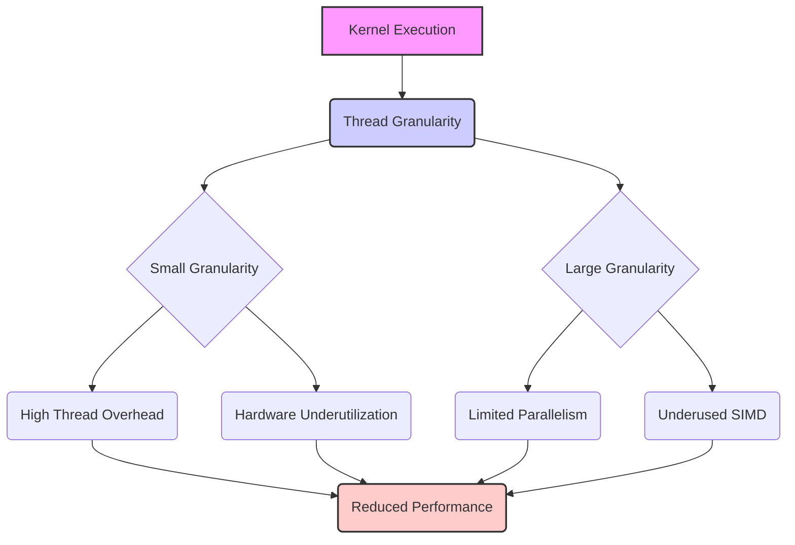
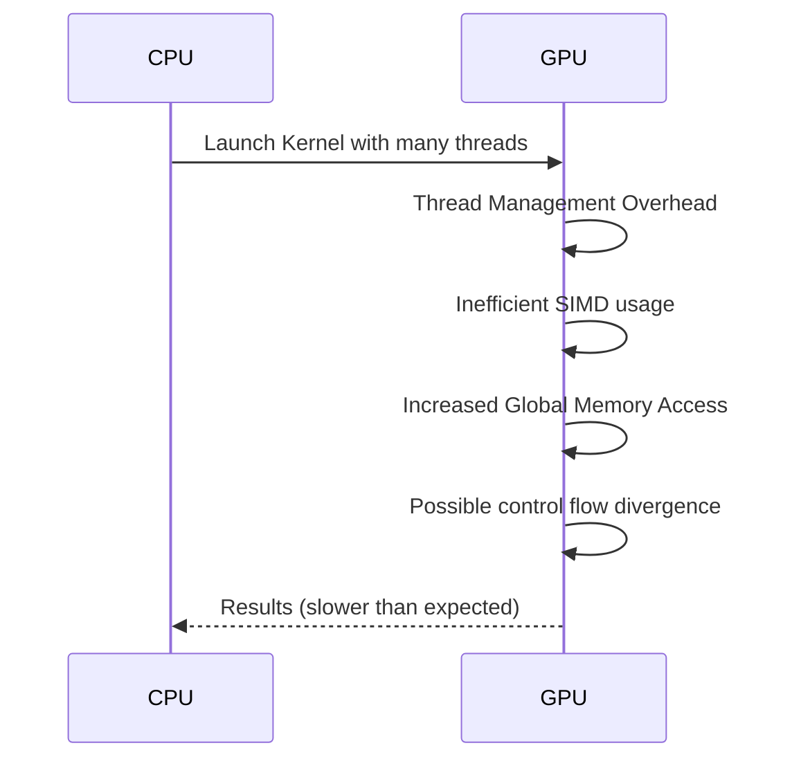
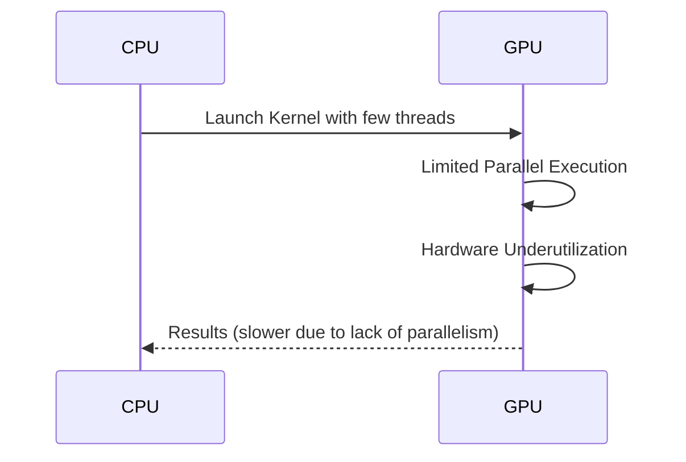

Okay, I understand. Here's the enhanced text with added Mermaid diagrams:

## Performance Considerations in CUDA: A Deep Dive (Cont.)

### Introdução

(Mantendo a introdução para consistência e contexto, com pequenas alterações)

Alcançar o máximo desempenho em aplicações CUDA requer uma compreensão profunda das restrições de recursos e de como elas impactam a execução do kernel [^1]. Este capítulo explora as principais limitações em dispositivos CUDA e como ajustar o código para atingir níveis superiores de desempenho. As restrições de recursos variam entre aplicações, tornando essencial entender como um recurso afeta outro. A otimização de desempenho não é trivial e demanda um conhecimento profundo da arquitetura CUDA para identificar gargalos e implementar soluções eficientes [^1]. Além disso, este capítulo busca desenvolver uma intuição sobre padrões algorítmicos que levam a um alto desempenho, bem como estabelecer princípios e ideias para orientar a otimização [^1]. Nesta seção, vamos explorar o conceito de granularidade de threads e como a escolha da quantidade de trabalho a ser realizada por cada thread afeta o desempenho de kernels CUDA.

### Conceitos Fundamentais (Continuação)

Continuando a análise da arquitetura CUDA e como ela afeta o desempenho, vamos agora examinar o conceito de granularidade de threads e seu impacto no desempenho dos kernels.

**Conceito 127: Granularidade de Threads**

A **granularidade de threads** refere-se à quantidade de trabalho que é atribuída a cada thread em um kernel CUDA [^16]. Em um kernel, o programador decide qual a parte do trabalho será feita por cada thread, e essa escolha tem um impacto direto no desempenho da aplicação. A escolha da granularidade tem um grande impacto no paralelismo e na carga de trabalho das unidades de execução.

> ⚠️ **Ponto Crítico:** A escolha da granularidade de threads é uma decisão fundamental na otimização de kernels CUDA. Uma granularidade muito pequena pode levar a um excesso de threads e diminuir a eficiência do uso do hardware, enquanto uma granularidade muito grande pode limitar o paralelismo e a utilização das unidades de processamento.

A escolha adequada da granularidade envolve um trade-off entre a quantidade de trabalho por thread, a utilização do hardware, a latência e o overhead de gerenciar as threads.

**Lemma 70:** *A granularidade de threads define a quantidade de trabalho realizada por cada thread em um kernel CUDA. O equilíbrio entre a quantidade de trabalho e o número de threads tem um impacto direto no paralelismo, na utilização do hardware e no desempenho do kernel.*

**Prova do Lemma 70:** Ao escolher a granularidade, o projetista do kernel define a forma como o trabalho é dividido entre as threads. Uma quantidade pequena de trabalho para cada thread leva a uma grande quantidade de threads, e pode gerar um overhead desnecessário. Uma quantidade muito grande de trabalho por thread diminui o paralelismo, e pode diminuir o desempenho do código. O equilíbrio correto entre esses fatores é essencial para o desempenho. $\blacksquare$

**Corolário 71:** *A escolha da granularidade de threads é uma decisão fundamental na otimização de kernels CUDA, e o programador deve buscar a granularidade que melhor se adapte às necessidades do algoritmo e às características do hardware.*

A granularidade de threads afeta o paralelismo e o uso do hardware, e a escolha de um valor adequado é um aspecto importante da otimização.

**Conceito 128: Impacto do Uso de Threads em Excessivo**

O uso de um grande número de threads para realizar um pequeno trabalho por thread pode ser ineficiente, já que isso pode levar a um alto overhead de gerenciamento das threads e à subutilização das unidades de processamento do hardware SIMD. Além disso, um grande número de threads pode levar a mais acesso a memória global, e pode aumentar o problema de divergência de fluxo de controle.

> ✔️ **Destaque:**  Utilizar um número excessivo de threads para realizar um trabalho pequeno pode ser menos eficiente do que utilizar um número menor de threads para realizar um trabalho maior. A quantidade de trabalho realizada por thread deve ser considerada.

A escolha do tamanho do bloco deve levar em consideração o tipo de trabalho que é realizado por cada thread, e a forma como essa divisão afeta o desempenho.

**Conceito 129: Impacto do Uso de Poucos Threads**

Por outro lado, a utilização de poucas threads para realizar um trabalho muito grande também pode ser ineficiente, já que isso pode limitar o paralelismo da aplicação e diminuir a utilização do hardware. Utilizar poucas threads em um problema onde o paralelismo é alto, leva a uma subutilização do hardware SIMD.

> ❗ **Ponto de Atenção:** Utilizar um número muito baixo de threads para um trabalho muito grande pode limitar o paralelismo e deixar o hardware da GPU subutilizado. A escolha da quantidade de trabalho que cada thread irá fazer é um fator importante para atingir o máximo desempenho.

A escolha adequada do número de threads e do trabalho que cada thread realizará é fundamental para otimizar o desempenho e o uso eficiente da GPU.

### Análise Teórica Avançada da Granularidade de Threads e Seu Impacto no Desempenho

**Pergunta Teórica Avançada:** *Como podemos modelar matematicamente o impacto da granularidade de threads no desempenho de kernels CUDA, considerando o número de instruções por thread, o tempo de execução, o overhead do gerenciamento de threads e a utilização do hardware SIMD, e como esse modelo pode guiar a escolha da granularidade ideal para um dado algoritmo?*

**Resposta:**

Para modelar matematicamente o impacto da granularidade de threads no desempenho, vamos introduzir algumas variáveis e conceitos adicionais:

*   `W`: Trabalho total a ser realizado (em operações ou instruções).
*   `N`: Número total de elementos a serem processados.
*   `N_threads`: Número total de threads.
*   `W_t`: Trabalho realizado por thread.
*   `T_i`: Tempo de execução de uma instrução SIMD (sem divergência).
*   `T_overhead`: Overhead do gerenciamento de threads, que depende do número de threads.
*   `T_{exec}`: Tempo de execução por thread.
*   `N_SM`: Número de Streaming Multiprocessors (SMs).
*   `N_blocks`: Número de blocos de threads.
*   `N_w`: Número de threads em um warp.
*   `T_mem`: Tempo de acesso à memória global.

**Modelo de Desempenho sem Divisão do Trabalho:**

O tempo de execução sequencial do código sem o uso de threads é dado por:
$$T_{seq} = W \times T_i$$

**Modelo de Desempenho com Granularidade de Threads:**

Em um modelo onde o trabalho é dividido entre as threads, o trabalho que cada thread deve realizar é dado por:
$$W_t = \frac{W}{N_{threads}}$$

O tempo de execução de cada thread é dado por:
$$T_{exec} = W_t \times T_i + T_{mem}$$
Onde `T_{mem}` representa o tempo gasto no acesso a memória.
O tempo total de execução do kernel é dado por:
$$T_{kernel} = \frac{N}{N_b \times N_w \times N_{SM}} \times (T_{exec} + T_{overhead})$$

Onde `N` é a quantidade total de dados, `N_b` é o número de threads por bloco, `N_w` é o número de threads por warp, e `N_{SM}` é a quantidade de SMs.

**Impacto do Número de Threads:**

*   **Overhead:** Um número grande de threads pode causar um grande overhead de sincronização.
*   **Paralelismo:** Um número menor de threads pode diminuir o paralelismo da aplicação e o uso do hardware SIMD.
*  **Largura de Banda:** O acesso a memória pode sofrer por conta da variação do número de threads, e por isso o número de threads deve ser escolhido para que o acesso seja feito da forma mais eficiente possível.

**Análise do Trade-off:**

O modelo apresentado mostra que existe um trade-off entre a granularidade e o número de threads e o tempo de execução do código. O programador deve balancear esses fatores para encontrar o ponto de equilíbrio entre eles e maximizar o desempenho.

**Lemma 71:** *A granularidade de threads influencia diretamente o desempenho de kernels CUDA. A escolha da quantidade de trabalho por thread deve considerar o trade-off entre minimizar o overhead e maximizar o paralelismo, para evitar a subutilização dos recursos do hardware.*

**Prova do Lemma 71:** Os modelos matemáticos mostram que a diminuição do número de threads leva a uma diminuição do paralelismo, o que diminui o desempenho. Por outro lado, um aumento da quantidade de threads pode levar a um overhead na execução e no acesso a memória. A escolha do número adequado de threads, e, consequentemente, do trabalho por thread é fundamental para garantir o desempenho máximo. $\blacksquare$

**Corolário 72:** *O modelo matemático da granularidade de threads permite quantificar o impacto da quantidade de trabalho a ser feito por cada thread, do overhead da sua alocação e do paralelismo, e guiar a otimização de kernels CUDA para que cada thread realize a quantidade ideal de trabalho, maximizando o desempenho do código.*

O modelo matemático do impacto da granularidade nos auxilia a tomar decisões informadas ao projetar kernels CUDA que necessitem de uma boa eficiência.

### Continuação

Com a análise detalhada da granularidade de threads e seu impacto no desempenho, estamos agora preparados para explorar os seguintes tópicos:

*   **Otimização do Acesso à Memória:** Como utilizar o *tiling* e a memória compartilhada para otimizar o acesso à memória global e minimizar a latência.
*   **Balanceamento de Carga:** Como distribuir o trabalho de forma uniforme entre as threads para evitar a subutilização do hardware.
*    **Estudos de Caso:** Análise de casos reais para entender como o uso adequado da granularidade pode levar a uma grande melhoria no desempenho das aplicações CUDA.
*   **Ferramentas de Análise:** Como usar ferramentas de análise de desempenho para identificar gargalos e otimizar kernels CUDA.

Ao explorar esses tópicos, nos aproximamos do objetivo de criar aplicações CUDA mais eficientes e de alto desempenho.

### Referências

[^1]: "The execution speed of a CUDA kernel can vary greatly depending on the resource constraints of the device being used. In this chapter, we will discuss the major types of resource constraints in a CUDA device and how they can affect the kernel execution performance in this device. To achieve his or her goals, a programmer often has to find ways to achieve a required level of performance that is higher than that of an initial version of the application. In different applications, different constraints may dom- inate and become the limiting factors. One can improve the performance of an application on a particular CUDA device, sometimes dramatically, by trading one resource usage for another. This strategy works well if the resource constraint alleviated was actually the dominating constraint before the strategy was applied, and the one exacerbated does not have negative effects on parallel execution. Without such understanding, perfor-mance tuning would be guess work; plausible strategies may or may not lead to performance enhancements. Beyond insights into these resource constraints, this chapter further offers principles and case studies designed to cultivate intuition about the type of algorithm patterns that can result in high-performance execution. It is also establishes idioms and ideas that" *(Trecho de Performance Considerations)*
[^6]: "divergence if its loop condition is based on thread index values. Such usages arise naturally in some important parallel algorithms. We will use a reduction algorithm to illustrate this point. A reduction algorithm derives a single value from an array of values. The single value could be the sum, the maximal value, the minimal value, etc. among all elements. All these types of reductions share the same computation structure. A reduction can be easily done by sequen-tially going through every element of the array. When an element is vis- ited, the action to take depends on the type of reduction being performed. For a sum reduction, the value of the element being visited at the current step, or the current value, is added to a running sum. For a maximal reduction, the current value is compared to a running maximal value of all the elements visited so far. If the current value is larger than the running maximal, the current element value becomes the running maximal value. For a minimal reduction, the value of the element cur- rently being visited is compared to a running minimal. If the current value is smaller than the running minimal, the current element value becomes the running minimal. The sequential algorithm ends when all the elements are visited. The sequential reduction algorithm is work- efficient in that every element is only visited once and only a minimal amount of work is performed when each element is visited. Its execution time is proportional to the number of elements involved. That is, the computational complexity of the algorithm is O(N), where N is the num- ber of elements involved in the reduction." *(Trecho de Performance Considerations)*
[^16]: "An important algorithmic decision in performance tuning is the granularity of threads. It is often advantageous to put more work into each thread and use fewer threads. Such advantage arises when some redundant work exists between threads. In the current generation of devices, each SM has limited instruction processing bandwidth. Every instruction consumes instruction processing bandwidth, whether it is a floating-point calculation instruction, a load instruction, or a branch instruction. Eliminating redun- dant instructions can ease the pressure on the instruction processing band- width and improve the overall execution speed of the kernel. Figure 6.12 illustrates such an opportunity in matrix multiplication. The tiled algorithm in Figure 6.11 uses one thread to compute one element of the output d_P matrix. This requires a dot product between one row of d_M and one column of d_N." *(Trecho de Performance Considerations)*

**Deseja que eu continue com as próximas seções?**
