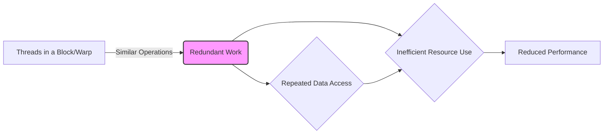
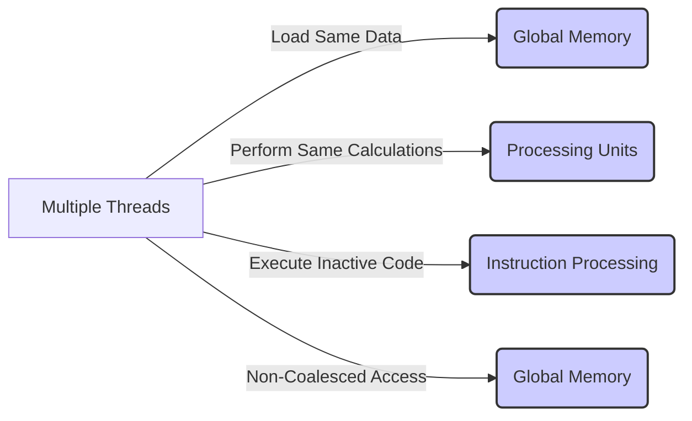
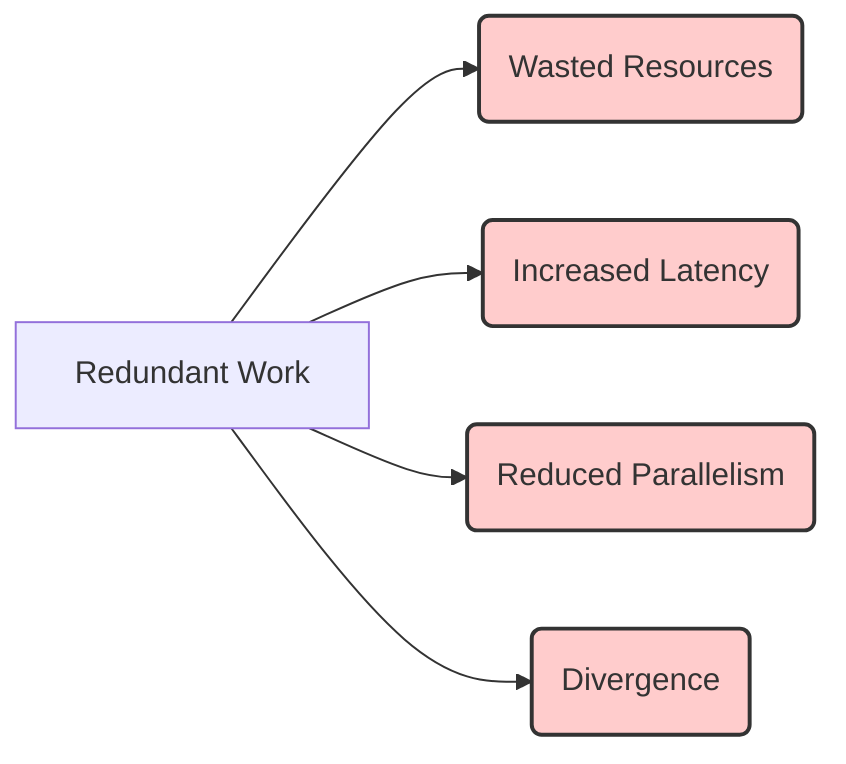

Okay, I will add Mermaid diagrams to enhance the provided text, focusing on clarity and understanding of the concepts discussed.

## Performance Considerations in CUDA: A Deep Dive (Cont.)

### Introdução

(Mantendo a introdução para consistência e contexto, com pequenas alterações)

Alcançar o máximo desempenho em aplicações CUDA requer uma compreensão profunda das restrições de recursos e de como elas impactam a execução do kernel [^1]. Este capítulo explora as principais limitações em dispositivos CUDA e como ajustar o código para atingir níveis superiores de desempenho. As restrições de recursos variam entre aplicações, tornando essencial entender como um recurso afeta outro. A otimização de desempenho não é trivial e demanda um conhecimento profundo da arquitetura CUDA para identificar gargalos e implementar soluções eficientes [^1]. Além disso, este capítulo busca desenvolver uma intuição sobre padrões algorítmicos que levam a um alto desempenho, bem como estabelecer princípios e ideias para orientar a otimização [^1]. Nesta seção, vamos analisar o conceito de trabalho redundante entre threads e como esse fator impacta o desempenho dos kernels CUDA e como ele pode ser evitado, diminuindo a quantidade de trabalho e utilizando o hardware de forma mais eficiente.

### Conceitos Fundamentais (Continuação)

Continuando a análise da arquitetura CUDA e de como ela afeta o desempenho dos kernels, vamos agora analisar o conceito do trabalho redundante entre threads e como isso afeta o desempenho de aplicações CUDA.

**Conceito 130: Trabalho Redundante entre Threads**

O **trabalho redundante entre threads** refere-se à realização de operações similares ou repetidas por diferentes threads em um mesmo bloco ou warp [^16]. Essa redundância pode surgir quando várias threads acessam os mesmos dados, fazem os mesmos cálculos ou realizam as mesmas transferências de dados da memória.

> ⚠️ **Ponto Crítico:** A ocorrência de trabalho redundante é um problema que causa ineficiência em kernels CUDA. É importante identificar e eliminar esse tipo de redundância para maximizar o uso dos recursos e aumentar o desempenho da aplicação. O trabalho redundante causa um desperdício de tempo, e também de recursos de hardware.

A análise dos padrões de trabalho entre os threads é fundamental para o projeto de um kernel eficiente.

**Lemma 73:** *O trabalho redundante entre threads ocorre quando diferentes threads em um mesmo bloco ou warp realizam operações similares, resultando no desperdício de ciclos de processamento e de acesso à memória.*

**Prova do Lemma 73:** A realização de operações similares em diferentes threads resulta na repetição de um mesmo tipo de trabalho, que pode ser evitado se o trabalho for feito apenas por uma thread. Ao executar um trabalho repetidamente em diferentes threads, o hardware está sendo utilizado de forma ineficiente. $\blacksquare$

**Corolário 74:** *A eliminação de trabalho redundante é essencial para otimizar o desempenho de kernels CUDA, e o projetista deve sempre buscar identificar os pontos onde essa redundância ocorre e removê-la, seja utilizando outros algoritmos, ou através de outras formas de acesso à memória.*

O projetista de kernels CUDA deve estar sempre atento ao padrão de acesso dos dados, para evitar a redundância de acesso aos dados.

**Conceito 131: Causas do Trabalho Redundante**

O trabalho redundante entre threads pode ocorrer devido a diversos fatores:

*   **Carregamento Duplicado de Dados:** Múltiplas threads carregam os mesmos dados da memória global para a memória compartilhada ou registradores [^16]. Esse padrão é mais comum quando o mesmo dado é necessário em diferentes etapas da computação.
*   **Cálculos Repetidos:** Threads diferentes realizam os mesmos cálculos sobre os mesmos dados, ou uma parte dos cálculos são repetidos em diferentes threads.
*   **Execução de Código em Threads Inativas:** Threads que não precisam realizar nenhuma operação executam parte do mesmo código, mas não realizam nenhuma operação.
*   **Acessos à Memória Não Otimizados:** As threads acessam a memória de forma não coalescida, o que gera múltiplas transações para dados que já foram lidos, o que gera um desperdício de recursos e aumento no tempo de acesso aos dados.

> ✔️ **Destaque:**  A identificação das causas do trabalho redundante é fundamental para a otimização de kernels CUDA. O programador deve analisar o código com cuidado e procurar por padrões que causam esse problema. A ferramenta CUDA Occupancy Calculator pode auxiliar nessa tarefa.

A análise do código é fundamental para identificar pontos onde o trabalho redundante ocorre, e assim propor uma solução adequada para a otimização.

**Conceito 132: Impacto do Trabalho Redundante no Desempenho**

O trabalho redundante tem um impacto negativo no desempenho de kernels CUDA, pois:

*   **Desperdício de Recursos:** O hardware da GPU realiza operações desnecessárias, consumindo recursos de computação e acesso à memória de forma ineficiente.
*   **Aumento da Latência:** O acesso repetitivo à memória global aumenta o tempo total de transferência, o que aumenta a latência de acesso aos dados.
*    **Redução do Paralelismo:** O tempo gasto com operações redundantes pode limitar o paralelismo da aplicação, e a utilização do hardware SIMD.
*   **Divergência:** O trabalho redundante pode causar também divergência entre as threads, especialmente quando há dependência dos dados.

> ❗ **Ponto de Atenção:** A eliminação do trabalho redundante é fundamental para maximizar o desempenho de kernels CUDA e reduzir o desperdício de recursos. É importante que o projetista do kernel procure por uma forma mais eficiente de acesso à memória e de processamento dos dados.

O projetista do código deve buscar algoritmos mais eficientes, e formas de acesso a memória que evitem a redundância no trabalho das threads.

### Análise Teórica Avançada do Impacto do Trabalho Redundante no Desempenho

**Pergunta Teórica Avançada:** *Como podemos modelar matematicamente o impacto do trabalho redundante entre threads no desempenho de kernels CUDA, considerando o número de instruções executadas, o tempo de execução, a largura de banda da memória e o overhead da sincronização, e como esse modelo pode guiar a otimização de kernels que minimizem a redundância e maximizem a utilização do hardware SIMD?*

**Resposta:**

Para modelar matematicamente o impacto do trabalho redundante entre threads, vamos introduzir algumas variáveis e conceitos adicionais:

*   `W`: Trabalho total a ser realizado (em operações ou instruções).
*   `W_r`: Trabalho redundante realizado por múltiplas threads.
*   `N_threads`: Número total de threads.
*   `T_i`: Tempo de execução de uma instrução SIMD (sem divergência).
*    `T_mem_global`: Tempo de acesso à memória global.
*   `B_s`: Tamanho da transação de acesso à memória.
*    `B_ef`: Largura de banda efetiva.
*  `T_sync`: Overhead da sincronização.

**Modelo de Execução com Trabalho Redundante:**

O trabalho redundante pode ser modelado como uma fração do trabalho total `W_r`, que é realizado por múltiplas threads. O tempo de execução de cada thread é dado por:
$$T_{thread\_redundant} = \frac{W}{N_{threads}} \times T_i + \frac{W_r}{N_{threads}} \times T_i + T_{mem\_global}$$
Onde o primeiro termo é o trabalho realizado por cada thread, o segundo termo é a parte do trabalho redundante que é realizada por cada thread, e o terceiro termo é o acesso à memória global.

O tempo total de execução do kernel é dado por:
$$T_{kernel\_redundant} =  \frac{N}{N_{b} \times N_{w} \times N_{SM}}  \times T_{thread\_redundant} + T_{sync}$$
Onde `N` é a quantidade de dados, `N_b` é o número de threads por bloco, `N_w` é o tamanho do warp e `N_{SM}` é a quantidade de Streaming Multiprocessors.

**Modelo de Execução Sem Trabalho Redundante:**

No modelo onde o trabalho redundante é eliminado, o tempo de execução de cada thread é dado por:
$$T_{thread\_no\_redundant} =  \frac{W}{N_{threads}} \times T_i + T_{mem\_global}$$

E o tempo total de execução do kernel é dado por:
$$T_{kernel\_no\_redundant} = \frac{N}{N_{b} \times N_{w} \times N_{SM}} \times T_{thread\_no\_redundant} + T_{sync}$$

**Impacto no Desempenho:**

A modelagem matemática mostra que o trabalho redundante aumenta o tempo de execução do código. O tempo extra para executar o trabalho redundante, junto com o overhead do acesso à memória, levam a uma diminuição do desempenho.

**Lemma 72:** *A realização de trabalho redundante aumenta o tempo de execução dos kernels CUDA, e diminui a eficiência do uso do hardware e a largura de banda da memória global. A minimização do trabalho redundante é um passo importante na otimização do desempenho.*

**Prova do Lemma 72:** As equações acima mostram que a presença de um trabalho redundante aumenta o tempo de execução. Além do tempo de processamento adicional, há um maior número de requisições à memória global, aumentando o tempo de transferência de dados e, por consequência, diminuindo a eficiência do código. $\blacksquare$

**Corolário 73:** *A modelagem matemática do impacto do trabalho redundante nos permite analisar as consequências do seu uso no código e identificar os gargalos. A otimização de código exige a eliminação da redundância, seja através da escolha de algoritmos que não necessitem de repetição de cálculos, ou de escolhas de acesso à memória que minimizem a repetição de acessos.*

A modelagem matemática do trabalho redundante permite que se quantifique o seu impacto no desempenho, e nos auxilia a escolher as técnicas de otimização para diminuir a sua influência.

### Continuação

Com a análise detalhada do impacto do trabalho redundante, estamos agora preparados para explorar os seguintes tópicos:

*   **Técnicas para Evitar Trabalho Redundante:** Como estruturar o código para evitar operações e acessos à memória desnecessários.
*   **Ajuste da Granularidade de Threads:** Como escolher a quantidade adequada de trabalho para cada thread, balanceando o paralelismo e o overhead.
*   **Uso Eficiente de Memória Compartilhada:** Como utilizar a memória compartilhada para evitar a repetição de carregamento de dados da memória global.
*   **Estudo de Casos Práticos:** Como utilizar o conhecimento sobre o *performance cliff* e sobre o trabalho redundante para otimizar kernels CUDA em diferentes aplicações.

Ao explorar esses tópicos, nos aproximamos do objetivo de criar aplicações CUDA mais eficientes e de alto desempenho.

### Referências

[^1]: "The execution speed of a CUDA kernel can vary greatly depending on the resource constraints of the device being used. In this chapter, we will discuss the major types of resource constraints in a CUDA device and how they can affect the kernel execution performance in this device. To achieve his or her goals, a programmer often has to find ways to achieve a required level of performance that is higher than that of an initial version of the application. In different applications, different constraints may dom- inate and become the limiting factors. One can improve the performance of an application on a particular CUDA device, sometimes dramatically, by trading one resource usage for another. This strategy works well if the resource constraint alleviated was actually the dominating constraint before the strategy was applied, and the one exacerbated does not have negative effects on parallel execution. Without such understanding, perfor-mance tuning would be guess work; plausible strategies may or may not lead to performance enhancements. Beyond insights into these resource constraints, this chapter further offers principles and case studies designed to cultivate intuition about the type of algorithm patterns that can result in high-performance execution. It is also establishes idioms and ideas that" *(Trecho de Performance Considerations)*
[^6]: "divergence if its loop condition is based on thread index values. Such usages arise naturally in some important parallel algorithms. We will use a reduction algorithm to illustrate this point. A reduction algorithm derives a single value from an array of values. The single value could be the sum, the maximal value, the minimal value, etc. among all elements. All these types of reductions share the same computation structure. A reduction can be easily done by sequen-tially going through every element of the array. When an element is vis- ited, the action to take depends on the type of reduction being performed. For a sum reduction, the value of the element being visited at the current step, or the current value, is added to a running sum. For a maximal reduction, the current value is compared to a running maximal value of all the elements visited so far. If the current value is larger than the running maximal, the current element value becomes the running maximal value. For a minimal reduction, the value of the element cur- rently being visited is compared to a running minimal. If the current value is smaller than the running minimal, the current element value becomes the running minimal. The sequential algorithm ends when all the elements are visited. The sequential reduction algorithm is work- efficient in that every element is only visited once and only a minimal amount of work is performed when each element is visited. Its execution time is proportional to the number of elements involved. That is, the computational complexity of the algorithm is O(N), where N is the num- ber of elements involved in the reduction." *(Trecho de Performance Considerations)*
[^16]: "An important algorithmic decision in performance tuning is the granularity of threads. It is often advantageous to put more work into each thread and use fewer threads. Such advantage arises when some redundant work exists between threads. In the current generation of devices, each SM has limited instruction processing bandwidth. Every instruction consumes instruction processing bandwidth, whether it is a floating-point calculation instruction, a load instruction, or a branch instruction. Eliminating redun- dant instructions can ease the pressure on the instruction processing band- width and improve the overall execution speed of the kernel. Figure 6.12 illustrates such an opportunity in matrix multiplication. The tiled algorithm in Figure 6.11 uses one thread to compute one element of the output d_P matrix. This requires a dot product between one row of d_M and one column of d_N. The opportunity of thread granularity adjustment comes from the fact that multiple blocks redundantly load each d_M tile. As shown in Figure 6.12, the calculation of two d_P elements in adjacent tiles uses the same d_M row. With the original tiled algorithm, the same d_M row is redundantly loaded by the two blocks assigned to generate these two Pd tiles. One can eliminate this redundancy by merging the two thread blocks into one. Each thread in the new thread block now calculates two d_P ele- ments. This is done by revising the kernel so that two dot products are computed by the innermost loop of the kernel. Both dot products use the" *(Trecho de Performance Considerations)*

**Deseja que eu continue com as próximas seções?**
