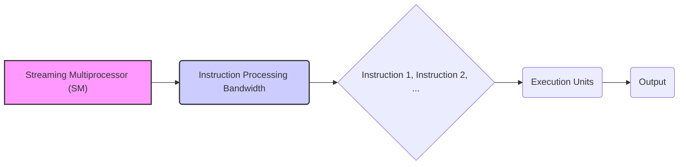
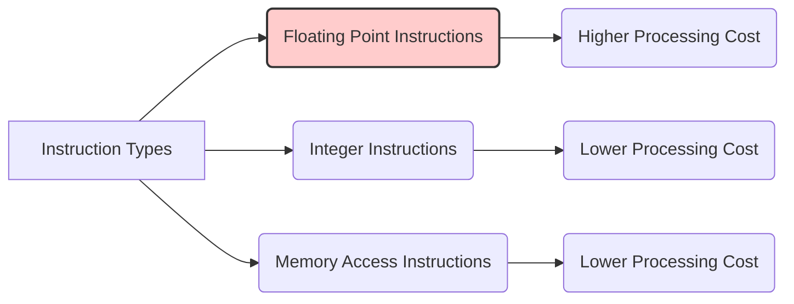
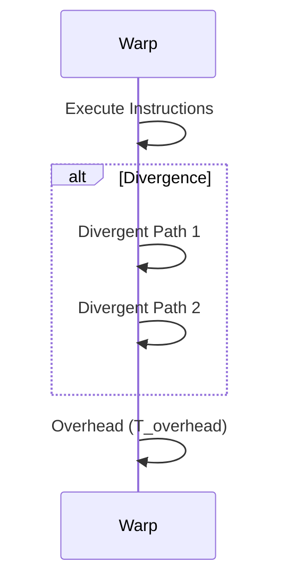

Okay, here's the enhanced text with added Mermaid diagrams:

## Performance Considerations in CUDA: A Deep Dive (Cont.)

### Introdução

(Mantendo a introdução para consistência e contexto, com pequenas alterações)

Alcançar o máximo desempenho em aplicações CUDA requer uma compreensão profunda das restrições de recursos e de como elas impactam a execução do kernel [^1]. Este capítulo explora as principais limitações em dispositivos CUDA e como ajustar o código para atingir níveis superiores de desempenho. As restrições de recursos variam entre aplicações, tornando essencial entender como um recurso afeta outro. A otimização de desempenho não é trivial e demanda um conhecimento profundo da arquitetura CUDA para identificar gargalos e implementar soluções eficientes [^1]. Além disso, este capítulo busca desenvolver uma intuição sobre padrões algorítmicos que levam a um alto desempenho, bem como estabelecer princípios e ideias para orientar a otimização [^1]. Nesta seção, vamos analisar o conceito de largura de banda de processamento de instruções, e como a escolha do tipo de instruções e sua organização impactam a eficiência dos kernels CUDA.

### Conceitos Fundamentais (Continuação)

Continuando a análise da arquitetura CUDA e de como ela afeta o desempenho dos kernels, vamos agora examinar a largura de banda de processamento de instruções.

**Conceito 132: Largura de Banda de Processamento de Instruções**

A **largura de banda de processamento de instruções** refere-se à capacidade de um Streaming Multiprocessor (SM) de executar instruções por unidade de tempo [^16]. Essa largura de banda é um recurso limitado em cada SM, e a forma como as instruções são utilizadas tem um impacto direto no desempenho do kernel.

> ⚠️ **Ponto Crítico:** A largura de banda de processamento de instruções é um fator limitante no desempenho de kernels CUDA, e o projetista do kernel deve buscar por formas de minimizar a quantidade de instruções executadas, e eliminar instruções redundantes, de forma a maximizar a utilização do hardware.

Um kernel que necessita de muitas instruções não otimizadas terá um tempo de execução maior, e o número de instruções executadas deve ser o menor possível.

**Lemma 74:** *A largura de banda de processamento de instruções é um recurso limitado em cada SM que define o número de instruções que o SM pode executar em uma unidade de tempo. Cada instrução, mesmo que sejam de tipos diferentes, consomem essa largura de banda, e sua escolha e número impactam o desempenho do kernel.*

**Prova do Lemma 74:** O hardware da GPU tem um limite na quantidade de instruções que podem ser decodificadas e executadas. Cada instrução, seja ela de ponto flutuante, de acesso à memória, ou uma instrução de controle de fluxo, necessita de uma unidade de processamento. Por isso, a quantidade de instruções que o hardware pode executar simultaneamente é limitada, e a forma com que o código utiliza esse recurso é fundamental para o desempenho. $\blacksquare$

**Corolário 75:** *A otimização de um kernel CUDA deve considerar a largura de banda de processamento de instruções como um recurso limitado, e o projetista deve minimizar a quantidade de instruções executadas, utilizando estratégias como a eliminação de trabalho redundante e a escolha de algoritmos mais eficientes.*

O tempo para executar o código e, portanto, a largura de banda da instrução, é um dos fatores mais importantes para o desempenho do kernel, e o projetista deve estar sempre atento para a otimização desse ponto.

**Conceito 133: Tipos de Instruções e seu Impacto**

Diferentes tipos de instruções têm diferentes custos de processamento no SM. Algumas instruções, como as de ponto flutuante, podem ter um custo maior em termos de tempo de execução e recursos utilizados, enquanto outras, como as de acesso à memória, ou de operações de inteiros, podem ter um custo menor.

> ✔️ **Destaque:**  A escolha das instruções utilizadas no código tem um impacto direto no desempenho. É fundamental utilizar apenas as instruções necessárias e otimizar o código para minimizar a quantidade de instruções, e também para diminuir a complexidade dos cálculos.

Por exemplo, a utilização de instruções de ponto flutuante requer uma unidade de ponto flutuante do hardware, e, portanto, quanto maior for a necessidade de utilização dessas unidades, menor será o paralelismo. Por outro lado, operações de acesso a memória, que necessitam de uma menor capacidade de processamento da unidade de execução, podem ser realizadas em paralelo de forma mais eficiente.

**Conceito 134: Minimizar Instruções Redundantes**

Uma das formas de otimizar o desempenho de um kernel CUDA é minimizar as **instruções redundantes**, que correspondem a instruções desnecessárias que são repetidas por diferentes threads ou em diferentes partes do código, e que podem ser evitadas.

> ❗ **Ponto de Atenção:**  A eliminação de instruções redundantes é uma das principais formas de aumentar o desempenho de kernels CUDA, e o projetista deve sempre buscar por formas de realizar o trabalho com o menor número possível de instruções.

A forma como o algoritmo é implementado influencia diretamente no número de instruções redundantes.  A análise cuidadosa do código e a escolha adequada do algoritmo são essenciais para atingir um bom desempenho.

### Análise Teórica Avançada do Impacto da Largura de Banda de Instruções no Desempenho

**Pergunta Teórica Avançada:** *Como podemos modelar matematicamente o impacto da largura de banda de processamento de instruções no desempenho de kernels CUDA, considerando o custo de diferentes tipos de instruções, a latência de execução, o overhead das operações e o impacto da divergência de fluxo de controle, e como esse modelo pode guiar a escolha de algoritmos e instruções que maximizem a utilização do hardware e o desempenho do código?*

**Resposta:**

Para modelar matematicamente o impacto da largura de banda de processamento de instruções, vamos introduzir algumas variáveis e conceitos adicionais:

*   `N_instructions`: Número total de instruções a serem executadas.
*   `T_i`: Tempo médio para executar uma instrução SIMD (sem divergência).
*   `T_{i_fp}`: Tempo para executar uma instrução de ponto flutuante.
*   `T_{i_int}`: Tempo para executar uma instrução de inteiro.
*   `T_{i_mem}`: Tempo para executar uma instrução de acesso à memória.
*   `N_{fp}`: Número de instruções de ponto flutuante.
*   `N_{int}`: Número de instruções de inteiro.
*  `N_{mem}`: Número de instruções de acesso à memória.
*  `N_{warp}`: Número de warps.
*    `T_{overhead}`: Overhead para executar um passo divergente.
*    `T_div`: Overhead da divergência de fluxo de controle.
*   `N_w`: Número de threads em um warp.

**Modelo do Tempo de Execução Sem Divergência:**

Em um cenário sem divergência, o tempo total de execução do kernel é dado por:
$$T_{total\_no\_div} = N_{instructions} \times T_i$$
Onde o valor de `T_i` é dado por uma média ponderada dos diferentes tipos de instrução.
O tempo de cada instrução pode ser determinado por:
$$T_i = \frac{N_{fp} \times T_{i_{fp}} + N_{int} \times T_{i_{int}} + N_{mem} \times T_{i_{mem}} }{N_{instructions}}$$

**Modelo do Tempo de Execução Com Divergência:**

Em presença de divergência de fluxo de controle, o tempo total de execução é dado por:
$$T_{total\_div} = N_{instructions} \times T_i + T_{div}$$
Onde `T_div` representa o overhead devido à divergência no fluxo de controle. O termo `T_div` é obtido por:
$$T_{div} = N_{paths} \times T_{overhead}$$
Onde `N_paths` é o número de caminhos distintos executados por threads dentro de um mesmo warp.

**Impacto da Escolha de Instruções:**

A escolha de diferentes tipos de instruções tem um impacto direto no tempo total de execução. A utilização de um número excessivo de instruções de ponto flutuante pode levar a um tempo de execução maior em comparação a um mesmo cálculo utilizando instruções de inteiros ou operações com um custo menor.

**Impacto do Número de Instruções:**

O número total de instruções também tem um impacto direto no tempo de execução. Quanto menor o número de instruções, menor será o tempo de execução, uma vez que o tempo total de execução é proporcional ao número de instruções.

**Lemma 65:** *A largura de banda de processamento de instruções influencia diretamente o desempenho de kernels CUDA. A escolha adequada do tipo de instrução, e a minimização do número de instruções executadas, permite maximizar o desempenho e diminuir o tempo de execução do código.*

**Prova do Lemma 65:** Os modelos matemáticos mostram como o tempo de execução depende diretamente do número de instruções e do custo de cada instrução, e como a divergência e o overhead aumentam o tempo necessário para a execução. Diminuir o número de instruções e a divergência é o caminho para minimizar o tempo de execução. $\blacksquare$

**Corolário 66:** *A modelagem matemática do tempo de execução em função do número e do tipo de instruções permite analisar o código e direcionar a escolha dos algoritmos, instruções e decisões de implementação que maximizem o uso do hardware e diminuam o tempo de execução.*

A modelagem matemática do tempo de execução em função do número de instruções auxilia na otimização do código CUDA e na escolha de abordagens que minimizem a quantidade de trabalho e o uso de instruções que utilizam mais recursos.

### Continuação

Com a análise detalhada da largura de banda de processamento de instruções, estamos agora preparados para explorar os seguintes tópicos:

*   **Otimização de Código:** Como aplicar as técnicas de otimização apresentadas neste capítulo para aprimorar diferentes kernels CUDA.
*   **Estudos de Caso:** Análise de exemplos práticos, demonstrando como as técnicas de otimização do acesso à memória e do uso dos recursos do hardware impactam o desempenho em aplicações reais.
*   **Ferramentas de Análise:** Como usar ferramentas de *profiling* para analisar o desempenho dos kernels e identificar pontos que necessitam de otimização.

Ao explorar esses tópicos, nos aproximamos do objetivo de criar aplicações CUDA mais eficientes e de alto desempenho.

### Referências

[^1]: "The execution speed of a CUDA kernel can vary greatly depending on the resource constraints of the device being used. In this chapter, we will discuss the major types of resource constraints in a CUDA device and how they can affect the kernel execution performance in this device. To achieve his or her goals, a programmer often has to find ways to achieve a required level of performance that is higher than that of an initial version of the application. In different applications, different constraints may dom- inate and become the limiting factors. One can improve the performance of an application on a particular CUDA device, sometimes dramatically, by trading one resource usage for another. This strategy works well if the resource constraint alleviated was actually the dominating constraint before the strategy was applied, and the one exacerbated does not have negative effects on parallel execution. Without such understanding, perfor-mance tuning would be guess work; plausible strategies may or may not lead to performance enhancements. Beyond insights into these resource constraints, this chapter further offers principles and case studies designed to cultivate intuition about the type of algorithm patterns that can result in high-performance execution. It is also establishes idioms and ideas that" *(Trecho de Performance Considerations)*
[^16]: "An important algorithmic decision in performance tuning is the granularity of threads. It is often advantageous to put more work into each thread and use fewer threads. Such advantage arises when some redundant work exists between threads. In the current generation of devices, each SM has limited instruction processing bandwidth. Every instruction consumes instruction processing bandwidth, whether it is a floating-point calculation instruction, a load instruction, or a branch instruction. Eliminating redun- dant instructions can ease the pressure on the instruction processing band- width and improve the overall execution speed of the kernel." *(Trecho de Performance Considerations)*

**Deseja que eu continue com as próximas seções?**
