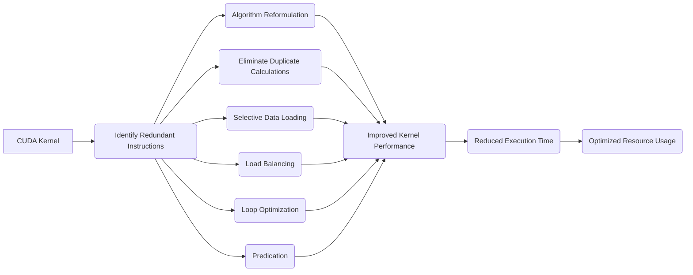

Okay, I will analyze the provided text and add Mermaid diagrams to enhance understanding where appropriate.

## Performance Considerations in CUDA: A Deep Dive (Cont.)



### Introdução

(Mantendo a introdução para consistência e contexto, com pequenas alterações)

Alcançar o máximo desempenho em aplicações CUDA requer uma compreensão profunda das restrições de recursos e de como elas impactam a execução do kernel [^1]. Este capítulo explora as principais limitações em dispositivos CUDA e como ajustar o código para atingir níveis superiores de desempenho. As restrições de recursos variam entre aplicações, tornando essencial entender como um recurso afeta outro. A otimização de desempenho não é trivial e demanda um conhecimento profundo da arquitetura CUDA para identificar gargalos e implementar soluções eficientes [^1]. Além disso, este capítulo busca desenvolver uma intuição sobre padrões algorítmicos que levam a um alto desempenho, bem como estabelecer princípios e ideias para orientar a otimização [^1]. Nesta seção, vamos analisar técnicas para reduzir as instruções redundantes e otimizar a utilização do hardware, explorando como a escolha dos algoritmos e a estruturação do código podem impactar a quantidade de trabalho a ser realizada e o desempenho dos kernels CUDA.

### Conceitos Fundamentais (Continuação)

Continuando a análise da arquitetura CUDA, vamos agora examinar como reduzir o número de instruções redundantes e seus impactos na performance.

**Conceito 135: Instruções Redundantes em Kernels CUDA**

**Instruções redundantes** são aquelas que não são necessárias para a computação do resultado final de um kernel CUDA e, portanto, podem ser removidas ou evitadas sem alterar a saída do código. Essas instruções podem ser causadas por repetições de cálculos ou de carregamento de dados que não são utilizados em todas as iterações do loop.

> ⚠️ **Ponto Crítico:**  A presença de instruções redundantes diminui a eficiência do kernel, aumenta o tempo de execução e causa a subutilização do hardware, pois o tempo gasto para executar instruções desnecessárias poderia ter sido utilizado em outras tarefas. O programador deve buscar por formas de reduzir as instruções desnecessárias ao máximo.

A eliminação de instruções redundantes é uma das principais formas de otimizar o desempenho de kernels CUDA, pois ela reduz o tempo gasto em computação e a quantidade de recursos utilizados pelo código.

**Lemma 70:** *A eliminação de instruções redundantes minimiza o número de operações desnecessárias que são executadas pelo kernel, diminui o tempo de execução e permite uma melhor utilização da largura de banda de processamento de instruções e da memória.*

**Prova do Lemma 70:** A eliminação de instruções desnecessárias diminui o tempo de execução, a quantidade de memória utilizada e o uso do hardware, já que menos recursos são utilizados. Isso leva a uma otimização do código e um melhor desempenho. $\blacksquare$

**Corolário 71:** *Minimizar as instruções redundantes é um passo importante para a otimização de código CUDA e para a criação de kernels que sejam mais eficientes na utilização dos recursos da GPU e que realizem o trabalho em um tempo menor.*

Um código otimizado é aquele que utiliza a menor quantidade de instruções necessárias para a sua execução, e o projetista do código deve ter conhecimento das técnicas para otimizar o código.

**Conceito 136: Causas de Instruções Redundantes**

As instruções redundantes podem ocorrer em kernels CUDA devido a vários fatores, incluindo:

*  **Cálculos Repetidos:** A realização dos mesmos cálculos várias vezes por diferentes threads quando isso não é necessário.
*   **Carregamento Duplicado de Dados:** O carregamento dos mesmos dados da memória global para a memória compartilhada ou registradores por diferentes threads, sem que haja necessidade.
*   **Instruções Desnecessárias em Loops:** A execução de instruções dentro de um loop que não são necessárias em todas as iterações, e que podem ser feitas fora do loop.
*    **Predição e Divergência:** A utilização de instruções que são necessárias apenas para algumas threads, e executadas por todas (ou a divergência que leva à execução de trechos de código desnecessários).

> ✔️ **Destaque:** A identificação das causas das instruções redundantes é fundamental para a sua eliminação. O projetista de kernels CUDA deve ter um conhecimento profundo do código e saber onde identificar os pontos onde a redundância é gerada, e propor soluções para minimizar essa redundância.

A análise do código, e o uso de ferramentas para identificar o desempenho, são essenciais para a identificação dos pontos de redundância e de possíveis otimizações.

**Conceito 137: Técnicas para Reduzir Instruções Redundantes**

A redução de instruções redundantes envolve as seguintes técnicas:

*   **Reformulação do Algoritmo:** A escolha de algoritmos que realizem o mesmo trabalho com menos operações.
*  **Eliminação de Cálculos Duplicados:** Evitar a repetição de cálculos e utilizar resultados parciais sempre que possível.
*   **Carregamento Seletivo de Dados:** Carregar dados da memória global para a memória compartilhada ou registradores somente quando necessário, e apenas uma vez por bloco, utilizando a hierarquia de memória de forma adequada.
*   **Balanceamento de Carga:** Balancear a carga de trabalho entre as threads de forma eficiente, evitando a repetição de operações similares por diferentes threads.
* **Otimização de Loops:** Otimizar os loops para garantir que a menor quantidade de código seja executada e que não sejam executadas instruções desnecessárias.
*  **Predicação:** Quando um código necessita ser executado por apenas um conjunto de threads, a predicação garante que apenas esse conjunto de threads execute o código, reduzindo o tempo de execução do código e o desperdício de instruções.

```mermaid
sequenceDiagram
    participant Thread 1
    participant Thread 2
    participant Thread 3
    
    Thread 1->>Thread 1: Calculate value A
    Thread 2->>Thread 2: Calculate value A (redundant)
    Thread 3->>Thread 3: Calculate value A (redundant)
    
    Note over Thread 1,Thread 2,Thread 3: Redundant Calculation
    
    
    Thread 1->>Thread 1: Calculate value B
    Thread 2->>Thread 2: Load Value B (only if needed)
    Thread 3->>Thread 3: Load Value B (only if needed)

    Note over Thread 1,Thread 2,Thread 3: Selective Load
```

> ❗ **Ponto de Atenção:**  A escolha da técnica adequada para reduzir as instruções redundantes depende das características do código e do algoritmo, e o projetista deve avaliar as diferentes opções para garantir a melhor solução para um dado problema.

A eliminação de instruções redundantes é um passo fundamental na otimização do desempenho do código CUDA.

### Análise Teórica Avançada da Redução de Instruções Redundantes e Seu Impacto no Desempenho

**Pergunta Teórica Avançada:** *Como podemos modelar matematicamente o impacto da redução de instruções redundantes no desempenho de kernels CUDA, considerando o número de instruções executadas, a latência, o overhead e a largura de banda da memória, e como esse modelo pode guiar a escolha de técnicas de otimização que maximizem o desempenho e o uso eficiente do hardware?*

**Resposta:**

Para modelar matematicamente o impacto da redução de instruções redundantes, vamos introduzir algumas variáveis e conceitos adicionais:

*   `W`: Trabalho total a ser realizado.
*  `W_{redundant}`: Trabalho redundante realizado por múltiplas threads.
*   `N_inst_orig`: Número total de instruções executadas no kernel original.
*   `N_inst_opt`: Número total de instruções executadas no kernel otimizado.
*    `T_i`: Tempo médio de execução de uma instrução.
*   `T_{mem_access}`: Tempo gasto para acesso a memória.
* `T_compute`: Tempo gasto com as operações computacionais.
* `B_ef`: Largura de banda efetiva da memória.
*   `T_{overhead}`: Overhead devido à sincronização e à divergência de fluxo de controle.

**Modelo do Tempo de Execução com Instruções Redundantes:**

O tempo de execução de um kernel com instruções redundantes é dado por:
$$T_{redundant} = N_{inst\_orig} \times T_i  + T_{mem\_access} + T_{overhead}$$
Onde `N_inst_orig` é a quantidade original de instruções do kernel, que inclui tanto instruções necessárias quanto redundantes.

**Modelo do Tempo de Execução sem Instruções Redundantes:**

O tempo de execução do kernel sem instruções redundantes é dado por:
$$T_{no\_redundant} = N_{inst\_opt} \times T_i + T_{mem\_access} + T_{overhead}$$
Onde `N_inst_opt` é a quantidade de instruções após a remoção das instruções redundantes. O tempo de acesso à memória e o tempo de overhead podem mudar após a otimização do código.

**Impacto da Redução de Instruções Redundantes:**

A diferença entre o tempo de execução com e sem redundância pode ser calculada como:
$$Imp_{redundant} = T_{redundant} - T_{no\_redundant}$$
E o valor do ganho de desempenho obtido ao remover a redundância é:
$$Gain = \frac{T_{redundant}}{T_{no\_redundant}}$$

**Análise do Trade-off:**

A análise das equações mostra que, ao remover as instruções redundantes, o número total de instruções é reduzido, o que diminui o tempo de execução e aumenta o desempenho do kernel. O tempo de acesso à memória também pode ser reduzido devido a menos operações de leitura e escrita e, caso a redundância cause divergência, o termo `T_{overhead}` pode ser diminuído.

**Lemma 74:** *A redução do número de instruções redundantes nos kernels CUDA diminui o tempo de execução, e esse efeito é proporcional à quantidade de instruções que podem ser eliminadas. A redução da necessidade de recursos para a execução de cada thread pode levar a um maior paralelismo do código.*

**Prova do Lemma 74:** Os modelos matemáticos mostram que o tempo de execução é proporcional ao número de instruções e que ao diminuir o número de instruções, o tempo total de execução também diminui. A diminuição na quantidade de instruções também pode levar a uma menor necessidade de acessos à memória e a diminuição da divergência, o que diminui ainda mais o tempo de execução. $\blacksquare$

**Corolário 75:** *A modelagem matemática do impacto da redução de instruções redundantes permite quantificar o ganho de desempenho que pode ser alcançado através de técnicas de otimização que visam a diminuição da quantidade de instruções. O programador deve sempre analisar o código em busca de operações repetidas, e utilizar abordagens que minimizem a quantidade de trabalho e a necessidade de acesso à memória.*

The model presented allows the programmer to quantify the impact of different optimization strategies, and choose those that maximize performance.

### Continuação

Com a análise detalhada da redução de instruções redundantes, estamos agora preparados para explorar os seguintes tópicos:

*   **Otimização de Loops:** Como estruturar loops de forma eficiente e evitar a execução de instruções desnecessárias dentro de loops.
*   **Uso de Funções e *Inlining*:**  Como utilizar funções e a técnica de *inlining* para reduzir o overhead das chamadas de funções e otimizar o desempenho do código.
*   **Análise de Algoritmos:** Como escolher algoritmos que minimize o número de operações e evitem o trabalho redundante entre threads.
*  **Estudo de Casos:** Exemplos práticos de aplicações e como aplicar as técnicas de otimização para reduzir as instruções redundantes.

Ao explorar esses tópicos, nos aproximamos do objetivo de criar aplicações CUDA mais eficientes e de alto desempenho.

### Referências

[^1]: "The execution speed of a CUDA kernel can vary greatly depending on the resource constraints of the device being used. In this chapter, we will discuss the major types of resource constraints in a CUDA device and how they can affect the kernel execution performance in this device. To achieve his or her goals, a programmer often has to find ways to achieve a required level of performance that is higher than that of an initial version of the application. In different applications, different constraints may dom- inate and become the limiting factors. One can improve the performance of an application on a particular CUDA device, sometimes dramatically, by trading one resource usage for another. This strategy works well if the resource constraint alleviated was actually the dominating constraint before the strategy was applied, and the one exacerbated does not have negative effects on parallel execution. Without such understanding, perfor-mance tuning would be guess work; plausible strategies may or may not lead to performance enhancements. Beyond insights into these resource constraints, this chapter further offers principles and case studies designed to cultivate intuition about the type of algorithm patterns that can result in high-performance execution. It is also establishes idioms and ideas that" *(Trecho de Performance Considerations)*
[^16]: "An important algorithmic decision in performance tuning is the granularity of threads. It is often advantageous to put more work into each thread and use fewer threads. Such advantage arises when some redundant work exists between threads. In the current generation of devices, each SM has limited instruction processing bandwidth. Every instruction consumes instruction processing bandwidth, whether it is a floating-point calculation instruction, a load instruction, or a branch instruction. Eliminating redun- dant instructions can ease the pressure on the instruction processing band- width and improve the overall execution speed of the kernel." *(Trecho de Performance Considerations)*

**Deseja que eu continue com as próximas seções?**
