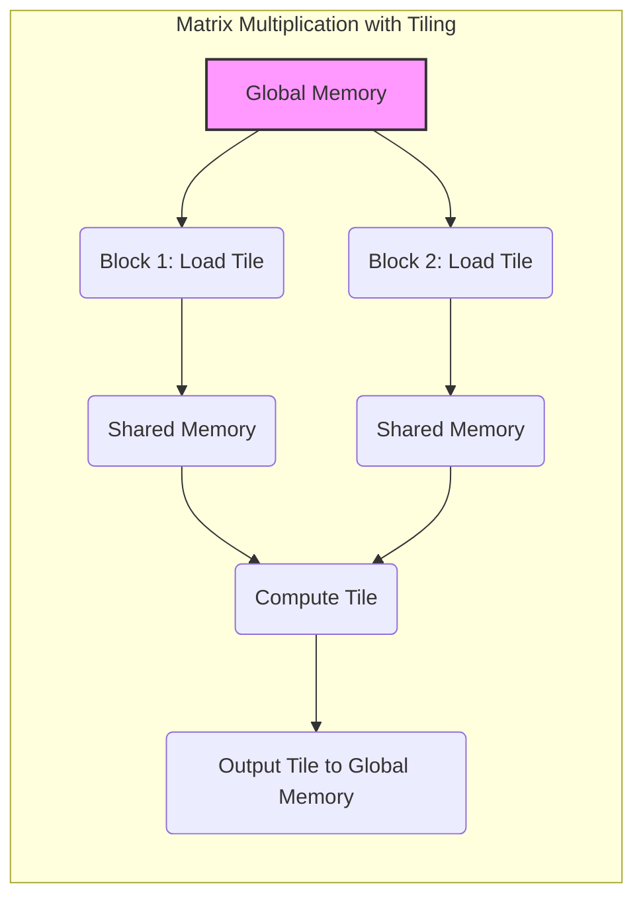
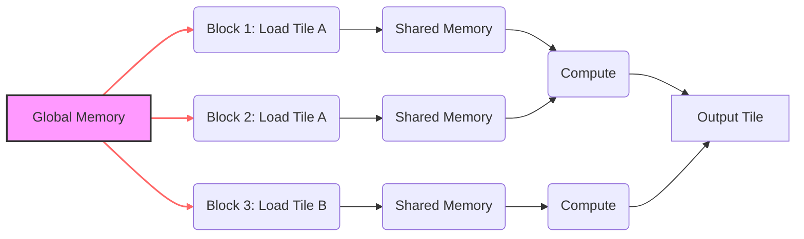
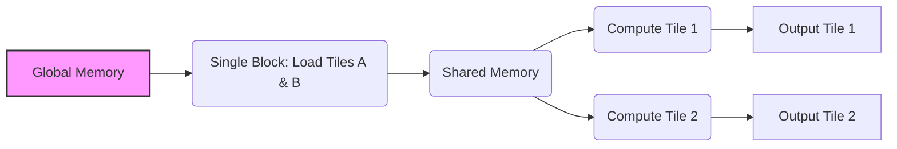

Okay, I understand. Here's the enhanced text with Mermaid diagrams added, focusing on visual representations of the described concepts:

## Performance Considerations in CUDA: A Deep Dive (Cont.)

### Introdução

(Mantendo a introdução para consistência e contexto, com pequenas alterações)

Alcançar o máximo desempenho em aplicações CUDA requer uma compreensão profunda das restrições de recursos e de como elas impactam a execução do kernel [^1]. Este capítulo explora as principais limitações em dispositivos CUDA e como ajustar o código para atingir níveis superiores de desempenho. As restrições de recursos variam entre aplicações, tornando essencial entender como um recurso afeta outro. A otimização de desempenho não é trivial e demanda um conhecimento profundo da arquitetura CUDA para identificar gargalos e implementar soluções eficientes [^1]. Além disso, este capítulo busca desenvolver uma intuição sobre padrões algorítmicos que levam a um alto desempenho, bem como estabelecer princípios e ideias para orientar a otimização [^1]. Nesta seção, vamos analisar em detalhe a redundância no acesso à memória global em um algoritmo de multiplicação de matrizes com *tiling*, e como essa redundância pode ser minimizada com mudanças na implementação do algoritmo, o que possibilita um melhor desempenho da aplicação.

### Conceitos Fundamentais (Continuação)

Continuando a análise da arquitetura CUDA e de como ela afeta o desempenho dos kernels, vamos agora analisar a redundância de carregamento de dados na multiplicação de matrizes.

**Conceito 138: Redundância no Carregamento de Dados em Multiplicação de Matrizes**

Em um algoritmo de **multiplicação de matrizes** com *tiling*, é comum que múltiplos blocos de threads carreguem os mesmos dados da memória global, de forma redundante, para realizar os cálculos [^16]. Essa redundância pode ser uma das maiores fontes de ineficiência no código, e pode ser eliminada com a utilização de blocos que utilizem diferentes partes dos dados, evitando a sobreposição no trabalho realizado.

> ⚠️ **Ponto Crítico:** A redundância no carregamento de dados em algoritmos de multiplicação de matrizes gera um overhead desnecessário e causa uma grande diminuição na utilização da largura de banda da memória global. A identificação e a eliminação dessa redundância é fundamental para o melhor desempenho do código.

Essa redundância é especialmente importante quando os dados são carregados repetidamente para a memória compartilhada, e precisa ser evitada para que o código seja o mais eficiente possível.

**Lemma 72:** *O carregamento redundante de dados em algoritmos de multiplicação de matrizes com tiling causa um desperdício de recursos do hardware de acesso à memória, e reduz a largura de banda efetiva, o que impacta diretamente o desempenho do kernel.*

**Prova do Lemma 72:**  Quando múltiplos blocos carregam os mesmos dados da memória global para a memória compartilhada, o hardware de acesso a memória precisa executar as leituras diversas vezes, o que causa uma queda na largura de banda, aumento do tempo de leitura, e desperdício de tempo e recursos. $\blacksquare$

**Corolário 73:** *A eliminação do carregamento redundante de dados é fundamental para a otimização de algoritmos de multiplicação de matrizes e outras aplicações que realizam o carregamento de dados para a memória compartilhada.  O conhecimento do padrão de acesso à memória global, e como os dados são utilizados é essencial para otimizar o código.*

Um acesso eficiente é a chave para uma boa implementação da multiplicação de matrizes.

**Conceito 139: Causas da Redundância em Multiplicação de Matrizes**

Em um algoritmo de multiplicação de matrizes com *tiling*, a redundância no carregamento de dados pode ser causada por:

*   **Sobreposição de *Tiles*:** Quando diferentes blocos de threads acessam os mesmos dados de entrada para calcular diferentes *tiles* da matriz resultante.
*   **Reutilização de Dados em Diferentes Blocos:** Quando um mesmo bloco reutiliza o mesmo tile da matriz de entrada em mais de uma iteração.
*   **Acesso Ineficiente:** A falta de coalescing no acesso à memória global pode causar uma necessidade de múltiplas leituras para que os dados sejam carregados na memória compartilhada.

> ✔️ **Destaque:** A análise do padrão de acesso à memória em um algoritmo de multiplicação de matrizes é fundamental para identificar as causas da redundância e propor soluções para minimizar esse problema.

O projetista do código deve ter uma visão clara de como os dados são utilizados no código, a fim de poder otimizar o algoritmo.

**Conceito 140: Técnicas para Reduzir a Redundância**

Para reduzir a redundância no carregamento de dados em algoritmos de multiplicação de matrizes, podemos utilizar as seguintes técnicas:

*   **Agrupamento de Blocos:** Combinar dois ou mais blocos de threads em um único bloco, fazendo com que as threads do novo bloco calculem a mesma quantidade de dados que os blocos originais calculariam juntos, o que leva à eliminação de dados carregados redundantemente [^16].
*    **Carregamento Seletivo de Dados:** Carregar apenas os dados que são necessários em cada etapa do cálculo.
*   **Utilização Eficiente da Memória Compartilhada:** Carregar os dados para a memória compartilhada apenas uma vez e reutilizar os dados dentro da memória compartilhada.

> ❗ **Ponto de Atenção:**  A escolha da técnica mais adequada para reduzir a redundância no carregamento de dados depende das características do problema e do algoritmo utilizado e deve ser realizada após análise da forma de acesso à memória. O projetista deve buscar uma solução que maximize a utilização do hardware.

A análise detalhada das necessidades de cada algoritmo de multiplicação de matrizes é essencial para que a melhor abordagem seja selecionada.

### Análise Teórica Avançada do Impacto da Redundância no Desempenho da Multiplicação de Matrizes

**Pergunta Teórica Avançada:** *Como podemos modelar matematicamente o impacto do carregamento redundante de dados no desempenho de um algoritmo de multiplicação de matrizes em CUDA, considerando o número de acessos à memória, o tamanho dos dados, a latência, a largura de banda e o overhead da computação, e como esse modelo pode guiar a escolha de abordagens que minimizem a redundância?*

**Resposta:**

Para modelar matematicamente o impacto do carregamento redundante de dados na multiplicação de matrizes, vamos introduzir algumas variáveis e conceitos adicionais:

*   `Width`: Largura das matrizes.
*   `Height`: Altura das matrizes.
*   `Tile_Width`: Tamanho do tile (em elementos).
*    `N_b`: Número de threads por bloco.
*   `N_w`: Número de threads em um warp.
*    `T_c`: Tempo de computação para um elemento.
*    `L`: Latência de acesso à memória.
*   `T_t`: Tempo de transferência de dados da memória global.
*   `T_{mem_access_redundant}`: Tempo de acesso à memória com carregamento redundante.
*   `T_{mem_access_no_redundant}`: Tempo de acesso à memória sem carregamento redundante.
*   `B_s`: Tamanho da transação de memória.
*   `B_ef`: Largura de banda efetiva da memória global.
* `N_{access}`: Número de acesso a memória global.

**Modelo do Carregamento Redundante de Dados:**

Em uma implementação com carregamento redundante, múltiplos blocos carregam os mesmos *tiles* da matriz `d_M`. O número de acessos à memória global para carregar dados da matriz `d_M` é dado por:
$$N_{access\_redundant} = \frac{Width \times Height}{Tile\_Width^2} \times N_{blocks}$$
Onde `N_blocks` é o número de blocos que necessitam dos dados, e a fração representa o número de tiles que serão carregados na memória compartilhada.
O tempo de acesso a memória global com carregamento redundante é dado por:
$$T_{mem\_access\_redundant} = N_{access\_redundant} \times (L + T_t)$$
E o tempo total de execução do kernel é dado por:
$$T_{redundant} = T_{compute} + T_{mem\_access\_redundant} + T_{overhead} $$
Onde `T_compute` é o tempo gasto em computação.

**Modelo do Carregamento Sem Redundância:**

Em uma implementação com carregamento sem redundância, apenas o número de blocos necessários para o cálculo final fazem o carregamento dos dados da matriz `d_M`, e o número de acessos à memória global é dado por:
$$N_{access\_no\_redundant} = \frac{Width \times Height}{Tile\_Width^2}$$
O tempo de acesso à memória global sem carregamento redundante é dado por:
$$T_{mem\_access\_no\_redundant} = N_{access\_no\_redundant} \times (L + T_t)$$
E o tempo total de execução do kernel, que elimina a redundância, é dado por:
$$T_{no\_redundant} = T_{compute} + T_{mem\_access\_no\_redundant} + T_{overhead}$$

**Impacto no Desempenho:**

Os modelos matemáticos mostram que o carregamento redundante de dados aumenta o tempo de acesso à memória e a quantidade de dados transferidos, o que diminui a largura de banda efetiva e causa uma perda de desempenho. A eliminação da redundância diminui o número de acessos, reduz a latência, aumenta a largura de banda e otimiza o desempenho do código.

**Lemma 73:** *O carregamento redundante de dados em algoritmos de multiplicação de matrizes leva a uma diminuição na largura de banda efetiva e ao aumento do tempo de acesso à memória global, resultando em um desempenho inferior em comparação com algoritmos que minimizam esse problema.*

**Prova do Lemma 73:** A comparação das duas formas de acesso mostra que o carregamento redundante aumenta a quantidade de acessos, e, por consequência, aumenta o tempo de acesso. A comparação dos dois modelos mostra que a redução no número de acessos à memória diminui a latência e o tempo de execução. $\blacksquare$

**Corolário 74:** *O modelo matemático apresentado nos permite quantificar o impacto do carregamento redundante no acesso à memória e direcionar a escolha de algoritmos e técnicas de otimização que minimizem essa redundância e maximizem o desempenho de kernels CUDA que utilizam a multiplicação de matrizes.*

O modelo matemático permite que o projetista do kernel avalie as diferentes abordagens, e escolha as que maximizem o desempenho.

### Continuação

Com a análise detalhada do carregamento redundante de dados na multiplicação de matrizes, estamos agora preparados para explorar os seguintes tópicos:

*   **Implementação de Multiplicação de Matrizes:**  Como implementar um algoritmo de multiplicação de matrizes que minimize o carregamento redundante de dados e maximize a eficiência de uso da memória global e da memória compartilhada.
*   **Ajuste da Granularidade:** Como ajustar a quantidade de trabalho por thread para obter um melhor uso dos recursos do hardware.
*   **Utilização de Primitivas da Arquitetura:** Como utilizar recursos da arquitetura CUDA, como instruções de *shuffle*, para realizar otimizações avançadas e diminuir a necessidade de sincronização.
*  **Estudos de Caso:** Análise de exemplos de código, e de aplicações do mundo real, mostrando como aplicar as técnicas de otimização estudadas ao longo do capítulo.

Ao explorar esses tópicos, nos aproximamos do objetivo de criar aplicações CUDA mais eficientes e de alto desempenho.

### Referências

[^1]: "The execution speed of a CUDA kernel can vary greatly depending on the resource constraints of the device being used. In this chapter, we will discuss the major types of resource constraints in a CUDA device and how they can affect the kernel execution performance in this device. To achieve his or her goals, a programmer often has to find ways to achieve a required level of performance that is higher than that of an initial version of the application. In different applications, different constraints may dom- inate and become the limiting factors. One can improve the performance of an application on a particular CUDA device, sometimes dramatically, by trading one resource usage for another. This strategy works well if the resource constraint alleviated was actually the dominating constraint before the strategy was applied, and the one exacerbated does not have negative effects on parallel execution. Without such understanding, perfor-mance tuning would be guess work; plausible strategies may or may not lead to performance enhancements. Beyond insights into these resource constraints, this chapter further offers principles and case studies designed to cultivate intuition about the type of algorithm patterns that can result in high-performance execution. It is also establishes idioms and ideas that" *(Trecho de Performance Considerations)*
[^16]: "An important algorithmic decision in performance tuning is the granularity of threads. It is often advantageous to put more work into each thread and use fewer threads. Such advantage arises when some redundant work exists between threads. In the current generation of devices, each SM has limited instruction processing bandwidth. Every instruction consumes instruction processing bandwidth, whether it is a floating-point calculation instruction, a load instruction, or a branch instruction. Eliminating redun- dant instructions can ease the pressure on the instruction processing band- width and improve the overall execution speed of the kernel. Figure 6.12 illustrates such an opportunity in matrix multiplication. The tiled algorithm in Figure 6.11 uses one thread to compute one element of the output d_P matrix. This requires a dot product between one row of d_M and one column of d_N. The opportunity of thread granularity adjustment comes from the fact that multiple blocks redundantly load each d_M tile. As shown in Figure 6.12, the calculation of two d_P elements in adjacent tiles uses the same d_M row. With the original tiled algorithm, the same d_M row is redundantly loaded by the two blocks assigned to generate these two Pd tiles. One can eliminate this redundancy by merging the two thread blocks into one. Each thread in the new thread block now calculates two d_P ele- ments. This is done by revising the kernel so that two dot products are computed by the innermost loop of the kernel. Both dot products use the" *(Trecho de Performance Considerations)*

**Deseja que eu continue com as próximas seções?**
