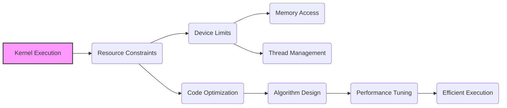
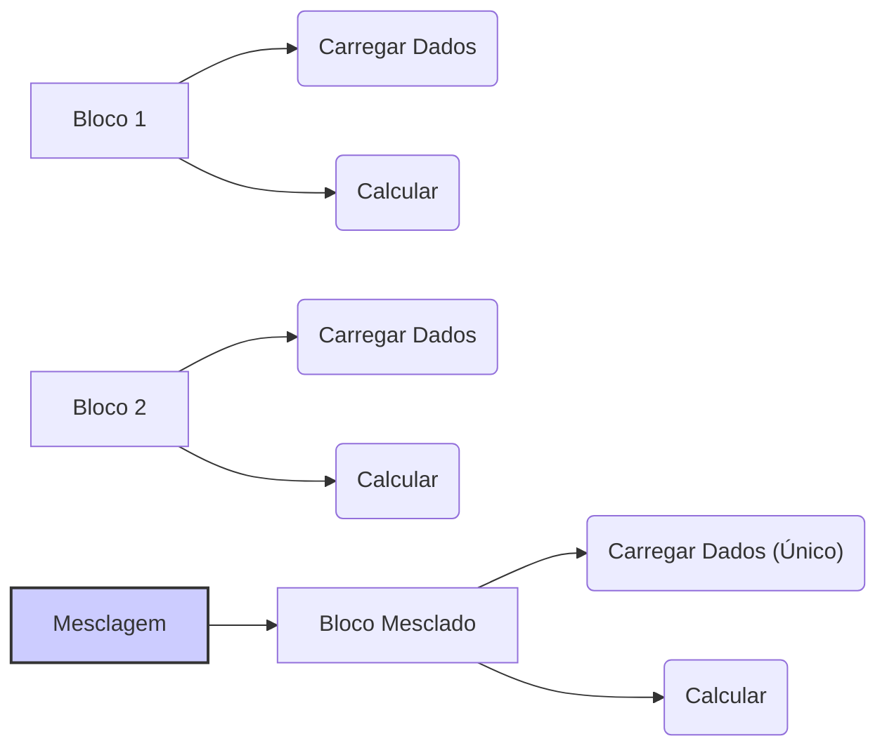
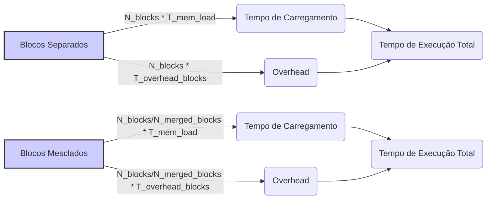

Okay, I understand. Here's the enhanced text with Mermaid diagrams added where appropriate:

## Performance Considerations in CUDA: A Deep Dive (Cont.)

### Introdução

(Mantendo a introdução para consistência e contexto, com pequenas alterações)

Alcançar o máximo desempenho em aplicações CUDA requer uma compreensão profunda das restrições de recursos e de como elas impactam a execução do kernel [^1]. Este capítulo explora as principais limitações em dispositivos CUDA e como ajustar o código para atingir níveis superiores de desempenho. As restrições de recursos variam entre aplicações, tornando essencial entender como um recurso afeta outro. A otimização de desempenho não é trivial e demanda um conhecimento profundo da arquitetura CUDA para identificar gargalos e implementar soluções eficientes [^1]. Além disso, este capítulo busca desenvolver uma intuição sobre padrões algorítmicos que levam a um alto desempenho, bem como estabelecer princípios e ideias para orientar a otimização [^1]. Nesta seção, vamos analisar a técnica de mesclagem de blocos de threads como uma forma de eliminar o trabalho redundante em aplicações CUDA, especialmente em cenários de multiplicação de matrizes.

### Conceitos Fundamentais (Continuação)

Continuando a análise da arquitetura CUDA e de como ela afeta o desempenho dos kernels, vamos agora examinar a técnica de mesclagem de blocos de threads e como essa técnica pode minimizar a redundância.

**Conceito 141: Mesclagem de Blocos de Threads**

A **mesclagem de blocos de threads** é uma técnica de otimização onde múltiplos blocos de threads adjacentes são combinados em um único bloco maior [^16]. Essa técnica visa eliminar a redundância no carregamento de dados e reduzir o overhead do gerenciamento de múltiplos blocos.

> ⚠️ **Ponto Crítico:** A mesclagem de blocos é utilizada para maximizar o uso dos recursos e diminuir o número de operações desnecessárias, melhorando o desempenho e otimizando o uso do hardware SIMD. A técnica pode ser utilizada para contornar problemas causados por um número excessivo de acessos a dados na memória global.

A mesclagem de blocos, portanto, auxilia na criação de um código mais eficiente e que utilize os recursos disponíveis no hardware da forma mais adequada.

**Lemma 75:** *A mesclagem de blocos de threads permite combinar as operações realizadas por blocos adjacentes em um único bloco, eliminando o carregamento redundante de dados e reduzindo o overhead da gerência de múltiplos blocos.*

**Prova do Lemma 75:** Ao combinar blocos adjacentes, as operações de leitura ou escrita realizadas para carregar dados similares em múltiplos blocos são eliminadas, e a necessidade de gerenciar cada bloco de forma separada também é eliminada, o que reduz a quantidade de trabalho e o tempo de execução. $\blacksquare$

**Corolário 76:** *A mesclagem de blocos de threads é uma técnica eficiente para reduzir o carregamento redundante de dados da memória global e otimizar o desempenho de kernels CUDA, principalmente quando blocos vizinhos realizam cálculos similares e acessam os mesmos dados.*

A técnica de mesclagem de blocos, quando utilizada corretamente, pode levar a um ganho de performance significativo.

**Conceito 142: Aplicação da Mesclagem em Multiplicação de Matrizes**

Em um algoritmo de multiplicação de matrizes com *tiling*, a mesclagem de blocos de threads pode ser utilizada para eliminar a redundância no carregamento de tiles da matriz [^16].  Como cada bloco realiza uma operação sobre uma parte dos dados, a combinação de dois blocos permite que um novo bloco utilize os mesmos dados, mas processe um bloco maior.

> ✔️ **Destaque:**  Ao combinar blocos adjacentes, o novo bloco carrega os dados uma única vez, o que reduz o acesso à memória global.

Essa abordagem leva a uma redução no tráfego de dados entre a memória global e a memória compartilhada, e, portanto, a uma melhor utilização dos recursos da memória.

**Conceito 143: Vantagens da Mesclagem de Blocos**

A mesclagem de blocos de threads oferece diversas vantagens:

*   **Redução da Redundância:** A diminuição do número de blocos também diminui o carregamento redundante de dados da memória global.
*   **Diminuição do Overhead:** A redução do número de blocos diminui o overhead de gerenciamento dos blocos e também da sincronização entre eles, resultando em um uso mais eficiente do hardware.
*   **Aumento do Paralelismo:** A técnica aumenta o número de threads que estão realizando o trabalho de um bloco, o que aumenta a eficiência do uso do hardware.

> ❗ **Ponto de Atenção:**  A mesclagem de blocos deve ser feita cuidadosamente, para que o número de threads não ultrapasse o limite do SM, e para que o uso dos recursos (registradores e memória compartilhada) sejam utilizados de forma adequada.

A técnica de mesclagem pode levar a um ganho de performance significativo, mas deve ser utilizada com cuidado para evitar problemas com o limite de recursos do SM.

### Análise Teórica Avançada da Mesclagem de Blocos e Seu Impacto no Desempenho

**Pergunta Teórica Avançada:** *Como podemos modelar matematicamente o impacto da mesclagem de blocos de threads no desempenho de kernels CUDA, considerando a redução do acesso à memória, o overhead de gerenciamento de blocos, a divergência de fluxo de controle e o trade-off entre o paralelismo e a quantidade de recursos alocados, e como esse modelo pode guiar a escolha da melhor estratégia de mesclagem para otimizar o desempenho?*

**Resposta:**

Para modelar matematicamente o impacto da mesclagem de blocos de threads, vamos introduzir algumas variáveis e conceitos adicionais:

*   `N_b`: Número de threads em um bloco original.
*   `N_b_merged`: Número de threads em um bloco mesclado.
*   `R_t`: Número de registradores utilizados por thread.
*  `S_b`: Tamanho da memória compartilhada utilizada por bloco (em bytes).
*   `T_c`: Tempo de computação por elemento do tile.
*   `T_sync`: Overhead da sincronização `__syncthreads()`.
*   `T_mem_load`: Tempo para carregar dados da memória global.
*    `T_{overhead_blocks}`: Overhead de gerenciar um bloco.
*  `W`: Trabalho total a ser realizado.

**Modelo do Tempo de Execução com Blocos Separados:**

O tempo de execução com blocos separados é dado por:
$$T_{blocks\_sep} = N_{blocks} \times (T_c + T_{mem\_load} + T_{sync}) + N_{blocks} \times T_{overhead\_blocks}$$

Onde `N_blocks` é o número de blocos, `T_mem_load` é o tempo de acesso a memória global, e `T_overhead_blocks` é o overhead da execução dos blocos.

**Modelo do Tempo de Execução com Blocos Mesclados:**

O tempo de execução com blocos mesclados é dado por:
$$T_{blocks\_merged} = \frac{N_{blocks}}{N_{merged\_blocks}} \times  (T_c + T_{mem\_load} + T_{sync}) + \frac{N_{blocks}}{N_{merged\_blocks}} \times T_{overhead\_blocks}$$
Onde `N_merged_blocks` corresponde a quantidade de blocos após o merge.

**Impacto da Mesclagem no Desempenho:**

A mesclagem dos blocos influencia o desempenho através dos seguintes fatores:

*   **Redução do Carregamento de Dados:** Ao combinar dois blocos em um, o carregamento de dados da memória global para a memória compartilhada ocorre apenas uma vez, diminuindo o tempo gasto com esse processo.
*  **Redução do Overhead:** A diminuição do número de blocos implica a diminuição do overhead de gerenciamento de blocos, e também a diminuição do overhead de sincronização.
*  **Impacto no Paralelismo:** A mesclagem dos blocos também pode aumentar o tempo de computação de cada thread, e isso pode diminuir a eficiência do uso dos recursos de computação.

**Lemma 66:** *A mesclagem de blocos de threads permite reduzir o carregamento redundante de dados da memória global e o overhead do gerenciamento de blocos.  A otimização de kernels através da mesclagem exige um equilíbrio adequado entre a redução de recursos utilizados e a manutenção do paralelismo.*

**Prova do Lemma 66:**  Os modelos matemáticos acima demonstram que a redução do número de blocos reduz o tempo de execução e o tempo para acesso a memória. O equilíbrio deve ser encontrado em função da necessidade de recursos computacionais e de acesso à memória. $\blacksquare$

**Corolário 67:** *O modelo matemático da mesclagem de blocos nos permite quantificar o impacto dessa técnica no desempenho de kernels CUDA e guiar o projetista na escolha da configuração de blocos que minimize o overhead do gerenciamento de blocos e maximise o acesso coalescido à memória, maximizando o desempenho.*

O modelo apresentado permite que o projetista do código CUDA utilize essa técnica de forma eficiente e obtenha o melhor desempenho possível.

### Continuação

Com a análise detalhada da mesclagem de blocos de threads e seu impacto no desempenho, estamos agora preparados para explorar os seguintes tópicos:

*   **Organização da Memória Compartilhada:** Como organizar o acesso aos dados na memória compartilhada após a mesclagem de blocos.
*   **Técnicas de Balanceamento de Carga:** Como distribuir o trabalho de forma eficiente entre as threads após a mesclagem.
*   **Estudo de Caso da Multiplicação de Matrizes:** Como aplicar a técnica de mesclagem de blocos para otimizar a implementação do algoritmo de multiplicação de matrizes.
*   **Análise de Desempenho:** Como utilizar ferramentas de *profiling* para analisar os resultados da aplicação da mesclagem de blocos, identificar gargalos e otimizar o código.

Ao explorar esses tópicos, nos aproximamos do objetivo de criar aplicações CUDA mais eficientes e de alto desempenho.

### Referências

[^1]: "The execution speed of a CUDA kernel can vary greatly depending on the resource constraints of the device being used. In this chapter, we will discuss the major types of resource constraints in a CUDA device and how they can affect the kernel execution performance in this device. To achieve his or her goals, a programmer often has to find ways to achieve a required level of performance that is higher than that of an initial version of the application. In different applications, different constraints may dom- inate and become the limiting factors. One can improve the performance of an application on a particular CUDA device, sometimes dramatically, by trading one resource usage for another. This strategy works well if the resource constraint alleviated was actually the dominating constraint before the strategy was applied, and the one exacerbated does not have negative effects on parallel execution. Without such understanding, perfor-mance tuning would be guess work; plausible strategies may or may not lead to performance enhancements. Beyond insights into these resource constraints, this chapter further offers principles and case studies designed to cultivate intuition about the type of algorithm patterns that can result in high-performance execution. It is also establishes idioms and ideas that" *(Trecho de Performance Considerations)*
[^16]: "An important algorithmic decision in performance tuning is the granularity of threads. It is often advantageous to put more work into each thread and use fewer threads. Such advantage arises when some redundant work exists between threads. In the current generation of devices, each SM has limited instruction processing bandwidth. Every instruction consumes instruction processing bandwidth, whether it is a floating-point calculation instruction, a load instruction, or a branch instruction. Eliminating redun- dant instructions can ease the pressure on the instruction processing band- width and improve the overall execution speed of the kernel. Figure 6.12 illustrates such an opportunity in matrix multiplication. The tiled algorithm in Figure 6.11 uses one thread to compute one element of the output d_P matrix. This requires a dot product between one row of d_M and one column of d_N. The opportunity of thread granularity adjustment comes from the fact that multiple blocks redundantly load each d_M tile. As shown in Figure 6.12, the calculation of two d_P elements in adjacent tiles uses the same d_M row. With the original tiled algorithm, the same d_M row is redundantly loaded by the two blocks assigned to generate these two Pd tiles. One can eliminate this redundancy by merging the two thread blocks into one. Each thread in the new thread block now calculates two d_P ele- ments. This is done by revising the kernel so that two dot products are computed by the innermost loop of the kernel. Both dot products use the" *(Trecho de Performance Considerations)*

**Deseja que eu continue com as próximas seções?**
