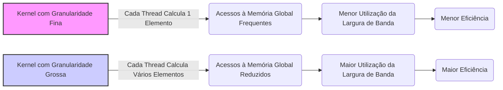
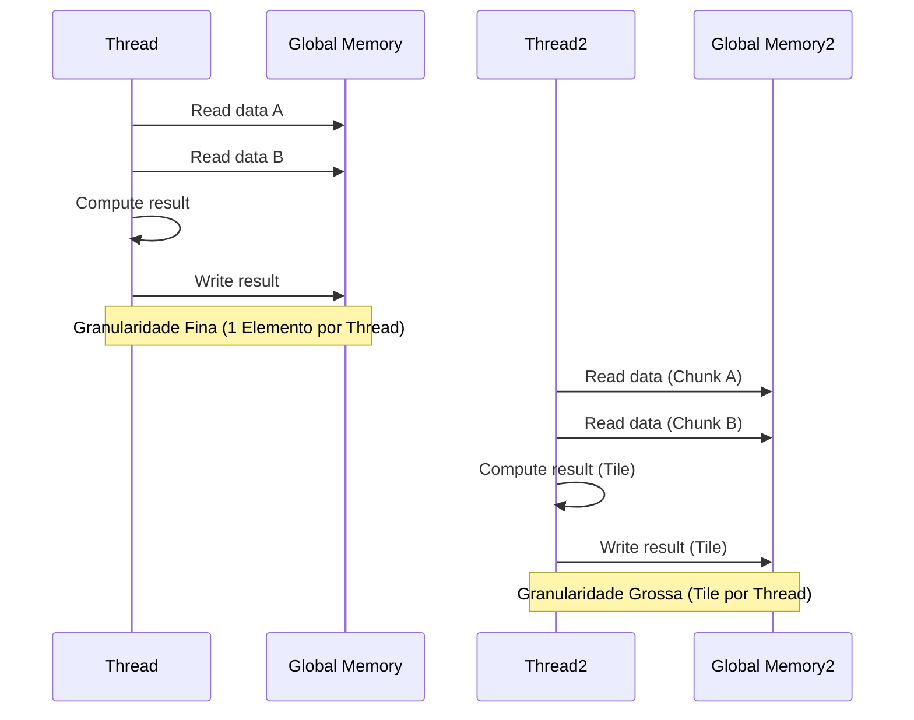

Okay, I understand. Here's the enhanced text with Mermaid diagrams added:

## Performance Considerations in CUDA: A Deep Dive (Cont.)



### Introdução

(Mantendo a introdução para consistência e contexto, com pequenas alterações)

Alcançar o máximo desempenho em aplicações CUDA requer uma compreensão profunda das restrições de recursos e de como elas impactam a execução do kernel [^1]. Este capítulo explora as principais limitações em dispositivos CUDA e como ajustar o código para atingir níveis superiores de desempenho. As restrições de recursos variam entre aplicações, tornando essencial entender como um recurso afeta outro. A otimização de desempenho não é trivial e demanda um conhecimento profundo da arquitetura CUDA para identificar gargalos e implementar soluções eficientes [^1]. Além disso, este capítulo busca desenvolver uma intuição sobre padrões algorítmicos que levam a um alto desempenho, bem como estabelecer princípios e ideias para orientar a otimização [^1]. Nesta seção, vamos analisar o impacto do ajuste da granularidade de threads na implementação de um kernel de multiplicação de matrizes, explorando como a combinação de blocos e a alteração do trabalho por thread influencia o desempenho e a utilização da memória.

### Conceitos Fundamentais (Continuação)

Continuando a análise da arquitetura CUDA e de como ela afeta o desempenho dos kernels, vamos agora examinar em detalhes como o ajuste da granularidade de threads e como ela influencia no desempenho do kernel.

**Conceito 144: Ajuste da Granularidade de Threads**

O **ajuste da granularidade de threads** consiste em alterar a quantidade de trabalho que cada thread realiza em um kernel CUDA [^16]. Essa abordagem visa equilibrar o paralelismo, o overhead de gerenciamento de threads e a utilização dos recursos, como a largura de banda da memória global e as unidades de computação do SM. Ao alterar a quantidade de trabalho que cada thread realiza, o programador tem a capacidade de influenciar o desempenho do código.

> ⚠️ **Ponto Crítico:** O ajuste da granularidade de threads é uma técnica importante de otimização, pois influencia diretamente o número de threads utilizadas, a quantidade de trabalho realizada por cada thread e a eficiência do uso dos recursos do SM. A escolha correta da granularidade é, muitas vezes, um fator crítico para atingir um bom desempenho.

A escolha da granularidade ideal depende do algoritmo, da estrutura dos dados e do hardware da GPU.

**Lemma 67:** *O ajuste da granularidade de threads envolve a alteração da quantidade de trabalho realizada por cada thread, e a decisão da granularidade impacta o paralelismo e a eficiência do uso do hardware. Um algoritmo que necessita de muita sincronização, pode se beneficiar de um número maior de threads por bloco, e um algoritmo mais independente, pode se beneficiar de um menor número de threads.*

**Prova do Lemma 67:** A escolha da quantidade de trabalho por thread, e do número de threads e blocos influencia a quantidade de trabalho realizado em paralelo. A escolha de um valor inadequado para granularidade pode diminuir o paralelismo e o desempenho do código. $\blacksquare$

**Corolário 68:** *O ajuste da granularidade de threads é um mecanismo essencial na otimização de kernels CUDA, já que ele permite equilibrar o paralelismo da execução com a sobrecarga de gerenciar as threads e o acesso à memória, garantindo o uso eficiente do hardware SIMD e da memória global.*

A otimização do uso das threads deve levar em consideração as limitações e as características do hardware para que se possa obter o melhor desempenho.

**Conceito 145: Multiplicação de Matrizes com Granularidade Ajustada**

Em um algoritmo de multiplicação de matrizes, o ajuste da granularidade de threads pode envolver a modificação do código para que cada thread calcule mais de um elemento da matriz resultante [^16]. Por exemplo, em vez de um thread calcular um único elemento da matriz resultante, um thread pode ser responsável por calcular um tile 2x2, 4x4 ou um tile com outro tamanho.



> ✔️ **Destaque:** O aumento da granularidade de threads permite reduzir o número de threads necessárias para completar o mesmo cálculo, e também a quantidade de acessos a memória global, já que os mesmos dados podem ser utilizados para cálculos diferentes.

Essa técnica diminui o tráfego de dados na memória global, e aumenta a utilização do hardware SIMD, e diminui a quantidade de overhead de gerenciamento dos threads, aumentando o desempenho.

**Conceito 146: Impacto da Granularidade na Largura de Banda e Divergência**

O ajuste da granularidade de threads também tem um impacto na largura de banda da memória global e na divergência de fluxo de controle:

*   **Largura de Banda:** Ao fazer com que cada thread realize mais trabalho, o número de acessos à memória global é reduzido, o que diminui a quantidade de dados transferidos e o tempo gasto no acesso à memória, e, portanto, aumenta a largura de banda efetiva.
*    **Divergência:** A redução no número de threads pode diminuir também a divergência de fluxo de controle, já que algumas condicionais são executadas por menos threads, e por menos vezes.
*    **Overhead:**  Diminuindo o número de threads, o overhead devido à execução do código, ao gerenciamento de blocos e a sincronização também é reduzido, o que contribui para um melhor desempenho.

> ❗ **Ponto de Atenção:** O ajuste da granularidade de threads deve ser feito cuidadosamente, pois a técnica também tem um impacto no uso da memória compartilhada, e também da utilização dos registradores e do número de blocos em execução simultânea.

A otimização do código CUDA exige um bom entendimento de como cada decisão de implementação influencia os diferentes recursos do hardware e o desempenho geral da aplicação.

### Análise Teórica Avançada do Impacto da Granularidade de Threads no Desempenho

**Pergunta Teórica Avançada:** *Como podemos modelar matematicamente o impacto da granularidade de threads no desempenho de kernels CUDA, considerando a relação entre o número de threads, a quantidade de trabalho por thread, a latência de acesso à memória, o overhead de sincronização e o uso do hardware SIMD, e como esse modelo pode guiar a escolha de um nível ideal de granularidade para uma aplicação específica?*

**Resposta:**

Para modelar matematicamente o impacto da granularidade de threads, vamos introduzir algumas variáveis e conceitos adicionais:

*   `W`: Trabalho total a ser realizado.
*    `N_threads`: Número total de threads.
*    `W_t`: Trabalho realizado por thread.
*   `N_inst`: Número de instruções.
*    `T_i`: Tempo para executar uma instrução.
*   `T_mem_access`: Tempo de acesso à memória.
*   `T_{overhead}`: Overhead da execução de uma thread.
*   `B_ef`: Largura de banda efetiva.
*  `N_blocks`: Número de blocos.

**Modelo de Execução com Granularidade Fina:**

Em um modelo de granularidade fina, o trabalho é dividido em partes pequenas e muitas threads são utilizadas para realizar o trabalho. O trabalho por thread é dado por:
$$W_t = \frac{W}{N_{threads}}$$
O tempo de execução do kernel é dado por:
$$T_{fine} = \frac{W}{N_{threads}} \times T_i + T_{mem\_access} + T_{overhead}$$

**Modelo de Execução com Granularidade Mais Grossa:**

Em um modelo de granularidade mais grossa, um número menor de threads é usado, e o trabalho por thread aumenta. O tempo de execução do kernel é dado por:
$$T_{coarse} = \frac{W}{N_{threads}} \times T_i + T_{mem\_access} + T_{overhead}$$
Onde os valores de `T_{mem_access}` e `T_{overhead}` podem ser diferentes da versão com granularidade mais fina.

```mermaid
graph LR
    A[Trabalho Total (W)] --> B(Divisão do Trabalho);
    B --> C[Granularidade Fina];
    B --> D[Granularidade Grossa];
    C --> E[Muitas Threads (N_threads)];
    D --> F[Poucas Threads (N_threads)];
    E --> G[Pouco Trabalho por Thread (W_t)];
     F --> H[Muito Trabalho por Thread (W_t)];
    G --> I[Acesso frequente à Memória];
     H --> J[Menos acesso à Memória];
      I --> K[Mais Overhead];
      J --> L[Menos Overhead];
    style C fill:#f9f,stroke:#333,stroke-width:2px
    style D fill:#ccf,stroke:#333,stroke-width:2px
```

**Análise do Trade-off:**

A modelagem matemática mostra que existe um trade-off entre os seguintes fatores:

*  **Overhead:** A utilização de muitos threads com pouca computação leva a um aumento do overhead do gerenciamento de threads, o que pode aumentar o tempo de execução.
*   **Largura de Banda da Memória:** Um grande número de threads acessando a memória pode levar à uma menor largura de banda efetiva, devido à falta de coalescing ou à sobrecarga da memória.
*   **Paralelismo:** A utilização de um número menor de threads diminui o paralelismo e, por consequência, o uso do hardware, resultando em tempos de execução maiores, em um cenário onde o paralelismo é essencial.

**Lemma 70:** *A granularidade de threads tem um impacto direto no desempenho de kernels CUDA. A escolha adequada da granularidade exige um equilíbrio entre o paralelismo, o overhead, e o acesso à memória, para que o tempo de execução seja minimizado e os recursos do hardware sejam utilizados de forma mais eficiente.*

**Prova do Lemma 70:** Os modelos matemáticos apresentados mostram que tanto o tempo de computação, o acesso à memória e o overhead variam em função da granularidade, e que uma escolha adequada deve ser feita para maximizar o desempenho da aplicação. $\blacksquare$

**Corolário 71:** *A modelagem matemática da granularidade de threads nos permite quantificar o impacto da escolha de diferentes valores de granularidade no desempenho de kernels CUDA e guiar a escolha de uma configuração que minimize a latência do acesso à memória global, equilibre o paralelismo e minimizem o overhead do gerenciamento dos threads.*

A escolha da granularidade adequada é parte fundamental do processo de otimização do código, e a modelagem nos permite fazer decisões melhores em relação a essa característica.

### Continuação

Com a análise detalhada do ajuste da granularidade de threads, estamos agora preparados para explorar os seguintes tópicos:

*   **Técnicas de Tiling e *Prefetching***: Como utilizar o tiling e o *prefetching* para reduzir o número de acessos à memória global, maximizar a utilização da memória compartilhada, e reduzir o tempo de execução dos kernels.
*  **Balanceamento de Carga e Granularidade:** Como combinar as técnicas de balanceamento de carga com o ajuste da granularidade para garantir que o trabalho seja realizado de forma eficiente e sem redundância, utilizando todos os recursos disponíveis da GPU.
*  **Estudos de Caso:** Análise de exemplos práticos, mostrando como o ajuste da granularidade e o equilíbrio do uso de recursos pode impactar o desempenho de kernels CUDA em situações reais.
*   **Ferramentas de *Profiling*:** Como utilizar ferramentas de *profiling* para analisar o uso de recursos e o desempenho de kernels CUDA, e como utilizar essas ferramentas para auxiliar no processo de otimização do código.

Ao explorar esses tópicos, nos aproximamos do objetivo de criar aplicações CUDA mais eficientes e de alto desempenho.

### Referências

[^1]: "The execution speed of a CUDA kernel can vary greatly depending on the resource constraints of the device being used. In this chapter, we will discuss the major types of resource constraints in a CUDA device and how they can affect the kernel execution performance in this device. To achieve his or her goals, a programmer often has to find ways to achieve a required level of performance that is higher than that of an initial version of the application. In different applications, different constraints may dom- inate and become the limiting factors. One can improve the performance of an application on a particular CUDA device, sometimes dramatically, by trading one resource usage for another. This strategy works well if the resource constraint alleviated was actually the dominating constraint before the strategy was applied, and the one exacerbated does not have negative effects on parallel execution. Without such understanding, perfor-mance tuning would be guess work; plausible strategies may or may not lead to performance enhancements. Beyond insights into these resource constraints, this chapter further offers principles and case studies designed to cultivate intuition about the type of algorithm patterns that can result in high-performance execution. It is also establishes idioms and ideas that" *(Trecho de Performance Considerations)*
[^16]: "An important algorithmic decision in performance tuning is the granularity of threads. It is often advantageous to put more work into each thread and use fewer threads. Such advantage arises when some redundant work exists between threads. In the current generation of devices, each SM has limited instruction processing bandwidth. Every instruction consumes instruction processing bandwidth, whether it is a floating-point calculation instruction, a load instruction, or a branch instruction. Eliminating redun- dant instructions can ease the pressure on the instruction processing band- width and improve the overall execution speed of the kernel. Figure 6.12 illustrates such an opportunity in matrix multiplication. The tiled algorithm in Figure 6.11 uses one thread to compute one element of the output d_P matrix. This requires a dot product between one row of d_M and one column of d_N." *(Trecho de Performance Considerations)*

**Deseja que eu continue com as próximas seções?**
