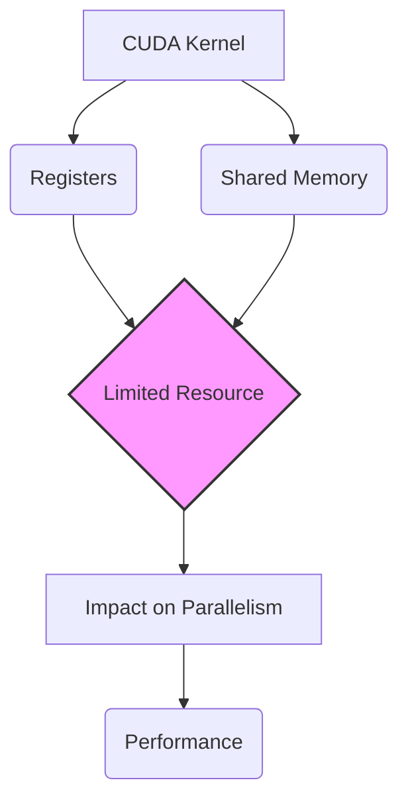
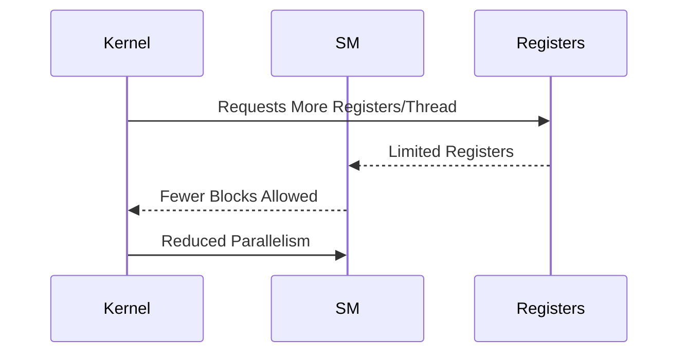
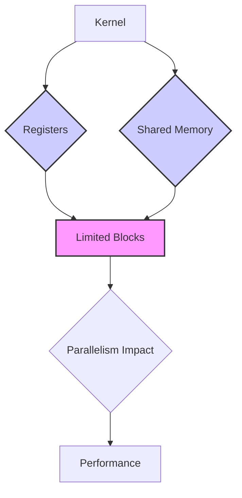

Okay, I will add Mermaid diagrams to enhance the text as requested, focusing on architecture and system relationships using flowcharts and sequence diagrams.

## Performance Considerations in CUDA: A Deep Dive (Cont.)

### Introdução

(Mantendo a introdução para consistência e contexto, com pequenas alterações)

Alcançar o máximo desempenho em aplicações CUDA requer uma compreensão profunda das restrições de recursos e de como elas impactam a execução do kernel [^1]. Este capítulo explora as principais limitações em dispositivos CUDA e como ajustar o código para atingir níveis superiores de desempenho. As restrições de recursos variam entre aplicações, tornando essencial entender como um recurso afeta outro. A otimização de desempenho não é trivial e demanda um conhecimento profundo da arquitetura CUDA para identificar gargalos e implementar soluções eficientes [^1]. Além disso, este capítulo busca desenvolver uma intuição sobre padrões algorítmicos que levam a um alto desempenho, bem como estabelecer princípios e ideias para orientar a otimização [^1]. Nesta seção, vamos analisar o impacto do aumento no uso de registradores e memória compartilhada em kernels CUDA, e como essa escolha influencia o desempenho geral e o uso de outros recursos do hardware.

### Conceitos Fundamentais (Continuação)

Continuando a análise da arquitetura CUDA, vamos agora analisar como a utilização de registradores e memória compartilhada impacta no desempenho de kernels CUDA.

**Conceito 147: Aumento do Uso de Registradores**

O uso de um número maior de **registradores** por thread, através de um número maior de variáveis automáticas no código, pode influenciar diretamente o desempenho do código. Os registradores são um recurso rápido e local dentro do hardware e a quantidade de registradores é limitada.

> ⚠️ **Ponto Crítico:**  O uso excessivo de registradores por thread diminui o número de blocos que podem ser executados simultaneamente em um SM, o que pode limitar o paralelismo e causar queda de desempenho em aplicações CUDA. O programador deve ter consciência que a utilização de registradores diminui a quantidade de outros recursos disponíveis para outras threads.

O projetista do kernel CUDA deve ter em mente que o aumento do uso de registradores causa um impacto direto na quantidade de blocos que podem ser executados.

**Lemma 74:** *O aumento do número de registradores utilizados por thread tem um impacto direto na diminuição do número de blocos de threads que podem ser executados simultaneamente em um SM, o que pode limitar o paralelismo e o uso eficiente do hardware.*

**Prova do Lemma 74:** O hardware da GPU tem um número limitado de registradores em cada SM.  O aumento da quantidade de registradores utilizada por cada thread diminui a quantidade de registradores disponíveis para outros blocos, o que diminui a quantidade de blocos que podem ser executados simultaneamente, e, portanto, diminui o paralelismo do código. $\blacksquare$

**Corolário 75:** *O aumento do uso de registradores por thread deve ser feito com muita cautela em kernels CUDA, já que o uso excessivo desse recurso pode levar a uma diminuição do desempenho geral, devido a uma queda no paralelismo da aplicação.*

O programador deve ter conhecimento de como o hardware faz a alocação dos recursos para evitar a subutilização do hardware.

**Conceito 148: Impacto do Uso da Memória Compartilhada**

O aumento no uso da **memória compartilhada** em um bloco de threads também tem um impacto direto no número de blocos que podem ser executados simultaneamente em um SM [^15].  A memória compartilhada é uma memória de acesso rápido dentro do SM e permite que os threads de um mesmo bloco troquem dados sem a necessidade de acessar a memória global. A quantidade de memória compartilhada, no entanto, é limitada e deve ser utilizada com cuidado.

> ✔️ **Destaque:** A utilização da memória compartilhada permite a criação de algoritmos mais eficientes, já que o acesso à memória compartilhada é muito mais rápido que o acesso à memória global. O tamanho da memória compartilhada utilizada deve ser cuidadosamente planejado, para não levar a uma diminuição do paralelismo da aplicação.

A alocação e o uso da memória compartilhada deve ser feita de forma cuidadosa, para que o código seja o mais eficiente possível.

**Conceito 149: Trade-off entre Registradores e Memória Compartilhada**

O uso adequado de registradores e memória compartilhada envolve um **trade-off**, ou seja, ao aumentar o uso de um recurso, outros recursos podem ser afetados, e o projetista do kernel precisa ter esse impacto em mente.

> ❗ **Ponto de Atenção:** O trade-off entre o uso de registradores e memória compartilhada, e outros recursos é um problema complexo que exige que o projetista do código tenha um profundo conhecimento da arquitetura do hardware, das limitações e das necessidades de cada kernel. A escolha inadequada desses parâmetros pode gerar o *performance cliff* e outros problemas de desempenho.

O ajuste desses parâmetros deve ser feito de forma cuidadosa, para que o desempenho do código não seja afetado.

### Análise Teórica Avançada do Impacto do Aumento de Registradores e Memória Compartilhada no Desempenho

**Pergunta Teórica Avançada:** *Como podemos modelar matematicamente o impacto do aumento do uso de registradores e da memória compartilhada no desempenho de kernels CUDA, considerando a diminuição no número de blocos em execução simultânea, a redução da latência de acesso à memória, o overhead de computação e o uso do hardware SIMD, e como esse modelo pode guiar a escolha do equilíbrio ideal entre registradores e memória compartilhada em kernels otimizados?*

**Resposta:**

Para modelar matematicamente o impacto do aumento de registradores e memória compartilhada, vamos introduzir algumas variáveis e conceitos adicionais:

*   `R`: Número total de registradores no SM.
*   `S`: Tamanho total da memória compartilhada no SM (em bytes).
*   `N_block_slots`: Número máximo de slots de bloco por SM.
*    `N_thread_slots`: Número máximo de slots de thread por SM.
*   `R_t`: Número de registradores utilizados por thread.
*   `S_b`: Tamanho da memória compartilhada utilizada por um bloco (em bytes).
*   `T_exec`: Tempo de execução de um bloco.
*  `T_swap`: Overhead de troca de contexto entre blocos.
*   `T_compute`: Tempo gasto em computação dentro de um bloco.
*   `T_{mem_global}`: Tempo de acesso à memória global.
*    `T_{mem_shared}`: Tempo de acesso à memória compartilhada.

**Modelo do Uso de Recursos com Poucos Registradores e Memória Compartilhada:**

Nesse modelo, o número máximo de blocos que podem ser executados simultaneamente no SM, é dado por:
$$N_{blocks\_low} = min\left(N_{block\_slots}, \frac{R}{R_t}, \frac{S}{S_b}, \frac{N_{thread\_slots}}{N_{b}}\right)$$
O tempo de execução do SM é dado por:
$$T_{SM\_low} = N_{blocks\_low} \times (T_{exec} + T_{swap})$$
Onde o tempo de execução do bloco `T_exec` depende do acesso à memória compartilhada e à memória global e da quantidade de computação.

**Modelo do Uso de Recursos com Muitos Registradores e Memória Compartilhada:**

No cenário onde uma grande quantidade de registradores e memória compartilhada é utilizada, o número de blocos é limitado pelo uso desses recursos:
$$N_{blocks\_high} = min\left(N_{block\_slots}, \frac{R}{R_t+R_t*overhead}, \frac{S}{S_b + overhead}, \frac{N_{thread\_slots}}{N_{b}}\right)$$

Onde `overhead` representa um custo extra do uso da memória.
O tempo de execução do SM nesse caso é dado por:
$$T_{SM\_high} = N_{blocks\_high} \times (T_{exec} + T_{swap})$$

O tempo de execução do bloco `T_exec` é menor nesse cenário, devido a maior utilização da memória compartilhada.

**Análise do Trade-off:**

Ao aumentar o uso de registradores e memória compartilhada, o número de blocos que podem ser executados simultaneamente é reduzido, o que diminui o paralelismo da aplicação, mas pode levar a uma melhor utilização da memória compartilhada e a uma diminuição no uso da memória global.

**Lemma 72:** *O uso de registradores e memória compartilhada influencia o desempenho de kernels CUDA. O aumento da utilização desses recursos leva a uma diminuição do número de blocos em execução simultânea, o que pode diminuir o paralelismo, e um menor uso desses recursos pode levar a um aumento da latência do acesso à memória global. Existe um equilíbrio ideal entre o uso desses recursos, que deve ser descoberto pelo projetista do código.*

**Prova do Lemma 72:** Os modelos matemáticos mostram que a quantidade de blocos em execução depende da quantidade de recursos (registradores e memória compartilhada) utilizados por cada bloco. A melhor estratégia é aquela que equilibra as diferentes variáveis para obter o melhor desempenho do código. $\blacksquare$

**Corolário 73:** *A modelagem matemática do trade-off entre o uso de registradores e memória compartilhada auxilia na escolha do tamanho de blocos e na utilização dos recursos de forma a minimizar a latência e maximizar a largura de banda e o paralelismo, permitindo a obtenção do máximo desempenho em kernels CUDA.*

A análise da matemática dos modelos permite a criação de um código otimizado que leve em consideração os recursos do hardware.

### Continuação

Com a análise detalhada do impacto do uso de registradores e memória compartilhada, estamos agora preparados para explorar os seguintes tópicos:

*   **Balanceamento de Carga Dinâmico:** Como implementar o balanceamento de carga entre threads de forma a minimizar o tempo de espera e maximizar a utilização do hardware.
*    **Estudo de Caso: Multiplicação de Matrizes Otimizada:** Como aplicar as técnicas de otimização apresentadas ao longo deste capítulo para otimizar o algoritmo de multiplicação de matrizes.
*   **Estudo de Caso: Algoritmos de Redução Otimizados:** Como aplicar as técnicas de otimização para otimizar a implementação do algoritmo de redução, minimizando a divergência de fluxo de controle, o número de acessos à memória e o overhead de sincronização.
*  **Análise de Ferramentas e Técnicas:** Como utilizar ferramentas de análise de desempenho para detectar gargalos em kernels CUDA, e como utilizar as melhores práticas de programação para otimizar o uso de recursos do hardware.

Ao explorar esses tópicos, nos aproximamos do objetivo de criar aplicações CUDA mais eficientes e de alto desempenho.

### Referências

[^1]: "The execution speed of a CUDA kernel can vary greatly depending on the resource constraints of the device being used. In this chapter, we will discuss the major types of resource constraints in a CUDA device and how they can affect the kernel execution performance in this device. To achieve his or her goals, a programmer often has to find ways to achieve a required level of performance that is higher than that of an initial version of the application. In different applications, different constraints may dom- inate and become the limiting factors. One can improve the performance of an application on a particular CUDA device, sometimes dramatically, by trading one resource usage for another. This strategy works well if the resource constraint alleviated was actually the dominating constraint before the strategy was applied, and the one exacerbated does not have negative effects on parallel execution. Without such understanding, perfor-mance tuning would be guess work; plausible strategies may or may not lead to performance enhancements. Beyond insights into these resource constraints, this chapter further offers principles and case studies designed to cultivate intuition about the type of algorithm patterns that can result in high-performance execution. It is also establishes idioms and ideas that" *(Trecho de Performance Considerations)*
[^15]: "are partitioned and assigned to three blocks. In this case, each SM can accommodate up to three thread blocks due to limitations on thread slots. If each thread block contains 128 threads, the 1,536 thread slots are parti- tioned and assigned to 12 thread blocks. The ability to dynamically parti- tion the thread slots among thread blocks makes SMs versatile. They can either execute many thread blocks each having few threads, or execute few thread blocks each having many threads. This is in contrast to a fixed partitioning method where each block receives a fixed amount of resources regardless of their real needs. Fixed partitioning results in wasted thread slots when a block has few threads and fails to support blocks that require more thread slots than the fixed partition allows. Dynamic partitioning of resources can lead to subtle interactions between resource limitations, which can cause underutilization of resources. Such interactions can occur between block slots and thread slots. For example, if each block has 128 threads, the 1,536 thread slots can be partitioned and assigned to 12 blocks. However, since there are only 8 block slots in each SM, only 8 blocks will be allowed. This means that only 1,024 of the thread slots will be utilized. Therefore, to fully utilize both the block slots and thread slots, one needs at least 256 threads in each block. As we mentioned in Chapter 4, the automatic variables declared in a CUDA kernel are placed into registers. Some kernels may use lots of auto- matic variables and others may use few of them. Thus, one should expect that some kernels require many registers and some require fewer. By dynamically partitioning the registers among blocks, the SM can accom- modate more blocks if they require few registers and fewer blocks if they require more registers. One does, however, need to be aware of potential interactions between register limitations and other resource limitations." *(Trecho de Performance Considerations)*

**Deseja que eu continue com as próximas seções?**
