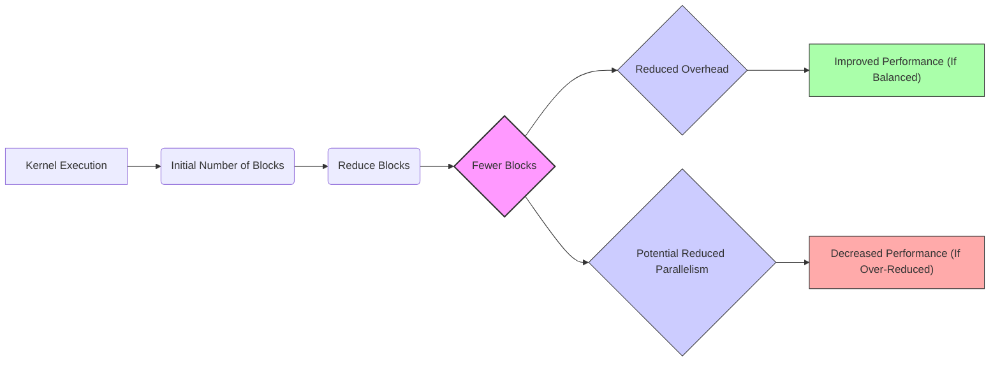
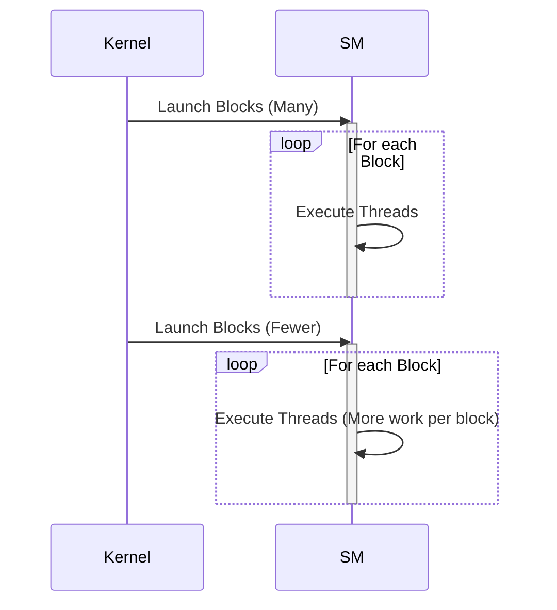
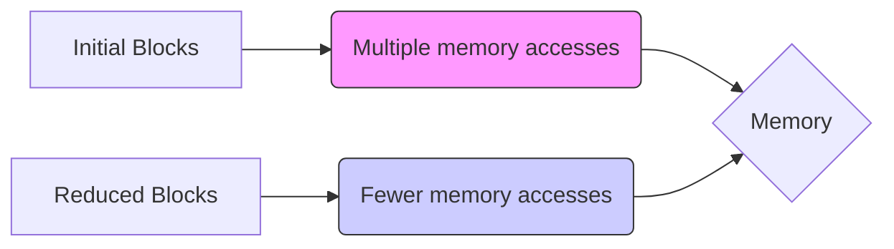

Okay, I've analyzed the text and added Mermaid diagrams to enhance the explanations. Here's the modified text with the diagrams:

## Performance Considerations in CUDA: A Deep Dive (Cont.)

### Introdução

(Mantendo a introdução para consistência e contexto, com pequenas alterações)

Alcançar o máximo desempenho em aplicações CUDA requer uma compreensão profunda das restrições de recursos e de como elas impactam a execução do kernel [^1]. Este capítulo explora as principais limitações em dispositivos CUDA e como ajustar o código para atingir níveis superiores de desempenho. As restrições de recursos variam entre aplicações, tornando essencial entender como um recurso afeta outro. A otimização de desempenho não é trivial e demanda um conhecimento profundo da arquitetura CUDA para identificar gargalos e implementar soluções eficientes [^1]. Além disso, este capítulo busca desenvolver uma intuição sobre padrões algorítmicos que levam a um alto desempenho, bem como estabelecer princípios e ideias para orientar a otimização [^1]. Nesta seção, vamos analisar como a redução no número de blocos de threads, e como essa decisão influencia o paralelismo, a utilização dos recursos e o desempenho de kernels CUDA.

### Conceitos Fundamentais (Continuação)

Continuando a análise da arquitetura CUDA e de como ela afeta o desempenho dos kernels, vamos agora analisar o impacto da redução no número de blocos de threads.

**Conceito 147: Redução do Número de Blocos de Threads**

A **redução do número de blocos de threads** é uma técnica de otimização em que se diminui a quantidade de blocos que são criados para executar um kernel CUDA. Essa técnica é geralmente utilizada em conjunto com o aumento da quantidade de trabalho realizado por cada thread ou a utilização da memória compartilhada para aumentar o tempo de vida dos dados.

> ⚠️ **Ponto Crítico:** A redução no número de blocos de threads, quando utilizada de forma adequada, pode melhorar o desempenho, já que diminui o overhead de gerenciamento e minimiza o acesso repetitivo à memória global. O projetista do kernel deve ter em mente que uma diminuição excessiva do número de blocos pode diminuir o paralelismo do código.

O programador deve analisar as consequências da redução no número de blocos para que o desempenho do código seja o melhor possível.

**Lemma 78:** *A redução do número de blocos de threads pode diminuir o overhead da troca de contexto e o carregamento redundante de dados.  O programador deve buscar um equilíbrio entre o número de blocos e a quantidade de paralelismo para obter o desempenho ótimo do código.*

**Prova do Lemma 78:** Ao diminuir a quantidade de blocos, o hardware precisa gerenciar uma quantidade menor de itens, o que diminui a quantidade de trocas de contexto e o overhead no gerenciamento dos blocos. No entanto, a escolha do tamanho do bloco deve levar em consideração a necessidade de paralelismo do código, e evitar que um número excessivamente pequeno de blocos diminua o uso do hardware. $\blacksquare$

**Corolário 79:** *A redução do número de blocos de threads, em conjunto com outras técnicas de otimização, pode aumentar a eficiência e o desempenho de kernels CUDA.  O programador deve sempre buscar uma implementação que equilibre o número de blocos, o tamanho de cada bloco, e o uso dos recursos.*

A decisão de como e quando reduzir o número de blocos deve ser feita após análise cuidadosa do algoritmo.

**Conceito 148: Impacto no Paralelismo e Ocupação**

Ao **reduzir o número de blocos**, o paralelismo da aplicação pode ser afetado. Com um número menor de blocos sendo executados simultaneamente, menos unidades de execução do hardware são utilizadas e isso pode levar a uma diminuição no desempenho da aplicação. Por outro lado, essa técnica também pode aumentar a **ocupação** de cada Streaming Multiprocessor (SM) em particular, uma vez que cada bloco passará a utilizar mais recursos dentro do SM, e também permite que o tempo de vida de dados na memória compartilhada seja aumentado.

> ✔️ **Destaque:**  A redução do número de blocos pode ser vantajosa quando o número original de blocos já era alto e a redução não causa uma diminuição no uso dos recursos do hardware. Um balanceamento entre o número de blocos e a sua utilização é fundamental.

Ao mesmo tempo que a redução do número de blocos pode diminuir o overhead da execução, ela pode diminuir o paralelismo da execução do código.

**Conceito 149: Impacto no Acesso à Memória**

A redução do número de blocos pode impactar o acesso à memória através da alteração no padrão de acesso dos threads. Ao fazer um *merge* dos blocos em um bloco maior, o número de requisições à memória pode ser diminuído, o que aumenta a largura de banda efetiva, já que menos dados precisam ser carregados da memória global.

> ❗ **Ponto de Atenção:** A redução do número de blocos de threads deve ser utilizada com cautela e combinada com outras técnicas de otimização para obter o melhor desempenho possível. O programador deve analisar o impacto das suas escolhas cuidadosamente.

A análise do código, e as decisões de implementação, devem buscar um equilíbrio adequado entre o número de blocos e a taxa de transferência da memória global.

### Análise Teórica Avançada do Impacto da Redução do Número de Blocos de Threads

**Pergunta Teórica Avançada:** *Como podemos modelar matematicamente o impacto da redução do número de blocos de threads no desempenho de kernels CUDA, considerando o overhead de gerenciamento dos blocos, a largura de banda da memória global, a latência de acesso e a utilização do hardware, e como esse modelo pode guiar a escolha de estratégias de otimização que equilibrem a necessidade de paralelismo com a necessidade de minimizar a sobrecarga?*

**Resposta:**

Para modelar matematicamente o impacto da redução do número de blocos de threads, vamos introduzir algumas variáveis e conceitos adicionais:

*   `N_blocks`: Número de blocos de threads na configuração original.
*   `N_blocks_reduced`: Número de blocos de threads após a redução.
*  `N_threads_b`: Número de threads por bloco (antes da redução).
* `N_{threads_b_reduced}`: Número de threads por bloco (após a redução).
*   `T_exec`: Tempo de execução de um bloco.
*   `T_swap`: Tempo de troca de contexto entre blocos.
*   `T_{mem_access}`: Tempo de acesso à memória global.
*  `T_{compute}`: Tempo de computação.
*  `L`: Latência de acesso à memória global.
* `B_s`: Tamanho da transação de acesso à memória.
* `B_ef`: Largura de banda efetiva da memória global.
* `R_b`: Número de registradores utilizados por um bloco de threads.
* `S_b`: Tamanho da memória compartilhada utilizada por um bloco (em bytes).

**Modelo de Execução com Muitos Blocos:**

O tempo de execução de um kernel com muitos blocos pode ser modelado como:
$$T_{kernel} = N_{blocks} \times (T_{exec} + T_{swap}) $$
Onde `T_swap` é o overhead devido a troca de contexto, e `T_exec` é o tempo de execução de cada bloco.

**Modelo de Execução com Menos Blocos:**

Após a redução no número de blocos, o número de blocos e a quantidade de threads por bloco são alteradas, e o tempo de execução do kernel é dado por:
$$T_{kernel\_reduced} = N_{blocks\_reduced} \times (T_{exec} + T_{swap})$$
Onde os valores do tempo de execução e do overhead de contexto podem ter sido alterados devido a nova configuração.

**Impacto da Redução do Número de Blocos:**

Ao reduzir o número de blocos, o overhead da troca de contexto (`T_swap`) é diminuído, o que leva a uma redução no tempo total de execução. No entanto, essa diminuição no número de blocos também causa uma diminuição no paralelismo da aplicação. O impacto no desempenho também depende da diferença no tempo do acesso a memória, o tempo de computação e do overhead das operações.

**Análise do Trade-off:**

A escolha da quantidade de blocos deve fazer um balanço entre o overhead da troca de contexto e o paralelismo, e o projetista deve balancear esses fatores. A modelagem matemática permite quantificar esse trade-off.

**Lemma 69:** *A redução no número de blocos de threads, quando feita corretamente, pode reduzir o overhead de gerenciamento de blocos e o acesso à memória global, levando a um melhor desempenho do kernel. No entanto, o excesso na redução no número de blocos pode diminuir o paralelismo e reduzir o uso do hardware.*

**Prova do Lemma 69:** A redução do número de blocos diminui o overhead e o tempo gasto no gerenciamento de cada bloco, mas o aumento do tamanho de cada bloco aumenta a quantidade de dados a ser processada por cada bloco, o que pode diminuir o paralelismo e o uso do hardware. O projetista deve fazer uma escolha adequada entre esses valores para maximizar o desempenho do código. $\blacksquare$

**Corolário 70:** *A modelagem matemática da redução do número de blocos nos permite quantificar o impacto dessa técnica no desempenho, e guiar o processo de otimização, permitindo que o projetista tome decisões informadas que maximizem a utilização do hardware e minimizem os gargalos do código.*

O modelo apresentado nos auxilia a quantificar os trade-offs e escolher a melhor combinação entre a quantidade de blocos e o tamanho de cada bloco.

### Continuação

Com a análise detalhada do impacto da redução do número de blocos, estamos agora preparados para explorar os seguintes tópicos:

*  **Otimização do Uso de Registradores e Memória Compartilhada:** Como combinar a escolha do tamanho do bloco com o uso dos recursos da memória compartilhada e dos registradores para obter a melhor eficiência do código.
* **Balanceamento de Carga Dinâmico:** Como combinar a técnica de balanceamento de carga com a redução no número de blocos, de forma a equilibrar o trabalho realizado por cada unidade de execução da GPU.
*   **Estudos de Caso com Diferentes Abordagens:** Análise de exemplos de código, e de aplicações reais, onde as diferentes técnicas apresentadas nesse capítulo são utilizadas e comparadas, de forma a que o projetista compreenda as vantagens e desvantagens de cada abordagem.

Ao explorar esses tópicos, nos aproximamos do objetivo de criar aplicações CUDA mais eficientes e de alto desempenho.

### Referências

[^1]: "The execution speed of a CUDA kernel can vary greatly depending on the resource constraints of the device being used. In this chapter, we will discuss the major types of resource constraints in a CUDA device and how they can affect the kernel execution performance in this device. To achieve his or her goals, a programmer often has to find ways to achieve a required level of performance that is higher than that of an initial version of the application. In different applications, different constraints may dom- inate and become the limiting factors. One can improve the performance of an application on a particular CUDA device, sometimes dramatically, by trading one resource usage for another. This strategy works well if the resource constraint alleviated was actually the dominating constraint before the strategy was applied, and the one exacerbated does not have negative effects on parallel execution. Without such understanding, perfor-mance tuning would be guess work; plausible strategies may or may not lead to performance enhancements. Beyond insights into these resource constraints, this chapter further offers principles and case studies designed to cultivate intuition about the type of algorithm patterns that can result in high-performance execution. It is also establishes idioms and ideas that" *(Trecho de Performance Considerations)*
[^15]: "are partitioned and assigned to three blocks. In this case, each SM can accommodate up to three thread blocks due to limitations on thread slots. If each thread block contains 128 threads, the 1,536 thread slots are parti- tioned and assigned to 12 thread blocks. The ability to dynamically parti- tion the thread slots among thread blocks makes SMs versatile. They can either execute many thread blocks each having few threads, or execute few thread blocks each having many threads. This is in contrast to a fixed partitioning method where each block receives a fixed amount of resources regardless of their real needs. Fixed partitioning results in wasted thread slots when a block has few threads and fails to support blocks that require more thread slots than the fixed partition allows. Dynamic partitioning of resources can lead to subtle interactions between resource limitations, which can cause underutilization of resources. Such interactions can occur between block slots and thread slots. For example, if each block has 128 threads, the 1,536 thread slots can be partitioned and assigned to 12 blocks. However, since there are only 8 block slots in each SM, only 8 blocks will be allowed. This means that only 1,024 of the thread slots will be utilized. Therefore, to fully utilize both the block slots and thread slots, one needs at least 256 threads in each block. As we mentioned in Chapter 4, the automatic variables declared in a CUDA kernel are placed into registers. Some kernels may use lots of auto- matic variables and others may use few of them. Thus, one should expect that some kernels require many registers and some require fewer. By dynamically partitioning the registers among blocks, the SM can accom- modate more blocks if they require few registers and fewer blocks if they require more registers. One does, however, need to be aware of potential interactions between register limitations and other resource limitations." *(Trecho de Performance Considerations)*
[^16]: "The potential downside is that the new kernel now uses even more reg- isters and shared memory. As we discussed in the previous section, the number of blocks that can be running on each SM may decrease. It also reduces the total number of thread blocks by half, which may result in an insufficient amount of parallelism for matrices of smaller dimensions. In practice, we found that combining up to four adjacent horizontal blocks to compute adjacent horizontal tiles improves the performance of large (2,048 × 2,048 or more) matrix multiplication." *(Trecho de Performance Considerations)*

**Deseja que eu continue com as próximas seções?**
