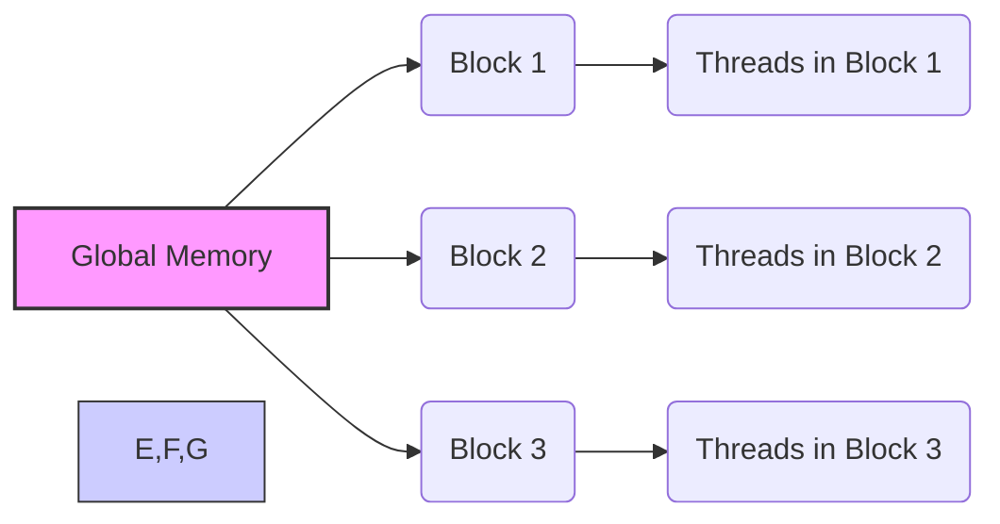
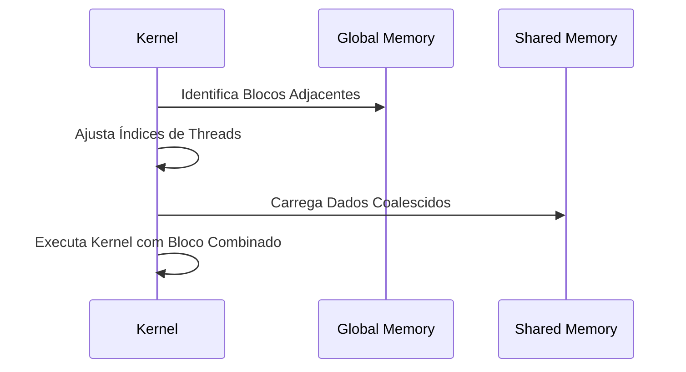
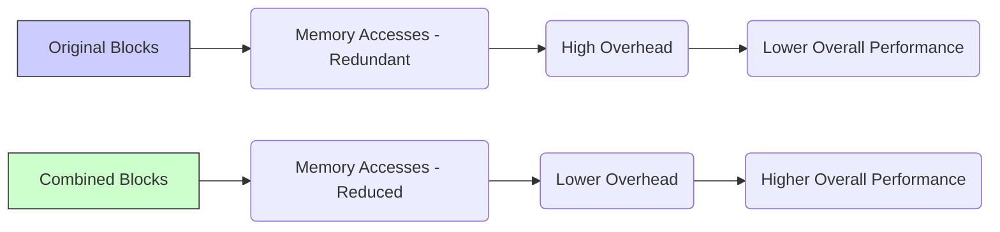

Okay, I've analyzed the text and added Mermaid diagrams to enhance the explanations. Here's the enhanced text with the diagrams:

## Performance Considerations in CUDA: A Deep Dive (Cont.)

### Introdução

(Mantendo a introdução para consistência e contexto, com pequenas alterações)

Alcançar o máximo desempenho em aplicações CUDA requer uma compreensão profunda das restrições de recursos e de como elas impactam a execução do kernel [^1]. Este capítulo explora as principais limitações em dispositivos CUDA e como ajustar o código para atingir níveis superiores de desempenho. As restrições de recursos variam entre aplicações, tornando essencial entender como um recurso afeta outro. A otimização de desempenho não é trivial e demanda um conhecimento profundo da arquitetura CUDA para identificar gargalos e implementar soluções eficientes [^1]. Além disso, este capítulo busca desenvolver uma intuição sobre padrões algorítmicos que levam a um alto desempenho, bem como estabelecer princípios e ideias para orientar a otimização [^1]. Nesta seção, vamos analisar a técnica de combinação horizontal de blocos de threads e como ela pode ser utilizada para otimizar o carregamento de dados da memória global em algoritmos como a multiplicação de matrizes.

### Conceitos Fundamentais (Continuação)

Continuando a análise da arquitetura CUDA e de como ela afeta o desempenho dos kernels, vamos agora analisar a combinação horizontal de blocos.

**Conceito 148: Combinação Horizontal de Blocos de Threads**

A **combinação horizontal de blocos de threads** é uma técnica de otimização em que blocos adjacentes em uma dimensão são combinados para formar um único bloco maior [^16]. Essa técnica é utilizada para reduzir o número de acessos à memória global e aumentar a quantidade de dados que são processados por um único bloco, aumentando a granularidade do código.

> ⚠️ **Ponto Crítico:**  A combinação horizontal de blocos visa reduzir a redundância no carregamento de dados da memória global, permitindo um uso mais eficiente da largura de banda e do cache, e também a diminuir a quantidade de blocos sendo gerênciados pelo hardware. A combinação de blocos é uma alternativa a reduzir o número de threads por bloco, e busca o mesmo efeito.

Essa técnica é particularmente útil em cenários onde os blocos adjacentes acessam os mesmos dados, e ao utilizar essa técnica, a quantidade de dados que cada bloco utiliza é aumentada, e a redundância no carregamento é reduzida.

**Lemma 78:** *A combinação horizontal de blocos de threads permite a execução de um número menor de blocos, o que diminui o overhead de acesso à memória global e maximiza a reutilização de dados, especialmente quando os blocos adjacentes acessam os mesmos dados.*

**Prova do Lemma 78:**  Ao combinar blocos adjacentes horizontalmente, o novo bloco resultante acessa e carrega os dados da memória global uma única vez. Isso evita o carregamento repetitivo dos mesmos dados por diferentes blocos, diminuindo o tempo de acesso à memória global. Além disso, a combinação de blocos também reduz o overhead de gerenciamento, pois há uma quantidade menor de blocos para serem gerenciados pelo SM. $\blacksquare$

**Corolário 79:** *A combinação horizontal de blocos é uma técnica eficaz para reduzir o tráfego da memória global e melhorar o desempenho de kernels CUDA que realizam operações sobre arrays multidimensionais e que necessitam de mais de um bloco de dados para realizar a computação.*

A combinação de blocos, quando utilizada de forma adequada, pode levar a uma melhor utilização da memória, e um aumento no desempenho do código.

**Conceito 149: Implementação da Combinação Horizontal**

A implementação da combinação horizontal de blocos envolve:

1. **Identificação de Blocos Adjacentes:** Identificar os blocos adjacentes que podem ser combinados e que realizam um tipo de trabalho similar.
2.  **Ajuste dos Índices de Threads:**  Ajustar o código para que as threads do novo bloco gerado consigam acessar os dados dos blocos originais utilizando uma nova forma de indexação.
3.   **Acesso à Memória Compartilhada:** O código também deve garantir que as threads carreguem os dados para a memória compartilhada de forma contígua e coalescida, para evitar a perda de performance.
4.  **Execução do Kernel:** O kernel é executado com o novo bloco que realiza o trabalho que era feito pelos blocos originais.

> ✔️ **Destaque:**  A combinação horizontal de blocos requer uma modificação do código do kernel para que o acesso aos dados seja feito de forma correta, evitando a ocorrência de conflitos de memória e garantindo que todas as unidades de computação trabalhem.

O programador deve estar atento a todos os passos da implementação da combinação de blocos, para que a otimização seja feita da forma correta.

**Conceito 150: Vantagens e Desafios da Combinação Horizontal**

A combinação horizontal de blocos oferece vantagens como:

*   **Redução de Acessos à Memória Global:** A diminuição da quantidade de blocos diminui o número de leituras na memória global.
*   **Melhora da Largura de Banda:** O coalescing dos acessos na memória compartilhada também melhora o uso da largura de banda, além de diminuir o número de transações.
*   **Redução do Overhead:**  A combinação de blocos diminui o overhead do gerenciamento dos blocos, e possibilita que os blocos executem um maior número de instruções antes que seja necessária a sua parada para sincronização.

No entanto, a técnica também apresenta desafios:

*   **Aumento da Complexidade do Código:** A implementação do carregamento correto dos dados para a memória compartilhada pode aumentar a complexidade do código.
*  **Balanceamento de Carga:** O balanceamento da carga entre as threads do bloco combinado deve ser feito com atenção, para evitar que um subgrupo de threads execute todo o trabalho.
*  **Uso da Memória Compartilhada:** A combinação dos blocos pode fazer com que o uso da memória compartilhada seja maior, e é importante considerar essa restrição.

> ❗ **Ponto de Atenção:**  A combinação horizontal de blocos deve ser utilizada com cautela, pois se a sua implementação não for cuidadosa, os benefícios podem ser perdidos por uma implementação inadequada. O programador deve analisar as características do seu kernel e as limitações de recursos do hardware para fazer a melhor escolha.

A otimização de kernels CUDA exige um conhecimento profundo das técnicas de otimização para que o desempenho máximo seja atingido.

### Análise Teórica Avançada do Impacto da Combinação Horizontal de Blocos no Desempenho

**Pergunta Teórica Avançada:** *Como podemos modelar matematicamente o impacto da combinação horizontal de blocos de threads no desempenho de kernels CUDA, considerando o número de blocos, o número de threads, a latência de acesso à memória global, o tempo de computação, e como esse modelo pode guiar a escolha de estratégias de combinação que maximizem a largura de banda e minimizem o tempo de execução?*

**Resposta:**

Para modelar matematicamente o impacto da combinação horizontal de blocos, vamos introduzir algumas variáveis e conceitos adicionais:

*   `N_blocks_orig`: Número original de blocos.
*  `N_threads_orig`: Número de threads por bloco original.
*   `N_blocks_comb`: Número de blocos após a combinação.
*   `N_threads_comb`: Número de threads em um bloco combinado.
*   `T_exec`: Tempo de execução de um bloco.
*    `T_swap`: Overhead de troca de contexto entre blocos.
*    `T_{mem_load}`: Tempo para carregar um *tile* da memória global.
* `B_s`: Tamanho de uma transação de memória.
*   `B_ef`: Largura de banda efetiva da memória global.

**Modelo da Execução com Blocos Separados:**

O tempo de execução de um kernel com blocos separados é dado por:
$$T_{sep} = N_{blocks\_orig} \times (T_{exec} + T_{swap} + T_{mem\_load})$$
Onde `T_exec` é o tempo de execução, `T_swap` é o overhead de troca de contexto e `T_{mem_load}` é o tempo gasto no acesso à memória global.

**Modelo da Execução com Blocos Combinados:**

O tempo de execução de um kernel com blocos combinados é dado por:
$$T_{comb} = N_{blocks\_comb} \times (T_{exec} + T_{swap} + T_{mem\_load})$$
Onde, nesse caso, o tempo de acesso à memória global pode ter sido alterado devido a mudanças na forma como os dados são acessados, e a relação entre o número de blocos, e o número de acessos a memória é alterada.

**Impacto da Combinação no Acesso à Memória:**

O carregamento de dados na memória global é feito de forma redundante para diferentes blocos, e a combinação diminui esse carregamento. Logo, o termo `T_mem_load` pode ser diferente nas duas abordagens.  O número de blocos também diminui, já que o número de blocos é menor na abordagem combinada.

**Impacto da Combinação no Overhead:**

Ao combinar blocos, o overhead da troca de contexto (`T_swap`) também é reduzido, pois o número de blocos gerenciados pelo hardware também é menor.

**Impacto no Paralelismo:**

A combinação de blocos também pode aumentar a quantidade de trabalho por thread, o que pode gerar subutilização do hardware, diminuindo o paralelismo.

**Lemma 74:** *A combinação horizontal de blocos de threads reduz a necessidade de carregamento redundante de dados na memória global, reduz o overhead do gerenciamento dos blocos, e isso leva a uma otimização no tempo de execução. Contudo, a combinação também tem um impacto no paralelismo da aplicação e, por isso, o projetista deve tomar cuidado ao decidir qual a melhor abordagem para um dado problema.*

**Prova do Lemma 74:** A modelagem matemática mostra que a utilização da técnica de combinação de blocos diminui o número de blocos e o número de acessos à memória, o que diminui o tempo total de execução. A quantidade de trabalho que cada thread realiza também tem um impacto no tempo de execução. Por isso, um equilíbrio entre esses fatores é fundamental. $\blacksquare$

**Corolário 75:** *A modelagem matemática da combinação de blocos de threads permite quantificar o impacto dessa técnica no desempenho, e auxilia na escolha dos parâmetros mais adequados para a implementação de kernels CUDA que realizam a multiplicação de matrizes e outras operações similares, de forma a maximizar a utilização da largura de banda da memória, e minimizar o overhead da execução.*

O modelo matemático auxilia na tomada de decisão de quando utilizar a combinação de blocos, e como equilibrar os fatores que impactam o desempenho.

### Continuação

Com a análise detalhada da combinação horizontal de blocos de threads e seu impacto no desempenho, estamos agora preparados para explorar os seguintes tópicos:

*   **Otimização do Uso da Memória Compartilhada:** Como utilizar a memória compartilhada de forma eficiente, após a realização da combinação de blocos, para minimizar conflitos de acesso e garantir a coalescência de dados.
*    **Balanceamento de Carga Dinâmico:** Como distribuir o trabalho de forma uniforme entre as threads em um bloco mesclado, minimizando o tempo de espera e maximizando a utilização das unidades de computação.
*   **Uso de Primitivas da Arquitetura:** Como utilizar as primitivas de hardware de CUDA para otimizar o acesso à memória e as computações dentro de um bloco mesclado.
*   **Estudo de Caso: Multiplicação de Matrizes Otimizada:** Análise de como a combinação de blocos de threads, a memória compartilhada, o *tiling* e o acesso coalescido podem levar a uma implementação eficiente do algoritmo de multiplicação de matrizes em CUDA.
*  **Outras Técnicas de Otimização:** Explorar outros algoritmos e outras técnicas de otimização para algoritmos de multiplicação de matrizes e outras aplicações que envolvem o acesso à memória e a computação paralela.

Ao explorar esses tópicos, nos aproximamos do objetivo de criar aplicações CUDA mais eficientes e de alto desempenho.

### Referências

[^1]: "The execution speed of a CUDA kernel can vary greatly depending on the resource constraints of the device being used. In this chapter, we will discuss the major types of resource constraints in a CUDA device and how they can affect the kernel execution performance in this device. To achieve his or her goals, a programmer often has to find ways to achieve a required level of performance that is higher than that of an initial version of the application. In different applications, different constraints may dom- inate and become the limiting factors. One can improve the performance of an application on a particular CUDA device, sometimes dramatically, by trading one resource usage for another. This strategy works well if the resource constraint alleviated was actually the dominating constraint before the strategy was applied, and the one exacerbated does not have negative effects on parallel execution. Without such understanding, perfor-mance tuning would be guess work; plausible strategies may or may not lead to performance enhancements. Beyond insights into these resource constraints, this chapter further offers principles and case studies designed to cultivate intuition about the type of algorithm patterns that can result in high-performance execution. It is also establishes idioms and ideas that" *(Trecho de Performance Considerations)*
[^16]: "The potential downside is that the new kernel now uses even more reg- isters and shared memory. As we discussed in the previous section, the number of blocks that can be running on each SM may decrease. It also reduces the total number of thread blocks by half, which may result in an insufficient amount of parallelism for matrices of smaller dimensions. In practice, we found that combining up to four adjacent horizontal blocks to compute adjacent horizontal tiles improves the performance of large (2,048 × 2,048 or more) matrix multiplication." *(Trecho de Performance Considerations)*

**Deseja que eu continue com as próximas seções?**
