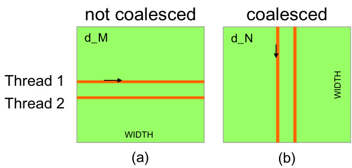
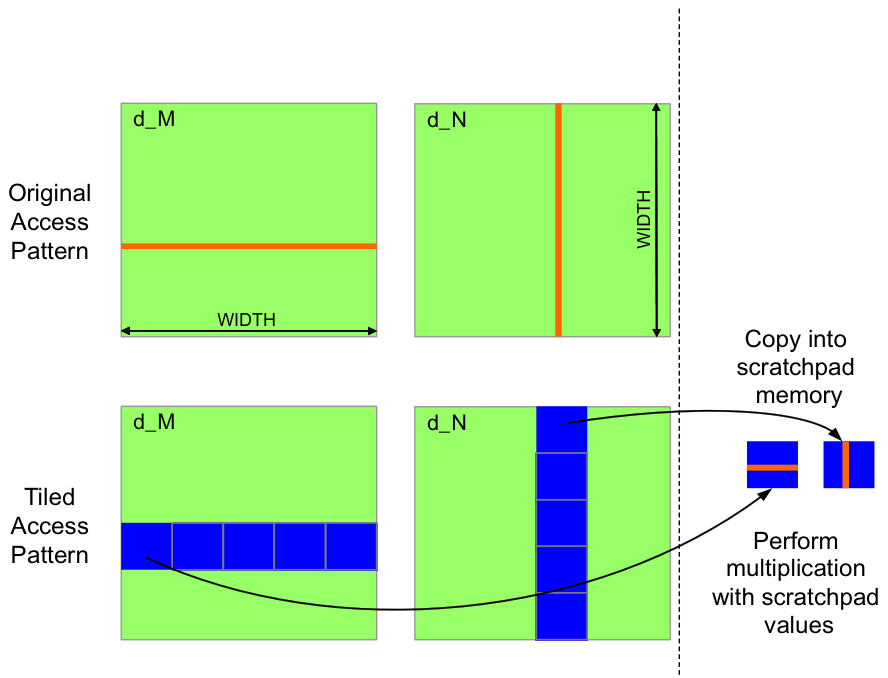
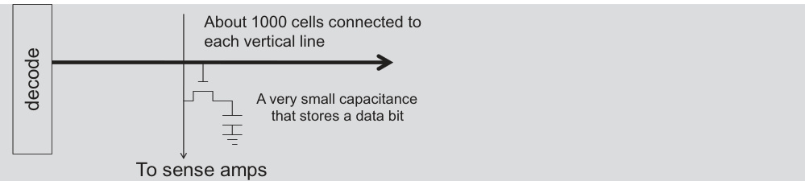
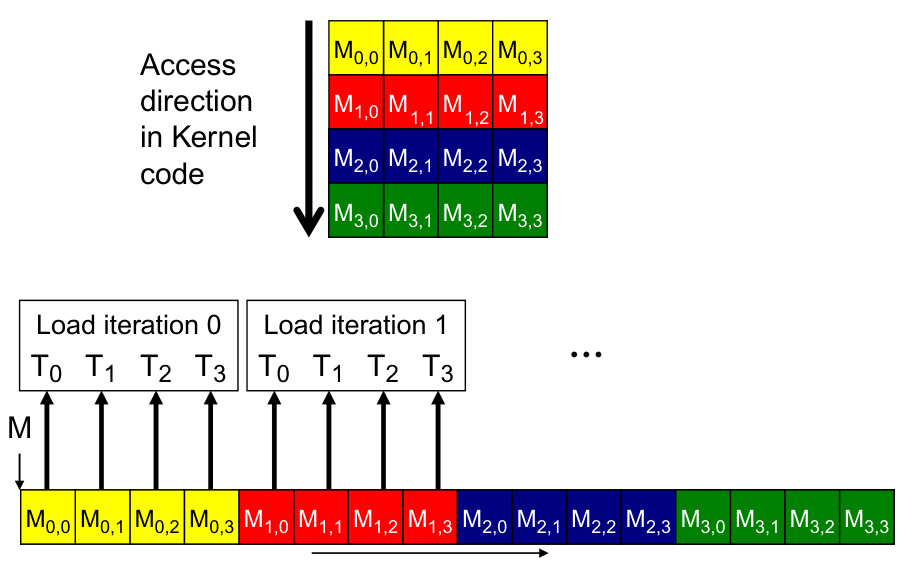
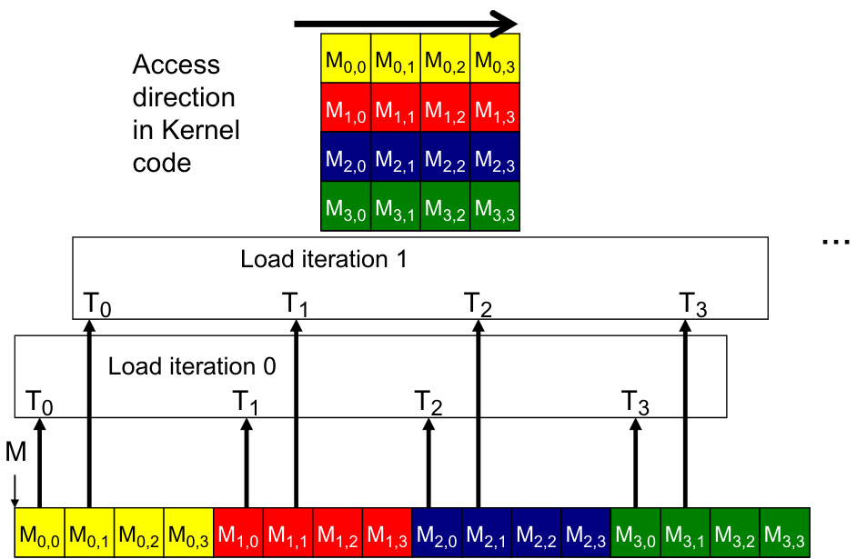

The image illustrates the concept of linearizing a 2D matrix in row-major order, a fundamental aspect of memory management in CUDA, as discussed in Section 6.2 on page 135. It shows a 4x4 matrix 'M' being mapped into a linear memory space, demonstrating how consecutive elements in each row are placed contiguously in memory, impacting memory access patterns and coalescing. Understanding this row-major layout is crucial for optimizing memory access patterns in CUDA kernels to achieve efficient global memory bandwidth utilization.

A imagem, encontrada na página 136 do documento, ilustra padrões de acesso à memória em C 2D arrays para coalescência. A Figura 6.7(a) mostra um acesso não coalescido ao array d_M, onde threads adjacentes acessam linhas diferentes, resultando em acessos não contíguos na memória global. A Figura 6.7(b) demonstra um acesso coalescido ao array d_N, onde threads adjacentes acessam colunas consecutivas, permitindo que o hardware combine os acessos em uma única transação de memória.

The image, Figure 6.10 from page 139, illustrates a memory coalescing technique using shared memory for matrix multiplication. It contrasts the 'Original Access Pattern' with the 'Tiled Access Pattern'. The original pattern shows non-coalesced access to global memory for d_M (row-wise) and d_N (column-wise). The tiled access pattern demonstrates how data is read into scratchpad (shared) memory in tiles, enabling coalesced memory access and efficient multiplication with scratchpad values.

The image illustrates the execution of a sum reduction kernel, a method for efficiently summing elements in an array using parallel processing, as discussed in Chapter 6 of the document. It shows the first four iterations of the reduction process, with each thread adding values from array elements to compute partial sums, which are then stored back into the array at even indices; threads 0 through 15 (Thread 0 - Thread 15) contribute to the computation, with the red blocks indicating actively modified data and the green region signifying memory beyond the scope of initial threads involved.

A imagem, referida na página 124 como sendo a mesma da Figura 5.4, ilustra a motivação para a execução de threads como warps, mostrando esquematicamente um processador (SM) com uma unidade de controle que busca e decodifica instruções. Um mesmo sinal de controle é enviado a múltiplas unidades de processamento, cada uma executando uma thread em um warp, destacando o conceito de Single Instruction, Multiple Data (SIMD), onde diferenças na execução ocorrem devido aos valores de operandos nos arquivos de registro. A figura detalha a interconexão entre a unidade de processamento (contendo ALU e arquivo de registradores), memória compartilhada, memória, unidade de controle (com PC e IR) e interfaces de I/O.

The image illustrates the DRAM cell architecture, showcasing the connection of approximately 1000 cells to each vertical line, the presence of a small capacitance for data bit storage, and the signal path to sense amplifiers, which is discussed in section 6.2, page 134. This representation is used to explain the challenges in increasing DRAM access speeds due to the reliance on electrical charge sharing and the trade-off between cell size and data storage capacity, impacting memory bandwidth and performance. The diagram emphasizes the architectural limitations affecting the speed and efficiency of memory access in CUDA devices.

The image, referred to as Figure 6.8 in the document, illustrates a coalesced memory access pattern in CUDA, specifically when accessing a 4x4 matrix. It depicts the access direction in kernel code and how threads load data in iterations, highlighting the process of accessing d_N to achieve coalesced memory accesses for improved DRAM bandwidth utilization as discussed in Section 6.2 on Global Memory Bandwidth (page 136). The diagram demonstrates how consecutive threads in a warp access consecutive memory locations, enabling the hardware to combine these accesses into a consolidated access, which is essential for efficient data transfer from global memory to the processor.

The image, labeled as Figure 6.1 on page 126 of the document, illustrates how 2D threads are mapped into a linear order for partitioning into warps in CUDA. The upper section shows a 2D arrangement of threads T0,0 to T3,3, representing threadIdx.x and threadIdx.y, while the lower section demonstrates their corresponding linear order, crucial for warp partitioning and SIMD hardware execution, as detailed in Section 6.1.

The image, appearing as Figure 6.8 in Chapter 6, visualizes a coalesced access pattern in CUDA memory. It depicts how threads access elements M(i,j) of a 4x4 matrix in consecutive memory locations during two load iterations, enabling the hardware to consolidate these accesses for improved DRAM bandwidth utilization, as discussed in Section 6.2. The diagram shows how threads T0 through T3 read elements from global memory and how these reads are aligned to enable coalescing.

The image illustrates the execution of a sum reduction kernel, as explained in Figure 6.3 of the document, focusing on how threads and array elements interact during the reduction process. It depicts how pairwise partial sums are generated in the array after each iteration, showing the progression of the reduction across multiple threads (Thread 0, Thread 2, Thread 4, Thread 6, Thread 8, Thread 10) and array elements (0 to 11). The diagram highlights that after iteration 1, even elements of the array hold pairwise partial sums, and with each iteration, the 'stride' variable doubles, affecting which threads execute the add statement (add statement in line 8)
