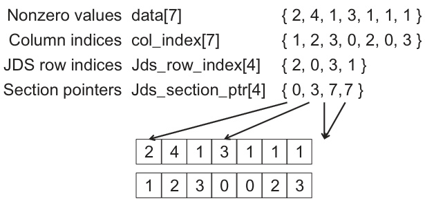

## Otimização de SpMV para Sistemas Lineares Esparsos em CUDA

### Introdução

A resolução de **sistemas lineares esparsos** é uma tarefa fundamental em diversas áreas da computação científica e engenharia. Frequentemente, métodos iterativos como o **gradiente conjugado** são empregados para resolver esses sistemas, onde a operação de **multiplicação esparsa matriz-vetor (SpMV)**, tipicamente da forma *A × X + Y*, representa o gargalo computacional [^3]. Este capítulo explora a otimização de SpMV em arquiteturas CUDA, com foco nas trocas entre diferentes formatos de armazenamento, dado que a escolha do formato afeta diretamente o desempenho em GPU. O objetivo é fornecer uma análise detalhada das estratégias de implementação e otimização para SpMV, considerando as características intrínsecas das GPUs e os formatos de dados mais comuns.

### Conceitos Fundamentais

A **multiplicação esparsa matriz-vetor (SpMV)** é uma operação crucial em muitos algoritmos de álgebra linear, especialmente na resolução de sistemas lineares esparsos. Uma matriz esparsa é aquela onde a maioria dos elementos são zero. Armazenar e operar com todos os elementos, incluindo os zeros, seria ineficiente. Portanto, formatos de armazenamento especiais são utilizados para representar apenas os elementos não-nulos e sua estrutura. A eficiência de uma implementação SpMV depende fortemente da escolha do formato de armazenamento, da arquitetura da GPU e da estratégia de paralelização utilizada.

Dado o destaque na importância da função SpMV (A × X + Y) no contexto de resolução iterativa de sistemas lineares esparsos [^3], é crucial detalhar os aspectos relacionados à otimização dessa operação em GPUs utilizando CUDA. A operação SpMV, de forma geral, pode ser expressa como:

$$
Y_i = \sum_{j=1}^{n} A_{ij}X_j + Y_i
$$

onde *A* é a matriz esparsa, *X* é o vetor de entrada, *Y* é o vetor de saída, e *n* é a dimensão da matriz.


A implementação eficiente desta operação em GPUs exige uma consideração cuidadosa de vários fatores, incluindo:

1.  **Formato de Armazenamento da Matriz Esparsa:** Diferentes formatos, como Compressed Sparse Row (CSR), Compressed Sparse Column (CSC), ELLPACK, e Coordinate (COO), oferecem diferentes vantagens e desvantagens em termos de consumo de memória, padrão de acesso, e adequação à arquitetura da GPU.

2.  **Paralelização:** A operação SpMV pode ser paralelizada em vários níveis. A paralelização mais comum é distribuir as linhas da matriz entre os threads da GPU. No entanto, a eficiência desta abordagem depende da distribuição dos elementos não-nulos nas linhas.

3.  **Acesso à Memória:** O acesso eficiente à memória global da GPU é crucial para um bom desempenho. A coalescência de memória (acesso contíguo por threads adjacentes) e o uso de memória compartilhada para armazenamento temporário podem melhorar significativamente o desempenho.

4.  **Balanceamento de Carga:** É importante garantir que todos os threads da GPU tenham uma quantidade similar de trabalho a fazer. Desbalanceamento de carga pode levar a ineficiências e subutilização dos recursos da GPU.

### Formatos de Armazenamento e suas Trocas

A escolha do formato de armazenamento para a matriz esparsa é uma decisão crítica que impacta significativamente o desempenho da SpMV. Alguns dos formatos mais comuns incluem:

*   **Compressed Sparse Row (CSR):** Este formato armazena a matriz usando três arrays: `row_ptr`, `col_ind`, e `val`. `row_ptr` armazena os índices para o início de cada linha em `col_ind` e `val`. `col_ind` armazena os índices das colunas dos elementos não-nulos. `val` armazena os valores dos elementos não-nulos. O formato CSR é geralmente eficiente para operações onde as linhas da matriz são processadas independentemente.


*   **Compressed Sparse Column (CSC):** Similar ao CSR, mas armazena a matriz por colunas. É útil quando as colunas são processadas independentemente.

*   **ELLPACK:** Este formato é adequado para matrizes com uma distribuição relativamente uniforme de elementos não-nulos por linha. Armazena os elementos não-nulos e seus índices de coluna em arrays retangulares. Se uma linha tem menos elementos não-nulos do que o número máximo de elementos não-nulos em qualquer linha, os elementos restantes são preenchidos com valores padrão (normalmente zero).


*   **Coordinate (COO):** Este formato armazena cada elemento não-nulo como uma tupla (linha, coluna, valor). É simples, mas geralmente menos eficiente que CSR ou CSC para SpMV devido ao acesso aleatório à memória.

 A escolha do formato de armazenamento depende das características da matriz esparsa e da arquitetura da GPU. Por exemplo, CSR é frequentemente uma boa escolha para GPUs devido ao seu padrão de acesso à memória coalescido e à sua capacidade de ser paralelizado eficientemente.


No entanto, para matrizes com padrões de esparsidade irregulares, outros formatos podem ser mais adequados.


A análise de trade-offs entre os formatos é essencial para obter o melhor desempenho possível.




### Estratégias de Otimização para SpMV em CUDA

Diversas estratégias podem ser empregadas para otimizar a implementação de SpMV em CUDA:

1.  **Coalescência de Memória:** Garantir que os threads da GPU acessem a memória global de forma coalescida é crucial para um bom desempenho. Isso significa que os threads adjacentes devem acessar endereços de memória adjacentes. O formato CSR, quando implementado corretamente, pode fornecer acesso coalescido à memória.

2.  **Uso de Memória Compartilhada:** A memória compartilhada na GPU é muito mais rápida do que a memória global. Usar a memória compartilhada para armazenar partes do vetor de entrada ou saída pode melhorar significativamente o desempenho.

3.  **Otimização do Kernel CUDA:** O kernel CUDA que realiza a multiplicação esparsa matriz-vetor deve ser cuidadosamente otimizado para a arquitetura da GPU. Isso pode envolver o uso de diretivas de compilador, o ajuste do tamanho do bloco de threads e a otimização do uso de registros.

4.  **Balanceamento de Carga:** Distribuir o trabalho uniformemente entre os threads da GPU é essencial para evitar gargalos e maximizar o desempenho. Isso pode envolver a divisão das linhas da matriz entre os threads de forma a garantir que cada thread tenha uma quantidade similar de trabalho.

5.  **Uso de Bibliotecas Otimizadas:** Bibliotecas como cuSPARSE fornecem implementações otimizadas de SpMV para GPUs NVIDIA. O uso dessas bibliotecas pode economizar tempo e esforço no desenvolvimento de implementações personalizadas.

### Exemplo de Implementação CSR em CUDA

A seguir, apresenta-se um exemplo simplificado de implementação de SpMV utilizando o formato CSR em CUDA. Este exemplo ilustra os princípios básicos da implementação, mas pode ser ainda mais otimizado para obter o melhor desempenho possível.

```c++
__global__ void spmv_csr_kernel(int num_rows, const int *row_ptr, const int *col_ind, const float *val, const float *x, float *y) {
    int row = blockIdx.x * blockDim.x + threadIdx.x;

    if (row < num_rows) {
        float sum = 0.0f;
        int row_start = row_ptr[row];
        int row_end = row_ptr[row + 1];

        for (int i = row_start; i < row_end; ++i) {
            int col = col_ind[i];
            float value = val[i];
            sum += value * x[col];
        }

        y[row] = sum;
    }
}
```

Neste exemplo, cada thread da GPU calcula o produto escalar de uma linha da matriz esparsa com o vetor de entrada. O `row_ptr` e o `col_ind` são usados para acessar os elementos não-nulos da linha e seus índices de coluna correspondentes. O resultado é armazenado no vetor de saída `y`.


### Conclusão

A otimização de SpMV em GPUs usando CUDA requer uma compreensão profunda dos formatos de armazenamento de matrizes esparsas, das características da arquitetura da GPU e das estratégias de paralelização. A escolha do formato de armazenamento, a implementação eficiente do kernel CUDA e a otimização do acesso à memória são fatores críticos para obter o melhor desempenho possível. A escolha do formato de armazenamento ideal para SpMV é diretamente ligada à arquitetura CUDA e, por consequência, deve ser testada para diferentes sistemas lineares esparsos. A exploração das estratégias apresentadas neste capítulo permite o desenvolvimento de implementações de SpMV altamente eficientes para uma ampla gama de aplicações. A utilização de bibliotecas otimizadas, como cuSPARSE, também representa uma alternativa valiosa para acelerar o desenvolvimento e garantir um desempenho superior [^3].

### Referências
[^3]: Sparse linear systems are often solved using iterative methods like conjugate gradient, where the most time-consuming part is the SpMV (A × X + Y) calculation. This has standardized library function interfaces and serves to illustrate trade-offs between storage formats.
<!-- END -->