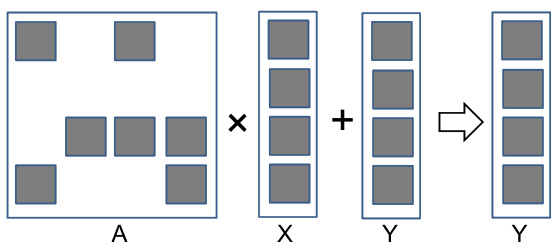

## Implementação Sequencial de SpMV Baseada em CSR

### Introdução

A multiplicação esparsa matriz-vetor (SpMV) é uma operação fundamental em diversas áreas da computação científica e engenharia. Devido à natureza esparsa das matrizes envolvidas, implementações eficientes são cruciais para obter bom desempenho. A representação Compressed Sparse Row (CSR) é um formato comum para armazenar matrizes esparsas, e a implementação sequencial de SpMV baseada em CSR serve como um ponto de partida para desenvolver versões paralelas otimizadas para GPUs. Este capítulo detalha a implementação sequencial de SpMV usando CSR, explorando os argumentos da função, a estrutura de dados e o fluxo de execução.

### Conceitos Fundamentais

A implementação sequencial de SpMV com CSR recebe como entrada o número de linhas da matriz esparsa (`num_rows`) e três arrays: `data[]`, `row_ptr[]` e `x[]` [^1]. O array `data[]` armazena os valores não nulos da matriz, `row_ptr[]` indica o início de cada linha no array `data[]`, e `x[]` é o vetor de entrada. O objetivo é calcular o produto da matriz esparsa (armazenada em formato CSR) pelo vetor `x[]`, resultando em um vetor de saída `y[]`.



O algoritmo básico para a implementação sequencial é o seguinte:

1.  Iterar sobre cada linha da matriz esparsa, de `row = 0` a `num_rows - 1`.
2.  Para cada linha `row`, inicializar o elemento correspondente no vetor de saída `y[row] = 0`.
3.  Determinar os índices de início e fim da linha `row` no array `data[]` usando `row_ptr[]`. O índice de início é `row_ptr[row]` e o índice de fim é `row_ptr[row + 1]`.
4.  Iterar sobre os elementos não nulos da linha `row` no array `data[]`, de `j = row_ptr[row]` a `row_ptr[row + 1] - 1`.
5.  Para cada elemento `data[j]`, obter o índice da coluna correspondente `col_index`. Este índice precisa ser calculado ou armazenado em um array adicional `col_index[]`.
6.  Multiplicar o valor `data[j]` pelo elemento correspondente do vetor `x[]`, ou seja, `x[col_index]`.
7.  Acumular o resultado na posição correspondente do vetor de saída: `y[row] += data[j] * x[col_index]`.

Em resumo, o código realiza um produto escalar entre a linha atual da matriz esparsa e o vetor `x`.


A eficiência da implementação sequencial depende da escolha da estrutura de dados para armazenar os índices das colunas (`col_index`). Em algumas implementações, um array separado `col_index[]` é usado para armazenar os índices das colunas correspondentes a cada valor em `data[]`. Em outras, o índice da coluna pode ser calculado dinamicamente dentro do loop.

**Exemplo de Código (Pseudocódigo):**

```
function spmv_csr_sequential(num_rows, data[], row_ptr[], col_index[], x[], y[])
  for row = 0 to num_rows - 1 do
    y[row] = 0
    for j = row_ptr[row] to row_ptr[row + 1] - 1 do
      col = col_index[j]
      y[row] += data[j] * x[col]
    end for
  end for
end function
```


**Análise Matemática:**

A operação SpMV pode ser expressa matematicamente como:

$$
y = Ax
$$

Onde $A$ é a matriz esparsa, $x$ é o vetor de entrada e $y$ é o vetor de saída. No formato CSR, a matriz $A$ é representada implicitamente pelos arrays `data[]`, `row_ptr[]` e `col_index[]`. A complexidade computacional da implementação sequencial é proporcional ao número de elementos não nulos na matriz esparsa. Se $nnz$ é o número de elementos não nulos, a complexidade é $O(nnz)$.

### Conclusão

A implementação sequencial de SpMV usando CSR serve como base para explorar implementações paralelas em GPUs. Compreender os argumentos da função, a estrutura de dados CSR e o fluxo de execução da implementação sequencial é fundamental para desenvolver versões CUDA eficientes. As otimizações para GPU se concentrarão em paralelizar o loop externo sobre as linhas da matriz esparsa, alocando diferentes linhas para diferentes threads ou blocos de threads na GPU. Além disso, técnicas de otimização de acesso à memória, como coalescing e uso de memória compartilhada, podem ser aplicadas para melhorar o desempenho.

### Referências
[^1]: Contexto fornecido: A sequential SpMV implementation based on CSR uses function arguments like `num_rows` and arrays `data[]`, `row_ptr[]`, and `x[]`. It iterates through rows, calculating a dot product of the current row and vector x, using `col_index` to access elements for multiplication.

<!-- END -->