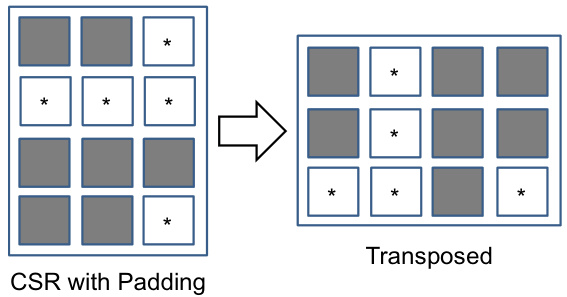

## Otimização de SpMV com ELL: Padding, Transposição e Acesso à Memória Coalescido

### Introdução

O produto esparso matriz-vetor (SpMV) é uma operação fundamental em diversas áreas da computação científica e engenharia. No entanto, sua implementação eficiente em GPUs é desafiadora devido à natureza irregular das matrizes esparsas, que frequentemente leva a acessos não coalescidos à memória e divergência no fluxo de execução dos *threads*. Uma técnica para mitigar esses problemas é o uso do formato de armazenamento ELL (Ellpack/Itpack) [^1], combinado com *padding* e transposição. Este capítulo explora em profundidade essa abordagem, detalhando seus mecanismos e benefícios.

### Conceitos Fundamentais

O formato ELL [^1] é derivado do formato ELLPACK, um dos primeiros esquemas de armazenamento projetados para matrizes esparsas. A ideia central é adicionar elementos *dummy* (geralmente zeros) às linhas da matriz esparsa, de forma que todas as linhas tenham o mesmo comprimento que a linha com o maior número de elementos não nulos. Isso transforma a matriz esparsa em uma matriz densa *virtual*, facilitando o acesso à memória e o processamento paralelo.

**Padding:** O processo de *padding* [^1] é essencial para garantir que todas as linhas da matriz tenham o mesmo comprimento, denotado por $K$, onde $K = \max_{i} (\text{número de elementos não nulos na linha } i)$. Se uma linha $i$ tiver menos de $K$ elementos não nulos, preenchemos os espaços restantes com zeros. Embora isso aumente o uso da memória, simplifica significativamente o acesso aos dados.

**Transposição (Column-Major Order):** Após o *padding*, a matriz ELL é armazenada em ordem de coluna (column-major order) [^1]. Isso significa que os elementos de cada coluna são armazenados consecutivamente na memória. A transposição, neste contexto, refere-se à organização dos dados de linha-major (como a matriz original) para column-major. Essa transposição desempenha um papel crucial na otimização de acessos à memória coalescidos, especialmente em arquiteturas de GPU.



**Vantagens do Formato ELL com Padding e Transposição:**

1.  **Acesso à Memória Coalescido:** Em GPUs, o acesso à memória é mais eficiente quando os *threads* em um *warp* (um grupo de *threads* que executam em SIMD) acessam dados contíguos na memória. Ao armazenar a matriz ELL em ordem de coluna, os *threads* podem acessar os elementos de uma coluna consecutivamente, o que leva a acessos coalescidos [^1].

2.  **Redução da Divergência:** Como todas as linhas têm o mesmo comprimento, todos os *threads* dentro de um *warp* executam o mesmo número de operações. Isso reduz a divergência de fluxo de execução, que pode degradar significativamente o desempenho da GPU.


**Implementação e Considerações Matemáticas:**

Seja $A$ uma matriz esparsa de dimensão $M \times N$. No formato ELL, $A$ é representada por duas matrizes: `data` e `indices`. A matriz `data` armazena os valores dos elementos não nulos, e a matriz `indices` armazena os índices das colunas correspondentes. Ambas as matrizes têm dimensão $M \times K$, onde $K$ é o número máximo de elementos não nulos em qualquer linha de $A$.

Para calcular o produto SpMV $y = Ax$, onde $x$ é o vetor de entrada e $y$ é o vetor de saída, podemos usar o seguinte algoritmo:

```
for i = 0 to M-1:
  y[i] = 0
  for j = 0 to K-1:
    if data[i][j] != 0:
      y[i] += data[i][j] * x[indices[i][j]]
```

A condição `data[i][j] != 0` é usada para evitar operações desnecessárias com os elementos *dummy*. No entanto, em muitas implementações de GPU, essa verificação condicional pode ser evitada para simplificar o fluxo de execução e melhorar o desempenho. A penalidade de realizar algumas multiplicações por zero é geralmente menor do que o custo da divergência condicional.

**Exemplo:**

Considere a seguinte matriz esparsa:

$$
A = \begin{bmatrix}
1 & 0 & 2 & 0 \\
0 & 3 & 0 & 4 \\
5 & 0 & 6 & 0
\end{bmatrix}
$$

Neste caso, $M = 3$ e $N = 4$. O número máximo de elementos não nulos em qualquer linha é $K = 2$. Portanto, a representação ELL de $A$ seria:

```
data = [[1, 2],
        [3, 4],
        [5, 6]]

indices = [[0, 2],
           [1, 3],
           [0, 2]]
```

Note que não foi necessário *padding* neste exemplo, pois todas as linhas possuem o mesmo número de elementos não nulos.

**Padding com zeros:**

Se a matriz esparsa fosse:

$$
A = \begin{bmatrix}
1 & 0 & 2 & 0 \\
0 & 3 & 0 & 0 \\
5 & 0 & 6 & 0
\end{bmatrix}
$$

Então, $K = 2$ e a representação ELL seria:

```
data = [[1, 2],
        [3, 0],
        [5, 6]]

indices = [[0, 2],
           [1, 0],
           [0, 2]]
```

Observe o *padding* com zero na segunda linha da matriz `data`, e o índice correspondente na matriz `indices` pode ser arbitrário (neste caso, usamos 0).

**Transposição para Column-Major:**

A matriz `data` acima (sem o padding) armazenada em column-major seria:

```
data_transposed = [[1, 3, 5],
                   [2, 4, 6]]
```

Isso permite que *threads* cooperem para carregar colunas inteiras de `data_transposed`, resultando em acessos coalescidos.

### Conclusão

O formato ELL, combinado com *padding* e transposição, é uma técnica eficaz para otimizar o produto SpMV em GPUs. Ao garantir que todas as linhas da matriz tenham o mesmo comprimento e ao armazenar os dados em ordem de coluna, podemos mitigar os problemas de acesso não coalescido à memória e divergência no fluxo de execução dos *threads*. No entanto, é importante notar que o formato ELL pode ser ineficiente para matrizes esparsas com grande variação no número de elementos não nulos por linha, pois o *padding* excessivo pode levar a um uso inaceitável da memória. Nesses casos, outros formatos de armazenamento, como o CSR (Compressed Sparse Row) ou formatos híbridos, podem ser mais apropriados. A escolha do formato de armazenamento ideal depende das características específicas da matriz esparsa e da arquitetura da GPU.

### Referências

[^1]: Descrição do formato ELL e sua aplicação para otimizar SpMV em GPUs.
<!-- END -->