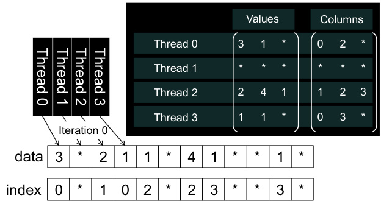

## Mitigando Desafios do SpMV com Métodos ELL e Híbridos

### Introdução

O produto esparso matriz-vetor (SpMV) é uma operação fundamental em diversas áreas da computação científica e engenharia. O formato ELL (Ellpack-Itpack) oferece uma abordagem estruturada para armazenar matrizes esparsas, facilitando a vetorização e o acesso à memória. No entanto, a eficiência do ELL pode ser comprometida quando algumas linhas da matriz apresentam um número significativamente maior de elementos não nulos, resultando em *padding* excessivo [^03]. Para superar essa limitação, métodos híbridos que combinam o ELL com o formato Coordenado (COO) são empregados.

### Conceitos Fundamentais

**Formato ELL (Ellpack-Itpack):** O formato ELL é adequado para matrizes esparsas onde o número de elementos não nulos em cada linha é aproximadamente o mesmo. Ele armazena os valores não nulos e seus índices de coluna em duas matrizes retangulares. O número de colunas nessas matrizes é determinado pelo número máximo de elementos não nulos em qualquer linha da matriz original. Linhas com menos elementos não nulos são preenchidas com valores padrão (geralmente zero), resultando em *padding*.

**Ineficiência do ELL:** A principal desvantagem do ELL surge quando a distribuição dos elementos não nulos entre as linhas é desigual. Se algumas poucas linhas contiverem um número substancialmente maior de elementos não nulos do que a maioria das outras linhas, o *padding* necessário para acomodar essas linhas longas se torna excessivo. Isso leva a um uso ineficiente da memória e a uma redução no desempenho computacional, pois operações desnecessárias são realizadas em elementos preenchidos.

**Formato Coordenado (COO):** O formato COO representa uma matriz esparsa armazenando cada elemento não nulo individualmente, juntamente com seu índice de linha e coluna. Essa representação é flexível e não requer *padding*, tornando-a adequada para matrizes com distribuições arbitrárias de elementos não nulos.

**Métodos Híbridos (ELL + COO):** Métodos híbridos combinam as vantagens do ELL e do COO para mitigar as desvantagens de cada formato individualmente. A ideia central é armazenar a maioria dos elementos não nulos usando o formato ELL para aproveitar sua estrutura regular e potencial de vetorização. No entanto, os elementos não nulos de linhas que excedem um determinado limite são armazenados separadamente no formato COO.

**Implementação de Métodos Híbridos:** A implementação de um método híbrido ELL+COO envolve as seguintes etapas:

1.  **Análise da Matriz:** Inicialmente, a matriz esparsa é analisada para determinar o número máximo de elementos não nulos em cada linha.
2.  **Seleção do Limite:** Um limite (threshold) é definido para o número máximo de elementos não nulos que serão armazenados no formato ELL. Esse limite pode ser determinado empiricamente ou usando heurísticas baseadas na distribuição dos elementos não nulos.
3.  **Armazenamento ELL:** As primeiras *k* (onde *k* é o limite) elementos não nulos de cada linha são armazenados no formato ELL. Se uma linha tiver menos de *k* elementos não nulos, ela é preenchida com *padding*.
4.  **Armazenamento COO:** Os elementos não nulos restantes (ou seja, os elementos das linhas que excedem o limite *k*) são armazenados no formato COO, juntamente com seus índices de linha e coluna.
5.  **Cálculo do SpMV:** Durante o cálculo do SpMV, os elementos armazenados no formato ELL são processados primeiro, seguidos pelos elementos armazenados no formato COO.

**Vantagens dos Métodos Híbridos:**

*   **Redução do Padding:** Ao mover os elementos excedentes para o formato COO, o *padding* no formato ELL é significativamente reduzido, economizando memória e aumentando a eficiência computacional [^03].
*   **Flexibilidade:** Métodos híbridos são mais flexíveis do que o ELL puro, pois podem lidar com matrizes esparsas com distribuições não uniformes de elementos não nulos.
*   **Aproveitamento da Vetorização:** A parte ELL do formato híbrido ainda permite o uso de técnicas de vetorização, aproveitando o acesso regular à memória.

### Conclusão

Os métodos híbridos que combinam ELL e COO representam uma estratégia eficaz para otimizar o desempenho do SpMV em GPUs [^03]. Ao reduzir o *padding* e aproveitar as vantagens de cada formato, esses métodos podem melhorar significativamente a eficiência da memória e o desempenho computacional em comparação com o uso exclusivo do formato ELL. A escolha do limite apropriado para determinar quais elementos são armazenados em ELL versus COO é crucial para obter o melhor desempenho.

### Referências

[^03]:  Trecho do contexto fornecido: "However, ELL can be inefficient if a few rows have significantly more non-zero elements, leading to excessive padding. Hybrid methods, combining ELL and Coordinate (COO) formats, mitigate this. COO stores each nonzero element with its row and column indices. Excess elements from long rows are moved to a separate COO representation, reducing padding in ELL."
<!-- END -->